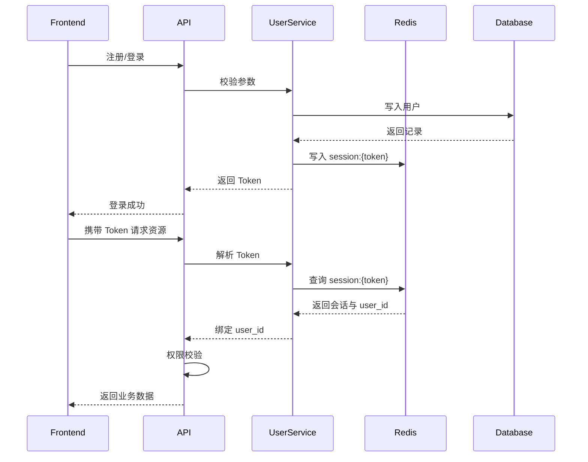
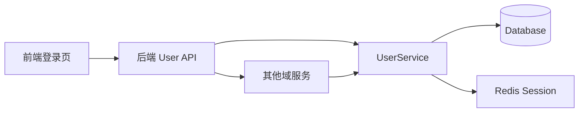

# [00] 用户模块设计稿

Created: 2026-07-29 Status: Draft

---

## 1. 用途

用户模块是 x-media 的账号与权限基座，负责：

- 账号生命周期（注册、登录、状态变更）
- 登录态与会话管理
- 基础权限控制
- 组织/团队空间

所有画布、素材、任务、配额数据最终都通过 `user_id` 关联到用户模块。

---

## 2. 最重要 3 点

### 2.1 数据结构设计

核心表设计：

```sql
-- 用户主表
CREATE TABLE pms_user
(
    id            BIGINT UNSIGNED NOT NULL AUTO_INCREMENT comment '主键',
    email         varchar(255) UNIQUE NOT NULL comment '登录邮箱',
    phone         varchar(32) comment '手机号',
    password_hash varchar(255)        NOT NULL COMMENT '密码哈希',
    nickname      varchar(100) comment '昵称',
    avatar_url    text comment '头像地址',
    role          varchar(32) default 'user' comment '角色：user/admin',
    status        varchar(32) default 'active' comment '状态：active/banned',
    last_login_at timestamptz comment '最后登录时间',
    created_at    timestamptz default now(),
    updated_at    timestamptz default now()
);

-- 会话数据放在 Redis，不建表
-- Redis Key: session:{token}
-- Redis Value 字段：
--   user_id
--   device_info
--   expire_at
--   created_at

-- 组织表
CREATE TABLE pms_organization
(
    id         BIGINT UNSIGNED NOT NULL AUTO_INCREMENT comment '主键',
    name       varchar(255) NOT NULL COMMENT '组织名称',
    owner_id   bigint       not null references users (id) comment '拥有者用户ID',
    plan_type  varchar(32) default 'free' comment '套餐类型',
    created_at timestamptz default now()
);

-- 组织成员
CREATE TABLE pms_organization_member
(
    id              BIGINT UNSIGNED NOT NULL AUTO_INCREMENT comment '主键',
    organization_id bigint not null references organizations (id) comment '组织ID',
    user_id         bigint not null references users (id) comment '用户ID',
    role            varchar(32) default 'member' comment '组织内角色',
    joined_at       timestamptz default now() comment '加入时间',
    unique (organization_id, user_id)
);

create unique index uk_organization_members_org_user
    on organization_members (organization_id, user_id);
```

设计说明：

- `users.status` 用于软删除/封禁，不直接物理删除。
- 会话数据存放在 Redis，键为 `session:{token}`，便于 token 校验与踢人下线。
- 组织模块保留，因为产品需要支持给不同团队生成视频。

### 2.2 数据流转过程



关键流转：

- 注册/登录后下发 Token，后续请求通过 Token 解析出 `user_id`。
- 所有写请求都必须在上下文中具备合法 `user_id`。
- 权限校验统一在 API 层或中间件完成，业务服务只认 `user_id`。

### 2.3 总体架构



参考 open-ai-canvas：

- 后端入口：`D:\GoWorkSpace\open-ai-canvas\backend\cmd`
- 内部服务：`D:\GoWorkSpace\open-ai-canvas\backend\internal`

建议：

- 会话统一走 Redis 中的 `session:{token}`，登录态通过 token 解析 `user_id`。
- 踢人下线直接删除对应 Redis key 即可。
- 用户模块不做业务逻辑，只负责“身份 + 权限 + 组织”。

---

## 3. 接口清单（MVP）

| 方法 | 路径                  | 说明         |
|------|-----------------------|--------------|
| POST | /api/v1/auth/register | 注册         |
| POST | /api/v1/auth/login    | 登录         |
| POST | /api/v1/auth/logout   | 登出         |
| GET  | /api/v1/users/me      | 当前用户信息 |
| PUT  | /api/v1/users/me      | 更新当前用户 |

---

## 4. 依赖模块

| 模块         | 依赖说明     |
|--------------|--------------|
| 素材模块     | 素材归属用户 |
| 画布模块     | 画布归属用户 |
| 任务调度模块 | 任务归属用户 |
| 计费配额模块 | 额度归属用户 |