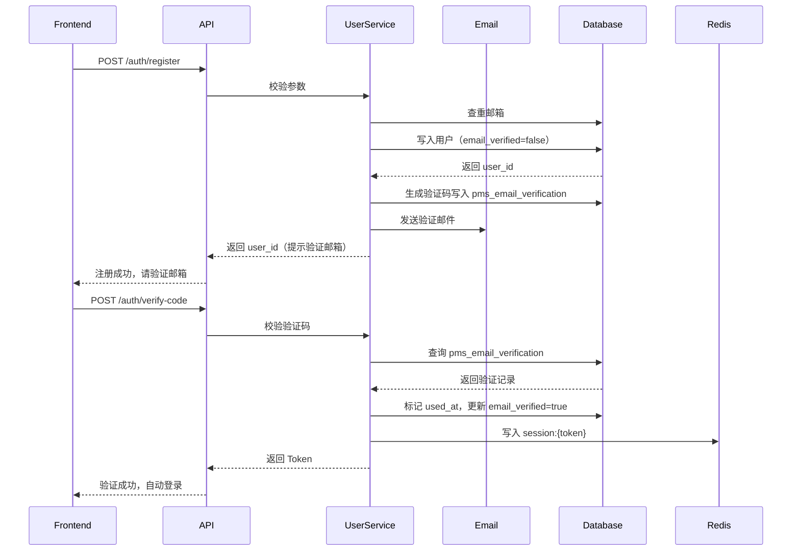
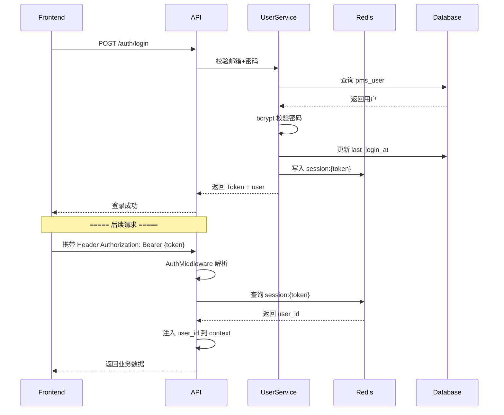
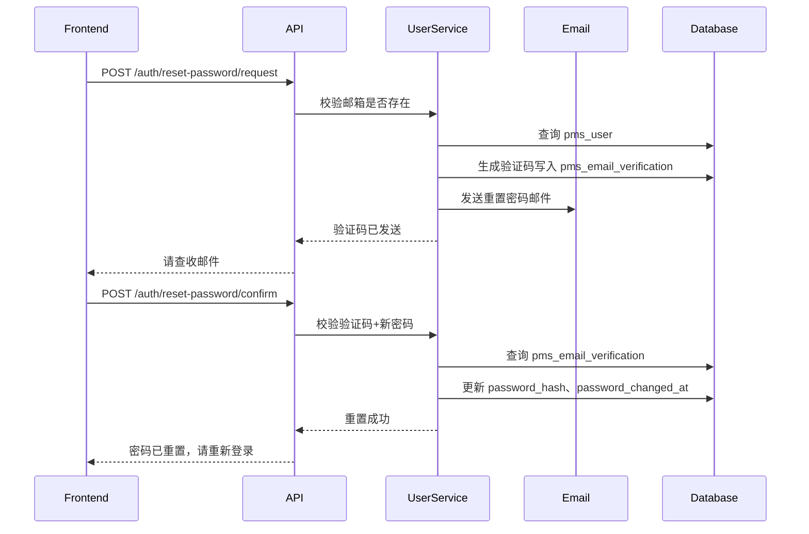
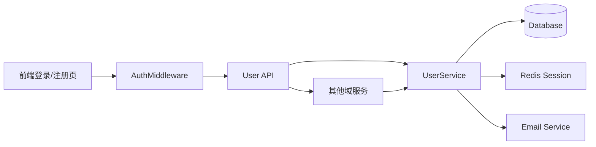

# [00] 用户模块设计稿

Created: 2026-07-29 | Status: Draft
Updated: 2026-07-29 — 修复 DDL 缺陷，补全邮箱验证与密码重置流程，增加字段注释

---

## 1. 用途

用户模块是 x-media 的账号与权限基座，负责：

- 账号生命周期（注册含邮箱验证、登录、密码重置、状态变更）
- 登录态与会话管理
- 基础权限控制与认证中间件
- 组织/团队空间

所有画布、素材、任务、配额数据最终都通过 `user_id` 关联到用户模块。

---

## 2. 最重要 3 点

### 2.1 数据结构设计

> **数据库方言：PostgreSQL 16+**，与项目基础设施模块保持一致。
>
> **新人提示**：`GENERATED ALWAYS AS IDENTITY` 表示自增主键，等价于 MySQL 的 `AUTO_INCREMENT`。
> `TIMESTAMPTZ` 是带时区的时间戳，`now()` 取数据库当前时间。

核心表设计：

```sql
-- ============================================================
-- 表1：用户主表
-- 说明：存储所有注册用户的基本信息和账号状态
-- 场景：登录校验、个人信息展示、管理员查询用户列表
-- ============================================================
CREATE TABLE pms_user
(
  -- 【主键】用户唯一ID，系统自动生成，全局唯一，一旦创建永不变化
  id                  BIGINT PRIMARY KEY GENERATED ALWAYS AS IDENTITY,

  -- 【登录账号】邮箱地址，全系统唯一，用于登录和找回密码
  -- 约束：不能为空、不能重复、需要邮箱验证后才能正常使用全部功能
  email               VARCHAR(255) UNIQUE NOT NULL,

  -- 【手机号】可选字段，预留后续短信登录/通知功能，目前 MVP 不强制填写
  phone               VARCHAR(32),

  -- 【密码】bcrypt 算法哈希后的密文，绝不存储明文密码
  -- bcrypt 自动包含盐值，即使两个用户密码相同，存储结果也不同
  password_hash       VARCHAR(255)        NOT NULL,

  -- 【昵称】用户展示名称，可重复，不要求唯一
  nickname            VARCHAR(100),

  -- 【头像】头像图片的 URL 地址，指向 OSS/COS 存储
  -- TEXT 类型无长度限制是因为 URL 可能很长（带签名参数）
  avatar_url          TEXT,

  -- 【账号状态】'active'=正常使用中
  --            'banned'=已被封禁（禁止登录和所有操作，相当于软删除）
  -- 封禁只是改状态，不删数据，管理员可以解封恢复
  status              VARCHAR(32)         NOT NULL DEFAULT 'active',

  -- 【邮箱验证】false=未验证（刚注册/改了邮箱），true=已验证
  -- 未验证用户可以登录，但前端会引导完成验证，且限制创建项目等写操作
  email_verified      BOOLEAN             NOT NULL DEFAULT false,

  -- 【密码最后修改时间】用户修改密码时更新
  -- 作用：配合 session TTL，确保改密码后旧登录态在 TTL 内自然过期
  -- MVP 阶段不主动驱逐旧 session，靠 Redis TTL（30天）自行过期
  password_changed_at TIMESTAMPTZ,

  -- 【最后登录时间】每次成功登录时更新，用于统计活跃用户和管理审计
  last_login_at       TIMESTAMPTZ,

  -- 【创建时间】账号注册时间，由数据库自动填充，之后不再修改
  created_at          TIMESTAMPTZ         NOT NULL DEFAULT now(),

  -- 【更新时间】任何字段变更时自动更新，用于排查数据变更时序
  updated_at          TIMESTAMPTZ         NOT NULL DEFAULT now()
);

-- 表注释（在 psql 中可通过 \dt+ 查看）
COMMENT
ON TABLE  pms_user IS '客户用户主表：存储所有注册创作者的基本信息、登录凭证和账号状态';
COMMENT
ON COLUMN pms_user.id                  IS '用户唯一ID，自增主键';
COMMENT
ON COLUMN pms_user.email               IS '登录邮箱，全系统唯一，不可重复';
COMMENT
ON COLUMN pms_user.phone               IS '手机号（可选），预留短信通知场景';
COMMENT
ON COLUMN pms_user.password_hash       IS 'bcrypt 哈希后的密码密文，不解密、不存明文';
COMMENT
ON COLUMN pms_user.nickname            IS '用户昵称，展示用，可重复';
COMMENT
ON COLUMN pms_user.avatar_url          IS '头像图片URL，指向OSS存储地址';
COMMENT
ON COLUMN pms_user.status              IS '账号状态：active=正常，banned=封禁';
COMMENT
ON COLUMN pms_user.email_verified      IS '邮箱是否已验证：false=未验证，true=已验证';
COMMENT
ON COLUMN pms_user.password_changed_at IS '密码最后修改时间，用于判断旧session是否应失效';
COMMENT
ON COLUMN pms_user.last_login_at       IS '最近一次成功登录的时间';
COMMENT
ON COLUMN pms_user.created_at          IS '账号注册时间，数据库自动填充';
COMMENT
ON COLUMN pms_user.updated_at          IS '记录最后更新时间，每次UPDATE自动刷新';


-- ============================================================
-- 表2：邮箱验证码表
-- 说明：注册和密码重置共用此表，通过 type 字段区分用途
-- 场景：用户注册时校验邮箱归属、忘记密码时验证身份
-- ============================================================
CREATE TABLE pms_email_verification
(
  -- 【主键】验证记录唯一ID
  id         BIGINT PRIMARY KEY GENERATED ALWAYS AS IDENTITY,

  -- 【邮箱】目标邮箱地址，与 pms_user.email 对应
  -- 注册时邮箱可能尚未存在于 pms_user 表（但注册接口会先创建用户再发码）
  email      VARCHAR(255) NOT NULL,

  -- 【验证码】6位随机数字验证码，例：483921
  -- 发送到用户邮箱，用户在前端输入后回传校验
  code       VARCHAR(8)   NOT NULL,

  -- 【用途类型】'register'=注册验证
  --            'reset_password'=密码重置验证
  -- 同一邮箱可以同时存在不同类型的两条记录互不干扰
  type       VARCHAR(32)  NOT NULL,

  -- 【过期时间】验证码的有效截止时间，默认创建后+10分钟
  -- 校验验证码时必须检查 now() < expires_at，否则拒绝
  expires_at TIMESTAMPTZ  NOT NULL,

  -- 【使用时间】验证码被成功校验后打上时间戳
  -- NULL=未使用，非NULL=已使用（防止同一验证码被重复使用）
  used_at    TIMESTAMPTZ,

  -- 【创建时间】验证码生成时间
  created_at TIMESTAMPTZ  NOT NULL DEFAULT now()
);

-- 加速"按邮箱+类型查询验证码"的查询（每个校验请求都会用到）
CREATE INDEX idx_email_verification_email_type
  ON pms_email_verification (email, type);

COMMENT
ON TABLE  pms_email_verification IS '邮箱验证码表：注册和密码重置共用，通过type字段区分用途';
COMMENT
ON COLUMN pms_email_verification.email      IS '目标邮箱地址';
COMMENT
ON COLUMN pms_email_verification.code       IS '6位随机数字验证码';
COMMENT
ON COLUMN pms_email_verification.type       IS '用途：register=注册验证，reset_password=密码重置';
COMMENT
ON COLUMN pms_email_verification.expires_at IS '验证码过期时间，默认创建后10分钟';
COMMENT
ON COLUMN pms_email_verification.used_at    IS '验证码被使用的时间，NULL=未使用，非NULL=已使用';
COMMENT
ON COLUMN pms_email_verification.created_at IS '验证码生成时间';


-- ============================================================
-- 表3：第三方登录绑定表
-- 说明：预留表，MVP 阶段不实现第三方登录，先建好表结构方便后期扩展
-- 场景：用户用微信/GitHub/微博等第三方账号登录时，绑定到已有 x-media 账号
-- ============================================================
CREATE TABLE pms_user_identity
(
  -- 【主键】绑定记录唯一ID
  id       BIGINT PRIMARY KEY GENERATED ALWAYS AS IDENTITY,

  -- 【用户ID】关联到 pms_user 表的用户，外键约束确保数据完整性
  user_id  BIGINT       NOT NULL REFERENCES pms_user (id),

  -- 【第三方平台】标识哪个平台的账号，例如 'wechat'、'github'、'weibo'
  provider VARCHAR(32)  NOT NULL,

  -- 【第三方用户标识】该平台下用户的唯一ID（openid/uid）
  -- 不同平台的 subject 格式不同，例如微信返回的是 openid
  subject  VARCHAR(255) NOT NULL,

  -- 【联合唯一约束】同一个第三方平台的同一个账号，只能绑定一个 x-media 用户
  UNIQUE (provider, subject)
);

COMMENT
ON TABLE  pms_user_identity IS '第三方登录绑定表：预留表，MVP阶段不实现，先建表方便后期扩展';
COMMENT
ON COLUMN pms_user_identity.user_id  IS '关联的x-media用户ID';
COMMENT
ON COLUMN pms_user_identity.provider IS '第三方平台名称：wechat/github/weibo等';
COMMENT
ON COLUMN pms_user_identity.subject  IS '第三方平台返回的用户唯一标识（如openid）';


-- ============================================================
-- 表4：组织表
-- 说明：组织是多人协作的空间容器，一个用户可以创建/加入多个组织
-- 场景：团队协作生成视频、企业客户管理成员和配额
-- ============================================================
CREATE TABLE pms_organization
(
  -- 【主键】组织唯一ID
  id         BIGINT PRIMARY KEY GENERATED ALWAYS AS IDENTITY,

  -- 【组织名称】对外展示名称，允许重名（不同组织可以同名）
  name       VARCHAR(255) NOT NULL,

  -- 【创建者】创建该组织的用户ID，创建者自动成为组织 owner
  -- 注意：owner_id 指向的用户，在 pms_organization_member 中也必须有一条 role='owner' 的记录
  owner_id   BIGINT       NOT NULL REFERENCES pms_user (id),

  -- 【套餐类型】'free'=免费版（默认，有配额限制）
  --            'pro'=专业版（更高配额和更多功能）
  --            'enterprise'=企业版（定制配额，私有部署等）
  -- 组织的套餐类型决定其下所有成员的配额上限
  plan_type  VARCHAR(32)  NOT NULL DEFAULT 'free',

  -- 【创建时间】组织创建时间
  created_at TIMESTAMPTZ  NOT NULL DEFAULT now()
);

COMMENT
ON TABLE  pms_organization IS '组织/团队表：多人协作的空间容器，用户可创建或加入多个组织';
COMMENT
ON COLUMN pms_organization.name      IS '组织名称，对外展示，允许重名';
COMMENT
ON COLUMN pms_organization.owner_id  IS '创建者用户ID，创建时写入，不可变更';
COMMENT
ON COLUMN pms_organization.plan_type IS '套餐类型：free=免费版，pro=专业版，enterprise=企业版';
COMMENT
ON COLUMN pms_organization.created_at IS '组织创建时间';


-- ============================================================
-- 表5：组织成员表
-- 说明：记录每个组织中包含哪些成员及各自的角色
-- 场景：邀请成员加入团队、设置管理员、成员退出
-- ============================================================
CREATE TABLE pms_organization_member
(
  -- 【主键】成员关系唯一ID
  id              BIGINT PRIMARY KEY GENERATED ALWAYS AS IDENTITY,

  -- 【组织ID】所属组织
  organization_id BIGINT      NOT NULL REFERENCES pms_organization (id),

  -- 【用户ID】成员用户
  user_id         BIGINT      NOT NULL REFERENCES pms_user (id),

  -- 【组织内角色】'owner'=创建者（最高权限，不能修改，不能移除）
  --               'admin'=管理员（可邀请/移除成员，管理组织设置）
  --               'member'=普通成员（只能使用组织内的项目资源）
  -- 注意：这与 pms_user.role（系统角色）是两套独立权限
  role            VARCHAR(32) NOT NULL DEFAULT 'member',

  -- 【加入时间】用户加入组织的时间
  joined_at       TIMESTAMPTZ NOT NULL DEFAULT now(),

  -- 【联合唯一约束】同一用户在同一组织中只能有一条记录（不能重复加入）
  UNIQUE (organization_id, user_id)
);

COMMENT
ON TABLE  pms_organization_member IS '组织成员表：记录每个组织中包含哪些用户及其角色';
COMMENT
ON COLUMN pms_organization_member.organization_id IS '所属组织ID';
COMMENT
ON COLUMN pms_organization_member.user_id         IS '成员用户ID';
COMMENT
ON COLUMN pms_organization_member.role            IS '组织内角色：owner=创建者，admin=管理员，member=普通成员';
COMMENT
ON COLUMN pms_organization_member.joined_at       IS '加入组织的时间';
```

---

### 会话数据（Redis 存储，不建 SQL 表）

```
为什么用 Redis 而不是数据库表？
- 读多写少：每个请求都要校验 token，Redis 内存读取比数据库查询快 100 倍以上
- 天然过期：Redis 的 TTL 机制自动清理过期 session，不需要定时任务扫表
- 无状态扩展：多个后端实例共享同一个 Redis，任意实例都能校验 token

Redis Key 格式：  session:{token}

示例：
  Key:   session:a1b2c3d4e5f6...（用户登录后下发的随机 token 字符串）
  Value: {
    "user_id":     10001,                     // 登录用户ID
    "device_info": "Chrome/Windows",          // 登录设备信息（展示在"设备管理"中）
    "expire_at":   "2026-08-28T10:30:00Z",   // 会话过期时间，默认登录后30天
    "created_at":  "2026-07-29T10:30:00Z"    // 会话创建时间
  }
  TTL：30天（2592000秒），登录和每次校验时自动续期
```

设计说明：

- `pms_user.status = 'banned'` 是软删除/封禁，**绝不物理删除**用户数据。
- `pms_user.email_verified = false` 的用户可以登录，但功能受限（前端检测后引导验证，限制创建项目等写操作）。
- `pms_user.password_changed_at` 不为空时表示用户改过密码，旧 session 靠 Redis TTL 自然过期，**MVP 不主动逐出**。
- 验证码有效期 10 分钟，同一邮箱+同一 type 在 60 秒内不可重复发送（防刷）。
- `pms_user_identity` 为后续 OAuth 微信/GitHub 登录预留，**MVP 只建表不实现**。
- **权限体系说明**：`pms_user` 是纯客户表，不含管理员角色。管理员身份在 `[10]管理后台模块` 的 `admins` 表中管理（通过 `admins.user_id` 关联）。
- 创建组织时必须同步操作：① 写 `pms_organization` ② 写 `pms_organization_member`（role='owner'），**两步必须在同一个数据库事务中完成**。

---

### 2.2 数据流转过程

#### 2.2.1 注册流程（含邮箱验证）



#### 2.2.2 登录与鉴权流程



#### 2.2.3 密码重置流程



关键流转规则：

- 注册时邮箱未验证也可以登录，但功能受限（前端检测 `email_verified` 做引导）。
- 验证码 10 分钟过期，同一邮箱+类型 60 秒内防重发。
- 密码重置后 `password_changed_at` 更新，所有旧 Redis session 通过 TTL 自然过期（踢人下线由 TTL 控制，不主动逐出）。
- 所有写请求必须在上下文中具备合法 `user_id`，由 AuthMiddleware 注入。
- 权限校验统一在 API 层或中间件完成，业务服务只认 `user_id`。

### 2.3 总体架构



AuthMiddleware 职责：
- 从 Header `Authorization: Bearer {token}` 提取 token
- 查询 Redis `session:{token}` 获取 `user_id`
- 将 `user_id` 注入 `context.Context`
- 白名单路由跳过鉴权：`/api/v1/auth/register`、`/api/v1/auth/login`、`/api/v1/auth/reset-password/*`
- 未登录返回 401，被封禁返回 403

参考 open-ai-canvas：
- 后端入口：`D:\GoWorkSpace\open-ai-canvas\backend\cmd`
- 内部服务：`D:\GoWorkSpace\open-ai-canvas\backend\internal`

建议：
- 会话统一走 Redis 中的 `session:{token}`，登录态通过 token 解析 `user_id`。
- 踢人下线直接删除对应 Redis key 即可。
- 用户模块不做业务逻辑，只负责「身份 + 权限 + 组织」。

---

## 3. 接口清单（MVP）

### 3.1 认证接口

| 方法 | 路径                                  | 鉴权 | 说明                         |
|------|---------------------------------------|------|------------------------------|
| POST | `/api/v1/auth/register`               | 否   | 注册（创建用户+发送邮箱验证码） |
| POST | `/api/v1/auth/send-code`              | 否   | 发送/重发邮箱验证码           |
| POST | `/api/v1/auth/verify-code`            | 否   | 校验验证码，通过后自动登录    |
| POST | `/api/v1/auth/login`                  | 否   | 邮箱+密码登录                 |
| POST | `/api/v1/auth/logout`                 | 是   | 登出（删除 Redis session）    |
| POST | `/api/v1/auth/reset-password/request` | 否   | 申请重置密码（向邮箱发验证码） |
| POST | `/api/v1/auth/reset-password/confirm` | 否   | 提交验证码+新密码，完成重置   |

### 3.2 用户接口

| 方法 | 路径                | 鉴权 | 说明         |
|------|---------------------|------|--------------|
| GET  | `/api/v1/users/me`  | 是   | 获取当前登录用户的完整信息 |
| PUT  | `/api/v1/users/me`  | 是   | 更新当前用户的昵称/头像等  |

### 3.3 组织接口（MVP）

| 方法   | 路径                                       | 鉴权 | 说明                      |
|--------|--------------------------------------------|------|---------------------------|
| POST   | `/api/v1/organizations`                    | 是   | 创建组织（自动成为 owner） |
| GET    | `/api/v1/organizations`                    | 是   | 查询我加入的所有组织       |
| GET    | `/api/v1/organizations/{id}`               | 是   | 查看组织详情和成员列表     |
| POST   | `/api/v1/organizations/{id}/members`       | 是   | 邀请用户加入组织           |
| DELETE | `/api/v1/organizations/{id}/members/{uid}` | 是   | 移除组织成员（owner不能被移除） |

---

## 4. 依赖模块

| 模块         | 依赖说明                 |
|--------------|--------------------------|
| 素材模块     | 素材通过 user_id 归属用户 |
| 画布模块     | 画布通过 user_id 归属用户 |
| 任务调度模块 | 任务通过 user_id 归属用户 |
| 计费与支付模块 | 配额额度按 user_id 计算   |

---

## 5. 与 open-ai-canvas 的差异点

| 差异项       | open-ai-canvas              | x-media                              |
|--------------|-----------------------------|--------------------------------------|
| 会话存储     | DB 表 auth_sessions         | Redis session:{token}                |
| 认证方式     | Cookie-based                | Header Bearer Token                  |
| 邮箱验证     | EmailVerificationCode 表    | pms_email_verification（同思路）       |
| 第三方登录   | LinuxDO OAuth               | pms_user_identity 预留，MVP 不做       |
| 组织/团队    | 无                          | pms_organization（差异化竞争优势）     |
| 模块拆分     | 扁平 handler/service/repo   | 按业务域拆分 internal/user            |

---

## 6. 新人上手指南

### 6.1 快速理解这 5 张表

| 表名 | 一句话解释 | 什么时候有数据 |
|------|-----------|---------------|
| `pms_user` | 注册用户的基本信息表 | 用户注册时写入 |
| `pms_email_verification` | 邮箱验证码临时记录表 | 注册/重置密码时写入，验证后标记已用 |
| `pms_user_identity` | 第三方登录绑定（预留） | MVP 阶段为空表 |
| `pms_organization` | 团队/组织信息 | 用户创建团队时写入 |
| `pms_organization_member` | 团队里的成员和角色 | 有人创建或加入团队时写入 |

### 6.2 动手之前先理解这些概念

1. **password_hash 不是密码原文**：用户输入 `123456`，存到数据库的是 bcrypt 算出来的一串乱码（如 `$2a$10$N9q...`）。校验密码时用 `bcrypt.CompareHashAndPassword()` 比对，永远不解密。

2. **Token 即临时身份证**：用户登录后拿到一个随机字符串 token，后续每个请求都带着它。后端从 Redis 查到 token 对应的 user_id，就知道"你是谁"了。Redis 的 key 过期了，token 就失效了。

3. **客户用户 ≠ 管理员**：`pms_user` 表存的是创作者/客户，所有人都平等。谁能进管理后台由 `[10]管理后台模块` 的 `admins` 表单独控制。`pms_organization_member.role` 只管团队内部权限（owner/admin/member），和后台管理员是两回事。

4. **软删除原则**：封禁用户只改 `status='banned'`，不删数据。这样误封可以恢复，数据也还在。

### 6.3 团队分工建议

| 角色 | 负责内容 |
|------|----------|
| 后端 A | `pms_user` 表 + 注册/登录/登出 + bcrypt 密码处理 |
| 后端 B | `pms_email_verification` 表 + 验证码生成/校验 + 邮件发送 |
| 后端 C | `pms_organization` + `pms_organization_member` + 团队 CRUD |
| 后端 D | AuthMiddleware + Redis session 管理 + 权限校验 |
