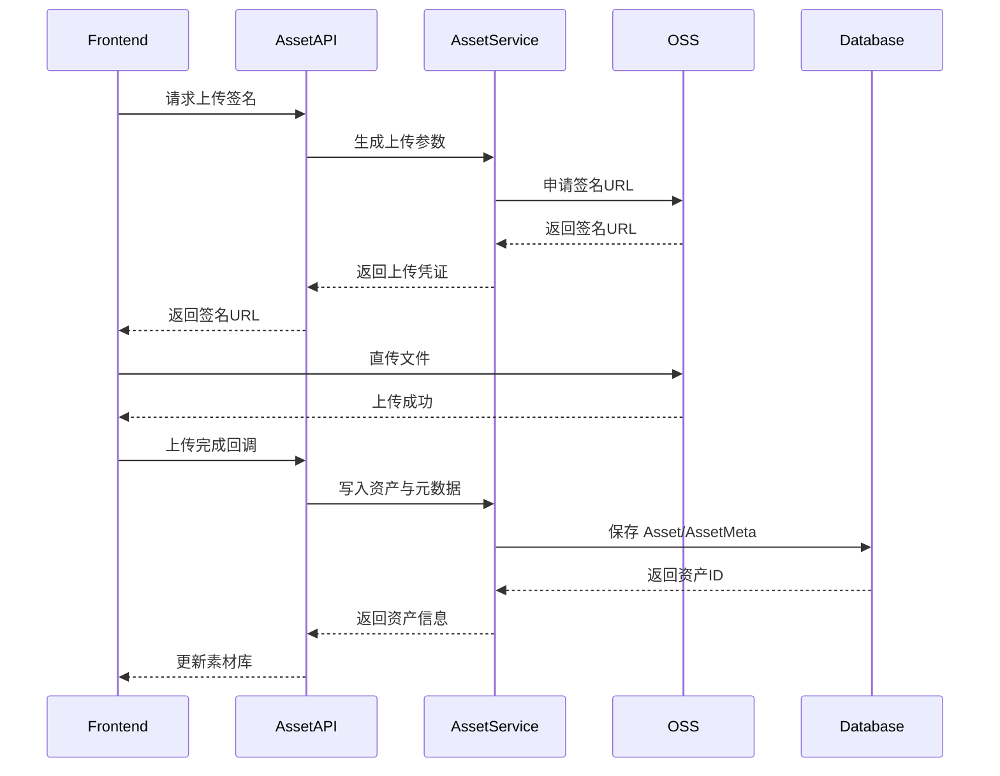
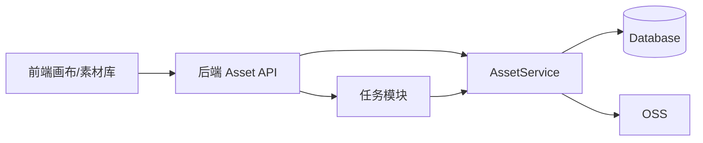

# [01] 素材模块设计稿

Created: 2026-07-29 Status: Draft

---

## 1. 用途

素材模块负责管理所有媒体资产，包括：

- 用户主动上传的图片/视频/音频
- AI 生成结果回写的素材
- 画布引用的参考图、角色卡、首尾帧
- 素材的元数据、标签、分享与生命周期

它是画布模块和 AI 网关模块的“资产中台”。

---

## 2. 最重要 3 点

### 2.1 数据结构设计

核心表设计：

```sql
-- 素材主表
create table assets
(
    id           bigint primary key generated always as identity,
    user_id      bigint      not null references users (id),
    project_id   bigint,
    type         varchar(32) not null,
    oss_key      text        not null,
    bucket       text,
    content_type varchar(128),
    size         bigint,
    digest       varchar(64),
    status       varchar(32) default 'active',
    created_at   timestamptz default now(),
    updated_at   timestamptz default now()
);

-- 素材元数据
create table asset_metas
(
    id       bigint primary key generated always as identity,
    asset_id bigint not null references assets (id),
    width    int,
    height   int,
    duration numeric,
    fps      numeric,
    model    varchar(128),
    prompt   text,
    tags     jsonb,
    extra    jsonb
);

-- 素材分享
create table asset_shares
(
    id         bigint primary key generated always as identity,
    asset_id   bigint not null references assets (id),
    shared_by  bigint not null references users (id),
    shared_to  bigint references users (id),
    permission varchar(32) default 'read',
    expire_at  timestamptz,
    created_at timestamptz default now()
);
```

设计说明：

- `assets.oss_key` 是唯一存储指针，前端按此读取资源。
- `asset_metas` 用 `jsonb` 存储灵活标签，便于后续检索。
- `asset_shares` 先做私有分享，MVP 不强制公开只读。

### 2.2 数据流转过程



关键流转：

- 大文件不走后端代理，前端直传 OSS，后端只保存 `oss_key`。
- 上传后必须回调落库，否则会出现“文件存在但数据库无记录”。
- 画布引用素材只保存 `asset_id`，不重复存储文件路径。

### 2.3 总体架构



参考 open-ai-canvas：

- 后端服务：`D:\GoWorkSpace\open-ai-canvas\backend\internal`
- 部署配置：`D:\GoWorkSpace\open-ai-canvas\docker-compose.server.yml`

建议：

- 素材服务只暴露“签名 + 回调 + 查询”三类核心接口。
- 图片/视频预处理（人脸检测、背景分割）可先由任务模块完成后回写元数据，不放在素材模块内。

---

## 3. 接口清单（MVP）

| 方法   | 路径                      | 说明         |
|--------|---------------------------|--------------|
| POST   | /api/v1/assets/upload-url | 获取上传签名 |
| POST   | /api/v1/assets/callback   | 上传完成回调 |
| GET    | /api/v1/assets            | 素材列表     |
| GET    | /api/v1/assets/{id}       | 素材详情     |
| DELETE | /api/v1/assets/{id}       | 删除素材     |
| POST   | /api/v1/assets/{id}/share | 创建分享     |

---

## 4. 依赖模块

| 模块         | 依赖说明       |
|--------------|----------------|
| 用户模块     | 素材归属与权限 |
| 画布模块     | 画布引用素材   |
| 任务调度模块 | 生成结果入库   |
| 存储模块     | OSS 直传与签名 |

---

## 5. 与 open-ai-canvas 的映射

| 我们的模块 | open-ai-canvas 对应              |
|------------|----------------------------------|
| 素材模块   | 资源同步、私有 OSS、资源归属校验 |
| 上传签名   | 前端直传 OSS 方案                |
| 素材回写   | 任务完成后回写画布与素材库       |
