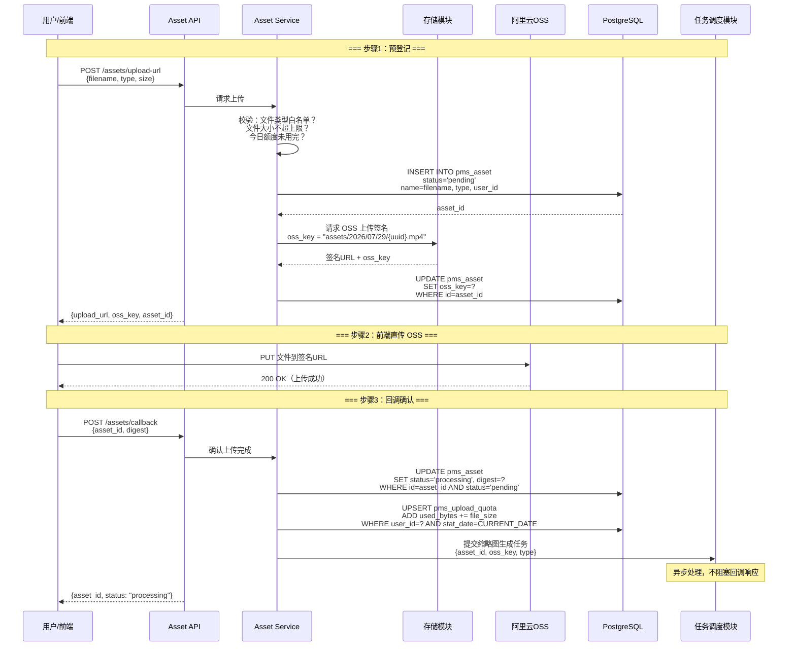
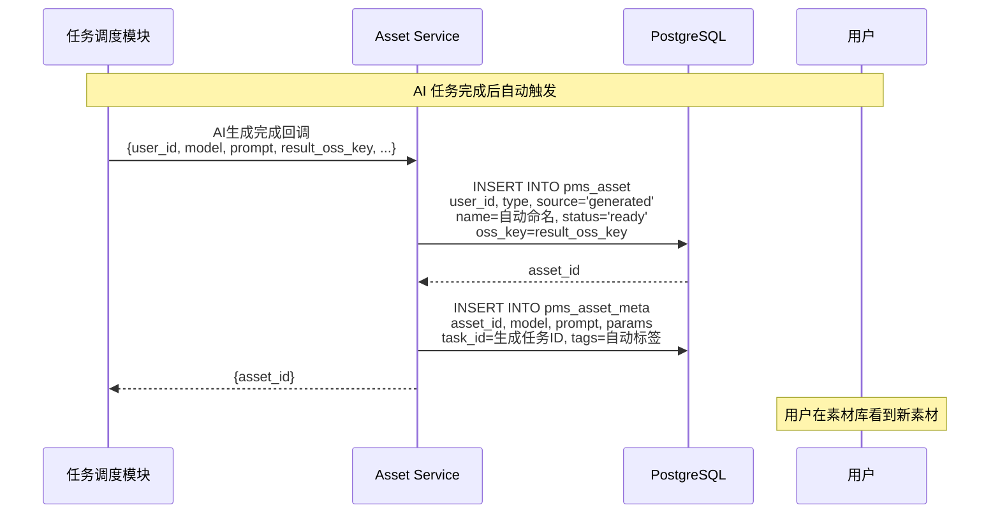
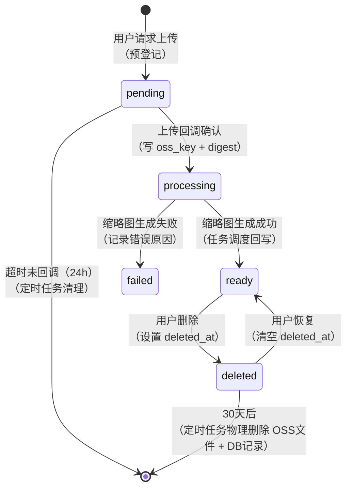
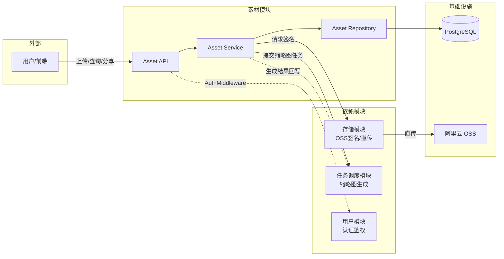

# [01] 素材模块设计稿

Created: 2026-07-29 | Status: Draft
Updated: 2026-07-29 — 统一 PostgreSQL DDL，修复乱码，重构表结构，新增字段注释与新人指南

---

## 1. 用途

素材模块是 x-media 的**资产中台**，负责所有媒体资产的全生命周期管理：

- 用户主动上传的图片/视频/音频文件
- AI 生成结果自动回写入库
- 画布中引用的参考图、角色卡、首尾帧素材
- 素材的元数据、标签、分享与软删除

**一句话概括**：用户上传或用 AI 生成的文件，经素材模块落库登记后，其他模块（画布、任务调度）通过 `asset_id` 引用。

> **与 `[07]存储模块` 的分工**：
> - 素材模块（本模块）：管**业务**——这个文件叫什么名字、什么类型、属于谁、标签是什么、分享给谁
> - 存储模块：管**物理**——OSS 上传签名、文件直传、物理删除
> - 素材模块通过 `oss_key` 告诉存储模块文件存在哪里，但素材表本身就是这个文件的**唯一业务入口**

---

## 2. 最重要 3 点

### 2.1 数据结构设计

> **数据库方言：PostgreSQL 16+**，与用户模块、基础设施模块保持一致。
>
> **新人提示**：`GENERATED ALWAYS AS IDENTITY` = 自增主键。`TIMESTAMPTZ` = 带时区的时间戳。
> `JSONB` = 可索引的 JSON 类型（比 `JSON` 更好，支持查询内部字段）。

#### 表1：素材主表（pms_asset）

```sql
-- ============================================================
-- 表1：素材主表
-- 说明：每一条记录 = 用户上传或 AI 生成的一个文件
-- 核心查询：按用户列出素材、按类型筛选、按标签搜索
-- 数据量预估：普通用户 1000+ 素材，全站 10 万级起步
-- ============================================================
CREATE TABLE pms_asset
(
  -- 【主键】素材唯一ID，系统自动生成，一旦创建永不变化
  -- 其他表（画布、任务）通过此 ID 引用素材，不直接存文件路径
  id              BIGINT PRIMARY KEY GENERATED ALWAYS AS IDENTITY,

  -- 【归属用户】谁上传的就属于谁，关联 pms_user.id
  -- 素材的所有权通过此字段判断：只有 owner 可以删除/分享
  user_id         BIGINT NOT NULL REFERENCES pms_user (id),

  -- 【素材名称】用户可见的素材名称，支持重命名
  -- 示例："雪山背景图"、"片头动画v3.mp4"、"角色立绘_正面"
  -- 初始值：上传时取文件名（去掉扩展名），生成时由 AI 任务自动命名
  name            VARCHAR(255) NOT NULL DEFAULT '',

  -- 【素材类型】'image'=图片（jpg/png/webp/gif）
  --            'video'=视频（mp4/mov/webm）
  --            'audio'=音频（mp3/wav/ogg）
  -- 决定前端用什么组件预览、任务调度用什么 Pipeline 处理
  type            VARCHAR(32) NOT NULL,

  -- 【素材来源】'uploaded'=用户本地上传
  --            'generated'=AI 生成结果回写
  --            'imported'=从外部链接导入
  -- 来源影响后续处理逻辑：generated 类型可以不占上传额度
  source          VARCHAR(32) NOT NULL DEFAULT 'uploaded',

  -- 【OSS 存储路径】文件在对象存储中的唯一 Key，例如 "assets/2026/07/29/uuid.mp4"
  -- 这是素材模块与存储模块的桥梁——存储模块用这个 Key 生成签名 URL
  -- 规则：`assets/{YYYY/MM/DD}/{uuid}.{ext}`，按日期分目录便于清理
  oss_key         VARCHAR(512) NOT NULL,

  -- 【存储桶】OSS Bucket 名称，开发环境和生产环境可能不同
  -- 示例："x-media-dev"、"x-media-prod"
  bucket          VARCHAR(128),

  -- 【MIME 类型】文件格式标准标识，例如 "image/png"、"video/mp4"、"audio/mpeg"
  -- 用于设置 HTTP Content-Type 响应头，确保浏览器正确渲染
  content_type    VARCHAR(128),

  -- 【文件大小】单位：字节（Byte），2048000 = 约 2MB
  -- 用于前端展示、上传额度统计、存储成本核算
  -- 注意：BIGINT 最大值约 9 EB，足够存超大视频文件
  size            BIGINT,

  -- 【文件摘要】SHA256 哈希值（64 位十六进制字符串）
  -- 用途1：上传时校验文件完整性（前端也计算一份，后端对比）
  -- 用途2：文件去重——同一用户传相同文件时直接复用已有素材（MVP 先不做，预留字段）
  digest          VARCHAR(64),

  -- 【宽度】图片/视频的像素宽度，例如 1920
  -- 无实际意义时可为 NULL（如纯音频文件）
  width           INT,

  -- 【高度】图片/视频的像素高度，例如 1080
  height          INT,

  -- 【时长】音视频文件的播放时长，单位：毫秒（ms），例如 30000 = 30 秒
  -- 前端展示用："时长 00:30"
  duration_ms     INT,

  -- 【帧率】视频帧率，例如 24、30、60（fps）
  -- 无实际意义时可为 NULL（图片、音频）
  fps             DECIMAL(6,2),

  -- 【缩略图 Key】视频或大图的缩略图 OSS Key
  -- 素材列表页加载缩略图而非原图，大幅减少带宽
  -- 生成时机：上传完成后由任务调度模块异步生成
  -- 为空表示暂无缩略图
  thumb_oss_key   VARCHAR(512),

  -- 【缩略图 URL】缩略图的 CDN 加速 URL，前端列表直接使用
  -- 为空时前端展示默认占位图；有值时直传显示
  thumb_url       TEXT,

  -- 【素材状态】'pending'=上传中（前端还未回调确认，不可用）
  --            'ready'=正常可用（上传完成且缩略图已生成）
  --            'processing'=处理中（正在生成缩略图/转码）
  --            'failed'=处理失败（生成缩略图或元数据提取失败）
  --            'deleted'=已删除（软删除，30天后物理清理）
  -- 状态流转：pending → processing → ready（正常路径）
  --          pending → processing → failed（处理失败）
  status          VARCHAR(32) NOT NULL DEFAULT 'pending',

  -- 【软删除时间】非 NULL 表示已删除，值为删除操作的时间
  -- 为什么不用 status='deleted'：软删除时间用于计算 30 天回收站过期
  deleted_at      TIMESTAMPTZ,

  -- 【创建时间】素材首次写入数据库的时间
  created_at      TIMESTAMPTZ NOT NULL DEFAULT now(),

  -- 【最后更新时间】素材任何字段变更时自动更新
  -- 不需要手动赋值，数据库触发器或 ORM 自动处理
  updated_at      TIMESTAMPTZ NOT NULL DEFAULT now()
);

-- 以下索引说明（为什么建这些索引）：
-- idx_asset_user_status：每用户按状态查素材是最常见查询 → "我的素材库"
-- idx_asset_user_type：按素材类型筛选 → "只看视频"
-- idx_asset_oss_key：通过 OSS Key 反查素材 → 存储模块回调确认
-- idx_asset_deleted_at：定时任务扫描过期软删除记录 → 30 天物理清理
CREATE INDEX idx_asset_user_status   ON pms_asset (user_id, status);
CREATE INDEX idx_asset_user_type     ON pms_asset (user_id, type);
CREATE INDEX idx_asset_oss_key       ON pms_asset (oss_key);
CREATE INDEX idx_asset_deleted_at    ON pms_asset (deleted_at) WHERE deleted_at IS NOT NULL;

COMMENT ON TABLE  pms_asset IS '素材主表：每一条记录代表一个用户拥有或生成的媒体文件';
COMMENT ON COLUMN pms_asset.id            IS '素材唯一ID，自增主键';
COMMENT ON COLUMN pms_asset.user_id       IS '归属用户ID，关联pms_user表';
COMMENT ON COLUMN pms_asset.name          IS '素材名称，用户可重命名，初始取上传文件名';
COMMENT ON COLUMN pms_asset.type          IS '素材类型：image=图片，video=视频，audio=音频';
COMMENT ON COLUMN pms_asset.source        IS '素材来源：uploaded=本地上传，generated=AI生成，imported=外部导入';
COMMENT ON COLUMN pms_asset.oss_key       IS 'OSS存储路径Key，与存储模块交互的桥梁';
COMMENT ON COLUMN pms_asset.bucket        IS 'OSS存储桶名称';
COMMENT ON COLUMN pms_asset.content_type  IS 'MIME类型，如image/png、video/mp4';
COMMENT ON COLUMN pms_asset.size          IS '文件大小，单位：字节（Byte）';
COMMENT ON COLUMN pms_asset.digest        IS '文件SHA256哈希值，用于完整性校验和去重（预留）';
COMMENT ON COLUMN pms_asset.width         IS '媒体像素宽度，音频文件为NULL';
COMMENT ON COLUMN pms_asset.height        IS '媒体像素高度，音频文件为NULL';
COMMENT ON COLUMN pms_asset.duration_ms   IS '音视频时长，单位：毫秒（ms）';
COMMENT ON COLUMN pms_asset.fps           IS '视频帧率，如图片/音频则为NULL';
COMMENT ON COLUMN pms_asset.thumb_oss_key IS '缩略图OSS Key，为空表示暂无缩略图';
COMMENT ON COLUMN pms_asset.thumb_url     IS '缩略图CDN加速URL，前端列表直接使用';
COMMENT ON COLUMN pms_asset.status        IS '状态：pending=上传中，processing=处理中，ready=可用，failed=失败，deleted=已删除';
COMMENT ON COLUMN pms_asset.deleted_at    IS '软删除时间，非NULL表示在回收站，30天后物理清理';
COMMENT ON COLUMN pms_asset.created_at    IS '素材创建时间';
COMMENT ON COLUMN pms_asset.updated_at    IS '最后更新时间';
```

#### 表2：AI 生成元数据表（pms_asset_meta）

```sql
-- ============================================================
-- 表2：AI 生成元数据表
-- 说明：存储 AI 生成素材的「生成参数」——用了什么模型、什么提示词
-- 与 pms_asset 的关系：一对一（一个素材最多一条元数据记录）
-- 为什么单独建表：普通上传素材不需要这些字段,
--                  分开避免 pms_asset 表有大量 NULL 列
-- ============================================================
CREATE TABLE pms_asset_meta
(
  -- 【主键】元数据记录唯一ID
  id              BIGINT PRIMARY KEY GENERATED ALWAYS AS IDENTITY,

  -- 【素材ID】关联 pms_asset.id，一对一关系
  -- 只有 source='generated' 的素材才会写这条记录
  asset_id        BIGINT NOT NULL REFERENCES pms_asset (id) ON DELETE CASCADE,

  -- 【来源模型】生成此素材的 AI 模型名称
  -- 示例："kling-v1.5"、"sora-v2"、"midjourney-v6"、"comfyui-workflow-001"
  -- 用于素材溯源：这个效果是用哪个模型跑出来的
  model           VARCHAR(128),

  -- 【生成提示词】AI 生成时使用的提示词原文（可能很长）
  -- 用途1：用户点击"复用提示词"可以拷贝到新任务
  -- 用途2：A/B 测试不同模型的生成效果对比
  prompt          TEXT,

  -- 【负面提示词】告诉 AI 不要出现的元素
  -- 示例："模糊、变形、多余的手指、文字、水印"
  negative_prompt TEXT,

  -- 【生成参数】JSON 对象，存储模型特定参数
  -- 示例：{"steps": 30, "cfg_scale": 7.5, "seed": 12345678, "sampler": "euler"}
  -- 为什么用 JSONB：不同模型参数不同，无法用固定列，JSONB 灵活可扩展、可索引
  params          JSONB,

  -- 【关联任务ID】生成此素材的任务 ID，关联 pms_task 表
  -- 用于素材溯源："这个素材是哪个生成任务产出的"
  task_id         BIGINT,

  -- 【标签】JSON 数组，用户手动添加的分类标签
  -- 示例：["角色", "正面", "白天", "室外", "立绘"]
  -- 为什么用 JSONB：支持数组查询（WHERE tags @> '["角色"]'）
  -- 与 params 的区别：tags 是业务标签（人读），params 是技术参数（机器读）
  tags            JSONB,

  -- 【扩展属性】预留的 JSON 对象，存储未来可能需要的字段
  -- 示例：{"face_detected": true, "nsfw_score": 0.02, "dominant_color": "#3366CC"}
  extra           JSONB,

  -- 【创建/更新时间】
  created_at      TIMESTAMPTZ NOT NULL DEFAULT now(),
  updated_at      TIMESTAMPTZ NOT NULL DEFAULT now()
);

-- ai_gen_task：通过任务ID查询它产出了哪些素材
-- ai_gen_model：查询某个模型产出的所有素材
CREATE INDEX idx_asset_meta_asset ON pms_asset_meta (asset_id);
CREATE INDEX idx_asset_meta_task  ON pms_asset_meta (task_id);
CREATE INDEX idx_asset_meta_model ON pms_asset_meta (model);
-- tags 字段的 GIN 索引支持 @>（包含查询）操作符
CREATE INDEX idx_asset_meta_tags  ON pms_asset_meta USING GIN (tags);

COMMENT ON TABLE  pms_asset_meta IS 'AI生成元数据表：存储AI生成素材的模型、提示词和参数';
COMMENT ON COLUMN pms_asset_meta.asset_id        IS '关联素材ID，一对一';
COMMENT ON COLUMN pms_asset_meta.model           IS '生成模型名称：kling-v1.5/sora-v2等';
COMMENT ON COLUMN pms_asset_meta.prompt          IS 'AI生成使用的提示词原文';
COMMENT ON COLUMN pms_asset_meta.negative_prompt IS '负面提示词：不希望AI生成的元素';
COMMENT ON COLUMN pms_asset_meta.params          IS '生成参数JSON：步数/种子/采样器等';
COMMENT ON COLUMN pms_asset_meta.task_id         IS '关联的生成任务ID';
COMMENT ON COLUMN pms_asset_meta.tags            IS '标签JSON数组：["角色","正面","白天"]';
COMMENT ON COLUMN pms_asset_meta.extra           IS '扩展属性JSON：预留字段';
COMMENT ON COLUMN pms_asset_meta.created_at      IS '创建时间';
COMMENT ON COLUMN pms_asset_meta.updated_at      IS '更新时间';
```

#### 表3：素材分享表（pms_asset_share）

```sql
-- ============================================================
-- 表3：素材分享表
-- 说明：记录素材被分享给了谁、有什么权限、什么时候过期
-- 场景："我把这个素材分享给导演看"、"协作编辑这个素材"
-- ============================================================
CREATE TABLE pms_asset_share
(
  -- 【主键】分享记录唯一ID
  id              BIGINT PRIMARY KEY GENERATED ALWAYS AS IDENTITY,

  -- 【被分享的素材】关联 pms_asset.id
  asset_id        BIGINT NOT NULL REFERENCES pms_asset (id) ON DELETE CASCADE,

  -- 【分享发起人】谁分享的（必须是素材的 owner）
  shared_by       BIGINT NOT NULL REFERENCES pms_user (id),

  -- 【被分享人】分享给谁，可为 NULL 表示生成分享链接（任何人凭链接访问）
  -- 不为 NULL 时：只有指定的用户才能访问
  shared_to       BIGINT REFERENCES pms_user (id),

  -- 【分享类型】'link'=生成分享链接（谁都能访问，像百度网盘分享）
  --            'user'=指定用户分享（只有特定用户能看）
  share_type      VARCHAR(32) NOT NULL DEFAULT 'user',

  -- 【分享令牌】生成分享链接时使用的唯一 Token（仅 share_type='link' 时有值）
  -- 示例："aB3xK9mW7qR2"（UUID 或 12 位随机字符串）
  -- 前端拼接为 https://x-media.com/share/aB3xK9mW7qR2
  share_token     VARCHAR(128),

  -- 【权限】'read'=只能查看/下载（默认）
  --        'write'=可以编辑/替换素材内容
  -- MVP 只做 read，write 留作后续协作功能
  permission      VARCHAR(32) NOT NULL DEFAULT 'read',

  -- 【过期时间】超过这个时间后分享自动失效，前端显示"分享已过期"
  -- NULL 表示永久有效（不推荐，建议设置过期时间）
  expire_at       TIMESTAMPTZ,

  -- 【创建时间】
  created_at      TIMESTAMPTZ NOT NULL DEFAULT now()
);

-- 按素材查询分享记录：某个素材被分享给了哪些人
CREATE INDEX idx_share_asset ON pms_asset_share (asset_id);
-- 按被分享人查询：展示"别人分享给我的素材"
CREATE INDEX idx_share_to    ON pms_asset_share (shared_to);
-- 按分享令牌查询：用户打开分享链接时快速定位
CREATE UNIQUE INDEX idx_share_token ON pms_asset_share (share_token) WHERE share_token IS NOT NULL;
-- 定时任务扫描过期分享
CREATE INDEX idx_share_expire ON pms_asset_share (expire_at) WHERE expire_at IS NOT NULL;

COMMENT ON TABLE  pms_asset_share IS '素材分享表：记录素材的分享关系和权限';
COMMENT ON COLUMN pms_asset_share.asset_id    IS '被分享的素材ID';
COMMENT ON COLUMN pms_asset_share.shared_by   IS '分享发起人用户ID（必须是素材owner）';
COMMENT ON COLUMN pms_asset_share.shared_to   IS '被分享人用户ID，NULL表示链接分享';
COMMENT ON COLUMN pms_asset_share.share_type  IS '分享类型：link=链接分享，user=指定用户分享';
COMMENT ON COLUMN pms_asset_share.share_token IS '分享令牌，链接分享时使用';
COMMENT ON COLUMN pms_asset_share.permission  IS '权限：read=只读，write=可编辑';
COMMENT ON COLUMN pms_asset_share.expire_at   IS '过期时间，超时后分享失效';
COMMENT ON COLUMN pms_asset_share.created_at  IS '分享创建时间';
```

#### 表4：每日上传额度统计表（pms_upload_quota）

```sql
-- ============================================================
-- 表4：每日上传额度统计表
-- 说明：记录每个用户每天上传了多少字节，用于限制每日上传总量
-- 为什么需要：防止恶意用户一天上传 TB 级数据刷爆存储费用
-- open-ai-canvas 竞品有相同的 UserDailyUploadUsage 表
-- ============================================================
CREATE TABLE pms_upload_quota
(
  -- 【主键】记录唯一ID
  id              BIGINT PRIMARY KEY GENERATED ALWAYS AS IDENTITY,

  -- 【用户ID】关联 pms_user.id
  user_id         BIGINT NOT NULL REFERENCES pms_user (id),

  -- 【日期】统计哪一天的上传量，格式：YYYY-MM-DD
  -- 与 user_id 组成联合唯一约束：同一用户同一天只有一条记录
  stat_date       DATE NOT NULL,

  -- 【已用字节数】当天累计上传的字节总数
  -- 每次上传成功后累加 size 到此字段
  -- 注意：此字段在服务端更新，不信任前端上报的值
  used_bytes      BIGINT NOT NULL DEFAULT 0,

  -- 【最后更新时间】
  updated_at      TIMESTAMPTZ NOT NULL DEFAULT now(),

  -- 每个用户每天只有一条记录
  UNIQUE (user_id, stat_date)
);

-- 查询：某用户今天的上传配额剩余
-- SELECT used_bytes FROM pms_upload_quota
-- WHERE user_id=? AND stat_date=CURRENT_DATE

COMMENT ON TABLE  pms_upload_quota IS '每日上传额度统计表：限制每用户每天上传总量';
COMMENT ON COLUMN pms_upload_quota.user_id    IS '用户ID';
COMMENT ON COLUMN pms_upload_quota.stat_date  IS '统计日期：YYYY-MM-DD';
COMMENT ON COLUMN pms_upload_quota.used_bytes IS '当天已用字节数，上传成功后累加';
COMMENT ON COLUMN pms_upload_quota.updated_at IS '最后上传时间';
```

---

#### 设计要点总结

| 设计决策 | 原因 |
|----------|------|
| `pms_asset` 直接存 width/height/duration_ms/fps | 避免查询列表时额外 JOIN pms_asset_meta，列表接口最频繁 |
| `pms_asset_meta` 单独存 prompt/model/params/tags | 这些字段只有 AI 生成素材才需要，分开避免大量 NULL |
| 缩略图存 thumb_oss_key + thumb_url | 列表页加载缩略图而非原图，带宽节省 90%+ |
| 软删除用 deleted_at + status | 回收站 30 天机制，误删可恢复 |
| 分享表支持 link 和 user 两种模式 | 竞品只有 session 级别分享，我们做得更灵活 |

---

### 2.2 数据流转过程

#### 2.2.1 用户上传流程（核心路径）



#### 2.2.2 AI 生成回写入库流程



#### 2.2.3 素材状态流转



**状态含义速查**：

| 状态 | 含义 | 前端如何展示 | 用户能做什么 |
|------|------|-------------|-------------|
| `pending` | 预登记，文件还没上传 | 灰色卡片 + "上传中..." | 取消上传 |
| `processing` | 上传完成，正在生成缩略图 | 加载动画 + "处理中" | 等待 |
| `ready` | 正常可用 | 正常缩略图 | 预览/下载/分享/删除 |
| `failed` | 处理失败 | 红色标记 + 错误原因 | 重试/删除 |
| `deleted` | 在回收站 | 不显示（回收站页显示） | 恢复/彻底删除 |

---

### 2.3 总体架构



**素材模块内部目录结构（建议）**：

```
internal/asset/
├── handler.go        # HTTP 请求处理：参数校验、响应封装
├── service.go        # 业务逻辑：上传流程编排、权限校验、分享管理
├── repository.go     # 数据访问：SQL 查询封装
├── model.go          # 数据模型定义（对应 pms_asset / pms_asset_meta / pms_asset_share）
├── middleware.go     # 素材归属校验中间件（确保 user_id 只能操作自己的素材）
└── upload_quota.go   # 上传额度检查与更新逻辑
```

---

## 3. 接口清单（MVP）

### 3.1 上传相关

| 方法 | 路径 | 说明 | 认证 |
|------|------|------|------|
| `POST` | `/api/v1/assets/upload-url` | 获取 OSS 上传签名（预登记素材） | 需要 |
| `POST` | `/api/v1/assets/callback` | 上传完成回调（写 oss_key + 触发缩略图） | 需要 |

**POST /api/v1/assets/upload-url 请求体**：
```json
{
  "filename": "片头动画.mp4",       // 必填：原始文件名（用于提取扩展名和初始 name）
  "type": "video",                  // 必填：image / video / audio
  "size": 52428800,                 // 必填：文件大小（字节），服务端校验不超上限
  "content_type": "video/mp4"       // 可选：MIME类型
}
```

**POST /api/v1/assets/callback 请求体**：
```json
{
  "asset_id": 123,                  // 必填：upload-url 返回的预登记 asset_id
  "digest": "a1b2c3d4..."          // 可选：文件 SHA256（用于完整性校验）
}
```

### 3.2 查询相关

| 方法 | 路径 | 说明 | 认证 |
|------|------|------|------|
| `GET` | `/api/v1/assets` | 我的素材列表（分页+筛选） | 需要 |
| `GET` | `/api/v1/assets/{id}` | 素材详情（含元数据、分享记录） | 需要 |
| `GET` | `/api/v1/assets/{id}/download-url` | 获取临时下载链接 | 需要 |
| `GET` | `/api/v1/assets/recycle` | 回收站列表（deleted 状态） | 需要 |

**GET /api/v1/assets 查询参数**：
```
?page=1&page_size=20          // 分页
&type=video                   // 筛选类型：image/video/audio
&source=generated             // 筛选来源：uploaded/generated/imported
&status=ready                 // 筛选状态（默认只返回 ready）
&keyword=雪山                  // 模糊搜索 name
&tag=角色                      // 标签筛选（查询 pms_asset_meta.tags）
&sort_by=created_at           // 排序字段：created_at/size/name
&sort_order=desc              // 排序方向：asc/desc
```

### 3.3 修改与删除

| 方法 | 路径 | 说明 | 认证 |
|------|------|------|------|
| `PUT` | `/api/v1/assets/{id}` | 更新素材（改名、改标签） | 需要 |
| `DELETE` | `/api/v1/assets/{id}` | 软删除（移入回收站） | 需要 |
| `POST` | `/api/v1/assets/{id}/restore` | 从回收站恢复 | 需要 |
| `DELETE` | `/api/v1/assets/{id}/permanent` | 彻底删除（物理清理 OSS + DB） | 需要 |

**PUT /api/v1/assets/{id} 请求体**：
```json
{
  "name": "重命名后的素材名.mp4",
  "tags": ["角色", "正面", "室外"]
}
```

### 3.4 分享相关

| 方法 | 路径 | 说明 | 认证 |
|------|------|------|------|
| `POST` | `/api/v1/assets/{id}/share` | 创建分享 | 需要 |
| `DELETE` | `/api/v1/assets/shares/{share_id}` | 取消分享 | 需要 |
| `GET` | `/api/v1/assets/shares/received` | 别人分享给我的素材 | 需要 |
| `GET` | `/api/v1/share/{token}` | 通过分享链接访问素材（无需认证） | 不需要 |

### 3.5 上传额度

| 方法 | 路径 | 说明 | 认证 |
|------|------|------|------|
| `GET` | `/api/v1/assets/quota` | 查询今日剩余额度 | 需要 |

### 3.6 内部接口（供其他模块调用，不暴露外网）

| 方法 | 路径 | 说明 |
|------|------|------|
| `POST` | `/internal/assets/from-task` | 任务调度模块回调：AI 生成结果入库 |

---

## 4. 核心业务规则

### 4.1 上传限制

| 限制项 | 值 | 说明 |
|--------|-----|------|
| 单文件最大 | 视频 2GB / 图片 50MB / 音频 100MB | 超过返回 413 |
| 每日总量 | 视频 5GB / 图片 500MB / 音频 1GB | 分级限制，不同类型分开计算 |
| 允许类型 | image: jpg/png/webp/gif/svg | 白名单机制，防止上传恶意文件 |
|  | video: mp4/mov/webm | |
|  | audio: mp3/wav/ogg/flac | |
| 并发上传 | 同一用户最多 3 个并行上传 | Redis 计数器 |

### 4.2 素材归属校验

```
每个素材操作（删/改/分享）前必须校验：
  SELECT user_id FROM pms_asset WHERE id=? AND deleted_at IS NULL
  → 如果 user_id != 当前登录用户 → 403 Forbidden
  → 素材不存在 → 404 Not Found
  → 素材已删除 → 410 Gone
```

建议封装为中间件 `AssetOwnershipMiddleware`，在路由层自动校验。

### 4.3 删除策略

```
用户点"删除"
  → UPDATE pms_asset SET deleted_at = now(), status = 'deleted'
  → 前端不再显示（除非切到回收站）

30天内
  → 用户可以点"恢复"：UPDATE SET deleted_at = NULL, status = 'ready'

30天后
  → 定时任务每天凌晨扫描 deleted_at < now() - 30 days
  → 调用存储模块物理删除 OSS 文件
  → DELETE FROM pms_asset WHERE id IN (...)
  → DELETE FROM pms_asset_meta WHERE asset_id IN (...)
  → DELETE FROM pms_asset_share WHERE asset_id IN (...)
```

### 4.4 分享过期

```
定时任务每小时扫描 expire_at < now()
  → 不删除记录（保留分享历史）
  → 访问分享链接时如果过期 → 返回 "分享已过期"
```

---

## 5. 与 open-ai-canvas 竞品对比

| 维度 | open-ai-canvas（竞品） | x-media（我们） | 评价 |
|------|----------------------|-----------------|------|
| 素材表结构 | Asset + AssetVersion + AssetRepresentation 三层 | pms_asset + pms_asset_meta 两层 | ✅ MVP 更简单直接 |
| 物理文件分离 | Resource 表独立管理文件 | pms_asset 直接含 oss_key | ✅ 减少 JOIN |
| 版本管理 | AssetVersion 支持素材版本迭代 | 无 | ⚠️ MVP 不需要，v2 可加 |
| 每日上传限制 | UserDailyUploadUsage 表 | pms_upload_quota 表 | ✅ 对齐 |
| 本地存储 | 支持 local + aliyun 双轨 | 仅 OSS | ✅ MVP 够用 |
| 会话文件 | SessionFile 表（按会话隔离） | 无 | ⚠️ 暂不需要，素材按用户管理 |
| Category 分类 | character/environment/wardrobe 等 | 靠 tags 实现 | ✅ 更灵活 |
| Project 归属 | ProjectAssetLink 表 | 通过画布模块管理 | — 各自定位不同 |
| 分享 | 无独立分享功能 | pms_asset_share 表 | ✅ 差异化优势 |

---

## 6. 依赖模块

| 模块 | 依赖说明 | 接口要求 |
|------|----------|----------|
| `[00]用户模块` | 素材归属 user_id、AuthMiddleware 认证 | `GET /api/v1/users/me` |
| `[07]存储模块` | OSS 上传签名、文件物理删除 | `POST /api/v1/storage/upload-sign` |
| `[04]任务调度模块` | 提交缩略图生成任务、接收 AI 生成结果回写 | 内部接口 |
| `[02]画布模块` | 画布通过 asset_id 引用素材 | — |

---

## 7. 新人上手指南

### 7.1 三张表一句话解释

| 表 | 一句话 |
|----|--------|
| `pms_asset` | "用户上传了一张图片" → 存文件在哪、多大、属于谁 |
| `pms_asset_meta` | "这张图片是 AI 用 kling 模型生成的" → 存生成参数、提示词 |
| `pms_asset_share` | "用户把素材分享给了导演" → 存分享关系、权限、过期时间 |
| `pms_upload_quota` | "用户今天已经上传了 200MB" → 控制每天上传上限 |

### 7.2 核心概念速查

1. **前端直传 OSS**：文件不经过后端服务器，直接从浏览器上传到阿里云 OSS。后端只负责签发临时凭证（签名 URL）。好处：不受后端带宽限制、上传更快。

2. **预登记模式**：上传前先在数据库建一条 `status='pending'` 的记录，获取 `asset_id`。上传成功后再回调把状态改成 `processing`。好处：知道谁什么时候开始上传。

3. **缩略图异步生成**：视频和大图上传完成后，提交缩略图任务给任务调度模块异步处理。用户不需要等缩略图生成完成就能继续上传下一个文件。

4. **软删除**：用户点"删除"只是打了一个 `deleted_at` 标记，数据还在。30 天内可以从回收站恢复。30 天后定时任务才真正从数据库和 OSS 删掉。

5. **标签用 JSONB**：`tags` 字段存 `["角色","正面","白天"]`，可以用 GIN 索引查询"所有带「角色」标签的素材"。比传统的关系表（素材-标签多对多）更简单。

### 7.3 分工建议

| 负责 | 工作内容 |
|------|----------|
| 后端 A | `pms_asset` 表的 CRUD（upload-url、callback、列表、详情、删除、恢复） |
| 后端 B | `pms_asset_meta` + `pms_asset_share` 表（元数据管理、分享创建/取消/查询） |
| 后端 C | 上传额度管理 + 定时清理任务（过期删除、过期分享） |
| 后端 D | 素材模块中间件（素材归属校验）+ 权限校验 |

### 7.4 常见踩坑点

1. **回调重入**：前端可能多次提交回调，必须用 `WHERE status='pending'` 做乐观锁，防止重复处理。
2. **上传额度并发**：`pms_upload_quota` 的 `used_bytes += size` 在高并发下会丢更新。用 `UPDATE ... SET used_bytes = used_bytes + ? WHERE user_id=? AND stat_date=?`（原子操作），不要先读后写。
3. **大文件 OSS 签名**：签名 URL 有过期时间（一般 1 小时），前端要在有效期内完成上传。
4. **删除时 OSS 文件也可能失败**：OSS 删除是异步的，如果 OSS 删除失败不应回滚 DB 删除（定时任务重试即可）。

---

## 8. 与 [07]存储模块 的接口协议

素材模块与存储模块的交互只通过两个接口：

### 8.1 请求上传签名

```
素材模块 → 存储模块

POST /api/v1/storage/upload-sign
{
  "oss_key": "assets/2026/07/29/abc123.mp4",
  "content_type": "video/mp4",
  "max_size": 2147483648      // 2GB 上限
}

存储模块 → 素材模块
{
  "upload_url": "https://bucket.oss-cn-beijing.aliyuncs.com/...",
  "oss_key": "assets/2026/07/29/abc123.mp4",
  "expires_at": "2026-07-29T15:00:00Z"  // 签名过期时间
}
```

### 8.2 请求物理删除

```
素材模块 → 存储模块

DELETE /api/v1/storage/objects
{
  "oss_keys": [
    "assets/2026/07/29/abc123.mp4",
    "assets/2026/07/29/abc123_thumb.jpg"
  ]
}

存储模块 → 素材模块
{
  "deleted": 2,
  "failed": []
}
```

素材模块**不需要**直接调用 OSS SDK，所有 OSS 操作都通过存储模块代理。

---
