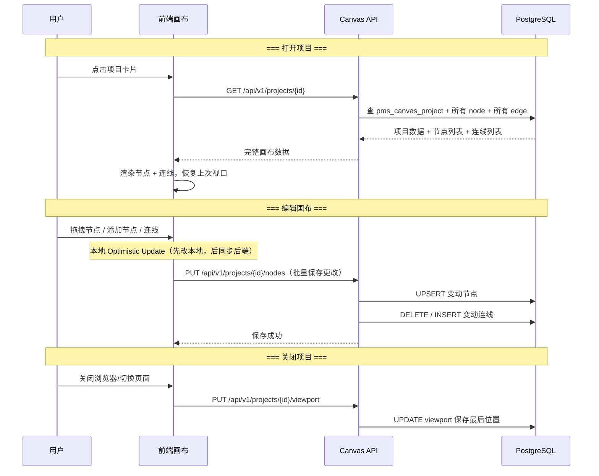
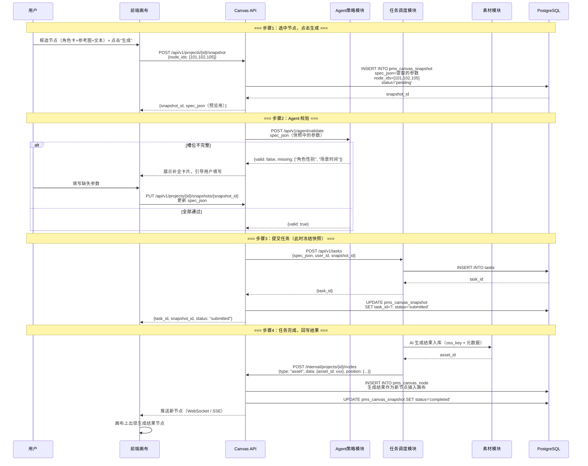
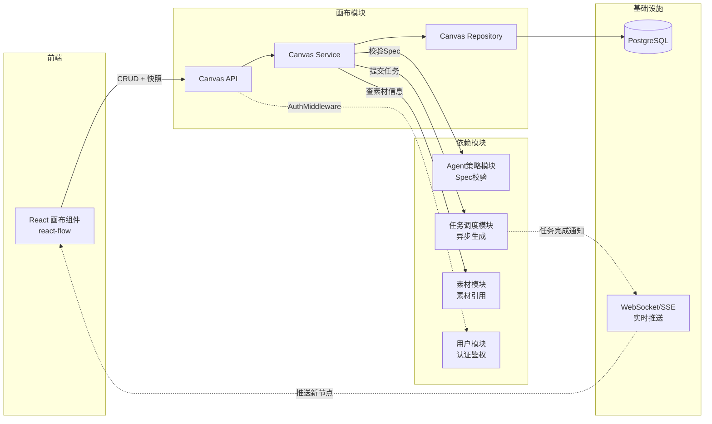

# [02] 画布模块设计稿

Created: 2026-07-29 | Status: Draft Updated: 2026-07-29 — 重构为关系型节点模型，修复表名与外键，补全节点类型与分镜设计，增加新人指南

---

## 1. 用途

画布模块是创作者的主工作台，负责：

- 无限画布：拖拽节点、连线、缩放、平移、框选
- 节点管理：素材节点、AI 生成节点、文本节点、分镜节点
- 结构化生成：选中节点 → 提取上下文 → 组装 Spec → 发给 Agent 校验 → 提交任务
- 分镜/时间轴：视频分镜的有序排列与预览
- 与素材、Agent、任务模块联动

> **画布前端基于 [basketikun/infinite-canvas](https://github.com/basketikun/infinite-canvas)**——与竞品 open-ai-canvas 共用同一上游，我们的后端在它的基础上改造。
> 
> **与上游的核心差异**：infinite-canvas / open-ai-canvas 把整张画布存成一个 JSON blob（`PayloadJSON`），简单但无法单独查询某个节点。
> x-media 做视频创作需要追踪每个节点的 AI 任务状态、素材引用关系，所以采用 **关系型节点表**，每个节点一行，支持按类型、状态、素材 ID 检索。

---

## 2. 最重要 3 点

### 2.1 数据结构设计

> **新人提示**：画布项目 = 一个创作工程（比如"第3集科幻短片"）。
> 节点 = 画布上每一个元素（图片、文本、AI生成按钮、分镜帧）。
> 连线 = 节点之间的关系线。快照 = AI 生成时冻结的画布状态。

#### 表1：画布项目表（pms_canvas_project）

```sql
-- ============================================================
-- 表1：画布项目表
-- 说明：每个画布项目 = 一个创作工程，包含标题、封面和视口状态
-- 数据量预估：普通用户 50+ 项目，全站万级
-- ============================================================
CREATE TABLE pms_canvas_project
(
    -- 【主键】项目唯一ID，与素材模块、任务模块关联时使用
    id              BIGINT PRIMARY KEY GENERATED ALWAYS AS IDENTITY,

    -- 【归属用户】项目属于谁创建
    user_id         BIGINT       NOT NULL REFERENCES pms_user (id),

    -- 【归属组织】可选，项目属于哪个团队空间
    -- NULL 表示个人项目，非 NULL 表示组织共有项目
    -- 此字段为后续团队协作预留，MVP 阶段所有项目都是个人项目
    organization_id BIGINT REFERENCES pms_organization (id),

    -- 【项目标题】用户在列表页看到的名称
    -- 示例："第3集 太空站对决"、"产品宣传片_v2"
    title           VARCHAR(255) NOT NULL DEFAULT '未命名项目',

    -- 【项目描述】可选，记录项目的创作意图或备注
    description     TEXT,

    -- 【封面图素材ID】项目列表页展示的缩略图
    -- 关联 pms_asset.id，通常取画布第一个图片节点或用户手动设置
    -- NULL 时前端显示默认占位图
    cover_asset_id  BIGINT REFERENCES pms_asset (id),

    -- 【画布视口】JSON 对象，记录用户上次查看的位置
    -- 格式：{"x": 0, "y": 0, "zoom": 1.0}
    -- 打开项目时恢复用户上次看到的画面位置
    viewport        JSONB,

    -- 【画布尺寸】JSON，记录画布整体大小
    -- 格式：{"width": 1920, "height": 1080}
    -- 可选，NULL 表示无限画布模式
    canvas_size     JSONB,

    -- 【项目状态】'draft'=创作中（默认）
    --            'review'=待审核（分享给导演/客户看）
    --            'completed'=已完成
    --            'archived'=已归档（只读，不再修改）
    -- 状态流转：draft → review → completed → archived（单向）
    status          VARCHAR(32)  NOT NULL DEFAULT 'draft',

    -- 【软删除】回收站，30天后物理清理
    deleted_at      TIMESTAMPTZ,

    -- 【时间字段】
    created_at      TIMESTAMPTZ  NOT NULL DEFAULT now(),
    updated_at      TIMESTAMPTZ  NOT NULL DEFAULT now()
);

-- 查询"我的项目列表"：WHERE user_id=? AND deleted_at IS NULL ORDER BY updated_at DESC
CREATE INDEX idx_project_user ON pms_canvas_project (user_id, deleted_at);
-- 查询"组织项目列表"：WHERE organization_id=? AND deleted_at IS NULL
CREATE INDEX idx_project_org ON pms_canvas_project (organization_id, deleted_at);
-- 按状态筛选：WHERE user_id=? AND status=?
CREATE INDEX idx_project_status ON pms_canvas_project (user_id, status);
-- 定时清理回收站过期项目（30天后物理删除）
CREATE INDEX idx_project_del ON pms_canvas_project (deleted_at) WHERE deleted_at IS NOT NULL;

COMMENT
ON TABLE  pms_canvas_project IS '画布项目表：每个项目对应一个创作工程，内含多个节点和连线';
COMMENT
ON COLUMN pms_canvas_project.id              IS '项目唯一ID，自增主键';
COMMENT
ON COLUMN pms_canvas_project.user_id         IS '归属用户ID，关联pms_user表';
COMMENT
ON COLUMN pms_canvas_project.organization_id IS '归属组织ID，NULL为个人项目';
COMMENT
ON COLUMN pms_canvas_project.title           IS '项目标题，列表页展示';
COMMENT
ON COLUMN pms_canvas_project.description     IS '项目描述，记录创作意图';
COMMENT
ON COLUMN pms_canvas_project.cover_asset_id  IS '封面图素材ID，关联pms_asset表';
COMMENT
ON COLUMN pms_canvas_project.viewport        IS '画布视口JSON：{x, y, zoom}，记录上次浏览位置';
COMMENT
ON COLUMN pms_canvas_project.canvas_size     IS '画布尺寸JSON，NULL表示无限画布';
COMMENT
ON COLUMN pms_canvas_project.status          IS '项目状态：draft=创作中，review=待审核，completed=已完成，archived=已归档';
COMMENT
ON COLUMN pms_canvas_project.deleted_at      IS '软删除时间，非NULL在回收站';
COMMENT
ON COLUMN pms_canvas_project.created_at      IS '创建时间';
COMMENT
ON COLUMN pms_canvas_project.updated_at      IS '最后更新时间';
```

#### 表2：画布节点表（pms_canvas_node）

```sql
-- ============================================================
-- 表2：画布节点表
-- 说明：画布上的每一个独立元素都是一个节点
-- 核心查询：按项目列出所有节点、按类型筛选、按素材ID反查被哪些画布引用
-- 数据量预估：平均每个项目 30-100 个节点
-- ============================================================
CREATE TABLE pms_canvas_node
(
    -- 【主键】节点唯一ID
    id             BIGINT PRIMARY KEY GENERATED ALWAYS AS IDENTITY,

    -- 【所属项目】节点属于哪个画布项目
    -- 删除项目时级联删除所有节点（ON DELETE CASCADE）
    project_id     BIGINT           NOT NULL REFERENCES pms_canvas_project (id) ON DELETE CASCADE,

    -- 【节点类型】决定前端用什么组件渲染、data JSON 里有什么字段
    -- 具体类型说明见下方「节点类型详解」
    type           VARCHAR(32)      NOT NULL,

    -- 【节点标签】在画布中显示的标题文字
    -- 示例："雪山参考图"、"生成主角视频"、"分镜3-特写"
    label          VARCHAR(255)     NOT NULL DEFAULT '',

    -- 【X 坐标】节点在画布中的水平位置（像素）
    position_x     DOUBLE PRECISION NOT NULL DEFAULT 0,

    -- 【Y 坐标】节点在画布中的垂直位置（像素）
    position_y     DOUBLE PRECISION NOT NULL DEFAULT 0,

    -- 【节点宽度】像素，用于前端渲染和碰撞检测
    -- NULL 时前端使用默认宽度（取决于节点类型）
    width          INT,

    -- 【节点高度】像素
    height         INT,

    -- 【节点样式】节点外观配置 JSON
    -- 示例：{"backgroundColor": "#FFFFFF", "borderColor": "#3366CC", "borderWidth": 2, "opacity": 1}
    -- 前端按此渲染，用户可自定义节点外观
    style          JSONB,

    -- 【业务数据】JSON 对象，根据节点类型存储不同内容
    -- 每种类型的 data 格式见下方「节点数据格式」
    -- 这是节点的核心字段，所有业务信息都在这里
    data           JSONB            NOT NULL DEFAULT '{}',

    -- 【排序序号】分镜 timeline 模式下的排列顺序（1, 2, 3...）
    -- 非分镜节点为 NULL
    -- 同一项目内 sort_order 应唯一（但不做数据库约束，前端负责排序）
    sort_order     INT,

    -- 【所属分镜组】NULL 表示不属于任何分镜组
    -- 非 NULL 表示分组 ID（同一分镜组内的节点属于同一组分镜，共享一个 group_id）
    -- group_id 是项目内自定义的字符串，不是数据库外键
    group_id       VARCHAR(64),

    -- 【父节点ID】用于节点嵌套（如：角色卡内嵌参考图）
    -- NULL 表示顶级节点
    parent_node_id BIGINT           REFERENCES pms_canvas_node (id) ON DELETE SET NULL,

    -- 【创建/更新时间】
    created_at     TIMESTAMPTZ      NOT NULL DEFAULT now(),
    updated_at     TIMESTAMPTZ      NOT NULL DEFAULT now()
);

-- 最核心索引：列出某个项目的所有节点（前端加载画布时用）
-- 按 sort_order 排序以支持分镜时间线模式
CREATE INDEX idx_node_project ON pms_canvas_node (project_id, sort_order);
-- 按类型筛选节点：列出项目中所有 AI 生成节点
CREATE INDEX idx_node_type ON pms_canvas_node (project_id, type);
-- 反查：某个素材被哪些画布节点引用（素材删除时检查是否有关联画布）
-- WHERE data->>'asset_id' = '123'
-- 注意：这是 JSONB 内部字段查询，需要用 GIN 索引
CREATE INDEX idx_node_data_gin ON pms_canvas_node USING GIN (data);

COMMENT
ON TABLE  pms_canvas_node IS '画布节点表：画布上每个元素对应一行，按类型区分行为';
COMMENT
ON COLUMN pms_canvas_node.project_id     IS '所属画布项目ID';
COMMENT
ON COLUMN pms_canvas_node.type           IS '节点类型：asset/image/video/audio/text/ai_gen/storyboard/character';
COMMENT
ON COLUMN pms_canvas_node.label          IS '节点标题，画布中显示';
COMMENT
ON COLUMN pms_canvas_node.position_x     IS '画布X坐标（像素）';
COMMENT
ON COLUMN pms_canvas_node.position_y     IS '画布Y坐标（像素）';
COMMENT
ON COLUMN pms_canvas_node.width          IS '节点渲染宽度，NULL用默认值';
COMMENT
ON COLUMN pms_canvas_node.height         IS '节点渲染高度，NULL用默认值';
COMMENT
ON COLUMN pms_canvas_node.style          IS '节点外观样式JSON：背景色/边框/透明度';
COMMENT
ON COLUMN pms_canvas_node.data           IS '业务数据JSON：根据节点类型存储不同内容';
COMMENT
ON COLUMN pms_canvas_node.sort_order     IS '分镜排序号，非分镜节点为NULL';
COMMENT
ON COLUMN pms_canvas_node.group_id       IS '分镜分组ID，同组节点属于同一组分镜';
COMMENT
ON COLUMN pms_canvas_node.parent_node_id IS '父节点ID，支持节点嵌套';
COMMENT
ON COLUMN pms_canvas_node.created_at     IS '创建时间';
COMMENT
ON COLUMN pms_canvas_node.updated_at     IS '最后更新时间';
```

#### 节点类型详解

| type 值      | 前端渲染    | data JSON 字段                                                                         | 说明                                      |
|--------------|-------------|----------------------------------------------------------------------------------------|-------------------------------------------|
| `asset`      | 素材卡片    | `{"asset_id": 123}`                                                                    | 引用素材模块的一个素材，展示缩略图        |
| `text`       | 文本框      | `{"content": "这是备注..."}`                                                           | 画布上的文字便签                          |
| `ai_gen`     | AI 生成面板 | `{"model": "kling", "prompt": "...", "params": {...}, "spec_id": 456}`                 | AI 生成请求节点，含模型、提示词、参数     |
| `storyboard` | 分镜帧      | `{"asset_id": 789, "duration_ms": 3000, "caption": "镜头3", "transcript": "旁白文本"}` | 分镜帧节点，属于时间线                    |
| `character`  | 角色卡      | `{"asset_id": 321, "name": "主角-小明", "attributes": {"年龄":"25", "性别":"男"}}`     | 角色设定卡                                |
| `reference`  | 参考图      | `{"asset_id": 456, "usage": "style"}`                                                  | 风格/构图参考，不直接参与生成，供 AI 参考 |

**为什么用 `data JSONB` 而不是为每种类型建独立字段**：

- 以后新增节点类型（如 `scene_setting`、`color_palette`、`voice_template`）时，不需要改表结构（ALTER TABLE），直接在 `data`
  里加字段即可
- GIN 索引支持 JSON 内部字段查询（如"查出所有引用了素材 123 的节点"）
- 缺点是不能做外键约束，需要在应用层校验 asset_id 是否合法

#### 表3：画布连线表（pms_canvas_edge）

```sql
-- ============================================================
-- 表3：画布连线表
-- 说明：记录节点之间的连接关系
-- 场景："这个参考图 → 用于这个 AI 生成任务"
--       "这个分镜 → 连到下一个分镜"
-- ============================================================
CREATE TABLE pms_canvas_edge
(
   -- 【主键】连线唯一ID
   id             BIGINT PRIMARY KEY GENERATED ALWAYS AS IDENTITY,

   -- 【所属项目】连线属于哪个画布项目
   project_id     BIGINT      NOT NULL REFERENCES pms_canvas_project (id) ON DELETE CASCADE,

   -- 【起点节点ID】连线从哪个节点出发
   source_node_id BIGINT      NOT NULL REFERENCES pms_canvas_node (id) ON DELETE CASCADE,

   -- 【起点端口】对于有多个输出端口的节点，指定从哪个端口连线
   -- 示例："output_image"、"output_video"、"output_main"
   -- 为 NULL 或 "default" 表示默认端口
   source_handle  VARCHAR(64)          DEFAULT 'default',

   -- 【终点节点ID】连线指向哪个节点
   target_node_id BIGINT      NOT NULL REFERENCES pms_canvas_node (id) ON DELETE CASCADE,

   -- 【终点端口】连接到目标节点的哪个输入端口
   -- 示例："input_reference"、"input_asset"、"input_prompt"
   target_handle  VARCHAR(64)          DEFAULT 'default',

   -- 【连线类型】前端用不同样式渲染不同类型的连线
   -- 'flow'=普通数据流连线（实线箭头）
   -- 'timeline'=时间线连线（虚线，带方向箭头）
   -- 'reference'=参考引用连线（浅色虚线，双向）
   type           VARCHAR(32) NOT NULL DEFAULT 'flow',

   -- 【连线标签】在连线上显示的文字
   -- 示例："参考风格"、"生成关系"、"→3秒后→"
   label          VARCHAR(128),

   -- 【连线样式】前端渲染样式 JSON
   -- 示例：{"stroke": "#3366CC", "strokeWidth": 2, "animated": true, "strokeDasharray": "5,5"}
   style          JSONB,

   -- 【创建时间】
   created_at     TIMESTAMPTZ NOT NULL DEFAULT now()
);

-- 查询某个项目的所有连线
CREATE INDEX idx_edge_project ON pms_canvas_edge (project_id);
-- 查询与某个节点相关的所有连线（删除节点时检查）
CREATE INDEX idx_edge_source ON pms_canvas_edge (source_node_id);
CREATE INDEX idx_edge_target ON pms_canvas_edge (target_node_id);
-- 防止重复连线：同一对 source/target/handle 组合只能有一条线
CREATE UNIQUE INDEX uk_edge_unique ON pms_canvas_edge
   (source_node_id, source_handle, target_node_id, target_handle);

COMMENT
ON TABLE  pms_canvas_edge IS '画布连线表：记录节点间的连接关系';
COMMENT
ON COLUMN pms_canvas_edge.project_id      IS '所属画布项目ID';
COMMENT
ON COLUMN pms_canvas_edge.source_node_id  IS '起点节点ID';
COMMENT
ON COLUMN pms_canvas_edge.source_handle   IS '起点端口名：default/output_image/output_video';
COMMENT
ON COLUMN pms_canvas_edge.target_node_id  IS '终点节点ID';
COMMENT
ON COLUMN pms_canvas_edge.target_handle   IS '终点端口名：default/input_reference/input_asset';
COMMENT
ON COLUMN pms_canvas_edge.type            IS '连线类型：flow=数据流，timeline=时间线，reference=引用';
COMMENT
ON COLUMN pms_canvas_edge.label           IS '连线标签文字';
COMMENT
ON COLUMN pms_canvas_edge.style           IS '连线样式JSON：颜色/粗细/虚线/动画';
COMMENT
ON COLUMN pms_canvas_edge.created_at      IS '创建时间';
```

#### 表4：画布快照表（pms_canvas_snapshot）

```sql
-- ============================================================
-- 表4：画布快照表
-- 说明：用户点击"生成"时，对当前画布状态做一次快照
-- 作用：如果 AI 生成过程中用户改了画布，不影响正在执行的任务
-- 竞品对照：open-ai-canvas 有 CanvasSnapshotJSON 做同样的事
-- ============================================================
CREATE TABLE pms_canvas_snapshot
(
    -- 【主键】快照唯一ID
    id         BIGINT PRIMARY KEY GENERATED ALWAYS AS IDENTITY,

    -- 【所属项目】哪个画布项目的快照
    project_id BIGINT      NOT NULL REFERENCES pms_canvas_project (id) ON DELETE CASCADE,

    -- 【创建快照的用户】
    user_id    BIGINT      NOT NULL REFERENCES pms_user (id),

    -- 【Spec JSON】从画布上下文中提取的结构化生成参数
    -- 这是发给 Agent 策略模块的输入，包含角色、场景、风格、参考图等
    -- 格式见下方「Spec JSON 结构说明」
    spec_json  JSONB       NOT NULL,

    -- 【节点ID列表】快照时包含哪些节点
    -- JSON 数组：如 [101, 102, 105, 108]
    -- 用于回溯"这次生成任务引用了画布上的哪些节点"
    node_ids   JSONB       NOT NULL DEFAULT '[]',

    -- 【关联任务ID】快照提交后创建的任务 ID
    -- 生成任务执行期间通过此字段追踪进度
    -- NULL 表示还未提交任务（快照创建了但还没发送）
    task_id    BIGINT,

    -- 【快照状态】'pending'=刚创建还没提交任务
    --            'submitted'=已提交生成任务
    --            'completed'=任务已完成，生成结果已回写
    --            'failed'=任务失败
    status     VARCHAR(32) NOT NULL DEFAULT 'pending',

    -- 【创建时间】
    created_at TIMESTAMPTZ NOT NULL DEFAULT now()
);

-- 查询某个项目的所有快照历史
CREATE INDEX idx_snapshot_project ON pms_canvas_snapshot (project_id, created_at DESC);
-- 通过任务ID反查快照
CREATE INDEX idx_snapshot_task ON pms_canvas_snapshot (task_id);

COMMENT
ON TABLE  pms_canvas_snapshot IS '画布快照表：AI生成前的画布状态冻结，支持生成期间继续编辑画布';
COMMENT
ON COLUMN pms_canvas_snapshot.project_id IS '所属画布项目ID';
COMMENT
ON COLUMN pms_canvas_snapshot.user_id    IS '创建快照的用户ID';
COMMENT
ON COLUMN pms_canvas_snapshot.spec_json  IS '结构化生成参数JSON，发给Agent模块';
COMMENT
ON COLUMN pms_canvas_snapshot.node_ids   IS '快照包含的节点ID列表JSON数组';
COMMENT
ON COLUMN pms_canvas_snapshot.task_id    IS '关联的生成任务ID';
COMMENT
ON COLUMN pms_canvas_snapshot.status     IS '快照状态：pending=待提交，submitted=已提交，completed=完成，failed=失败';
COMMENT
ON COLUMN pms_canvas_snapshot.created_at IS '快照创建时间';
```

#### Spec JSON 结构说明

用户选中画布上的若干节点点击"生成"时，后端从选中节点中提取以下结构化参数：

```json
{
  "project_id": 1,
  "type": "video_generation",
  // 生成类型：video_generation / image_generation / style_transfer
  "characters": [
    // 从 character 节点提取角色信息
    {
      "name": "小明",
      "asset_id": 321,
      "attributes": {
        "年龄": "25",
        "性别": "男"
      }
    }
  ],
  "references": [
    // 从 reference / asset 节点提取参考图
    {
      "asset_id": 456,
      "usage": "style_reference"
    },
    {
      "asset_id": 789,
      "usage": "composition"
    }
  ],
  "scene_description": "太空站内部走廊",
  // 从 text 节点提取场景描述
  "style": "科幻写实",
  // 风格标签
  "generation_params": {
    // AI 生成参数
    "model": "kling-v1.5",
    "prompt": "一个人在太空站走廊行走，科幻风格...",
    "negative_prompt": "模糊、变形...",
    "aspect_ratio": "16:9",
    "duration_ms": 5000
  }
}
```

这个 JSON 直接传给 Agent 策略模块做槽位校验，通过后再提交任务调度模块。

---

### 2.2 数据流转过程

#### 2.2.1 画布基础操作（打开/编辑/保存）



**保存策略**：

- 用户每次操作（拖拽、添加、删除）后，前端 300ms 防抖自动保存
- 同时最多积攒 50 个未保存的更改，超过后强制保存
- 服务端只保存变更的节点/连线，不做全量同步（节省带宽）

#### 2.2.2 AI 生成流程（核心路径）



**关键设计**：快照机制让用户在 AI 生成过程中 **继续编辑画布**，不会影响正在执行的任务。生成结果作为新节点插入到画布上用户的当前视口中央。

---

### 2.3 总体架构



**模块内部目录结构（建议）**：

```
internal/canvas/
├── handler.go          # HTTP 请求处理
├── service.go          # 画布业务逻辑：快照提取、节点批量保存、生成流程编排
├── repository.go       # 数据访问：项目CRUD、节点/连线批量操作
├── model.go            # 数据模型定义
├── spec_extractor.go   # 从选中节点提取 Spec JSON（核心逻辑）
├── snapshot.go         # 快照管理（创建、更新、查询历史）
└── middleware.go        # 项目归属校验中间件
```

---

## 3. 接口清单（MVP）

### 3.1 项目管理

| 方法     | 路径                              | 说明                        | 认证 |
|----------|-----------------------------------|-----------------------------|------|
| `GET`    | `/api/v1/projects`                | 我的项目列表（分页）        | 需要 |
| `POST`   | `/api/v1/projects`                | 创建新项目                  | 需要 |
| `GET`    | `/api/v1/projects/{id}`           | 加载画布（含所有节点+连线） | 需要 |
| `PUT`    | `/api/v1/projects/{id}`           | 更新项目（标题/描述/封面）  | 需要 |
| `DELETE` | `/api/v1/projects/{id}`           | 软删除项目（移入回收站）    | 需要 |
| `POST`   | `/api/v1/projects/{id}/restore`   | 从回收站恢复                | 需要 |
| `POST`   | `/api/v1/projects/{id}/duplicate` | 复制项目                    | 需要 |
| `PUT`    | `/api/v1/projects/{id}/viewport`  | 保存当前视口位置            | 需要 |

### 3.2 节点操作

| 方法     | 路径                          | 说明                      | 认证 |
|----------|-------------------------------|---------------------------|------|
| `POST`   | `/api/v1/projects/{id}/nodes` | 批量创建节点              | 需要 |
| `PUT`    | `/api/v1/projects/{id}/nodes` | 批量更新节点（位置/数据） | 需要 |
| `DELETE` | `/api/v1/projects/{id}/nodes` | 批量删除节点              | 需要 |

**批量更新请求体示例**：

```json
{
  "nodes": [
    {
      "id": 101,
      "position_x": 350.5,
      "position_y": 200.0,
      "data": {
        "asset_id": 123
      }
    },
    {
      "id": 102,
      "position_x": 600.0,
      "position_y": 200.0,
      "style": {
        "backgroundColor": "#FF0000"
      }
    }
  ]
}
```

### 3.3 连线操作

| 方法     | 路径                          | 说明         | 认证 |
|----------|-------------------------------|--------------|------|
| `POST`   | `/api/v1/projects/{id}/edges` | 批量创建连线 | 需要 |
| `DELETE` | `/api/v1/projects/{id}/edges` | 批量删除连线 | 需要 |

### 3.4 AI 生成（快照 + 提交）

| 方法   | 路径                                           | 说明                             | 认证 |
|--------|------------------------------------------------|----------------------------------|------|
| `POST` | `/api/v1/projects/{id}/snapshots`              | 创建快照（框选节点 → 提取 Spec） | 需要 |
| `GET`  | `/api/v1/projects/{id}/snapshots`              | 快照历史列表                     | 需要 |
| `GET`  | `/api/v1/projects/{id}/snapshots/{sid}`        | 快照详情（含 Spec 内容）         | 需要 |
| `PUT`  | `/api/v1/projects/{id}/snapshots/{sid}`        | 更新快照（补全缺失槽位后）       | 需要 |
| `POST` | `/api/v1/projects/{id}/snapshots/{sid}/submit` | 提交快照到任务调度模块           | 需要 |
| `GET`  | `/api/v1/projects/{id}/snapshots/{sid}/status` | 查询快照关联任务进度             | 需要 |

### 3.5 分镜视图

| 方法  | 路径                                       | 说明                               | 认证 |
|-------|--------------------------------------------|------------------------------------|------|
| `GET` | `/api/v1/projects/{id}/storyboard`         | 获取分镜列表（按 sort_order 排序） | 需要 |
| `PUT` | `/api/v1/projects/{id}/storyboard/reorder` | 重新排序分镜                       | 需要 |

### 3.6 内部接口（供其他模块调用）

| 方法   | 路径                                  | 说明                                     |
|--------|---------------------------------------|------------------------------------------|
| `POST` | `/internal/projects/{id}/nodes`       | 任务调度回调：生成结果作为新节点插入画布 |
| `GET`  | `/internal/nodes/by-asset/{asset_id}` | 素材模块查询：某素材被哪些画布引用       |

---

## 4. 核心业务规则

### 4.1 节点批量保存（防抖策略）

```
前端逻辑：
  用户操作 → 标记节点为 "dirty"
  → 300ms 防抖定时器启动
  → 期间有新操作 → 重置定时器
  → 定时器到期 → 收集所有 dirty 节点 → 批量 PUT
  
服务端逻辑：
  POST/PUT /nodes 接收节点数组
  → 逐条 UPSERT（按 id 存在则更新，不存在则插入）
  → 在同一个事务中执行（要么全成功，要么全失败）
```

### 4.2 快照提取逻辑（spec_extractor）

当用户框选节点并点击"生成"时，后端遍历选中的节点，按类型提取参数：

```
遍历选中节点：
  ├─ type='character'  → 提取到 spec_json.characters[]
  ├─ type='reference'  → 提取到 spec_json.references[]
  ├─ type='asset'      → 按 data.usage 可能归到 references
  ├─ type='text'       → data.content 合并到 spec_json.scene_description
  ├─ type='ai_gen'     → data.model/prompt/params 复制到 spec_json.generation_params
  └─ type='storyboard' → 提取 caption 和 transcript 用于上下文

最后组装：spec_json = { project_id, type, characters, references, scene_description, style, generation_params }
```

### 4.3 画布加载性能

| 策略           | 说明                                                      |
|----------------|-----------------------------------------------------------|
| 节点分页       | 如果节点数 > 500，先加载前 200 个，滚动时懒加载           |
| 缩略图延迟加载 | 素材节点的缩略图在可视区时才加载（Intersection Observer） |
| 连线按需加载   | 先不加载连线（看不见），画布渲染完成后异步加载            |
| 视口恢复       | 打开画布时恢复到上次离开的位置                            |

### 4.4 并发编辑冲突

MVP 阶段 **不处理多用户并发编辑**（项目同一时间只能由一个用户编辑）。为未来预留：

- `updated_at` 字段 → 保存时用乐观锁：`UPDATE ... WHERE updated_at = ?`
- 如果 WHERE 条件不命中（说明已被他人修改）→ 返回 409 Conflict

---

## 5. 与 infinite-canvas / open-ai-canvas 竞品对比

> 竞品 open-ai-canvas 基于 [infinite-canvas](https://github.com/basketikun/infinite-canvas) 二次开发，我们与竞品共用同一画布上游。

| 维度         | infinite-canvas / open-ai-canvas（竞品） | x-media（我们）                       | 评价                          |
|--------------|-------------------------------------|---------------------------------------|-------------------------------|
| 存储模式     | 文档型——整张画布一个 JSON blob      | 关系型——每节点一行                    | ✅ 更适合视频创作的节点级追踪 |
| Project 模型 | CanvasProject 独立于 Project        | pms_canvas_project 合二为一           | ✅ 更简单                     |
| 节点粒度     | 隐含在 PayloadJSON 里               | 独立 pms_canvas_node 表               | ✅ 可单独查询/统计            |
| AI 生成入口  | Session + Task 机制                 | 快照 + spec_extractor + 分步提交      | ✅ 流程更清晰                 |
| 分镜/时间轴  | 独立的 Shot/Unit 模型               | 内置 sort_order + storyboard 视图     | ✅ 更轻量                     |
| 连线端口     | 隐含在 JSON 中                      | source_handle/target_handle 显式字段  | ✅ 支持复杂拓扑               |
| 快照机制     | CanvasSnapshotJSON（在 Session 里） | 独立 pms_canvas_snapshot 表           | ✅ 可查询历史                 |
| 多用户协作   | 无                                  | 无（MVP 一致）                        | —                             |
| 项目状态机   | active / archived                   | draft / review / completed / archived | ✅ 更丰富的生命周期           |
| 软删除       | 无                                  | deleted_at + 回收站                   | ✅ 防误删                     |

---

## 6. 依赖模块

| 模块                | 依赖说明                   | 接口要求                      |
|---------------------|----------------------------|-------------------------------|
| `[00]用户模块`      | 项目归属、认证中间件       | `GET /api/v1/users/me`        |
| `[01]素材模块`      | 节点 data 中引用 asset_id  | `GET /api/v1/assets/{id}`     |
| `[03]Agent策略模块` | Spec 校验与槽位补全        | `POST /api/v1/agent/validate` |
| `[04]任务调度模块`  | 提交生成任务、接收结果回写 | `POST /api/v1/tasks`          |

---

## 7. 新人上手指南

### 7.1 四张表一句话解释

| 表                    | 一句话                                                          |
|-----------------------|-----------------------------------------------------------------|
| `pms_canvas_project`  | "我创建了一个叫「太空短片」的项目" → 这就是一个项目             |
| `pms_canvas_node`     | "项目里有一张图片、一段文字、一个生成按钮" → 每个都是节点       |
| `pms_canvas_edge`     | "这张图和这个生成任务之间有一条线" → 节点之间的连线             |
| `pms_canvas_snapshot` | "用户点生成时，我把当前画布状态拍了个快照" → 生成期间冻结的状态 |

### 7.2 核心概念速查

1. **节点 vs 素材**：节点是画布上的容器，素材是实际的文件。`asset` 类型节点通过 `data.asset_id`
   引用素材表中的记录。一个素材可以被多个画布的多个节点引用。

2. **快照的作用**：用户选了几个节点点"生成"，我们把这些节点的信息提取成 Spec JSON
   存起来。这样即使用户马上又开始编辑画布（移动节点、删节点），正在执行的生成任务不受影响——因为它看的是快照时的状态。

3. **批量保存**：前端不每个操作都调一次接口，而是攒一堆修改（最多 50 个，最长等 300ms）一起发。服务端收到后在一个事务里全部写完。

4. **分镜排序**：分镜视图（storyboard）是按 `sort_order` 字段从小到大排列的。前端拖拽调整顺序时，传新的排序数组（
   `[{id:101, sort_order:1}, {id:105, sort_order:2}, ...]`），后端批量更新。

5. **handle 端口**：一个节点可以有多个输入/输出。比如 AI 生成节点有 `input_reference`（参考图输入）和 `input_prompt`
   （提示词输入）两个端口。连线时指定连到哪个端口，前端就能知道数据流方向。

### 7.3 分工建议

| 负责   | 工作内容                                                                      |
|--------|-------------------------------------------------------------------------------|
| 后端 A | `pms_canvas_project` 表 CRUD + 视图保存 + 项目中间件                          |
| 后端 B | `pms_canvas_node` + `pms_canvas_edge` 批量操作（核心难点：事务内批量 UPSERT） |
| 后端 C | `pms_canvas_snapshot` + spec_extractor（从节点提取 Spec JSON）                |
| 前端 A | react-flow 画布渲染 + 节点/连线交互 + 视口管理                                |
| 前端 B | AI 生成面板 + 快照补全 UI + 分镜时间线视图                                    |
| 前端 C | 项目列表 + 画布加载/保存 + WebSocket 实时推送                                 |

### 7.4 常见踩坑点

1. **前端画布选型**：建议用 **react-flow**（最成熟的 React 画布库），自带节点拖拽、连线、缩放。不要从零写画布，不要用
   tldraw（那是白板工具，不适合我们的节点-连线模型）。

2. **批量 UPSERT 的事务**：同一个项目的节点保存操作必须在同一个事务里——不能出现"3 个节点写入了，2 个失败"的情况。用
   `INSERT ... ON CONFLICT (id) DO UPDATE`。

3. **删除项目时级联删除**：`pms_canvas_project` 删除时要同时删 node / edge / snapshot（通过 ON DELETE CASCADE）。但如果项目只是软删除（
   `deleted_at != NULL`），子表不触发 CASCADE，需要手动处理。

4. **Spec 提取的边界情况**：用户框选 0 个节点点生成 → 返回错误（"至少选一个节点"）；框选 50 个节点 → 取前 20 个（避免 Spec
   太大导致 token 超限）。

5. **GIN 索引的 JSONB 查询**：`data->>'asset_id'` 查询不走 `idx_node_data_gin`。正确写法是 `data @> '{"asset_id": 123}'`
   或者建表达式索引 `CREATE INDEX ON pms_canvas_node ((data->>'asset_id'))`。

---
