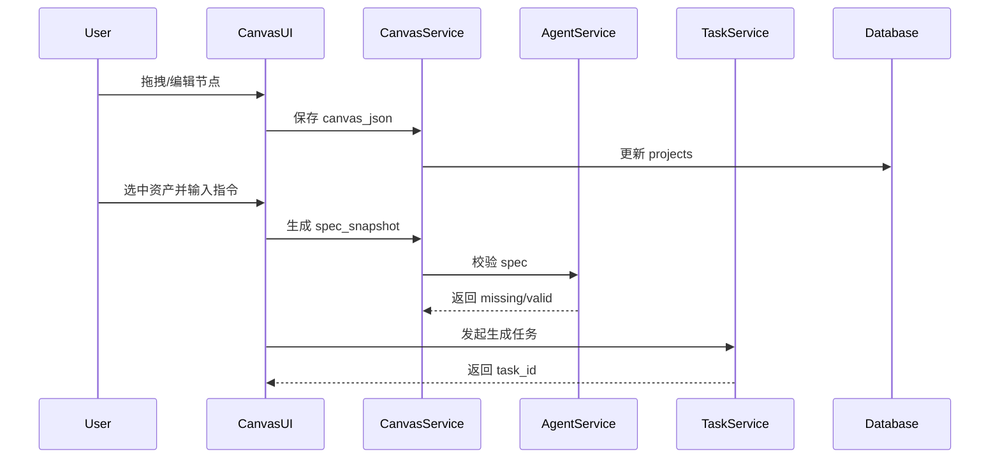
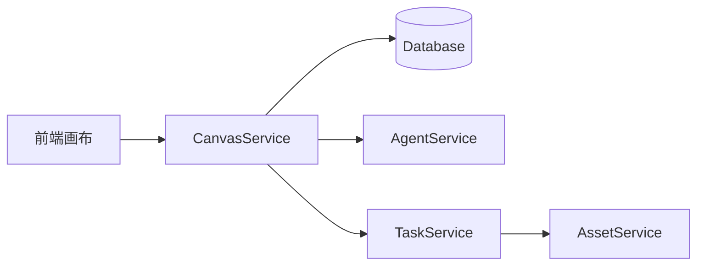

# [02] 画布模块设计稿

Created: 2026-07-29 Status: Draft

---

## 1. 用途

画布模块是创作者的主工作台，负责：

- 无限画布、节点、连线、框选、撤销重做
- 画布上下文捕获与 Spec 生成
- 结构化参数面板（Spec Snapshot）
- 分镜/时间轴预览与局部修改
- 与素材、Agent、任务模块联动

---

## 2. 最重要 3 点

### 2.1 数据结构设计

```sql
create table projects
(
    id            bigint primary key generated always as identity,
    user_id       bigint       not null references users (id),
    title         varchar(255) not null,
    canvas_json   jsonb        not null,
    spec_snapshot jsonb,
    status        varchar(32) default 'draft',
    created_at    timestamptz default now(),
    updated_at    timestamptz default now()
);

create table canvas_nodes
(
    id          bigint primary key generated always as identity,
    project_id  bigint      not null references projects (id),
    type        varchar(64) not null,
    position    jsonb,
    metadata    jsonb,
    output_refs jsonb,
    created_at  timestamptz default now()
);

create table canvas_edges
(
    id             bigint primary key generated always as identity,
    project_id     bigint not null references projects (id),
    source_node_id bigint not null references canvas_nodes (id),
    target_node_id bigint not null references canvas_nodes (id),
    created_at     timestamptz default now()
);
```

设计说明：

- `projects.canvas_json` 保存画布全量状态，支持导入导出与版本快照。
- `canvas_nodes.metadata` 存储节点的业务数据，如 prompt、asset_id、model。
- `output_refs` 记录节点输出素材，便于回查生成链路。

### 2.2 数据流转过程



关键流转：

- 画布本地优先，登录后异步同步后端。
- 选中资产 -> 上下文注入 -> spec_snapshot -> Agent 校验。
- 任务完成后回写节点输出，画布只保存引用 ID。

### 2.3 总体架构



参考 open-ai-canvas：

- 前端画布：`D:\GoWorkSpace\open-ai-canvas\web\src\components\canvas`
- 画布页面：`D:\GoWorkSpace\open-ai-canvas\web\src\pages\canvas`

建议：

- 前端状态以 `canvas_json` 为准，服务端做校验与同步。
- Spec Snapshot 放在侧边栏，支持 JSON 编辑。

---

## 3. 接口清单（MVP）

| 方法 | 路径                         | 说明      |
|------|------------------------------|-----------|
| GET  | /api/v1/projects             | 项目列表  |
| POST | /api/v1/projects             | 创建项目  |
| GET  | /api/v1/projects/{id}        | 项目详情  |
| PUT  | /api/v1/projects/{id}/canvas | 保存画布  |
| PUT  | /api/v1/projects/{id}/spec   | 更新 Spec |
| POST | /api/v1/projects/{id}/nodes  | 创建节点  |

---

## 4. 依赖模块

| 模块          | 依赖说明     |
|---------------|--------------|
| 用户模块      | 项目归属     |
| 素材模块      | 节点引用素材 |
| Agent策略模块 | Spec 校验    |
| 任务调度模块  | 生成任务     |

---

## 5. 与 open-ai-canvas 的映射

| 我们的模块 | open-ai-canvas 对应    |
|------------|------------------------|
| 画布模块   | web 画布组件与状态管理 |
| Spec面板   | 侧边栏参数区           |
| 节点输出   | 任务回写资源           |
