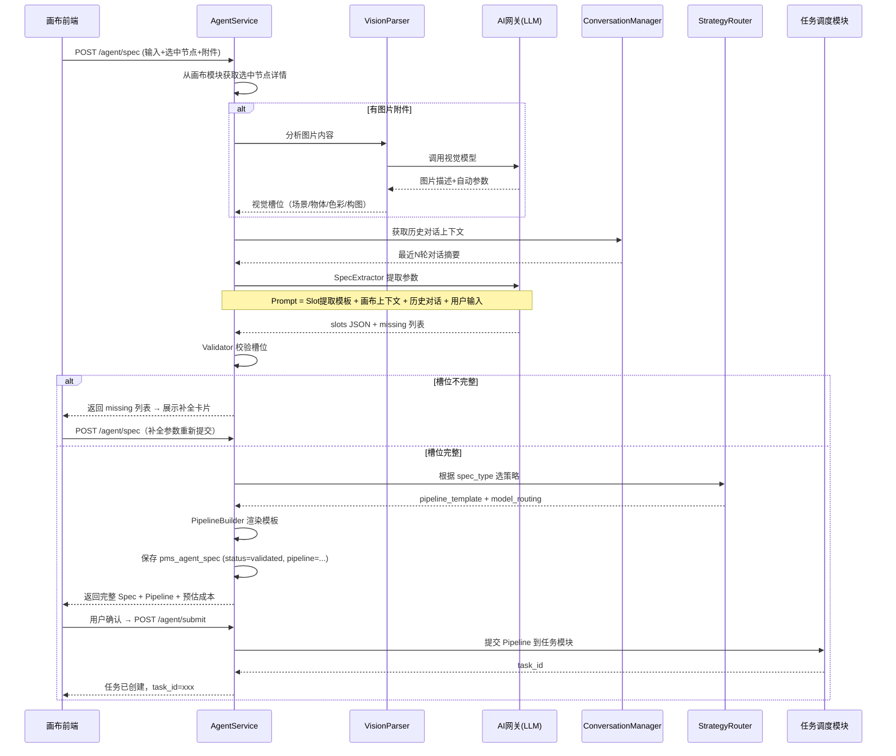

# [03] Agent 策略模块设计文档

Created: 2026-07-29 | Status: Draft | 作者: AI Assisted | Reviewed: 2026-07-29

---

## 📌 模块定位

> Agent 策略模块是产品的**"制片人脑"**——负责理解用户意图、提取结构化参数、选择生成策略、输出下游可执行的 Pipeline 定义。**不做模型调用**，只做"意图理解 → 策略路由 → 结构输出"。

一句话：**把自然语言 + 画布上下文 → 变成任务调度模块能执行的 Pipeline JSON**。

---

## 🗺️ 新人 3 分钟速通

### 4 张表一句话

| 表 | 一句话 |
|----|--------|
| `pms_agent_spec` | 一次生成请求的**完整结构化参数**（长什么样、用什么模型、参考谁） |
| `pms_agent_strategy` | 每种生成类型的**管线模板**（文生图怎么做、图生视频怎么做） |
| `pms_agent_prompt_template` | LLM 用的**提示词模板**（如何从用户输入提取参数、如何追问缺失槽位） |
| `pms_agent_conversation` | **多轮对话记录**（用户问了什么、Agent 回了什么、token 用了多少） |

### 核心概念速查

| 概念 | 含义 | 类比 |
|------|------|------|
| **Spec** | 结构化生成参数 | 拍电影的"分镜脚本" |
| **Slot** | Spec 中的一个参数 | 脚本里的"景别""时长""风格" |
| **Strategy** | 管线模板 | 拍电影的"制作流程" |
| **Pipeline** | 具体要执行的步骤序列 | "先文生图 → 再图生视频 → 最后配音" |
| **Prompt Template** | LLM 提示词模板 | 副导演的"提问话术" |

### 数据流一句话

```
用户输入 + 画布选中节点 → [提取Spec] → [校验槽位] → [选策略] → [生成Pipeline] → 提交任务模块
                                    ↓ 有缺失
                               [追问用户补全]
```

---

## 🆚 竞品对比（open-ai-canvas）

| 维度 | open-ai-canvas | x-media（我们） |
|------|---------------|----------------|
| Agent 实现 | TypeScript 独立进程，MCP 协议 | Go 服务内模块 |
| LLM 交互 | Codex/Claude 通过子进程 | HTTP 调用 AI 网关 |
| Spec 存储 | **无**——LLM 直接操作画布 | ✅ 有——`pms_agent_spec` 持久化 |
| 策略/管线 | **无**——LLM 自由发挥 | ✅ 有——`pms_agent_strategy` 模板化 |
| Prompt 管理 | 硬编码在 `config.ts` 里 | ✅ 有——`pms_agent_prompt_template` 可配置 |
| 视觉理解 | Codex 原生 `localImage` | ✅ 独立 Vision 解析流程 |
| 槽位校验 | LLM 自行判断 | ✅ 规则引擎 + LLM 双保险 |
| 多轮对话 | Codex Thread 管理 | ✅ `pms_agent_conversation` + 上下文窗口 |
| 模型选择 | 前端 AiConfig 静态配置 | ✅ Spec 级别动态路由 |
| Pipeline 可追踪 | ❌ | ✅ 每步可查 step_key + 耗时 |

---

## 1. 数据结构设计

### 1.1 pms_agent_spec — 结构化生成参数（核心表）

```sql
create table pms_agent_spec
(
    id                bigint primary key generated always as identity,

    -- 归属
    project_id        bigint      not null references pms_canvas_project (id),
    user_id           bigint      not null references pms_user (id),

    -- Spec 元信息
    spec_type         varchar(64) not null,  -- text_to_image | text_to_video | image_to_video
                                             -- video_edit | audio_gen | character_gen | storyboard
    status            varchar(32) not null default 'draft',
    -- 状态流转: draft → validating → validated → rejected
    --           rejected 可回到 draft（用户修改后重新校验）

    -- 核心数据
    slots             jsonb       not null,  -- 结构化槽位，见下方 Slot Schema
    missing           jsonb,                -- 缺失槽位列表，如 ["duration_seconds", "aspect_ratio"]
    pipeline          jsonb,                -- 校验通过后生成的 Pipeline 定义，可直接交给任务模块
    validation_errors jsonb,                -- 校验失败原因，如 [{"field":"duration_seconds","reason":"必须介于1-60秒"}]

    -- 来源追踪
    source            varchar(32) not null default 'manual',
    -- manual: 用户手动填参 | agent: Agent 提取 | template: 从模板创建

    -- AI 调用追踪
    agent_model       varchar(128),         -- 提取 Spec 用的 LLM 模型
    agent_tokens      int,                  -- 提取过程消耗的 token 数

    created_at        timestamptz not null default now(),
    updated_at        timestamptz not null default now()
);

create index idx_agent_spec_project on pms_agent_spec (project_id);
create index idx_agent_spec_user    on pms_agent_spec (user_id);
create index idx_agent_spec_status  on pms_agent_spec (status) where status = 'validated';
```

**Slots JSONB 结构（以 `text_to_video` 为例）：**

```json
{
  "prompt": "一只猫在草地上奔跑，电影质感，4K",
  "negative_prompt": "模糊，变形，低质量",
  "duration_seconds": 5,
  "aspect_ratio": "16:9",
  "resolution": "1080p",
  "fps": 24,
  "style": "cinematic",
  "camera_movement": "static",
  "reference_image_asset_ids": [101, 102],
  "reference_video_asset_ids": [],
  "reference_audio_asset_ids": [],
  "character_ids": [],
  "storyboard_index": 0
}
```

**Pipeline JSONB 结构（校验通过后生成）：**

```json
{
  "version": "1.0",
  "steps": [
    {
      "step_key": "text_to_image",
      "model": "sdxl-turbo",
      "input": { "prompt": "{{slots.prompt}}", "negative_prompt": "{{slots.negative_prompt}}",
                  "width": 1920, "height": 1080 },
      "output_key": "base_frame"
    },
    {
      "step_key": "image_to_video",
      "model": "svd-xt",
      "input": { "image_ref": "{{steps.base_frame.output}}", "duration_seconds": "{{slots.duration_seconds}}",
                  "fps": "{{slots.fps}}" },
      "output_key": "video"
    }
  ]
}
```

> Pipeline 使用 `{{slots.xxx}}` 和 `{{steps.xxx.output}}` 模板语法引用上游数据，任务模块负责渲染。

### 1.2 pms_agent_strategy — 生成策略/管线模板（新增）

```sql
create table pms_agent_strategy
(
    id                bigint primary key generated always as identity,

    -- 策略标识
    name              varchar(128) not null unique,  -- 如 "文生视频-标准"、"图生视频-高质量"
    spec_type         varchar(64)  not null,          -- 对应 pms_agent_spec.spec_type
    description       text,

    -- 管线模板
    pipeline_template jsonb        not null,          -- Pipeline 模板，含 {{slots.xxx}} 占位符
    model_routing     jsonb,                          -- 模型路由规则

    -- 需要传入的节点类型（用于从画布提取参考素材）
    required_input_types jsonb,     -- 如 ["image", "audio"] 表示需要传入图片和音频节点
    optional_input_types jsonb,     -- 如 ["character"] 表示可选的角色节点

    -- 槽位 Schema——定义这个策略有哪些槽位、哪些必填
    slot_schema       jsonb        not null,
    -- 示例: [{"key":"prompt","type":"string","required":true,"max_length":500},
    --        {"key":"duration_seconds","type":"int","required":false,"default":5,"min":1,"max":60}]

    is_default        boolean      not null default false,
    status            varchar(32)  not null default 'active',  -- active | inactive
    sort_order        int          not null default 0,

    created_at        timestamptz  not null default now(),
    updated_at        timestamptz  not null default now()
);

create index idx_agent_strategy_type   on pms_agent_strategy (spec_type, status);
create index idx_agent_strategy_default on pms_agent_strategy (spec_type, is_default) where is_default = true;
```

### 1.3 pms_agent_prompt_template — Prompt 模板管理（新增）

```sql
create table pms_agent_prompt_template
(
    id               bigint primary key generated always as identity,

    name             varchar(128) not null,         -- 模板名，如 "文生视频-Slot提取"
    spec_type        varchar(64)  not null,         -- 适用的 Spec 类型
    role             varchar(32)  not null,         -- system | user | slot_extractor | validator | vision
    template_content text         not null,         -- 模板文本，含 {{variable}} 占位符
    variables        jsonb,                         -- 模板变量说明
    -- 示例: [{"name":"canvas_context","description":"画布当前选中节点的描述文本"},
    --        {"name":"user_input","description":"用户输入的原始自然语言"}]

    version          int          not null default 1,
    is_active        boolean      not null default true,
    created_at       timestamptz  not null default now(),
    updated_at       timestamptz  not null default now()
);

create index idx_agent_prompt_type on pms_agent_prompt_template (spec_type, role, is_active);
```

**模板示例（`slot_extractor` 角色）：**

```
你是一个视频创作参数提取助手。根据用户的输入和画布上下文，提取视频生成的结构化参数。

## 画布上下文
{{canvas_context}}

## 用户输入
{{user_input}}

## 可用的参考素材
{{reference_assets}}

## 输出要求
请以 JSON 格式输出，包含以下字段：
- prompt: 详细的视频描述
- negative_prompt: 不希望出现的内容
- duration_seconds: 视频时长（1-60秒）
- aspect_ratio: 画幅比例（1:1/16:9/9:16）
- style: 视觉风格
- camera_movement: 镜头运动方式

如果有无法确定的参数，在 missing 数组中列出字段名和原因。
```

### 1.4 pms_agent_conversation — 多轮对话记录

```sql
create table pms_agent_conversation
(
    id           bigint primary key generated always as identity,

    -- 归属（一个对话可以关联一个 Spec，也可以在没有 Spec 时先对话）
    project_id   bigint      not null references pms_canvas_project (id),
    user_id      bigint      not null references pms_user (id),
    spec_id      bigint      references pms_agent_spec (id),

    -- 消息内容
    role         varchar(32) not null,  -- user | assistant | system | tool
    content      text,                  -- 消息文本（用户输入或 AI 回复）
    tool_calls   jsonb,                 -- AI 调用的工具记录
    tool_results jsonb,                 -- 工具返回结果

    -- Token 追踪
    prompt_tokens     int,
    completion_tokens int,
    total_tokens      int,

    -- 关联的素材引用（如果本轮上传了图片）
    attachment_asset_ids jsonb,

    created_at   timestamptz not null default now()
);

create index idx_agent_conv_project on pms_agent_conversation (project_id, created_at);
create index idx_agent_conv_spec    on pms_agent_conversation (spec_id);
```

---

## 2. 总体架构

```
┌──────────────────────────────────────────────────────────┐
│                     画布前端                               │
│  ┌──────────┐  ┌──────────┐  ┌──────────────────────┐    │
│  │用户输入框 │  │选中节点  │  │补全卡片（缺失槽位追问）│    │
│  └─────┬─────┘  └────┬─────┘  └──────────┬───────────┘    │
└────────┼──────────────┼───────────────────┼───────────────┘
         │              │                   │
         ▼              ▼                   ▼
┌──────────────────────────────────────────────────────────┐
│                  Agent 策略模块                            │
│                                                          │
│  ┌──────────────┐   ┌──────────────┐   ┌──────────────┐ │
│  │ SpecExtractor│──▶│  Validator   │──▶│StrategyRouter│ │
│  │ (LLM提取参数) │   │ (规则+LLM)   │   │ (选管线模板)  │ │
│  └──────┬───────┘   └──────┬───────┘   └──────┬───────┘ │
│         │                  │                   │         │
│  ┌──────┴───────┐          │           ┌──────┴───────┐ │
│  │ VisionParser │          │           │PipelineBuilder│ │
│  │ (图片理解)    │          │           │ (渲染模板)    │ │
│  └──────────────┘          │           └──────┬───────┘ │
│                            │                   │         │
│  ┌────────────────────────┴───────────────────┴───────┐ │
│  │              ConversationManager                   │ │
│  │          (多轮对话 + 上下文窗口管理)                 │ │
│  └────────────────────────────────────────────────────┘ │
└──────────────────────────────────────────────────────────┘
         │              │                   │
         ▼              ▼                   ▼
┌──────────────────────────────────────────────────────────┐
│              依赖模块                                     │
│  ┌──────────┐  ┌──────────┐  ┌──────────┐  ┌──────────┐│
│  │ 画布模块  │  │ 素材模块  │  │AI网关模块│  │任务调度  ││
│  │(上下文)   │  │(素材详情) │  │(LLM调用) │  │(提交任务)││
│  └──────────┘  └──────────┘  └──────────┘  └──────────┘│
└──────────────────────────────────────────────────────────┘
```

---

## 3. 核心流程

### 3.1 主流程：从用户输入到 Pipeline 输出

```
POST /api/v1/agent/spec
{
  "project_id": 42,
  "user_input": "生成一只猫在草地上奔跑的5秒视频，16:9，电影质感",
  "selected_node_ids": [201, 202],     // 画布上选中的参考节点
  "attachments": [                     // 用户上传的图片
    {"asset_id": 301}
  ]
}
```



### 3.2 视觉理解子流程

```
POST /api/v1/agent/vision
{ "asset_ids": [301, 302] }
```

```
VisionParser
  → 批量从素材模块获取图片的临时访问 URL
  → 调用 AI 网关的视觉模型（如 GPT-4V / Qwen-VL）
  → Prompt: "分析这张图片，提取以下信息：
      1. 主体内容描述
      2. 场景环境
      3. 色彩调性
      4. 构图方式
      5. 风格标签
    输出 JSON 格式"
  → 返回 JSON + 写入到 pms_agent_conversation (role=tool)
```

### 3.3 上下文窗口管理

```go
// ConversationManager 的核心逻辑（伪码）
func (m *ConversationManager) BuildContext(projectID, specID int64, userInput string) (string, error) {
    const maxTokens = 8000     // 留给上下文的 token 预算
    const summaryThreshold = 10 // 超过 10 轮对话时自动压缩

    msgs, _ := m.repo.GetRecentMessages(projectID, 50)

    if len(msgs) > summaryThreshold {
        // 压缩早期消息为摘要
        summary := m.summarize(msgs[:len(msgs)-summaryThreshold])
        recent := msgs[len(msgs)-summaryThreshold:]
        return m.buildPrompt(summary, recent, userInput), nil
    }
    return m.buildPrompt(nil, msgs, userInput), nil
}
```

### 3.4 Spec 状态机

```
  ┌──────┐   POST /agent/spec   ┌────────────┐   校验通过   ┌───────────┐
  │ draft │ ──────────────────▶ │ validating │ ───────────▶ │ validated │
  └──────┘                      └────────────┘              └─────┬─────┘
      ▲                              │                            │
      │                     校验失败  │                    用户确认 │
      │                              ▼                            ▼
      │                         ┌──────────┐              ┌───────────┐
      └───── 用户修改参数 ────── │ rejected │          任务模块消费 │ 提交任务  │
                                └──────────┘              └───────────┘
```

---


## 4. 接口清单

### 4.1 Spec 管理

| 方法 | 路径 | 说明 |
|------|------|------|
| POST | `/api/v1/agent/spec` | 提交输入，提取/补全 Spec（异步返回 slots + missing） |
| GET | `/api/v1/agent/spec/{id}` | 查询 Spec 详情 |
| PUT | `/api/v1/agent/spec/{id}` | 手动修改 Spec 槽位（触发重新校验） |
| POST | `/api/v1/agent/spec/{id}/validate` | 重新校验 Spec |
| POST | `/api/v1/agent/spec/{id}/submit` | 确认并提交到任务模块 |
| GET | `/api/v1/agent/spec/{id}/preview` | 预览 Pipeline 步骤（含预估耗时和成本） |

**POST /api/v1/agent/spec 请求体：**

```json
{
  "project_id": 42,
  "spec_type": "text_to_video",
  "user_input": "生成一只猫在草地上奔跑的5秒视频",
  "selected_node_ids": [201, 202],
  "attachment_asset_ids": [301],
  "strategy_id": null,
  "partial_slots": { "duration_seconds": 5 }
}
```

**响应体（槽位完整时）：**

```json
{
  "spec": {
    "id": 1001,
    "spec_type": "text_to_video",
    "status": "validated",
    "slots": { "...完整槽位..." },
    "pipeline": { "...Pipeline定义..." },
    "strategy_name": "文生视频-标准"
  },
  "estimated": {
    "cost": 12.5,
    "duration_seconds": 45,
    "steps_count": 3
  }
}
```

**响应体（槽位缺失时）：**

```json
{
  "spec": {
    "id": 1001,
    "spec_type": "text_to_video",
    "status": "draft",
    "slots": { "prompt": "一只猫在草地上奔跑" },
    "missing": [
      { "field": "duration_seconds", "reason": "请指定视频时长", "options": [3, 5, 10, 15] },
      { "field": "aspect_ratio", "reason": "请选择画幅比例", "options": ["16:9", "9:16", "1:1"] }
    ]
  }
}
```

### 4.2 视觉理解

| 方法 | 路径 | 说明 |
|------|------|------|
| POST | `/api/v1/agent/vision` | 分析图片/视频内容，提取视觉槽位 |

**请求体：**

```json
{
  "asset_ids": [301, 302],
  "analysis_types": ["content", "style", "composition", "color"]
}
```

**响应体：**

```json
{
  "results": [
    {
      "asset_id": 301,
      "analysis": {
        "content": "一只橘猫蹲在草地上",
        "style": ["cinematic", "natural_lighting"],
        "composition": "center_framed",
        "color": { "dominant": ["orange", "green"], "mood": "warm" },
        "suggested_slots": {
          "prompt": "一只橘猫在自然光草地上，温暖色调",
          "style": "cinematic"
        }
      }
    }
  ]
}
```

### 4.3 对话管理

| 方法 | 路径 | 说明 |
|------|------|------|
| GET | `/api/v1/agent/conversations` | 获取当前项目的对话历史 |
| POST | `/api/v1/agent/conversations` | 发送新消息（自由对话模式，不提交 Spec） |
| DELETE | `/api/v1/agent/conversations` | 清空对话历史 |

### 4.4 策略管理（管理后台）

| 方法 | 路径 | 说明 |
|------|------|------|
| GET | `/api/v1/agent/strategies` | 策略列表 |
| GET | `/api/v1/agent/strategies/{id}` | 策略详情（含 pipeline_template） |
| POST | `/api/v1/agent/strategies` | 创建策略 |
| PUT | `/api/v1/agent/strategies/{id}` | 更新策略 |
| GET | `/api/v1/agent/prompts` | Prompt 模板列表 |
| POST | `/api/v1/agent/prompts` | 创建 Prompt 模板 |
| PUT | `/api/v1/agent/prompts/{id}` | 更新 Prompt 模板 |

> 共 **16 个接口**，其中 6 个用户端 + 10 个管理端。

---

## 5. 依赖模块与接口协议

### 5.1 依赖关系

| 模块 | 调用方式 | 用途 |
|------|----------|------|
| 画布模块 | HTTP API | 获取选中节点详情（id, type, data, 素材引用） |
| 素材模块 | HTTP API | 获取素材详情（用于视觉理解和构建提示词） |
| AI 网关模块 | HTTP API | 调用 LLM 提取 Spec / 校验 / 视觉理解 |
| 任务调度模块 | HTTP API | 将 Pipeline 提交为异步任务 |

### 5.2 给画布模块的约定

Agent 需要从画布获取的上下文格式：

```json
// Agent 调用画布模块: GET /api/v1/canvas/projects/{project_id}/context?node_ids=201,202
{
  "project": { "id": 42, "title": "我的视频项目" },
  "selected_nodes": [
    {
      "id": 201,
      "type": "text",
      "data": { "content": "参考文案内容..." },
      "asset_refs": []
    },
    {
      "id": 202,
      "type": "image",
      "data": {
        "asset_id": 301,
        "prompt": "原始生图提示词",
        "model": "sdxl-turbo"
      },
      "asset_refs": [{"asset_id": 301, "content_type": "image/png"}]
    }
  ],
  "upstream_connections": [   // 选中节点之间的连线，表达数据依赖
    {"source_node_id": 202, "target_node_id": 203, "source_handle": "output", "target_handle": "reference"}
  ]
}
```

### 5.3 给任务调度模块的约定

Agent 输出的 Pipeline 格式：

```json
{
  "spec_id": 1001,
  "version": "1.0",
  "pipeline": {
    "steps": [
      {
        "step_key": "text_to_image",
        "model": "sdxl-turbo",
        "provider": "stability",
        "input": { "prompt": "...", "negative_prompt": "...", "width": 1920, "height": 1080 },
        "output_key": "base_frame",
        "timeout_seconds": 60,
        "retry": 2
      },
      {
        "step_key": "image_to_video",
        "model": "svd-xt",
        "provider": "stability",
        "input": { "image_ref": "{{steps.base_frame.output}}", "duration_seconds": 5, "fps": 24 },
        "output_key": "video",
        "timeout_seconds": 120,
        "retry": 1
      }
    ]
  },
  "config": {
    "priority": "normal",
    "webhook_url": null
  }
}
```

---

## 6. 分工建议

| 开发者 | 工作包 | 涉及内容 |
|--------|--------|----------|
| **后端 A** | Spec 核心 | `pms_agent_spec` CRUD + SpecExtractor + Validator（6个接口） |
| **后端 B** | 策略 + Pipeline | `pms_agent_strategy` + `pms_agent_prompt_template` + PipelineBuilder + StrategyRouter（8个接口） |
| **后端 C** | 视觉 + 对话 | VisionParser + ConversationManager + 上下文窗口管理（5个接口） |
| **后端 D** | 任务对接 + 计费 | Agent→Task 提交流程 + 成本预估 + 配额预检查 |

---

## 7. 常见踩坑点

| 踩坑点 | 说明 | 建议 |
|--------|------|------|
| LLM 输出不稳定 | LLM 返回的 JSON 可能格式错误、字段缺失、加了多余解释 | 用 JSON mode / structured output + 后置 Schema 校验 + 重试（最多 2 次） |
| 上下文窗口爆炸 | 长对话 + 大画布上下文可能超过模型 context limit | 自动压缩旧消息为摘要，画布上下文截断为前 N 个节点 |
| 视觉模型延迟 | 分析多张图片可能耗时 5-10 秒 | 并行分析、前端展示进度条、支持取消 |
| Slot Schema 变更 | 策略模板更新后，历史的 Spec 可能对不上新的 slot 结构 | Spec 加 `schema_version`，读取时做兼容转换 |
| LLM 重复追问 | 用户补了一个参数，LLM 又问同样的缺失槽位 | Validator 在 LLM 之前先做规则校验，只有规则无法判断的才问 LLM |
| Pipeline 模板渲染出错 | `{{slots.xxx}}` 引用不存在的字段 | 渲染前校验所有占位符是否可解析，失败时明确报出哪个字段缺失 |

---

## 8. 跨模块影响清单

本次修改影响以下模块的文档：

| 文档 | 需要改的地方 | 优先级 |
|------|-------------|--------|
| `[02]画布模块` | 确认上下文查询接口 `GET /context` 的实现 | P1 |
| `[04]任务调度模块` | `references projects (id)` → `references pms_canvas_project (id)` | P0 |
| `[04]任务调度模块` | `references users (id)` → `references pms_user (id)` | P0 |
| `[04]任务调度模块` | `spec_id` 关联 → `references pms_agent_spec (id)` | P0 |
| `[05]计费配额模块` | `references users (id)` / `references tasks (id)` → 正确表名 | P0 |
| `[05]计费配额模块` | 成本预估需要 `spec_type` + `strategy_id` 入参 | P1 |
| `[06]AI网关模块` | 补充视觉模型调用接口（Agent 需要调用 GPT-4V/Qwen-VL） | P1 |


