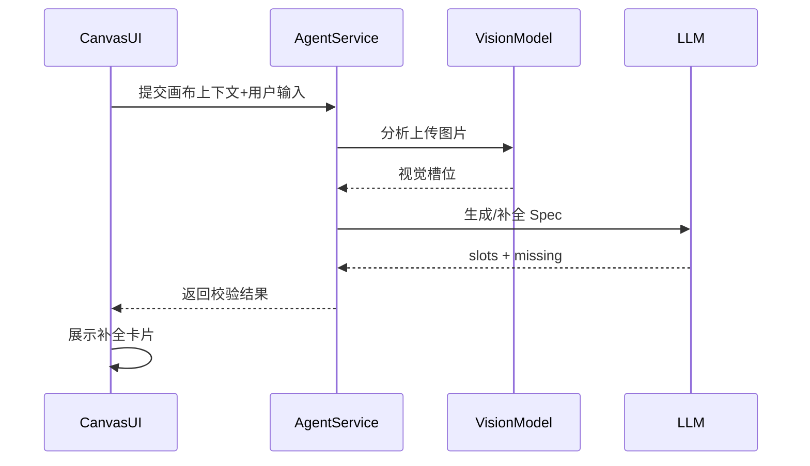
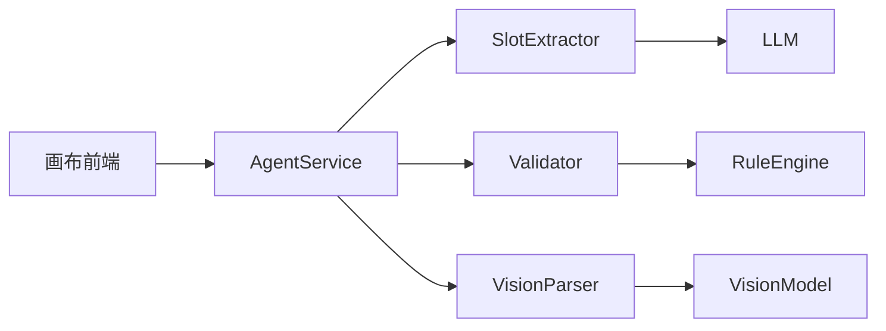

# [03] Agent 策略模块设计稿

Created: 2026-07-29 Status: Draft

---

## 1. 用途

Agent 策略模块是产品的“制片人脑”，负责：

- 从用户输入与画布上下文中提取结构化 Spec
- 校验生成前置条件并追问缺失槽位
- 视觉理解与自动填参
- 输出下游可执行的 Prompt/管道参数

---

## 2. 最重要 3 点

### 2.1 数据结构设计

```sql
create table agent_specs
(
    id                bigint primary key generated always as identity,
    project_id        bigint not null references projects (id),
    user_id           bigint not null references users (id),
    slots             jsonb  not null,
    missing           jsonb,
    validation_status varchar(32) default 'pending',
    created_at        timestamptz default now()
);

create table agent_conversations
(
    id         bigint primary key generated always as identity,
    project_id bigint      not null references projects (id),
    role       varchar(32) not null,
    content    text,
    meta       jsonb,
    created_at timestamptz default now()
);
```

设计说明：

- `agent_specs.slots` 保存结构化参数。
- `agent_specs.missing` 保存缺失槽位列表。
- `agent_conversations` 记录对话轨迹，便于回放和调试。

### 2.2 数据流转过程



关键流转：

- 输入：自然语言 + 画布选中资产 + 历史对话。
- 输出：完整 Spec 或缺失槽位列表。
- 不直接调用生成模型，只负责“理解 -> 结构化 -> 校验”。

### 2.3 总体架构



参考 open-ai-canvas：

- Agent 实现：`D:\GoWorkSpace\open-ai-canvas\canvas-agent`

建议：

- Validator 以确定性规则为主，LLM 只补槽位。
- Spec 一旦校验通过，下游任务不得再要求用户补参。

---

## 3. 接口清单（MVP）

| 方法 | 路径                        | 说明      |
|------|-----------------------------|-----------|
| POST | /api/v1/agent/spec          | 生成 Spec |
| POST | /api/v1/agent/validate      | 校验 Spec |
| POST | /api/v1/agent/vision        | 图片理解  |
| GET  | /api/v1/agent/conversations | 对话列表  |

---

## 4. 依赖模块

| 模块       | 依赖说明   |
|------------|------------|
| 画布模块   | 输入上下文 |
| 素材模块   | 图片理解   |
| AI网关模块 | 模型调用   |

---

## 5. 与 open-ai-canvas 的映射

| 我们的模块    | open-ai-canvas 对应    |
|---------------|------------------------|
| Agent策略模块 | canvas-agent           |
| Validator     | Agent 拦截生成请求逻辑 |
