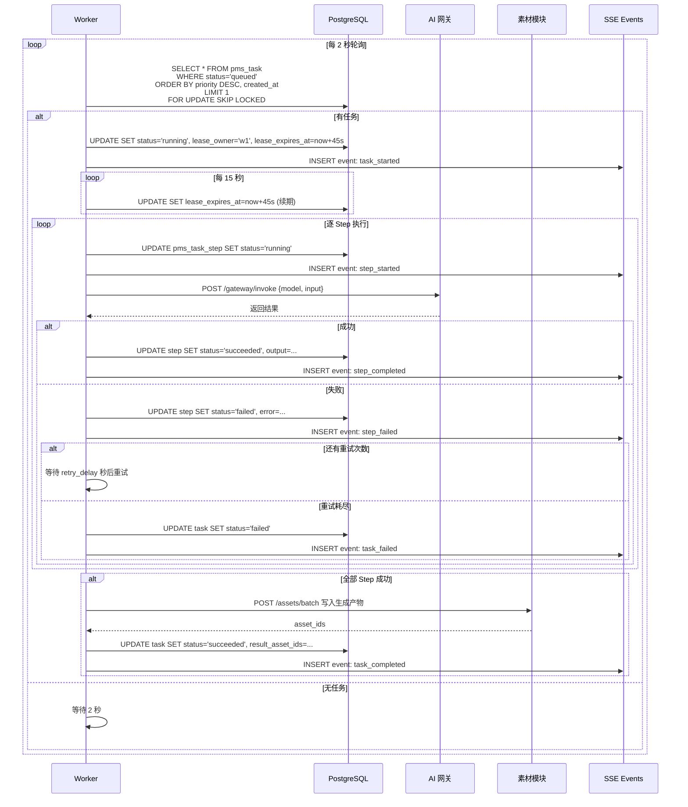
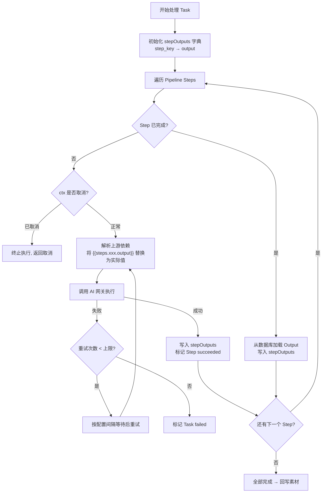
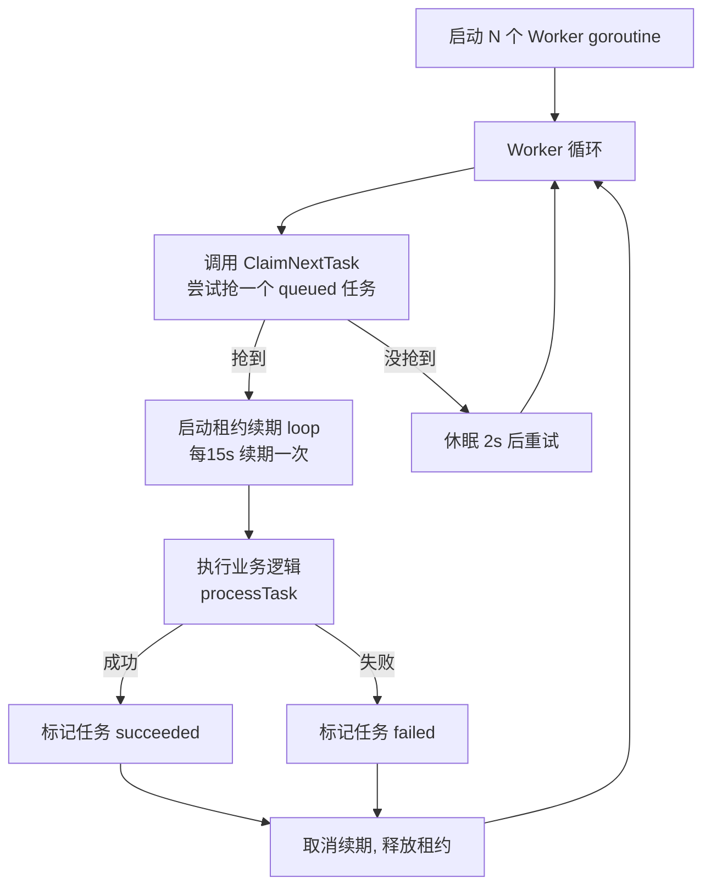

# [04] 任务调度模块设计文档

Created: 2026-07-29 | Status: Draft | Reviewed: 2026-07-29
Updated: 2026-07-30 — 对齐用户模块书写风格，SQL 关键字统一大写，补全字段注释与 COMMENT，新增新人提示与概念说明

---

## 1. 用途

任务调度模块是产品的**"制片执行引擎"**，负责：

- 接收 Agent 策略模块输出的 Pipeline，拆解为可执行的 Steps
- 通过数据库轮询 + SKIP LOCKED 分发给 Worker 池
- 调用 AI 网关逐步执行，实时推送进度
- 结果回写素材库，并联动计费模块结算

一句话：**把 Pipeline JSON → 变成素材文件，全程可追踪、可重试、可取消**。

所有任务通过 `user_id` 关联到用户模块，通过 `spec_id` 关联到 Agent 策略模块。

---

## 2. 最重要 3 点

### 2.1 数据结构设计

> **数据库方言：PostgreSQL 16+**，与项目基础设施模块保持一致。
>
> **新人提示**：
> - `GENERATED ALWAYS AS IDENTITY` 表示自增主键，等价于 MySQL 的 `AUTO_INCREMENT`。
> - `TIMESTAMPTZ` 是带时区的时间戳，`now()` 取数据库当前时间。
> - `JSONB` 是可查询的二进制 JSON 类型，比普通 JSON 更快、可建索引，适合存 Pipeline、错误结构等半结构化数据。
> - `REFERENCES 表(列)` 是外键约束，保证引用数据存在；`ON DELETE CASCADE` 表示父记录删除时自动删子记录；`ON DELETE SET NULL` 表示父记录删除时把外键置空。
> - 索引后的 `WHERE 条件` 叫"部分索引（Partial Index）"，只对满足条件的行建索引，体积更小、查询更快——本模块大量任务已结束，只索引活跃状态能显著加速 Worker 轮询。

核心表设计：

```sql
-- ============================================================
-- 表1：任务主表
-- 说明：存储一次生成任务的总控记录，含归属、Pipeline、状态、租约、重试与结果
-- 场景：用户创建任务时写入、Worker 认领与执行时更新、前端查询任务进度
-- ============================================================
CREATE TABLE pms_task
(
  -- 【主键】任务唯一ID，系统自动生成，全局唯一，一旦创建永不变化
  id                  BIGINT PRIMARY KEY GENERATED ALWAYS AS IDENTITY,

  -- 【归属用户】提交任务的用户，关联用户模块，所有任务必归属一个用户
  user_id             BIGINT       NOT NULL REFERENCES pms_user (id),

  -- 【归属项目】任务所属画布项目（可选），关联画布模块，便于按项目筛选任务
  project_id          BIGINT       REFERENCES pms_canvas_project (id),

  -- 【Spec ID】本次任务对应的已确认参数快照，关联 Agent 策略模块
  -- 注意：spec_id 指向 Pipeline 的来源，pipeline 字段是渲染后的副本（见 2.2.1）
  spec_id             BIGINT       NOT NULL REFERENCES pms_agent_spec (id),

  -- 【任务类型】冗余字段，方便不 join spec 也能按类型筛选
  -- 取值如：text_to_video / image_to_video / text_to_image ...
  spec_type           VARCHAR(64)  NOT NULL,

  -- 【Pipeline】已渲染的执行计划 JSON，来自 Agent 模块模板，创建任务时已把 {{slots.xxx}} 替换为实际值
  -- 存 JSONB 是因为步骤结构可变、可查询，且 Pipeline 天然是链式/树形结构
  pipeline            JSONB        NOT NULL,

  -- 【优先级】1-10，数字越大越优先被 Worker 认领，默认 5 为中优先级
  priority            INT          NOT NULL DEFAULT 5,

  -- 【任务状态】任务生命周期状态，状态机见 2.2.6
  -- pending → queued → running → succeeded / failed / cancelled
  -- failed/cancelled → queued（重试时重置）
  -- 预留 dead_letter：多次重试仍失败、待人工介入时归档的状态（MVP 暂不实现，先以 failed 承载）
  status              VARCHAR(32)  NOT NULL DEFAULT 'pending',

  -- 【进度】0-100，表示整体完成百分比，前端进度条直接读取
  progress            INT          NOT NULL DEFAULT 0,

  -- 【租约持有者】认领此任务的 Worker 唯一标识（如 "w1"）
  -- 为空表示未被认领；配合 lease_expires_at 防止同一任务被多个 Worker 同时执行
  lease_owner         VARCHAR(128),

  -- 【租约过期时间】超过此时间且 Worker 未续期，视为 Worker 崩溃，其他 Worker 可接管
  -- 默认租约 45 秒，Worker 每 15 秒续期一次（见 3.1）
  lease_expires_at    TIMESTAMPTZ,

  -- 【已尝试次数】Task 级别的重试计数，每次调用 /retry 时 +1，与 Step 级 attempts 相互独立
  attempts            INT          NOT NULL DEFAULT 0,

  -- 【最大尝试次数】Task 级别重试上限，超过则拒绝重试，默认 3
  max_attempts        INT          NOT NULL DEFAULT 3,

  -- 【错误信息】任务失败时写入，结构 {"code":"STEP_FAILED","message":"...","step_key":"image_to_video"}
  -- 存 JSONB 便于按错误码或失败步骤查询
  error               JSONB,

  -- 【产物素材ID列表】任务成功后生成的素材ID数组，如 [501, 502]
  -- 为空表示未完成；成功后由 Worker 回写素材模块后填入
  result_asset_ids    JSONB,

  -- 【创建时间】任务创建时间，数据库自动填充
  created_at          TIMESTAMPTZ  NOT NULL DEFAULT now(),

  -- 【入队时间】任务从 pending 进入 queued 的时间，用于统计排队耗时
  queued_at           TIMESTAMPTZ,

  -- 【开始执行时间】Worker 首次认领的时间，重试认领时不覆盖原值
  started_at          TIMESTAMPTZ,

  -- 【结束时间】任务进入终态（succeeded/failed/cancelled）的时间
  finished_at         TIMESTAMPTZ
);

-- 加速"按用户查看我的任务列表"，按创建时间倒序
CREATE INDEX idx_task_user     ON pms_task (user_id, created_at DESC);

-- 部分索引：只索引活跃状态的任务行，减小索引体积，加速 Worker 轮询与状态筛选
CREATE INDEX idx_task_status   ON pms_task (status) WHERE status IN ('pending', 'queued', 'running');

-- 部分索引：Worker 抢任务的核心索引，只对 queued 行按优先级降序、创建时间排序
CREATE INDEX idx_task_priority ON pms_task (priority DESC, created_at) WHERE status = 'queued';

-- 部分索引：用于发现租约过期、需被其他 Worker 接管的 running 任务（崩溃恢复，见 2.2.3）
CREATE INDEX idx_task_lease    ON pms_task (lease_expires_at) WHERE status = 'running';

-- 支持"按项目聚合任务"
CREATE INDEX idx_task_project  ON pms_task (project_id);

COMMENT ON TABLE  pms_task IS '任务主表：一次生成请求的总控记录，含归属、Pipeline、状态、租约、重试与结果';
COMMENT ON COLUMN pms_task.id               IS '任务唯一ID，自增主键';
COMMENT ON COLUMN pms_task.user_id          IS '提交任务的用户ID，关联 pms_user';
COMMENT ON COLUMN pms_task.project_id        IS '所属画布项目ID（可选），关联 pms_canvas_project';
COMMENT ON COLUMN pms_task.spec_id          IS '对应的 Agent Spec ID，Pipeline 的来源';
COMMENT ON COLUMN pms_task.spec_type        IS '任务类型（冗余），如 text_to_video';
COMMENT ON COLUMN pms_task.pipeline         IS '已渲染的 Pipeline JSON，模板已替换为实际值';
COMMENT ON COLUMN pms_task.priority         IS '优先级 1-10，数字越大越优先，默认 5';
COMMENT ON COLUMN pms_task.status           IS '任务状态：pending/queued/running/succeeded/failed/cancelled';
COMMENT ON COLUMN pms_task.progress         IS '整体进度 0-100';
COMMENT ON COLUMN pms_task.lease_owner      IS '认领此任务的 Worker ID，防重复执行';
COMMENT ON COLUMN pms_task.lease_expires_at IS '租约过期时间，默认45s，超时其他 Worker 可接管';
COMMENT ON COLUMN pms_task.attempts         IS 'Task 级已重试次数';
COMMENT ON COLUMN pms_task.max_attempts     IS 'Task 级最大重试次数，默认 3';
COMMENT ON COLUMN pms_task.error            IS '失败错误信息 JSON：{code,message,step_key}';
COMMENT ON COLUMN pms_task.result_asset_ids IS '成功产物素材ID列表，如 [501,502]';
COMMENT ON COLUMN pms_task.created_at       IS '任务创建时间';
COMMENT ON COLUMN pms_task.queued_at        IS '进入 queued 的时间';
COMMENT ON COLUMN pms_task.started_at       IS 'Worker 首次认领时间';
COMMENT ON COLUMN pms_task.finished_at      IS '进入终态时间';


-- ============================================================
-- 表2：步骤表
-- 说明：Pipeline 拆解后的每一步执行记录，含模型、输入输出、状态、重试、耗时
-- 场景：Worker 逐步执行时读写、前端展示步骤进度、重试时重置失败步骤
-- ============================================================
CREATE TABLE pms_task_step
(
  -- 【主键】步骤唯一ID
  id                  BIGINT PRIMARY KEY GENERATED ALWAYS AS IDENTITY,

  -- 【所属任务】关联 pms_task，任务删除时级联删除其所有步骤
  task_id             BIGINT       NOT NULL REFERENCES pms_task (id) ON DELETE CASCADE,

  -- 【步骤标识】Pipeline 中定义的步骤名，如 "text_to_image"，用于步骤间数据引用 {{steps.xxx.output}}
  step_key            VARCHAR(64)  NOT NULL,

  -- 【执行顺序】从 0 开始，Worker 按 step_index 升序执行
  step_index          INT          NOT NULL,

  -- 【模型名】本步骤调用的模型，如 "sdxl-turbo"，传给 AI 网关
  model               VARCHAR(128) NOT NULL,

  -- 【供应商】模型提供方，如 "stability" / "openai"，传给 AI 网关选择渠道
  provider            VARCHAR(64),

  -- 【输入参数】渲染后的实际请求参数（非模板），直接传给 AI 网关
  input               JSONB        NOT NULL,

  -- 【输出结果】AI 网关返回的结果，供下游步骤引用，也用于幂等跳过（有 output 则不重复执行）
  output              JSONB,

  -- 【步骤状态】pending → running → succeeded / failed / skipped；failed → pending（重试）
  status              VARCHAR(32)  NOT NULL DEFAULT 'pending',

  -- 【已尝试次数】Step 级别重试计数，失败后 +1，与 Task 级 attempts 相互独立
  attempts            INT          NOT NULL DEFAULT 0,

  -- 【最大尝试次数】Step 级别重试上限，默认 3
  max_attempts        INT          NOT NULL DEFAULT 3,

  -- 【重试间隔秒数】失败后等待多少秒再重试，配合指数退避策略
  retry_delay_seconds INT          DEFAULT 5,

  -- 【错误信息】步骤失败时写入，结构 {"code":"TIMEOUT","message":"请求超时","raw":"..."}
  error               JSONB,

  -- 【耗时毫秒】本步骤执行耗时，用于性能统计与成本核算
  duration_ms         INT,

  -- 【创建时间】步骤记录创建时间
  created_at          TIMESTAMPTZ  NOT NULL DEFAULT now(),

  -- 【开始执行时间】
  started_at          TIMESTAMPTZ,

  -- 【结束时间】
  finished_at         TIMESTAMPTZ
);

-- 支持"按任务查询步骤列表并按执行顺序排列"
CREATE INDEX idx_task_step_task   ON pms_task_step (task_id, step_index);

-- 部分索引：加速查询待执行/执行中的步骤
CREATE INDEX idx_task_step_status ON pms_task_step (status) WHERE status IN ('pending', 'running');

COMMENT ON TABLE  pms_task_step IS '步骤表：Pipeline 每一步的执行记录，含模型、输入输出、状态、重试、耗时';
COMMENT ON COLUMN pms_task_step.id                  IS '步骤唯一ID，自增主键';
COMMENT ON COLUMN pms_task_step.task_id             IS '所属任务ID，级联删除';
COMMENT ON COLUMN pms_task_step.step_key            IS '步骤标识，如 text_to_image，用于步骤间引用';
COMMENT ON COLUMN pms_task_step.step_index          IS '执行顺序，从 0 开始';
COMMENT ON COLUMN pms_task_step.model               IS '本步骤调用的模型名';
COMMENT ON COLUMN pms_task_step.provider            IS '模型供应商';
COMMENT ON COLUMN pms_task_step.input               IS '渲染后的实际输入参数 JSON';
COMMENT ON COLUMN pms_task_step.output              IS 'AI 网关返回结果，供下游引用，也用于幂等跳过';
COMMENT ON COLUMN pms_task_step.status              IS '步骤状态：pending/running/succeeded/failed/skipped';
COMMENT ON COLUMN pms_task_step.attempts            IS 'Step 级已重试次数';
COMMENT ON COLUMN pms_task_step.max_attempts        IS 'Step 级最大重试次数，默认 3';
COMMENT ON COLUMN pms_task_step.retry_delay_seconds IS '失败后重试间隔秒数，默认 5';
COMMENT ON COLUMN pms_task_step.error               IS '步骤错误信息 JSON：{code,message,raw}';
COMMENT ON COLUMN pms_task_step.duration_ms        IS '本步骤执行耗时（毫秒）';
COMMENT ON COLUMN pms_task_step.created_at          IS '步骤记录创建时间';
COMMENT ON COLUMN pms_task_step.started_at          IS '开始执行时间';
COMMENT ON COLUMN pms_task_step.finished_at         IS '结束时间';


-- ============================================================
-- 表3：执行日志表
-- 说明：任务执行过程的详细日志，面向开发排障与审计（与事件表区分：事件面向前端推送）
-- 场景：任务失败时查看调用链路、排查 AI 网关返回异常、审计 Worker 行为
-- ============================================================
CREATE TABLE pms_task_log
(
  -- 【主键】日志唯一ID
  id         BIGINT PRIMARY KEY GENERATED ALWAYS AS IDENTITY,

  -- 【所属任务】关联 pms_task，任务删除时级联删除日志
  task_id    BIGINT       NOT NULL REFERENCES pms_task (id) ON DELETE CASCADE,

  -- 【所属步骤】关联 pms_task_step（可选）；步骤被删除时置空，保留任务级日志
  step_id    BIGINT       REFERENCES pms_task_step (id) ON DELETE SET NULL,

  -- 【日志级别】debug / info / warn / error，便于按级别过滤
  level      VARCHAR(16)  NOT NULL DEFAULT 'info',

  -- 【日志内容】人类可读的日志文本
  message    TEXT         NOT NULL,

  -- 【附加数据】结构化附加信息，如 AI 网关的 request_id、错误堆栈等
  meta       JSONB,

  -- 【记录时间】
  created_at TIMESTAMPTZ  NOT NULL DEFAULT now()
);

-- 支持"按任务查看完整日志时间线"
CREATE INDEX idx_task_log_task ON pms_task_log (task_id, created_at);

COMMENT ON TABLE  pms_task_log IS '执行日志表：任务执行过程的详细日志，面向开发排障与审计';
COMMENT ON COLUMN pms_task_log.id         IS '日志唯一ID，自增主键';
COMMENT ON COLUMN pms_task_log.task_id    IS '所属任务ID，级联删除';
COMMENT ON COLUMN pms_task_log.step_id    IS '所属步骤ID（可选），步骤删除时置空';
COMMENT ON COLUMN pms_task_log.level      IS '日志级别：debug/info/warn/error';
COMMENT ON COLUMN pms_task_log.message    IS '人类可读的日志文本';
COMMENT ON COLUMN pms_task_log.meta       IS '结构化附加数据 JSON，如 request_id';
COMMENT ON COLUMN pms_task_log.created_at IS '日志记录时间';


-- ============================================================
-- 表4：实时事件表
-- 说明：面向前端 SSE 推送的事件记录，同时持久化以支持断线重连（since_event_id 补推）
-- 场景：Worker 每个状态变更写一条事件，前端通过 SSE 实时接收或断线后补拉
-- ============================================================
CREATE TABLE pms_task_event
(
  -- 【主键】事件唯一ID，单调递增，作为 SSE 断线重连的游标
  id         BIGINT PRIMARY KEY GENERATED ALWAYS AS IDENTITY,

  -- 【所属任务】关联 pms_task，任务删除时级联删除事件
  task_id    BIGINT       NOT NULL REFERENCES pms_task (id) ON DELETE CASCADE,

  -- 【所属步骤】关联 pms_task_step（可选）；步骤删除时置空
  step_id    BIGINT       REFERENCES pms_task_step (id) ON DELETE SET NULL,

  -- 【事件类型】task_queued / task_started / step_started / step_progress
  --            step_completed / step_failed / task_completed / task_failed / task_cancelled
  event_type VARCHAR(32)  NOT NULL,

  -- 【事件数据】事件携带的结构化数据，如 {"progress":50, "step_key":"..."}
  payload    JSONB,

  -- 【发生时间】
  created_at TIMESTAMPTZ  NOT NULL DEFAULT now()
);

-- 支持"按任务查询事件时间线"与"SSE 断线重连按 id > since_event_id 补推"
CREATE INDEX idx_task_event_task ON pms_task_event (task_id, created_at);

COMMENT ON TABLE  pms_task_event IS '实时事件表：面向前端SSE推送的事件，持久化以支持断线重连';
COMMENT ON COLUMN pms_task_event.id         IS '事件唯一ID，单调递增，作为断线重连游标';
COMMENT ON COLUMN pms_task_event.task_id    IS '所属任务ID，级联删除';
COMMENT ON COLUMN pms_task_event.step_id    IS '所属步骤ID（可选），步骤删除时置空';
COMMENT ON COLUMN pms_task_event.event_type IS '事件类型，如 step_completed/task_failed';
COMMENT ON COLUMN pms_task_event.payload    IS '事件携带的结构化数据 JSON';
COMMENT ON COLUMN pms_task_event.created_at IS '事件发生时间';
```

设计说明：

- `pms_task` 与 `pms_task_step` 是一对多，任务删除时步骤级联删除（`ON DELETE CASCADE`）。
- `pms_task_log` 与 `pms_task_event` 都关联步骤，但步骤删除时日志/事件保留（`ON DELETE SET NULL`），因为日志和事件属于任务级历史。
- `pipeline` 存的是**渲染后的副本**，即使原 Spec 后续被修改，已创建任务的执行计划不受影响。
- 租约机制靠 `lease_owner` + `lease_expires_at` 实现，默认 45s 有效、15s 续期，见 3.1。
- Step 级重试与 Task 级重试相互独立：单个 Step 失败先在 Step 级重试，耗尽才让 Task 失败；Task 失败后用户还能触发 Task 级重试。

---

### 2.2 数据流转过程

#### 2.2.1 任务创建

```
POST /api/v1/tasks
{
  "spec_id": 1001,
  "priority": 5
}
```

```
TaskService.CreateTask(spec_id):
  1. 加载 pms_agent_spec（含 pipeline 模板）
  2. 调用 PipelineRenderer 渲染模板：
     - 将 {{slots.xxx}} 替换为 spec.slots 中的实际值
     - 将 {{steps.xxx.output}} 替换为占位符（执行时再引用上游 step 的 output）
  3. 调用计费模块预估成本 + 预占额度
  4. INSERT pms_task (status='pending', pipeline=渲染后, priority=...)
  5. 为 pipeline.steps 逐条 INSERT pms_task_step
  6. 更新 status='queued' → 记录 queued_at
  7. INSERT pms_task_event (event_type='task_queued')
  8. 返回 task_id
```

**Pipeline 渲染前后对比：**

```
渲染前（模板，来自 Agent）：
{
  "steps": [
    {"step_key":"text_to_image", "input":{"prompt":"{{slots.prompt}}"}}
  ]
}

渲染后（入库，来自 Task）：
{
  "steps": [
    {"step_key":"text_to_image", "input":{"prompt":"一只猫在草地上奔跑，电影质感，4K"}}
  ]
}
```

#### 2.2.2 Worker 认领与执行



#### 2.2.3 租约与崩溃恢复

```
时间线：
T=0s    Worker-A 认领 task_42，lease_expires_at = T+45s
T=15s   Worker-A 续期 → lease_expires_at = T+60s
T=30s   Worker-A 再次续期 → lease_expires_at = T+75s
T=35s   Worker-A 崩溃 💥

T=75s   lease_expires_at 到期
T=77s   Worker-B 轮询发现 task_42（status='running' AND lease_expires_at <= now()）
        Worker-B 接管 task_42，从上次成功的 step 之后继续执行
        （幂等保证：step 已完成的不重复执行）
```

#### 2.2.4 任务取消

```
POST /api/v1/tasks/{id}/cancel

状态为 queued  → 直接 UPDATE status='cancelled'
状态为 running → UPDATE status='cancelling' → Worker 检测到后中止当前 step
    Worker 通过 context.WithCancel 传递取消信号
    AI 网关调用传入 ctx，支持中途取消
```

#### 2.2.5 任务重试

```
POST /api/v1/tasks/{id}/retry
{
  "from_step": "image_to_video"   // 可选：从哪个 step 开始重试，默认重试失败的 step
}

TaskService:
  1. 校验 status='failed' 或 'cancelled'
  2. attempts < max_attempts？否则拒绝
  3. 重置 task: status='queued', attempts+=1
  4. 重置失败的 step: status='pending', attempts=0
  5. 保留已成功 step 的 output（避免重复执行）
```

#### 2.2.6 任务状态机

```
                                ┌──────────────┐
                                │   pending    │  刚创建，还在渲染模板/计费预占
                                └──────┬───────┘
                                       │ 模板渲染 + 计费预占完成
                                       ▼
                                ┌──────────────┐
                     ┌─────────│    queued    │◄────────────── retry ──────────┐
                     │         └──────┬───────┘                               │
                     │     Worker认领 │                                        │
                     │                ▼                                        │
                     │         ┌──────────────┐    取消请求                     │
                     │         │   running    │────────────┐                   │
                     │         └──┬───┬───┬───┘            │                   │
                     │            │   │   │                ▼                   │
                     │   全部成功  │   │   │ 重试耗尽  ┌──────────┐             │
                     │            │   │   └──────────│  failed  │─────────────┘
                     │            │   │              └──────────┘
                     │            │   │  用户取消
                     │            │   └─────────────┐
                     │            │                 ▼
                     │            │  ┌──────────────────────┐
                     │            │  │    cancelling        │  Worker 收到取消信号，正在中止
                     │            │  └──────────┬───────────┘
                     │            │             │ Worker 确认中止
                     │            │             ▼
                     │            │  ┌──────────────────────┐
                     ▼            │  │    cancelled         │────────────── retry ──┘
              ┌──────────────┐    │  └──────────────────────┘
              │  succeeded   │◄───┘
              └──────────────┘
```

#### 2.2.7 Step 间数据传递

Pipeline 中后一个 Step 引用前一个 Step 的输出，Worker 用 `stepOutputs` 字典在 Step 间传递数据：



关键流转规则：

- **数据传递**：`{{steps.text_to_image.output}}` 引用前一步输出，Worker 自动替换为实际值。
- **幂等性**：已完成的 Step 直接跳过，从 DB 恢复 output，不重复调用 AI 网关。
- **取消检测**：每步开始前检查 `ctx.Done()`，及时响应取消信号。
- **重试**：单个 Step 失败不立即中止，按 `max_attempts` 和 `retry_delay_seconds` 重试。
- **失败标记**：Step 级重试全部耗尽后标记整个 Task 为 failed。

---

### 2.3 总体架构

```
┌─────────────────────────────────────────────────────────────────┐
│                        画布前端                                   │
│  POST /tasks 创建任务    SSE /tasks/{id}/events 监听进度          │
└──────────────┬──────────────────────────▲───────────────────────┘
               │                          │
               ▼                          │
┌─────────────────────────────────────────────────────────────────┐
│                      TaskService（API 层）                       │
│  ┌────────────┐  ┌────────────────┐  ┌────────────────────┐    │
│  │ 创建任务    │  │ 查询/取消/重试  │  │ SSE 事件推送        │    │
│  │ + 渲染模板 │  │                │  │ (全量 + 增量)       │    │
│  └─────┬──────┘  └───────┬────────┘  └─────────┬──────────┘    │
│        │                 │                     │               │
└────────┼─────────────────┼─────────────────────┼───────────────┘
         │                 │                     │
         ▼                 ▼                     ▼
┌─────────────────────────────────────────────────────────────────┐
│                    PostgreSQL（任务持久化）                        │
│  pms_task  │  pms_task_step  │  pms_task_log  │  pms_task_event │
└──────────────────────┬──────────────────────────────────────────┘
                       │ SELECT ... FOR UPDATE SKIP LOCKED
                       ▼
┌─────────────────────────────────────────────────────────────────┐
│                      Worker Pool                                 │
│  ┌──────────┐  ┌──────────┐  ┌──────────┐                      │
│  │ Worker 1 │  │ Worker 2 │  │ Worker 3 │  ... 最多 N 个        │
│  └────┬─────┘  └────┬─────┘  └────┬─────┘                      │
│       │             │             │                              │
│       │  每 2s 轮询 + 租约续期每 15s + SKIP LOCKED 防冲突       │
│       └─────────────┼─────────────┘                              │
│                     ▼                                            │
│  ┌──────────────────────────────────────┐                       │
│  │         processTask(task)             │                       │
│  │  1. 按 step_index 顺序执行 Step       │                       │
│  │  2. 调用 AI 网关 /gateway/invoke      │                       │
│  │  3. Step 间传递 output → next.input   │                       │
│  │  4. 写入 log + event                  │                       │
│  │  5. 最终 step 完成 → 回写素材模块     │                       │
│  └──────────────────────────────────────┘                       │
└─────────────────────────────────────────────────────────────────┘
         │
         ▼
┌─────────────────────────────────────────────────────────────────┐
│              依赖模块                                             │
│  ┌──────────┐  ┌──────────┐  ┌──────────┐  ┌──────────┐        │
│  │Agent策略  │  │AI 网关   │  │素材模块  │  │计费配额  │        │
│  │(Pipeline)│  │(调模型)  │  │(写素材)  │  │(预占扣费)│        │
│  └──────────┘  └──────────┘  └──────────┘  └──────────┘        │
└─────────────────────────────────────────────────────────────────┘
```

---

## 3. Worker 池设计

### 3.1 Worker 启动伪码

Worker 从任务表中争抢任务、持有租约、心跳续期、处理完成后释放——整体是一个**竞争-获取-续期-释放**循环。



**Worker 生命周期**：

| 阶段 | 动作 | 说明 |
|------|------|------|
| 抢任务 | `ClaimNextTask` | 用 SQL `FOR UPDATE SKIP LOCKED` 原子抢任务，租约 45s |
| 续期 | 每 15s 更新 `lease_expires_at` | 防止任务执行中租约过期被其他 Worker 抢走 |
| 执行 | `processTask` | 执行 Pipeline 中的每个 Step |
| 释放 | `cancel()` 停止续期 | 任务结束后释放租约 |

### 3.2 ClaimNextTask SQL

```sql
-- PostgreSQL SKIP LOCKED 实现：原子地"选出+锁定+更新"一条 queued 任务
-- FOR UPDATE SKIP LOCKED：多个 Worker 并发抢任务时，抢到的拿行锁，没抢到的跳过该行不阻塞
UPDATE pms_task
SET status           = 'running',
    lease_owner      = $1,
    lease_expires_at = now() + $2::interval,
    started_at       = COALESCE(started_at, now())
WHERE id = (
    SELECT id FROM pms_task
    WHERE status = 'queued'
       OR (status = 'running' AND lease_expires_at <= now())  -- 崩溃恢复：接管租约过期的任务
    ORDER BY priority DESC, created_at
    LIMIT 1
    FOR UPDATE SKIP LOCKED
)
RETURNING *;
```

参数说明：`$1` = Worker ID（如 `"w1"`），`$2` = 租约时长（如 `INTERVAL '45 seconds'`）。`COALESCE(started_at, now())` 保证重试认领时不覆盖首次开始时间。

### 3.3 关键并发安全原则

| 场景 | 方案 |
|------|------|
| 多 Worker 抢同一任务 | `FOR UPDATE SKIP LOCKED` — 抢到的拿到行锁，没抢到的跳过 |
| Worker 崩溃 | `lease_expires_at` 过期后其他 Worker 接管 |
| 租约过期但原 Worker 还活着 | 续期 loop + 执行前检查 `lease_owner` 是否还是自己 |
| Step 幂等 | 已有 `output` 的 step 跳过，不重复执行 |
| 取消竞态 | `cancelling` 状态 + Worker 每步开始前检查状态 |

---

## 4. 进度推送（SSE）

### 4.1 SSE 接口

```
GET /api/v1/tasks/{id}/events
Accept: text/event-stream

→ event: task_started
   data: {"task_id":42, "total_steps":3}

→ event: step_started
   data: {"task_id":42, "step_key":"text_to_image", "step_index":0, "progress":10}

→ event: step_completed
   data: {"task_id":42, "step_key":"text_to_image", "step_index":0, "progress":40, "duration_ms":12500}

→ event: step_started
   data: {"task_id":42, "step_key":"image_to_video", "step_index":1, "progress":45}

→ event: task_completed
   data: {"task_id":42, "result_asset_ids":[501, 502], "progress":100}
```

### 4.2 断线重连

```
前端 SSE 断开 → 自动重连 → GET /api/v1/tasks/{id}/events?since_event_id=128
后端从 pms_task_event 表中读取 event_id > 128 的事件，补推
```

---

## 5. 接口清单（MVP）

### 5.1 任务管理

| 方法 | 路径 | 鉴权 | 说明 |
|------|------|------|------|
| POST | `/api/v1/tasks` | 是 | 创建任务（入参 spec_id + priority） |
| GET | `/api/v1/tasks` | 是 | 任务列表（支持按 project/user/status 过滤 + 分页） |
| GET | `/api/v1/tasks/{id}` | 是 | 任务详情（含所有 step 的状态和进度） |
| POST | `/api/v1/tasks/{id}/cancel` | 是 | 取消任务 |
| POST | `/api/v1/tasks/{id}/retry` | 是 | 重试任务（可选 from_step） |
| GET | `/api/v1/tasks/{id}/steps` | 是 | 步骤列表 |
| GET | `/api/v1/tasks/{id}/logs` | 是 | 执行日志 |
| GET | `/api/v1/tasks/{id}/events` | 是 | SSE 实时事件流（支持 ?since_event_id 断线重连） |

**POST /api/v1/tasks 请求体：**

```json
{
  "spec_id": 1001,
  "priority": 5
}
```

**响应体：**

```json
{
  "task": {
    "id": 42,
    "status": "queued",
    "spec_type": "text_to_video",
    "progress": 0,
    "steps_count": 3,
    "estimated_duration_seconds": 120
  }
}
```

### 5.2 Worker 管理（管理后台 / 运维）

| 方法 | 路径 | 鉴权 | 说明 |
|------|------|------|------|
| GET | `/api/v1/admin/workers` | 管理员 | Worker 池状态（活跃数、任务积压数） |
| GET | `/api/v1/admin/tasks/stuck` | 管理员 | 卡住的任务（lease 过期但未恢复的） |
| POST | `/api/v1/admin/tasks/{id}/force-fail` | 管理员 | 强制标记失败 |

---

## 6. 依赖模块与接口协议

### 6.1 依赖关系

| 模块 | 调用方式 | 用途 |
|------|----------|------|
| Agent 策略模块 | 读 `pms_agent_spec` | 获取已渲染的 Pipeline |
| AI 网关模块 | HTTP `POST /gateway/invoke` | 执行每个 Step 的模型调用 |
| 素材模块 | HTTP `POST /internal/assets/from-task` | 生成结果回写为素材 |
| 计费与支付模块 | HTTP `Reserve` / `MarkRunning` / `Settle` / `Refund` | 预占/执行中/扣费/退款 |

> 注：`pms_canvas_project`、`pms_agent_spec` 两张外键表来自尚未完成的 `[02]画布模块`、`[03]Agent策略模块`，表名待对齐确认。

### 6.2 调用 AI 网关的格式

```json
// Worker 调用 AI 网关
POST /api/v1/gateway/invoke
{
  "task_id": 42,
  "step_id": 201,
  "step_key": "text_to_image",
  "model": "sdxl-turbo",
  "provider": "stability",
  "input": {
    "prompt": "一只猫在草地上奔跑，电影质感，4K",
    "negative_prompt": "模糊，变形，低质量",
    "width": 1920,
    "height": 1080
  },
  "timeout_seconds": 60
}

// AI 网关返回
{
  "status": "success",
  "output": {
    "oss_key": "generated/2026/07/29/task_42_step_201.png",
    "content_type": "image/png",
    "width": 1920,
    "height": 1080,
    "file_size": 2456789
  },
  "duration_ms": 12340,
  "tokens_used": 150
}
```

### 6.3 回写素材的格式

```json
// Worker 所有 Step 完成后调用素材模块
POST /internal/assets/from-task
{
  "task_id": 42,
  "project_id": 10,
  "user_id": 5,
  "assets": [
    {
      "oss_key": "generated/2026/07/29/task_42_step_201.png",
      "name": "文生视频-基础帧",
      "content_type": "image/png",
      "source": "ai_generated",
      "source_task_id": 42,
      "source_step_key": "text_to_image",
      "meta": { "prompt": "...", "model": "sdxl-turbo", "step_key": "text_to_image" }
    },
    {
      "oss_key": "generated/2026/07/29/task_42_step_202.mp4",
      "name": "文生视频-最终视频",
      "content_type": "video/mp4",
      "source": "ai_generated",
      "source_task_id": 42,
      "source_step_key": "image_to_video",
      "width": 1920,
      "height": 1080,
      "duration_ms": 5000,
      "meta": { "model": "svd-xt", "fps": 24, "step_key": "image_to_video" }
    }
  ]
}
```

---

## 7. 与 open-ai-canvas 的差异点

| 维度 | open-ai-canvas | x-media（我们） |
|------|---------------|----------------|
| 队列方案 | DB 轮询（PostgreSQL SKIP LOCKED） | 同方案——MVP 用 DB 轮询 |
| Worker 并发 | 本地信号量 + Redis 全局协调 | 本地信号量 + 可选 Redis 协调 |
| 租约机制 | 支持 claim + 15s 续期 | 同方案 |
| 任务优先级 | 无（FIFO） | 有，priority 字段 1-10 |
| 进度推送 | 前端轮询 GET /api/tasks/:id | SSE 推送（减少请求数） |
| 计费耦合 | 任务创建时创建账单 | 通过计费模块独立管理 |
| Pipeline 概念 | 无——直接调模型 | 多步骤 Pipeline 编排 |
| 重试策略 | 简单重试 | 每 Step 独立重试 + 指数退避 |
| 取消机制 | 支持 | 支持 + 超时自动取消 |
| 死信队列 | 无 | 预留 `dead_letter` status |

---

## 8. 新人上手指南

### 8.1 快速理解这 4 张表

| 表名 | 一句话解释 | 什么时候有数据 |
|------|-----------|---------------|
| `pms_task` | 一次生成请求的总控记录（谁提交的、到哪一步了、成功没） | 用户创建任务时写入 |
| `pms_task_step` | Pipeline 的每一步（调了哪个模型、输入输出是什么、花了多久） | 创建任务时随 Pipeline 拆解写入 |
| `pms_task_log` | 执行过程的详细日志（Worker 启动、API 调用、错误堆栈） | Worker 执行时持续写入 |
| `pms_task_event` | 推给前端的实时事件（进度百分比、步骤完成、最终结果） | Worker 每次状态变更写入 |

### 8.2 核心概念速查

| 概念 | 含义 | 类比 |
|------|------|------|
| **Task** | 一个完整的生成任务 | 一个订单 |
| **Step** | Pipeline 中的一个步骤 | 订单里的一个工序 |
| **Lease（租约）** | Worker 认领任务后的"使用令牌" | 锁——超时自动释放 |
| **SKIP LOCKED** | PostgreSQL 的行级锁特性 | 多个工人抢活，先到先得，不排队等锁 |
| **Polling** | Worker 每 2 秒扫一眼有没有新任务 | 值班的人定时刷工单系统 |
| **幂等** | 已完成的 Step 重试时跳过，不重复执行 | 干完的活不返工 |

### 8.3 动手之前先理解这些概念

1. **Pipeline 是"菜谱"，Step 是"一道工序"**：用户提交的不是直接调模型，而是一份多步骤的执行计划（Pipeline）。比如"文生视频"= 先文生图、再图生视频。每个 Step 调一次 AI 网关，前一步的输出可以喂给下一步。

2. **租约（Lease）= 借用证**：Worker 认领任务时拿到一张"借用证"（`lease_owner` + `lease_expires_at`），45 秒有效。只要它还活着就每 15 秒续期一次。如果 Worker 崩溃了没人续期，借用证过期，别的 Worker 就能合法接管这个任务——这就是"崩溃恢复"。

3. **SKIP LOCKED = 抢活不排队**：普通锁会让后来的 Worker 排队等前面的释放，造成阻塞。`FOR UPDATE SKIP LOCKED` 让多个 Worker 并发抢任务时，被锁住的行直接跳过，互不阻塞，先到先得。

4. **幂等 = 重试不重复干活**：一个 Step 已经成功了（有 `output`），重试时直接跳过，不重复调用 AI 网关。这样崩溃恢复或重试都不会产生重复素材、重复扣费。

5. **事件表 ≠ 日志表**：`pms_task_event` 面向用户（进度推送、断线重连），`pms_task_log` 面向开发（排障、审计）。两者都要写，但用途不同。

6. **Task 级重试 vs Step 级重试**：单个 Step 失败会先在 Step 级别重试（`attempts`/`max_attempts`）；Step 级重试耗尽才让整个 Task 失败；Task 失败后用户还能触发 Task 级重试（`/retry`），此时只重置失败的 Step、保留已成功 Step 的 output。

7. **Pipeline 渲染前 vs 渲染后**：Agent 给的是模板（含 `{{slots.prompt}}` 占位符），创建任务时把占位符替换成实际值（"一只猫在草地上奔跑..."）后存入 `pms_task.pipeline`。即使原 Spec 后续被改，已创建任务不受影响。

### 8.4 数据流一句话

```
Agent提交Pipeline → 入库(渲染模板→拆Step) → Worker认领(租约+SKIP LOCKED)
  → 逐Step调AI网关 → 进度推送SSE → 回写素材 → 结算计费
```

### 8.5 团队分工建议

| 角色 | 负责内容 |
|------|----------|
| 后端 A | `pms_task` 表 + 任务 CRUD + 状态机 + 取消/重试 + SSE 推送 |
| 后端 B | `pms_task_step` 表 + ClaimNextTask + 租约 + processTask + Step 编排 |
| 后端 C | AI 网关调用 + 重试 + Step 间数据传递 |
| 后端 D | 生成结果回写素材模块 + 计费 commit/release 对接 |

### 8.6 常见踩坑点

| 踩坑点 | 说明 | 建议 |
|--------|------|------|
| 租约过期误接管 | Worker 还活着但续期网络延迟，租约过期被抢 | 执行每步前检查 `lease_owner` 是否还是自己 |
| Step 非幂等 | 重试时已成功的 API 调用被重复执行 | step 状态为 succeeded 则跳过，检查 `output` 字段 |
| 大文件 OSS 上传超时 | 视频生成结果几百 MB，上传 OSS 可能超时 | AI 网关直接把结果写入 OSS，Worker 只拿 oss_key |
| 计费预占与执行不同步 | 预占了但 Worker 崩溃，额度永久冻结 | 租约过期 + 计费模块定时扫描 frozen 超时的记录释放 |
| SSE 断连丢失事件 | 前端断连期间的事件永久丢失 | 事件写表 + `since_event_id` 断点续传 |
| Pipeline 模板渲染失败 | `{{slots.xxx}}` 引用不存在的字段 | 创建任务时做前置校验 + 明确定义 Pipeline JSON schema |

### 8.7 跨模块影响清单

| 文档 | 需要改的地方 | 优先级 |
|------|-------------|--------|
| `[03]Agent策略模块` | 确认 Pipeline 输出格式与本模块输入格式一致 | P0 |
| `[05]计费与支付模块` | `references users (id)` / `references tasks (id)` → 正确表名 | P0 |
| `[05]计费与支付模块` | 预占与扣费的调用时机对齐（创建任务时预占，完成/失败时扣/退） | P0 |
| `[06]AI网关模块` | `model_calls` 的 `channel_id` 需要关联到 task/step | P1 |
| `[01]素材模块` | 确认批量创建素材接口 `POST /assets/batch` | P1 |
