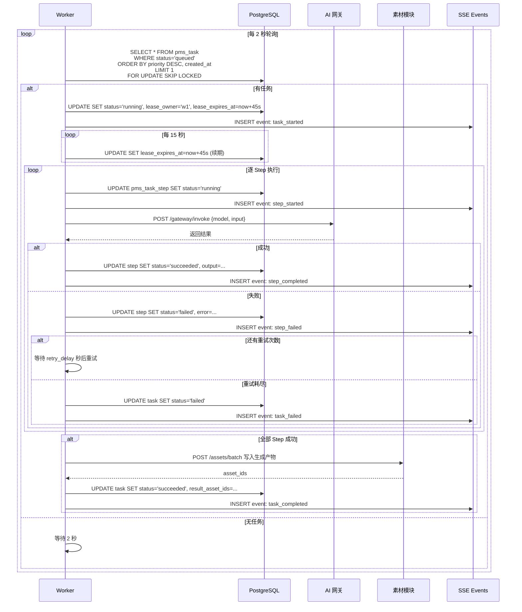

# [04] 任务调度模块设计文档

Created: 2026-07-29 | Status: Draft | Reviewed: 2026-07-29

---

## 📌 模块定位

> 任务调度模块是产品的**"制片执行引擎"**——接收 Agent 输出的 Pipeline，拆解为可执行的 Steps，通过数据库轮询 + SKIP LOCKED 分发给 Worker 池，调用 AI 网关执行，实时推送进度，结果回写素材库。

一句话：**把 Pipeline JSON → 变成素材文件，全程可追踪、可重试、可取消**。

---

## 🗺️ 新人 3 分钟速通

### 4 张表一句话

| 表 | 一句话 |
|----|--------|
| `pms_task` | 一次生成请求的**总控记录**（谁提交的、到哪一步了、成功没） |
| `pms_task_step` | Pipeline 的**每一步**（调了哪个模型、输入输出是什么、花了多久） |
| `pms_task_log` | 执行过程的**详细日志**（Worker 启动、API 调用、错误堆栈） |
| `pms_task_event` | 推给前端的**实时事件**（进度百分比、步骤完成、最终结果） |

### 核心概念速查

| 概念 | 含义 | 类比 |
|------|------|------|
| **Task** | 一个完整的生成任务 | 一个订单 |
| **Step** | Pipeline 中的一个步骤 | 订单里的一个工序 |
| **Lease（租约）** | Worker 认领任务后的"使用令牌" | 锁🔒——超时自动释放 |
| **SKIP LOCKED** | PostgreSQL 的行级锁特性 | 多个工人抢活，先到先得，不排队等锁 |
| **Polling** | Worker 每 2 秒扫一眼有没有新任务 | 值班的人定时刷工单系统 |

### 数据流一句话

```
Agent提交Pipeline → 入库(渲染模板→拆Step) → Worker认领(租约+SKIP LOCKED)
  → 逐Step调AI网关 → 进度推送SSE → 回写素材 → 结算计费
```

---

## 🆚 竞品对比（open-ai-canvas）

| 维度 | open-ai-canvas | x-media（我们） |
|------|---------------|----------------|
| 队列方案 | **DB 轮询**（PostgreSQL SKIP LOCKED） | 同方案——MVP 用 DB 轮询 |
| Worker 并发 | 本地信号量 + Redis 全局协调 | 本地信号量 + 可选 Redis 协调 |
| 租约机制 | ✅ claim + 15s 续期 | ✅ 同方案 |
| 任务优先级 | ❌ 无（FIFO） | ✅ priority 字段 1-10 |
| 进度推送 | 前端 **轮询** GET /api/tasks/:id | ✅ **SSE 推送**（减少请求数） |
| 计费耦合 | 任务创建时创建账单 | ✅ 通过计费模块独立管理 |
| Pipeline 概念 | ❌ 无——直接调模型 | ✅ 多步骤 Pipeline 编排 |
| 重试策略 | 简单重试 | ✅ 每 Step 独立重试 + 指数退避 |
| 取消机制 | ✅ | ✅ + 超时自动取消 |
| 死信队列 | ❌ | ✅ 预留 `dead_letter` status |

---

## 1. 数据结构设计

### 1.1 pms_task — 任务主表

```sql
create table pms_task
(
    id          bigint primary key generated always as identity,

    -- 归属
    user_id     bigint      not null references pms_user (id),
    project_id  bigint      references pms_canvas_project (id),
    spec_id     bigint      not null references pms_agent_spec (id),

    -- 任务类型与内容
    spec_type   varchar(64) not null,   -- 冗余，方便查询（text_to_video / image_to_video ...）
    pipeline    jsonb       not null,   -- 已渲染的 Pipeline（来自 Agent 模块，模板已替换为实际值）
    priority    int         not null default 5,  -- 1-10，数字越大越优先

    -- 状态追踪
    status      varchar(32) not null default 'pending',
    -- pending → queued → running → succeeded / failed / cancelled
    -- failed/cancelled → queued (retry 时重置)
    progress    int         not null default 0,    -- 0-100

    -- Worker 租约（防重复执行 + 崩溃恢复）
    lease_owner      varchar(128),         -- 认领此任务的 Worker ID
    lease_expires_at timestamptz,          -- 租约过期时间，超时其他 Worker 可接管

    -- 重试控制
    attempts     int not null default 0,
    max_attempts int not null default 3,

    -- 错误信息
    error        jsonb,                    -- {"code":"STEP_FAILED","message":"...","step_key":"image_to_video"}

    -- 结果
    result_asset_ids jsonb,                -- 生成产物的素材 ID 列表 [501, 502]

    -- 时间追踪
    created_at      timestamptz not null default now(),
    queued_at       timestamptz,
    started_at      timestamptz,
    finished_at     timestamptz
);

create index idx_task_user        on pms_task (user_id, created_at desc);
create index idx_task_status      on pms_task (status) where status in ('pending', 'queued', 'running');
create index idx_task_priority    on pms_task (priority desc, created_at) where status = 'queued';
create index idx_task_lease       on pms_task (lease_expires_at) where status = 'running';
create index idx_task_project     on pms_task (project_id);
```

### 1.2 pms_task_step — 步骤表

```sql
create table pms_task_step
(
    id          bigint primary key generated always as identity,

    task_id     bigint      not null references pms_task (id) on delete cascade,
    step_key    varchar(64) not null,    -- Pipeline 中定义的步骤标识，如 "text_to_image"
    step_index  int         not null,    -- 执行顺序，从 0 开始

    -- 模型与渠道
    model       varchar(128) not null,   -- 模型名，如 "sdxl-turbo"
    provider    varchar(64),             -- 供应商，如 "stability" / "openai"

    -- 输入输出（已渲染的实际值，非模板）
    input       jsonb       not null,    -- 渲染后的实际请求参数
    output      jsonb,                   -- API 返回结果

    -- 状态
    status      varchar(32) not null default 'pending',
    -- pending → running → succeeded / failed / skipped
    -- failed → pending (retry)

    -- 重试
    attempts     int not null default 0,
    max_attempts int not null default 3,
    retry_delay_seconds int default 5,   -- 失败后等待秒数再重试

    -- 错误
    error       jsonb,                    -- {"code":"TIMEOUT","message":"请求超时","raw":"..."}

    -- 耗时与时间
    duration_ms int,
    created_at  timestamptz not null default now(),
    started_at  timestamptz,
    finished_at timestamptz
);

create index idx_task_step_task   on pms_task_step (task_id, step_index);
create index idx_task_step_status on pms_task_step (status) where status in ('pending', 'running');
```

### 1.3 pms_task_log — 执行日志

```sql
create table pms_task_log
(
    id         bigint primary key generated always as identity,

    task_id    bigint not null references pms_task (id) on delete cascade,
    step_id    bigint references pms_task_step (id) on delete set null,

    level      varchar(16) not null default 'info',  -- debug / info / warn / error
    message    text        not null,
    meta       jsonb,                                -- 附加数据，如 API request_id

    created_at timestamptz not null default now()
);

create index idx_task_log_task on pms_task_log (task_id, created_at);
```

### 1.4 pms_task_event — 实时事件（SSE 推送用）

```sql
create table pms_task_event
(
    id         bigint primary key generated always as identity,

    task_id    bigint      not null references pms_task (id) on delete cascade,
    step_id    bigint      references pms_task_step (id) on delete set null,

    event_type varchar(32) not null,
    -- task_queued / task_started / step_started / step_progress
    -- step_completed / step_failed / task_completed / task_failed / task_cancelled

    payload    jsonb,       -- 事件携带数据，如 {"progress":50, "step_key":"..."}
    created_at timestamptz not null default now()
);

create index idx_task_event_task on pms_task_event (task_id, created_at);
```

---

## 2. 总体架构

```
┌─────────────────────────────────────────────────────────────────┐
│                        画布前端                                   │
│  POST /tasks 创建任务    SSE /tasks/{id}/events 监听进度          │
└──────────────┬──────────────────────────▲───────────────────────┘
               │                          │
               ▼                          │
┌─────────────────────────────────────────────────────────────────┐
│                      TaskService（API 层）                       │
│  ┌────────────┐  ┌────────────────┐  ┌────────────────────┐    │
│  │ 创建任务    │  │ 查询/取消/重试  │  │ SSE 事件推送        │    │
│  │ + 渲染模板 │  │                │  │ (全量 + 增量)       │    │
│  └─────┬──────┘  └───────┬────────┘  └─────────┬──────────┘    │
│        │                 │                     │               │
└────────┼─────────────────┼─────────────────────┼───────────────┘
         │                 │                     │
         ▼                 ▼                     ▼
┌─────────────────────────────────────────────────────────────────┐
│                    PostgreSQL（任务持久化）                        │
│  pms_task  │  pms_task_step  │  pms_task_log  │  pms_task_event │
└──────────────────────┬──────────────────────────────────────────┘
                       │ SELECT ... FOR UPDATE SKIP LOCKED
                       ▼
┌─────────────────────────────────────────────────────────────────┐
│                      Worker Pool                                 │
│  ┌──────────┐  ┌──────────┐  ┌──────────┐                      │
│  │ Worker 1 │  │ Worker 2 │  │ Worker 3 │  ... 最多 N 个        │
│  └────┬─────┘  └────┬─────┘  └────┬─────┘                      │
│       │             │             │                              │
│       │  每 2s 轮询 + 租约续期每 15s + SKIP LOCKED 防冲突       │
│       └─────────────┼─────────────┘                              │
│                     ▼                                            │
│  ┌──────────────────────────────────────┐                       │
│  │         processTask(task)             │                       │
│  │  1. 按 step_index 顺序执行 Step       │                       │
│  │  2. 调用 AI 网关 /gateway/invoke      │                       │
│  │  3. Step 间传递 output → next.input   │                       │
│  │  4. 写入 log + event                  │                       │
│  │  5. 最终 step 完成 → 回写素材模块     │                       │
│  └──────────────────────────────────────┘                       │
└─────────────────────────────────────────────────────────────────┘
         │
         ▼
┌─────────────────────────────────────────────────────────────────┐
│              依赖模块                                             │
│  ┌──────────┐  ┌──────────┐  ┌──────────┐  ┌──────────┐        │
│  │Agent策略  │  │AI 网关   │  │素材模块  │  │计费配额  │        │
│  │(Pipeline)│  │(调模型)  │  │(写素材)  │  │(预占扣费)│        │
│  └──────────┘  └──────────┘  └──────────┘  └──────────┘        │
└─────────────────────────────────────────────────────────────────┘
```

---

## 3. 核心流程

### 3.1 任务创建

```
POST /api/v1/tasks
{
  "spec_id": 1001,
  "priority": 5
}
```

```
TaskService.CreateTask(spec_id):
  1. 加载 pms_agent_spec（含 pipeline 模板）
  2. 调用 PipelineRenderer 渲染模板：
     - 将 {{slots.xxx}} 替换为 spec.slots 中的实际值
     - 将 {{steps.xxx.output}} 替换为占位符（执行时再引用上游 step 的 output）
  3. 调用计费模块预估成本 + 预占额度
  4. INSERT pms_task (status='pending', pipeline=渲染后, priority=...)
  5. 为 pipeline.steps 逐条 INSERT pms_task_step
  6. 更新 status='queued' → 记录 queued_at
  7. INSERT pms_task_event (event_type='task_queued')
  8. 返回 task_id
```

**Pipeline 渲染前后对比：**

```
渲染前（模板，来自 Agent）：
{
  "steps": [
    {"step_key":"text_to_image", "input":{"prompt":"{{slots.prompt}}"}}
  ]
}

渲染后（入库，来自 Task）：
{
  "steps": [
    {"step_key":"text_to_image", "input":{"prompt":"一只猫在草地上奔跑，电影质感，4K"}}
  ]
}
```

### 3.2 Worker 认领与执行



### 3.3 租约与崩溃恢复

```
时间线：
T=0s    Worker-A 认领 task_42，lease_expires_at = T+45s
T=15s   Worker-A 续期 → lease_expires_at = T+60s
T=30s   Worker-A 再次续期 → lease_expires_at = T+75s
T=35s   Worker-A 崩溃 💥

T=75s   lease_expires_at 到期
T=77s   Worker-B 轮询发现 task_42（status='running' AND lease_expires_at <= now()）
        Worker-B 接管 task_42，从上次成功的 step 之后继续执行
        （幂等保证：step 已完成的不重复执行）
```

### 3.4 任务取消

```
POST /api/v1/tasks/{id}/cancel

状态为 queued  → 直接 UPDATE status='cancelled'
状态为 running → UPDATE status='cancelling' → Worker 检测到后中止当前 step
    Worker 通过 context.WithCancel 传递取消信号
    AI 网关调用传入 ctx，支持中途取消
```

### 3.5 任务重试

```
POST /api/v1/tasks/{id}/retry
{
  "from_step": "image_to_video"   // 可选：从哪个 step 开始重试，默认重试失败的 step
}

TaskService:
  1. 校验 status='failed' 或 'cancelled'
  2. attempts < max_attempts？否则拒绝
  3. 重置 task: status='queued', attempts+=1
  4. 重置失败的 step: status='pending', attempts=0
  5. 保留已成功 step 的 output（避免重复执行）
```

### 3.6 任务状态机

```
                                ┌──────────────┐
                                │   pending    │  刚创建，还在渲染模板/计费预占
                                └──────┬───────┘
                                       │ 模板渲染 + 计费预占完成
                                       ▼
                                ┌──────────────┐
                     ┌─────────│    queued    │◄────────────── retry ──────────┐
                     │         └──────┬───────┘                               │
                     │     Worker认领 │                                        │
                     │                ▼                                        │
                     │         ┌──────────────┐    取消请求                     │
                     │         │   running    │────────────┐                   │
                     │         └──┬───┬───┬───┘            │                   │
                     │            │   │   │                ▼                   │
                     │   全部成功  │   │   │ 重试耗尽  ┌──────────┐             │
                     │            │   │   └──────────│  failed  │─────────────┘
                     │            │   │              └──────────┘
                     │            │   │  用户取消
                     │            │   └─────────────┐
                     │            │                 ▼
                     │            │  ┌──────────────────────┐
                     │            │  │    cancelling        │  Worker 收到取消信号，正在中止
                     │            │  └──────────┬───────────┘
                     │            │             │ Worker 确认中止
                     │            │             ▼
                     │            │  ┌──────────────────────┐
                     ▼            │  │    cancelled         │────────────── retry ──┘
              ┌──────────────┐    │  └──────────────────────┘
              │  succeeded   │◄───┘
              └──────────────┘
```

---

## 4. Worker 池设计

### 4.1 Worker 启动伪码

```go
func (s *TaskService) StartWorkerPool(n int) {
    for i := 0; i < n; i++ {
        go s.runWorker(fmt.Sprintf("worker-%d", i))
    }
}

func (s *TaskService) runWorker(id string) {
    for {
        task, err := s.repo.ClaimNextTask(ctx, id, 45*time.Second)
        if err != nil || task == nil {
            time.Sleep(2 * time.Second)
            continue
        }

        // 带租约续期的 context
        ctx, cancel := context.WithCancel(context.Background())
        go s.renewLeaseLoop(ctx, task.ID, id, 15*time.Second)

        s.processTask(ctx, task)
        cancel()
    }
}
```

### 4.2 ClaimNextTask SQL

```sql
-- PostgreSQL SKIP LOCKED 实现
UPDATE pms_task
SET status       = 'running',
    lease_owner  = $1,
    lease_expires_at = now() + $2::interval,
    started_at   = COALESCE(started_at, now())
WHERE id = (
    SELECT id FROM pms_task
    WHERE status = 'queued'
       OR (status = 'running' AND lease_expires_at <= now())  -- 崩溃恢复
    ORDER BY priority DESC, created_at
    LIMIT 1
    FOR UPDATE SKIP LOCKED
)
RETURNING *;
```

### 4.3 关键并发安全原则

| 场景 | 方案 |
|------|------|
| 多 Worker 抢同一任务 | `FOR UPDATE SKIP LOCKED` — 抢到的拿到行锁，没抢到的跳过 |
| Worker 崩溃 | `lease_expires_at` 过期后其他 Worker 接管 |
| 租约过期但原 Worker 还活着 | 续期 loop + 执行前检查 `lease_owner` 是否还是自己 |
| Step 幂等 | 已有 `output` 的 step 跳过，不重复执行 |
| 取消竞态 | `cancelling` 状态 + Worker 每步开始前检查状态 |

---

## 5. 进度推送（SSE）

### 5.1 SSE 接口

```
GET /api/v1/tasks/{id}/events
Accept: text/event-stream

→ event: task_started
   data: {"task_id":42, "total_steps":3}

→ event: step_started
   data: {"task_id":42, "step_key":"text_to_image", "step_index":0, "progress":10}

→ event: step_completed
   data: {"task_id":42, "step_key":"text_to_image", "step_index":0, "progress":40, "duration_ms":12500}

→ event: step_started
   data: {"task_id":42, "step_key":"image_to_video", "step_index":1, "progress":45}

→ event: task_completed
   data: {"task_id":42, "result_asset_ids":[501, 502], "progress":100}
```

### 5.2 断线重连

```
前端 SSE 断开 → 自动重连 → GET /api/v1/tasks/{id}/events?since_event_id=128
后端从 pms_task_event 表中读取 event_id > 128 的事件，补推
```

---

## 6. 接口清单

### 6.1 任务管理

| 方法 | 路径 | 说明 |
|------|------|------|
| POST | `/api/v1/tasks` | 创建任务（入参 spec_id + priority） |
| GET | `/api/v1/tasks` | 任务列表（支持按 project/user/status 过滤 + 分页） |
| GET | `/api/v1/tasks/{id}` | 任务详情（含所有 step 的状态和进度） |
| POST | `/api/v1/tasks/{id}/cancel` | 取消任务 |
| POST | `/api/v1/tasks/{id}/retry` | 重试任务（可选 from_step） |
| GET | `/api/v1/tasks/{id}/steps` | 步骤列表 |
| GET | `/api/v1/tasks/{id}/logs` | 执行日志 |
| GET | `/api/v1/tasks/{id}/events` | SSE 实时事件流 |

**POST /api/v1/tasks 请求体：**

```json
{
  "spec_id": 1001,
  "priority": 5
}
```

**响应体：**

```json
{
  "task": {
    "id": 42,
    "status": "queued",
    "spec_type": "text_to_video",
    "progress": 0,
    "steps_count": 3,
    "estimated_duration_seconds": 120
  }
}
```

### 6.2 Worker 管理（管理后台 / 运维）

| 方法 | 路径 | 说明 |
|------|------|------|
| GET | `/api/v1/admin/workers` | Worker 池状态（活跃数、任务积压数） |
| GET | `/api/v1/admin/tasks/stuck` | 卡住的任务（lease 过期但未恢复的） |
| POST | `/api/v1/admin/tasks/{id}/force-fail` | 强制标记失败 |

---

## 7. 依赖模块与接口协议

### 7.1 依赖关系

| 模块 | 调用方式 | 用途 |
|------|----------|------|
| Agent 策略模块 | 读 `pms_agent_spec` | 获取已渲染的 Pipeline |
| AI 网关模块 | HTTP `POST /gateway/invoke` | 执行每个 Step 的模型调用 |
| 素材模块 | HTTP `POST /assets/batch` | 生成结果回写为素材 |
| 计费配额模块 | HTTP `POST /quota/reserve` / `commit` / `release` | 预占/扣费/退款 |

### 7.2 调用 AI 网关的格式

```json
// Worker 调用 AI 网关
POST /api/v1/gateway/invoke
{
  "task_id": 42,
  "step_id": 201,
  "step_key": "text_to_image",
  "model": "sdxl-turbo",
  "provider": "stability",
  "input": {
    "prompt": "一只猫在草地上奔跑，电影质感，4K",
    "negative_prompt": "模糊，变形，低质量",
    "width": 1920,
    "height": 1080
  },
  "timeout_seconds": 60
}

// AI 网关返回
{
  "status": "success",
  "output": {
    "oss_key": "generated/2026/07/29/task_42_step_201.png",
    "content_type": "image/png",
    "width": 1920,
    "height": 1080,
    "file_size": 2456789
  },
  "duration_ms": 12340,
  "tokens_used": 150
}
```

### 7.3 回写素材的格式

```json
// Worker 所有 Step 完成后调用素材模块
POST /api/v1/assets/batch
{
  "task_id": 42,
  "project_id": 10,
  "user_id": 5,
  "assets": [
    {
      "oss_key": "generated/2026/07/29/task_42_step_201.png",
      "name": "文生视频-基础帧",
      "content_type": "image/png",
      "source": "ai_generated",
      "source_task_id": 42,
      "source_step_key": "text_to_image",
      "meta": { "prompt": "...", "model": "sdxl-turbo", "step_key": "text_to_image" }
    },
    {
      "oss_key": "generated/2026/07/29/task_42_step_202.mp4",
      "name": "文生视频-最终视频",
      "content_type": "video/mp4",
      "source": "ai_generated",
      "source_task_id": 42,
      "source_step_key": "image_to_video",
      "width": 1920,
      "height": 1080,
      "duration_ms": 5000,
      "meta": { "model": "svd-xt", "fps": 24, "step_key": "image_to_video" }
    }
  ]
}
```

---

## 8. Step 间数据传递

Pipeline 中后一个 Step 引用前一个 Step 的输出，Worker 负责传递：

```go
// Worker 执行 Pipeline 的核心逻辑（伪码）
func (w *Worker) processTask(ctx context.Context, task *Task) error {
    stepOutputs := make(map[string]json.RawMessage)  // step_key → output

    for _, step := range task.Steps {
        select {
        case <-ctx.Done():
            return ctx.Err()  // 取消
        default:
        }

        // 跳过已完成的 Step（幂等）
        if step.Status == "succeeded" {
            stepOutputs[step.StepKey] = step.Output
            continue
        }

        // 解析上游依赖
        input := w.resolveStepInput(step.Input, stepOutputs)
        // resolveStepInput 将 {{steps.text_to_image.output}} 替换为实际值

        // 调用 AI 网关
        output, err := w.gateway.Invoke(ctx, GatewayRequest{
            TaskID:  task.ID,
            StepID:  step.ID,
            StepKey: step.StepKey,
            Model:   step.Model,
            Input:   input,
        })

        if err != nil {
            // 重试逻辑
            if step.Attempts < step.MaxAttempts {
                time.Sleep(time.Duration(step.RetryDelaySeconds) * time.Second)
                continue  // 重新执行本 step
            }
            w.markTaskFailed(task, step, err)
            return err
        }

        stepOutputs[step.StepKey] = output
        w.markStepSucceeded(step, output)
    }

    // 全部完成 → 回写素材
    return w.createAssets(task, stepOutputs)
}
```

---

## 9. 分工建议

| 开发者 | 工作包 | 涉及内容 |
|--------|--------|----------|
| **后端 A** | 任务生命周期 | `pms_task` CRUD + 状态机 + 取消/重试 + SSE 推送 |
| **后端 B** | Worker 池 | ClaimNextTask + 租约 + processTask + Step 编排 |
| **后端 C** | Step 执行 + 网关对接 | AI 网关调用 + 重试 + Step 间数据传递 |
| **后端 D** | 素材回写 + 计费对接 | 生成结果 → 素材模块 + 计费 commit/release |

---

## 10. 常见踩坑点

| 踩坑点 | 说明 | 建议 |
|--------|------|------|
| 租约过期误接管 | Worker 还活着但续期网络延迟，租约过期被抢 | 执行每步前检查 `lease_owner` 是否还是自己 |
| Step 非幂等 | 重试时已成功的 API 调用被重复执行 | step 状态为 succeeded 则跳过，检查 `output` 字段 |
| 大文件 OSS 上传超时 | 视频生成结果几百 MB，上传 OSS 可能超时 | AI 网关直接把结果写入 OSS，Worker 只拿 oss_key |
| 计费预占与执行不同步 | 预占了但 Worker 崩溃，额度永久冻结 | 租约过期 + 计费模块定时扫描 frozen 超时的记录释放 |
| SSE 断连丢失事件 | 前端断连期间的事件永久丢失 | 事件写表 + `since_event_id` 断点续传 |
| Pipeline 模板渲染失败 | `{{slots.xxx}}` 引用不存在的字段 | 创建任务时做前置校验 + 明确定义 Pipeline JSON schema |

---

## 11. 跨模块影响清单

| 文档 | 需要改的地方 | 优先级 |
|------|-------------|--------|
| `[03]Agent策略模块` | 确认 Pipeline 输出格式与本模块输入格式一致 | P0 |
| `[05]计费配额模块` | `references users (id)` / `references tasks (id)` → 正确表名 | P0 |
| `[05]计费配额模块` | 预占与扣费的调用时机对齐（创建任务时预占，完成/失败时扣/退） | P0 |
| `[06]AI网关模块` | `model_calls` 的 `channel_id` 需要关联到 task/step | P1 |
| `[01]素材模块` | 确认批量创建素材接口 `POST /assets/batch` | P1 |
