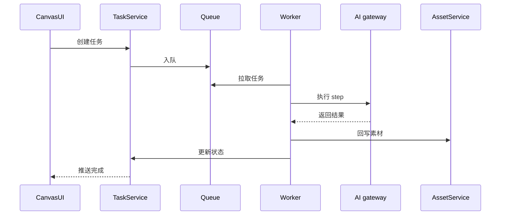
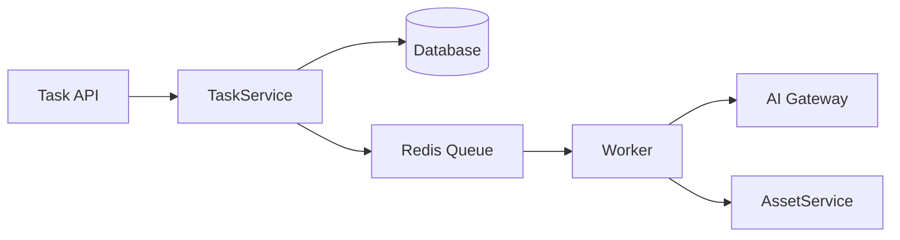

# [04] 任务调度模块设计稿

Created: 2026-07-29 Status: Draft

---

## 1. 用途

任务调度模块负责把用户提交的生成请求转化为可执行、可追踪、可重试的异步任务，并协调各模型步骤按 Pipeline 运行。

---

## 2. 最重要 3 点

### 2.1 数据结构设计

```sql
create table tasks
(
    id          bigint primary key generated always as identity,
    user_id     bigint not null references users (id),
    project_id  bigint references projects (id),
    spec_id     bigint not null,
    status      varchar(32) default 'pending',
    pipeline    jsonb,
    error       jsonb,
    created_at  timestamptz default now(),
    finished_at timestamptz
);

create table task_steps
(
    id          bigint primary key generated always as identity,
    task_id     bigint      not null references tasks (id),
    step_key    varchar(64) not null,
    model       varchar(128),
    input_refs  jsonb,
    output_refs jsonb,
    status      varchar(32) default 'pending',
    duration_ms int,
    created_at  timestamptz default now()
);

create table task_logs
(
    id         bigint primary key generated always as identity,
    task_id    bigint not null references tasks (id),
    step_id    bigint references task_steps (id),
    level      varchar(32),
    message    text,
    created_at timestamptz default now()
);
```

### 2.2 数据流转过程



### 2.3 总体架构



参考 open-ai-canvas：

- 后端任务与队列：`D:\GoWorkSpace\open-ai-canvas\backend\internal`
- 并发策略：`D:\GoWorkSpace\open-ai-canvas\docker-compose.server.yml`

---

## 3. 接口清单（MVP）

| 方法 | 路径                     | 说明     |
|------|--------------------------|----------|
| POST | /api/v1/tasks            | 创建任务 |
| GET  | /api/v1/tasks            | 任务列表 |
| GET  | /api/v1/tasks/{id}       | 任务详情 |
| POST | /api/v1/tasks/{id}/retry | 重试任务 |
| GET  | /api/v1/tasks/{id}/logs  | 任务日志 |

---

## 4. 依赖模块

| 模块         | 依赖说明   |
|--------------|------------|
| 画布模块     | 输入 Spec  |
| 计费配额模块 | 预占与扣费 |
| AI网关模块   | 模型执行   |
| 素材模块     | 结果回写   |

---

## 5. 与 open-ai-canvas 的映射

| 我们的模块   | open-ai-canvas 对应 |
|--------------|---------------------|
| 任务调度模块 | 异步任务中心        |
| Pipeline     | 生成任务编排        |
