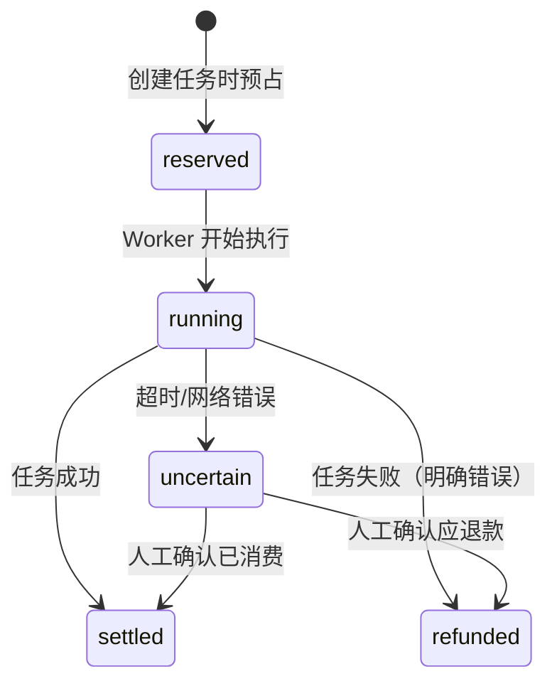
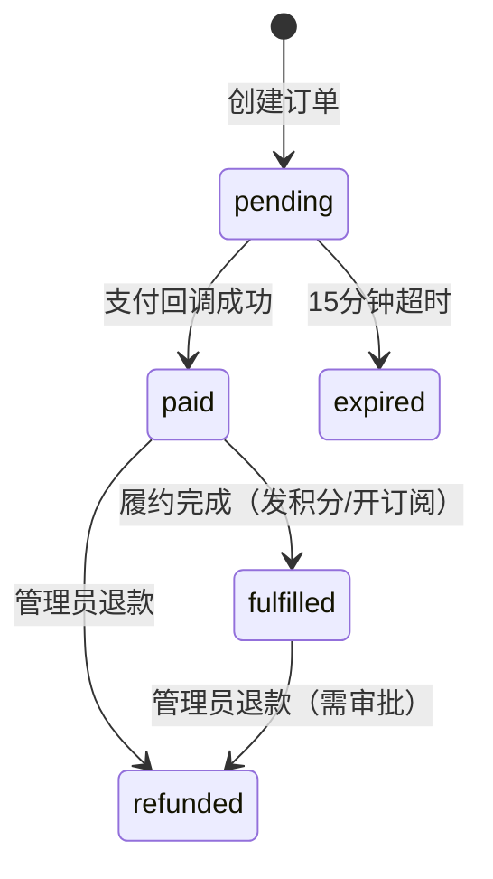
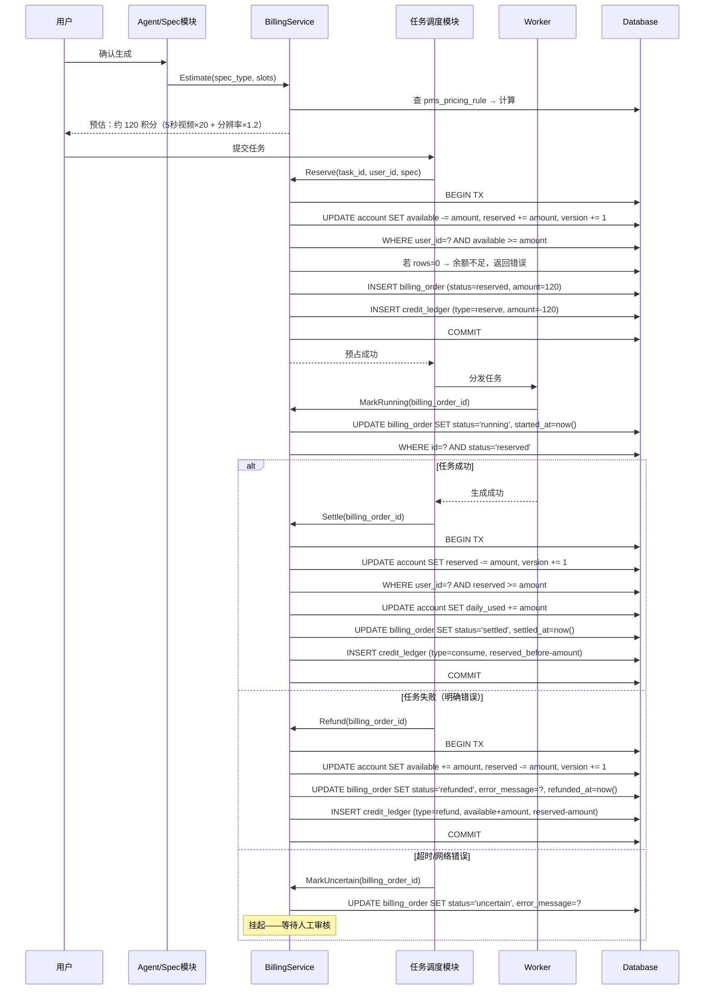
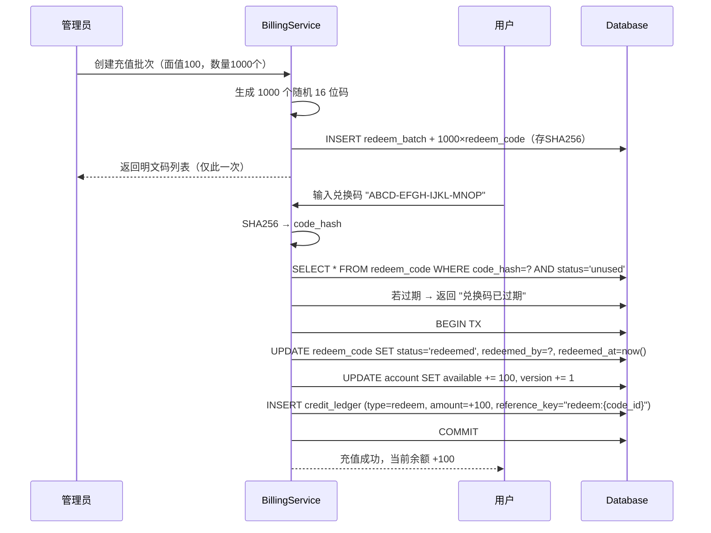
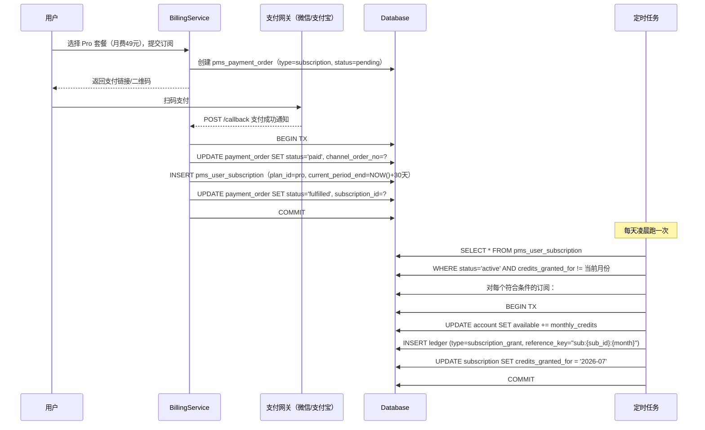
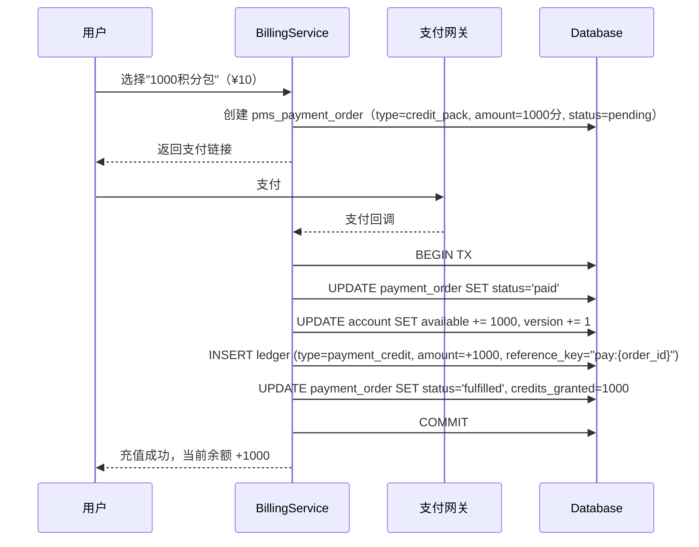
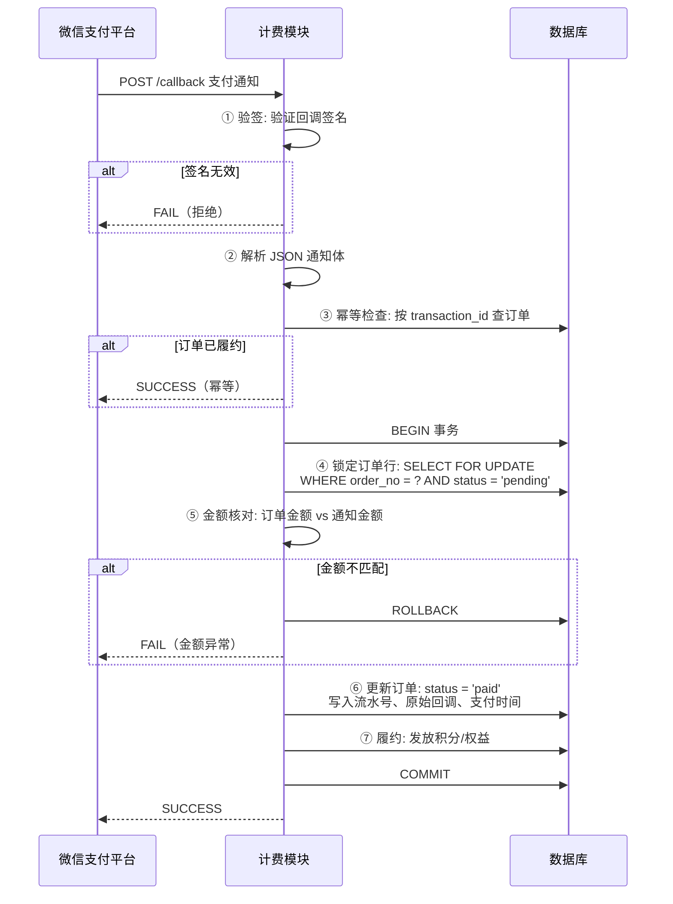
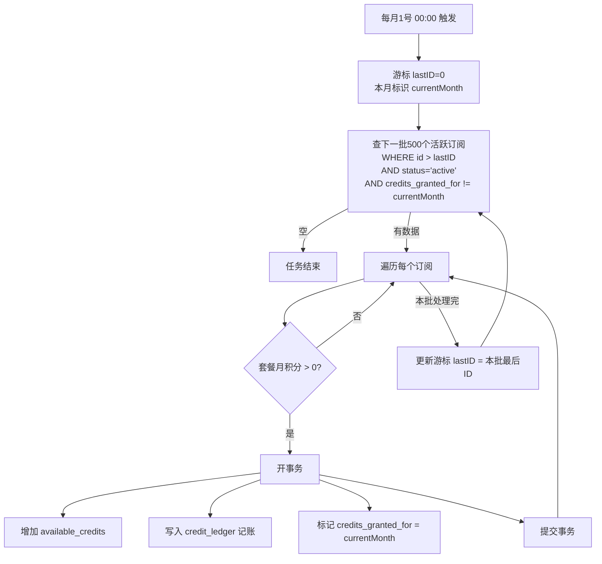
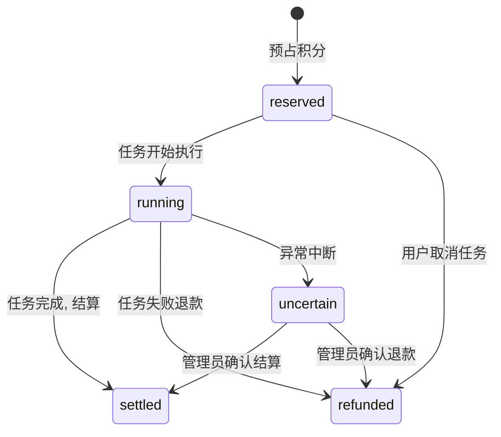

# [05] 计费与支付模块设计文档

Created: 2026-07-29 | Status: Draft | Reviewed: 2026-07-29

---

## 📌 模块定位

> 计费与支付模块是产品的**"财务大脑"**——负责三件事：
> 1. **积分怎么来**——订阅会员发积分、支付购买积分、兑换码充值
> 2. **积分怎么花**——预占→结算→退款，覆盖每次 AI 调用的完整生命周期
> 3. **积分可审计**——不可篡改的账本，每笔变动可追溯

一句话：**把真实货币 → 变成积分 → 追踪每一次 AI 消费，每一分钱有据可查**。

---

## 🗺️ 新人 3 分钟速通

### 8 张表一句话

| 表 | 一句话 | 所属域 |
|----|--------|--------|
| `pms_user_credit_account` | 用户的钱包——可用积分 + 冻结积分，乐观锁防超扣 | 积分账户 |
| `pms_credit_ledger` | 不可篡改的账本——每笔积分变动都有据可查 | 积分审计 |
| `pms_billing_order` | 一次 AI 生成任务的账单——从预占到结算的完整生命周期 | 消费 |
| `pms_pricing_rule` | 定价表——不同策略 × 模型收费多少 | 定价 |
| `pms_redeem_code` | 兑换码——运营发放，用户输入码换积分 | 充值 |
| `pms_subscription_plan` | 会员套餐——免费/Pro/企业，每月多少积分、多少钱 | 订阅 |
| `pms_user_subscription` | 用户当前订阅——什么套餐、何时到期、自动续费 | 订阅 |
| `pms_payment_order` | 支付订单——微信/支付宝实付记录 + 回调状态 | 支付 |

### 核心概念速查

| 概念 | 含义 | 类比 |
|------|------|------|
| **Credit（积分）** | 平台统一计费单位 | Q 币 |
| **Reserve（预占）** | 任务创建时冻结积分 | 酒店预授权——先冻结，退房再扣 |
| **Settle（结算）** | 任务成功后确认扣费 | 退房刷卡——真的扣了 |
| **Refund（退款）** | 任务失败后解冻归还 | 取消预订——钱退回来 |
| **Ledger（账本）** | 不可篡改的流水记录 | 银行流水单 |
| **Idempotency Key** | 幂等键，防重复扣费 | 订单号——同一单不会扣两次 |
| **Subscription（订阅）** | 按月付费的会员身份 | Netflix 会员 |
| **Payment Order** | 一次真实的金钱支付 | 微信支付账单 |

### 数据流一句话

```
用户订阅/购买积分 → 积分到账（available增加）
  → Agent校验通过 → 查定价估算 → 预占积分 → Worker执行
    → 成功则结算扣费 / 失败则退款 / 超时挂起人工
```

---

## 🆚 竞品对比（open-ai-canvas）

| 维度 | open-ai-canvas | x-media（我们） |
|------|---------------|----------------|
| 计费单位 | microcredits（1 credit = 1,000,000） | integer credits（整数，简化运算） |
| 余额模型 | 双余额：available + reserved | 同方案——双余额 + 乐观锁 |
| 账本审计 | `credit_ledger_entries`，8 种类型 | 同方案——`pms_credit_ledger`，按场景扩展 |
| 计费订单 | `billing_orders`，5 状态生命周期 | 同方案——`pms_billing_order`，4 状态 |
| 定价模型 | 三层：上游 ModelPricing + 用户 UnitPrice + CreditPolicy 倍率 | 简化为两层：策略基准价 + 用量乘数 |
| 充值方式 | SHA256 兑换码 + 注册奖励 + 每日签到 | 兑换码 + 订阅月费积分 + 直接购买积分包 |
| 订阅/会员 | **无**——纯积分制，无会员分层 | ✅ 新增——订阅套餐 + 每月自动发积分 |
| 支付网关 | **无**——不涉及真实货币 | ✅ 新增——微信/支付宝支付回调 |
| 并发保护 | `WHERE available >= amount` 乐观锁 | 同方案 |
| 异常处理 | uncertain 状态 + 人工审核 | 同方案——uncertain 挂起 |
| 限流 | 固定窗口 + 渠道并发槽位 + 熔断 | 固定窗口 + 渠道并发（在 AI 网关模块实现） |
| 幂等 | `(userID, idempotencyKey)` 唯一索引 | 同方案 |

---

## 1. 数据结构设计

### 1.1 pms_user_credit_account — 用户积分账户（核心表）

```sql
create table pms_user_credit_account
(
    id                bigint primary key generated always as identity,
    user_id           bigint      not null unique references pms_user (id),

    -- 双余额模型
    available_credits int         not null default 0 check (available_credits >= 0),
    reserved_credits  int         not null default 0 check (reserved_credits >= 0),

    -- 日限额
    daily_used        int         not null default 0,
    daily_limit       int,                  -- null 表示不限制

    -- 乐观锁
    version           int         not null default 0,

    created_at        timestamptz not null default now(),
    updated_at        timestamptz not null default now()
);
```

> **双余额说明**：用户可见余额 = `available_credits`（可自由支配）。任务执行中占用的积分 = `reserved_credits`（冻结中）。真实余额 = `available_credits + reserved_credits`。结算时只扣 reserved，退款时 reserved → available。

**日限额设计**：
- `daily_used` 由定时任务（或首次请求时惰性检查）按 UTC+8 午夜重置
- 创建预占时检查 `daily_used + amount <= daily_limit`（若 daily_limit 非 null）
- 结算成功后才累加 `daily_used`（预占不算，防止被刷）

### 1.2 pms_credit_ledger — 积分账本（不可篡改）

```sql
create table pms_credit_ledger
(
    id                   bigint primary key generated always as identity,
    user_id              bigint       not null references pms_user (id),
    billing_order_id     bigint       references pms_billing_order (id),

    -- 账本类型
    ledger_type          varchar(32)  not null,
    -- reserve: 预占 | consume: 结算扣费 | refund: 退款解冻
    -- grant: 管理员发放 | redeem: 兑换码充值 | daily_reset: 日限额重置
    -- subscription_grant: 会员月积分发放 | payment_credit: 直接购买积分
    -- admin_deduct: 管理员扣回积分

    -- 变动金额
    amount               int          not null,

    -- 变动前快照
    available_before     int          not null,
    reserved_before      int          not null,
    -- 变动后快照
    available_after      int          not null,
    reserved_after       int          not null,

    -- 幂等防重
    reference_key        varchar(128),

    -- 业务上下文
    model                varchar(128),
    spec_type            varchar(64),
    note                 text,

    created_at           timestamptz  not null default now()
);

-- 幂等唯一约束
create unique index idx_credit_ledger_ref on pms_credit_ledger (reference_key)
    where reference_key is not null;

create index idx_credit_ledger_user  on pms_credit_ledger (user_id, created_at desc);
create index idx_credit_ledger_order on pms_credit_ledger (billing_order_id);
```

> **为什么需要快照**：`available_before/after` 让对账无需 JOIN 历史状态——任何时刻的余额都能从最后一条账本记录推导。

### 1.3 pms_billing_order — 计费订单

```sql
create table pms_billing_order
(
    id                bigint primary key generated always as identity,
    user_id           bigint       not null references pms_user (id),
    task_id           bigint       not null references pms_task (id),
    spec_id           bigint       references pms_agent_spec (id),

    -- 幂等键：同一任务不会产生两份账单
    idempotency_key   varchar(128) not null,

    -- 计费上下文
    strategy_id       bigint       references pms_agent_strategy (id),
    spec_type         varchar(64)  not null,
    model             varchar(128),

    -- 定价快照（创建时锁定，防止事后改价影响）
    unit_price        int          not null,
    quantity          int          not null,        -- 秒数/张数/千token数
    amount            int          not null,        -- unit_price * quantity

    -- 状态机
    status            varchar(32)  not null default 'reserved',
    -- reserved（已预占）→ running（执行中）→ settled（已结算）
    --                                           → refunded（已退款）
    --                                           → uncertain（异常挂起）

    -- 异常信息
    error_message     text,
    resolved_by       bigint       references pms_user (id),  -- 人工处理人
    resolution_note   text,

    reserved_at       timestamptz,
    started_at        timestamptz,
    settled_at        timestamptz,
    refunded_at       timestamptz,

    created_at        timestamptz not null default now(),
    updated_at        timestamptz not null default now()
);

create unique index idx_billing_order_idem on pms_billing_order (user_id, idempotency_key);
create        index idx_billing_order_task on pms_billing_order (task_id);
create        index idx_billing_order_user on pms_billing_order (user_id, created_at desc);
```

**状态流转**：



### 1.4 pms_pricing_rule — 定价规则

```sql
create table pms_pricing_rule
(
    id              bigint primary key generated always as identity,

    -- 关联策略
    strategy_id     bigint       references pms_agent_strategy (id),
    -- 若不关联策略，则按 spec_type 兜底
    spec_type       varchar(64),

    -- 定价维度
    model           varchar(128),
    -- null 表示该 spec_type 下的默认定价

    base_credits    int          not null default 0,
    -- 每次请求的固定费用

    credits_per_unit int         not null default 0,
    -- 单位用量价格
    unit_type       varchar(32)  not null,
    -- second: 每秒视频 | image: 每张图片 | k_tokens: 每千 token | request: 与 quantity 无关

    -- 质量乘数
    resolution_multiplier jsonb,
    -- 示例: {"480p": 0.5, "720p": 1.0, "1080p": 2.0, "4k": 4.0}

    status          varchar(32)  not null default 'active',
    effective_from  timestamptz,
    effective_to    timestamptz,

    created_at      timestamptz  not null default now(),
    updated_at      timestamptz  not null default now()
);

create index idx_pricing_rule_strategy on pms_pricing_rule (strategy_id, status);
create index idx_pricing_rule_type     on pms_pricing_rule (spec_type, status) where strategy_id is null;
```

**定价示例**：

| spec_type | model | base_credits | credits_per_unit | unit_type | 含义 |
|-----------|-------|-------------|-----------------|-----------|------|
| text_to_image | sdxl-turbo | 0 | 10 | image | 每张图 10 积分 |
| text_to_video | svd-xt | 0 | 20 | second | 每秒视频 20 积分 |
| image_to_video | svd-xt | 0 | 20 | second | 同上 |
| video_edit | gpt-4o | 5 | 3 | k_tokens | 5 积分起步 + 每千 token 3 积分 |
| audio_gen | bark | 0 | 5 | second | 每秒音频 5 积分 |

**成本计算伪码**：

```
cost = pricing.base_credits + pricing.credits_per_unit * quantity
cost = cost * resolution_multiplier[spec.resolution]
```

### 1.5 pms_redeem_code — 充值码

```sql
create table pms_redeem_batch
(
    id              bigint primary key generated always as identity,
    name            varchar(128) not null,
    amount          int          not null,          -- 每个码面值
    total_count     int          not null,
    created_by      bigint       not null references pms_user (id),
    expires_at      timestamptz,
    note            text,
    created_at      timestamptz  not null default now()
);

create table pms_redeem_code
(
    id              bigint primary key generated always as identity,
    batch_id        bigint       not null references pms_redeem_batch (id),

    code_hash       varchar(64)  not null unique,   -- SHA256(code)
    code_prefix     varchar(8)   not null,          -- 明文前 8 位，用户识别用

    status          varchar(32)  not null default 'unused',
    -- unused → redeemed → disabled

    redeemed_by     bigint       references pms_user (id),
    redeemed_at     timestamptz,

    created_at      timestamptz  not null default now()
);

create index idx_redeem_code_batch  on pms_redeem_code (batch_id);
create index idx_redeem_code_status on pms_redeem_code (status) where status = 'unused';
```

> **安全设计**：码原文仅创建时短暂存在于内存 → SHA256 哈希落库 → 原文不存储。用户输入码 → SHA256 → 查 `code_hash` → 匹配则兑换。`code_prefix` 存明文前 8 位，便于用户和管理员识别。

### 1.6 pms_subscription_plan — 会员套餐定义

```sql
create table pms_subscription_plan
(
    id                  bigint primary key generated always as identity,

    -- 套餐标识
    name                varchar(128) not null unique,   -- "免费版" / "Pro版" / "企业版"
    tier                varchar(32)  not null unique,   -- free / pro / enterprise
    description         text,

    -- 权益
    monthly_credits     int          not null,          -- 每月自动发放积分数，0 表示不发
    daily_limit         int,                            -- 日生成限额，null 表示不限制
    max_resolution      varchar(16),                    -- 最高分辨率限制：720p / 1080p / 4k
    max_video_duration  int,                            -- 单次视频最大时长（秒）
    concurrent_tasks    int          not null default 1, -- 同时进行的任务数
    commercial_license  boolean      not null default false, -- 是否含商用授权

    -- 定价（null = 免费套餐）
    price_cents         int,                            -- 月费（分），null 表示免费
    currency            varchar(8)   default 'CNY',
    -- 年付折扣（可选）
    yearly_price_cents  int,                            -- 年费（分）

    -- 超额计费（积分用完后怎么算）
    overage_allowed     boolean      not null default false,
    overage_price_cents_per_credit jsonb,
    -- 示例: {"ranges": [{"up_to":1000,"price_cents":10},{"up_to":5000,"price_cents":8}]}
    --       前1000积分按10分/积分，1000-5000按8分/积分

    status              varchar(32)  not null default 'active',
    sort_order          int          not null default 0,

    created_at          timestamptz  not null default now(),
    updated_at          timestamptz  not null default now()
);
```

**套餐设计示例**：

| tier | monthly_credits | daily_limit | max_resolution | price_cents | 说明 |
|------|----------------|-------------|----------------|-------------|------|
| free | 200 | 50 | 720p | null | 免费体验，每日限 50 积分 |
| pro | 5000 | null | 1080p | 4900 | 月费 49 元，无日限额 |
| enterprise | 50000 | null | 4k | 29900 | 月费 299，商用授权 |

### 1.7 pms_user_subscription — 用户订阅状态

```sql
create table pms_user_subscription
(
    id                  bigint primary key generated always as identity,
    user_id             bigint       not null unique references pms_user (id),

    plan_id             bigint       not null references pms_subscription_plan (id),

    -- 订阅周期
    status              varchar(32)  not null default 'active',
    -- active: 生效中 | cancelled: 已取消（到期后不续） | expired: 已过期 | paused: 暂停

    current_period_start timestamptz not null,
    current_period_end   timestamptz not null,

    -- 自动续费
    auto_renew          boolean      not null default false,
    -- 当月积分是否已发放（防止重复发放）
    credits_granted_for varchar(7),             -- 格式 "2026-07"，已发放的月份

    -- 取消原因
    cancelled_at        timestamptz,
    cancel_reason       varchar(256),

    created_at          timestamptz  not null default now(),
    updated_at          timestamptz  not null default now()
);

create index idx_user_sub_status on pms_user_subscription (status, current_period_end);
```

### 1.8 pms_payment_order — 支付订单

```sql
create table pms_payment_order
(
    id                  bigint primary key generated always as identity,
    user_id             bigint       not null references pms_user (id),

    -- 订单号
    order_no            varchar(64)  not null unique,   -- 业务单号，如 "PO2026072900001"
    idempotency_key     varchar(128) not null,           -- 幂等键

    -- 买了什么
    order_type          varchar(32)  not null,
    -- subscription: 订阅套餐 | credit_pack: 积分包 | subscription_renew: 续费
    plan_id             bigint       references pms_subscription_plan (id),

    -- 金额
    amount_cents        int          not null,           -- 实付金额（分）
    currency            varchar(8)   not null default 'CNY',

    -- 支付渠道
    payment_method      varchar(32)  not null,
    -- wechat_pay: 微信支付 | alipay: 支付宝 | manual: 管理员标记

    -- 回调追踪
    channel_order_no    varchar(128),                    -- 支付渠道返回的流水号
    channel_callback_raw jsonb,                          -- 支付回调原始数据（对账用）

    -- 状态机
    status              varchar(32)  not null default 'pending',
    -- pending: 待支付 → paid: 已支付 → fulfilled: 已履约
    --                  → expired: 超时未支付 | refunded: 已退款

    paid_at             timestamptz,
    fulfilled_at        timestamptz,
    expired_at          timestamptz,

    -- 履约结果
    credits_granted     int,                             -- 发放了多少积分
    subscription_id     bigint       references pms_user_subscription (id),

    created_at          timestamptz  not null default now(),
    updated_at          timestamptz  not null default now()
);

create unique index idx_payment_order_idem on pms_payment_order (user_id, idempotency_key);
create        index idx_payment_order_user on pms_payment_order (user_id, created_at desc);
create        index idx_payment_order_chno on pms_payment_order (channel_order_no) where channel_order_no is not null;
```

**支付订单状态流转**：



> **订单类型 vs 履约行为对照**：
> - `subscription` → 创建/续费 `pms_user_subscription`，激活会员身份
> - `credit_pack` → 直接 `available_credits += 购买积分数`
> - `subscription_renew` → 延长 `current_period_end`，下个周期发积分

---

## 2. 业务流转

### 2.1 完整生命周期



### 2.2 成本预估（Estimate）

**触发时机**：Agent 校验 Spec 通过后，生成 Pipeline 之前。

**入参**：
```json
{
  "spec_type": "text_to_video",
  "slots": {
    "duration_seconds": 10,
    "resolution": "1080p"
  }
}
```

**计算逻辑**：
```
1. 按 spec_type → strategy 查 pms_pricing_rule
2. 按 model 匹配（优先 strategy 级，其次 spec_type 兜底）
3. cost = base_credits + credits_per_unit × duration_seconds
4. cost = cost × resolution_multiplier["1080p"]  // × 2.0
5. 返回: { estimated: 400, breakdown: "10秒×20×2.0分辨率", sufficient: true }
```

### 2.3 日限额检查

两个检查点：

| 检查点 | 时机 | 逻辑 |
|--------|------|------|
| **预估时** | Agent 返回 Pipeline 前 | 若 `daily_used + estimated > daily_limit` → 提示"今日额度不足，请明天再试" |
| **预占时** | 创建 BillingOrder 时 | 同一事务内：`daily_used + amount <= daily_limit`，失败则拒绝创建任务 |

**日重置机制**：

```
方案 A（推荐——惰性重置）：
  每次写 daily_used 时检查：
    若 NOW() 的日期 > daily_reset_date（存在 Redis/内存）
      → daily_used = 0, daily_reset_date = TODAY

方案 B（备选——定时任务）：
  每天 UTC+8 00:00 跑一次：
    UPDATE pms_user_credit_account SET daily_used = 0
```

MVP 推荐方案 B——简单可靠，无状态。

### 2.4 兑换码流程



### 2.5 订阅会员流程



**关键设计决策**：

| 决策 | 选择 | 原因 |
|------|------|------|
| 积分何时发放 | 每月 1 号凌晨 | 防止用户月初用完后取消订阅白嫖 |
| 当月未用完积分 | 不清零，累积 | 鼓励长期订阅，降低流失 |
| 套餐切换 | 下个周期生效 | 防止"付 Pro 钱用一天企业版"的漏洞 |
| 取消订阅 | 到期后降级为 free | 给用户缓冲期，非立即停服 |
| 自动续费 | 到期前 3 天创建新 payment_order | 若余额不足则通知用户，到期后自动过期 |

### 2.6 直接购买积分包



### 2.7 余额不足时——消费优先用订阅积分

积分消费优先级（结算时自动判断）：

```
1. 优先扣除 available_credits（可能来自订阅月积分、购买积分包、兑换码）
2. 若 available 不足：
   a. 订阅用户 + overage_allowed=true → 创建超额计费记录，月底结算
   b. 非订阅用户 → 提示余额不足，引导购买积分包
3. 免费套餐用户 → 每日 limit 到顶后提示"今日额度用完，升级 Pro 无限生成"
```

---

### 2.8 超额计费（订阅用户积分用完后的弹性消费）

```sql
create table pms_overage_record
(
    id                  bigint primary key generated always as identity,
    user_id             bigint       not null references pms_user (id),
    subscription_id     bigint       not null references pms_user_subscription (id),
    billing_month       varchar(7)   not null,          -- "2026-07"
    overage_credits     int          not null,          -- 超额使用的积分数
    amount_cents        int          not null,          -- 应补金额（分）
    status              varchar(32)  not null default 'pending',
    -- pending: 待结算 → settled: 已结算 → waived: 已豁免

    created_at          timestamptz  not null default now()
);

create unique index idx_overage_unique on pms_overage_record (user_id, billing_month);
```

> MVP 阶段超额计费可简化为：订阅用户积分用完 → 引导购买积分包，不做自动超额。**月结超额放到 V2**。

---

## 3. 接口清单

### 3.1 用户端（10个）

| 方法 | 路径 | 说明 |
|------|------|------|
| GET | `/api/v1/billing/account` | 我的余额 + 日用量 |
| GET | `/api/v1/billing/ledger` | 我的积分流水（分页） |
| GET | `/api/v1/billing/orders` | 我的计费订单列表 |
| GET | `/api/v1/billing/estimate` | 成本预估 |
| POST | `/api/v1/billing/redeem` | 兑换充值码 |
| GET | `/api/v1/billing/plans` | 套餐列表 |
| GET | `/api/v1/billing/my-subscription` | 我的订阅状态 |
| POST | `/api/v1/billing/subscribe` | 创建订阅支付订单 |
| POST | `/api/v1/billing/cancel-subscription` | 取消自动续费 |
| POST | `/api/v1/billing/buy-credits` | 创建积分包支付订单 |

### 3.2 支付回调（2个）

| 方法 | 路径 | 说明 |
|------|------|------|
| POST | `/api/v1/callback/wechat-pay` | 微信支付回调 |
| POST | `/api/v1/callback/alipay` | 支付宝回调 |

### 3.3 任务内部调用（4个）

| 方法 | 说明 | 调用方 |
|------|------|--------|
| `Reserve(taskID, userID, spec)` | 预占积分，创建 BillingOrder | 任务模块 |
| `MarkRunning(orderID)` | 开始执行 | Worker |
| `Settle(orderID)` | 结算扣费 | 任务模块 |
| `Refund(orderID, reason)` | 退款解冻 | 任务模块 |

### 3.4 管理端（12个）

| 方法 | 路径 | 说明 |
|------|------|------|
| GET | `/api/v1/admin/plans` | 套餐管理 |
| POST | `/api/v1/admin/plans` | 新增套餐 |
| PUT | `/api/v1/admin/plans/:id` | 编辑套餐 |
| GET | `/api/v1/admin/pricing-rules` | 定价规则 |
| POST | `/api/v1/admin/pricing-rules` | 新增定价规则 |
| PUT | `/api/v1/admin/pricing-rules/:id` | 编辑定价规则 |
| POST | `/api/v1/admin/redeem-batches` | 创建兑换码批次 |
| GET | `/api/v1/admin/redeem-batches/:id/codes` | 导出兑换码 |
| POST | `/api/v1/admin/credit-grant` | 手动发放积分 |
| GET | `/api/v1/admin/billing-orders` | 计费订单（筛选 uncertain） |
| POST | `/api/v1/admin/billing-orders/:id/resolve` | 处理 uncertain 订单 |
| GET | `/api/v1/admin/payment-orders` | 支付订单列表 + 对账 |

### 3.5 定时任务（2个）

| 任务 | 频率 | 说明 |
|------|------|------|
| `GrantMonthlyCredits` | 每月 1 号 UTC+8 00:00 | 为所有 active 订阅发放月积分 |
| `ResetDailyUsage` | 每天 UTC+8 00:00 | 重置所有用户的 daily_used |

### 3.6 请求/响应示例

**GET /api/v1/billing/plans**
```
Response 200:
{
  "plans": [
    {
      "tier": "free",
      "name": "免费版",
      "monthly_credits": 200,
      "daily_limit": 50,
      "max_resolution": "720p",
      "price_cents": null,
      "features": ["200积分/月", "720p", "1个并发任务"]
    },
    {
      "tier": "pro",
      "name": "Pro版",
      "monthly_credits": 5000,
      "daily_limit": null,
      "max_resolution": "1080p",
      "price_cents": 4900,
      "yearly_price_cents": 49000,
      "features": ["5000积分/月", "1080p", "3个并发任务", "高速队列"]
    }
  ]
}
```

**POST /api/v1/billing/subscribe**
```
Request:
{
  "plan_tier": "pro",
  "billing_cycle": "monthly"
}

Response 200:
{
  "payment_order_no": "PO2026072900001",
  "payment_url": "weixin://wxpay/bizpayurl?pr=xxx",
  "expires_in": 900
}
```

**GET /api/v1/billing/my-subscription**
```
Response 200:
{
  "tier": "pro",
  "status": "active",
  "current_period_end": "2026-08-28T23:59:59Z",
  "auto_renew": true,
  "monthly_credits": 5000,
  "credits_granted_this_month": true,
  "features": { "max_resolution": "1080p", "concurrent_tasks": 3 }
}
```

---

## 4. 模块间交互协议

### 4.1 与 Agent 策略模块

| 接口 | 方向 | 说明 |
|------|------|------|
| `Estimate(specType, slots)` | Agent → Billing | 校验通过后，生成 Pipeline 前调用 |
| `pms_billing_order.spec_id` | 数据引用 | 账单关联到 Spec |
| `pms_pricing_rule.strategy_id` | 数据引用 | 定价关联到策略 |

### 4.2 与任务调度模块

| 接口 | 方向 | 说明 |
|------|------|------|
| `Reserve(taskID, userID, spec)` | Task → Billing | 创建任务时预占积分 |
| `MarkRunning(orderID)` | Worker → Billing | 开始执行 |
| `Settle(orderID)` | Task → Billing | 成功后结算 |
| `Refund(orderID, reason)` | Task → Billing | 失败后退款 |
| `MarkUncertain(orderID, error)` | Task → Billing | 异常挂起 |
| `pms_billing_order.task_id` | 数据引用 | `references pms_task (id)` |

### 4.3 与用户模块

| 接口 | 方向 | 说明 |
|------|------|------|
| `pms_user_credit_account.user_id` | 数据引用 | `references pms_user (id)` |
| `pms_user_subscription.user_id` | 数据引用 | `references pms_user (id)` |
| `pms_payment_order.user_id` | 数据引用 | `references pms_user (id)` |
| `GetAccount(userID)` | User → Billing | 查询余额（前端实时展示） |
| `GetSubscription(userID)` | User → Billing | 查询会员状态（控制功能权限） |
| `CheckFeature(userID, feature)` | User → Billing | 检查用户是否可用某功能（如 4K） |

### 4.4 与外部支付网关

| 接口 | 方向 | 说明 |
|------|------|------|
| 发起支付 | Billing → Wechat/Alipay | 创建预支付订单，返回支付串 |
| 支付回调 | Wechat/Alipay → Billing | 异步通知支付结果 |
| 主动查询 | Billing → Wechat/Alipay | 超时未收到回调时主动查单 |

### 4.5 用户注册时的默认订阅

```
新用户注册 → UserService 调用 BillingService.OnUserCreated(userID):
  1. INSERT pms_user_credit_account (user_id, available=0)
  2. INSERT pms_user_subscription (user_id, plan=free, status=active)
  3. 立即发放首月积分（同月注册即发当月积分）
```

---

## 5. 实现要点

### 5.1 并发安全——乐观锁

扣费操作使用数据库行级原子更新，在一条 SQL 中完成"扣减 + 校验"，避免并发超扣。

**SQL 动作**：

```sql
UPDATE pms_user_credit_account
SET available_credits = available_credits - {amount},
    reserved_credits  = reserved_credits + {amount},
    version = version + 1
WHERE user_id = {userID}
  AND available_credits >= {amount}   -- 天然防超扣
```

**执行流程**：

| 步骤 | 说明 |
|------|------|
| 1. 执行 UPDATE | 单条 SQL 原子操作，PostgreSQL 对该行加行锁 |
| 2. 检查受影响行数 | `RowsAffected == 0` → 余额不足，返回 `ErrInsufficientCredits` |
| 3. 成功 | 余额扣减、预占增加、版本号 +1（用于审计追踪） |

> 关键：`WHERE available_credits >= ?` 利用 PostgreSQL 行锁保证不会超扣。`version` 递增用于追踪，不依赖它做冲突检测（比 CAS 更可靠）。

### 5.2 幂等性——防重复扣费与重复支付

**幂等键设计**：

| 场景 | 幂等键格式 | 唯一索引 | 说明 |
|------|-----------|----------|------|
| 任务扣费 | `task:{taskID}` | `(user_id, idempotency_key)` | 同一个 task 不会重复扣两次 |
| 支付订单 | `pay:{orderType}:{planTier}:{minute}` | `(user_id, idempotency_key)` | 同一用户每分钟内同类型订单只创建一次 |
| 支付回调 | 检查 `status == 'paid'` | — | 已履约订单直接返回成功，不重复处理 |

### 5.3 支付回调安全



### 5.4 日限额重置定时任务

每天 UTC+8 零点执行，将当天已用量归零：

```
触发时间: 每天 00:00 (UTC+8)
SQL: UPDATE pms_user_credit_account
     SET daily_used = 0, updated_at = now()
     WHERE daily_used > 0
```

> 只更新 `daily_used > 0` 的行，避免全表扫描。`updated_at` 更新用于审计。

### 5.5 月积分发放定时任务

每月 1 号零点扫描所有活跃订阅用户，按套餐发放月积分。用游标分页处理海量用户。



**关键设计**：

| 机制 | 说明 |
|------|------|
| 游标分页 | 每批 500 条，避免一次性加载全部用户撑爆内存 |
| 防重复发放 | `credits_granted_for != currentMonth` 确保同月不重复发放 |
| 事务内三合一 | 发放积分 + 记账 + 标记已发放在同一事务中，任一失败全部回滚 |

### 5.6 BillingOrder 状态机



**状态转换规则**：

| 当前状态 | 可转换到 | 说明 |
|----------|----------|------|
| `reserved` | `running`, `refunded` | 预占后可执行或取消 |
| `running` | `settled`, `refunded`, `uncertain` | 执行中可正常结算、退款，或标记异常 |
| `uncertain` | `settled`, `refunded` | 仅管理员可操作的人工裁决状态 |

### 5.7 分辨率乘数计算

不同分辨率消耗不同积分，通过 `resolution_multiplier` 配置实现差异化定价。

**定价公式**：

```
cost = (BaseCredits + CreditsPerUnit × quantity) × ResolutionMultiplier
```

**乘数配置示例**（`pms_pricing_rule.resolution_multiplier` JSONB 字段）：

| 分辨率 | 乘数 | 说明 |
|--------|------|------|
| 480p | 0.5 | 低清，半价 |
| 720p | 1.0 | 基准分辨率 |
| 1080p | 2.0 | 高清，2 倍 |
| 4k | 4.0 | 超高清，4 倍 |

> 分辨率未配置时默认乘数为 1.0。

---

## 6. 依赖模块

| 模块 | 依赖说明 | 接口 |
|------|---------|------|
| 用户模块 | 积分账户/订阅/支付归属 | 外键引用 `pms_user.id` |
| 用户模块 | 注册时自动创建免费订阅 | `OnUserCreated(userID)` 回调 |
| Agent 策略模块 | 定价规则按策略配置 | `pms_pricing_rule.strategy_id` → `pms_agent_strategy.id` |
| Agent 策略模块 | Spec 关联账单 | `pms_billing_order.spec_id` → `pms_agent_spec.id` |
| 任务调度模块 | 任务生命周期驱动计费 | `pms_billing_order.task_id` → `pms_task.id` |
| 任务调度模块 | 创建任务前检查余额 | `CheckBalance(userID, amount)` → bool |
| 外部 | 微信支付 SDK | 统一下单 + 回调验签 |
| 外部 | 支付宝 SDK | 预下单 + 回调验签 |

---

## 7. 新人开发指南

### 5 位后端分工

| 开发者 | 负责内容 | 依赖 |
|--------|---------|------|
| A | `pms_user_credit_account` + `pms_credit_ledger` + 乐观锁 + 日/月定时任务 | 用户模块 |
| B | `pms_billing_order` 状态机 + Reserve/Settle/Refund 核心事务 | 任务模块接口 |
| C | `pms_pricing_rule` + Estimate + 分辨率乘数 | Agent 模块接口 |
| D | `pms_subscription_plan` + `pms_user_subscription` + 套餐选择/升降级 | A, C |
| E | `pms_payment_order` + `pms_redeem_code` + 微信/支付宝回调 | A, D |

### 开发顺序

1. **先做定价 + 账户**（C + A）——定价有了才能估算，账户有了才能扣费
2. **再做预占 + 结算**（B）——核心消费流
3. **然后订阅体系**（D）——会员分层 + 月积分发放
4. **最后支付网关**（E）——真实金钱对接，最需谨慎

### 实战踩坑点

| 坑 | 建议 |
|----|------|
| **事务内余额检查失败** | 不要返回后重试——事务失败后整个 reserve 回滚，上层返回"余额不足"即可 |
| **日重置竞态** | 定时任务和结算可能同时操作 `daily_used`——使用 `SET daily_used = daily_used + ?` 原子加法 |
| **支付回调重复通知** | 微信/支付宝可能重复推送——幂等检查必须基于 `channel_order_no`，已履约直接返回 success |
| **支付回调金额篡改** | **必须**比对回调 `total_fee` 和订单 `amount_cents`，不一致则告警，禁止自动退款 |
| **兑换码暴力破解** | SHA256 不可逆，但建议加全局限流——`/redeem` 端点每人每小时 10 次 |
| **定价变更影响在途订单** | `pms_billing_order` 存储 `unit_price/amount` 快照——定价改了不影响已创建订单 |
| **uncertain 状态积压** | 超时订单 72 小时未处理 → 自动退款，发送告警通知 |
| **积分发多了** | 用 `pms_credit_ledger` 回溯，管理员可扣回（type=admin_deduct），需审批流程 |
| **月积分漏发** | 定时任务使用游标分页 + reference_key 幂等——中断后重跑不会重复发放 |
| **订阅套餐切换** | 切换后**下个周期**生效——当前周期不变。立即生效会导致"付一天 Pro 钱用一天企业版" |
