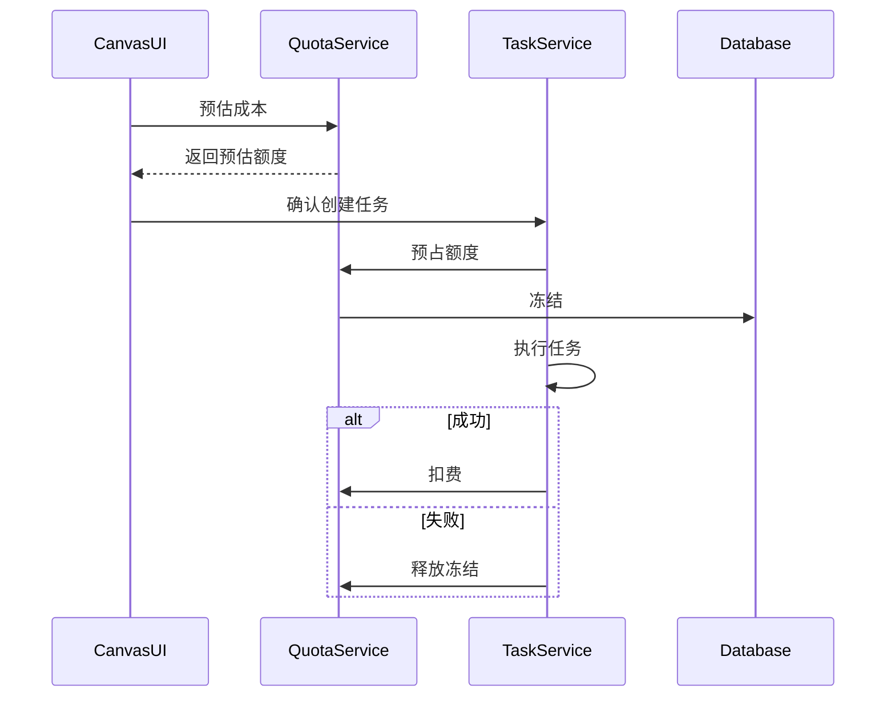
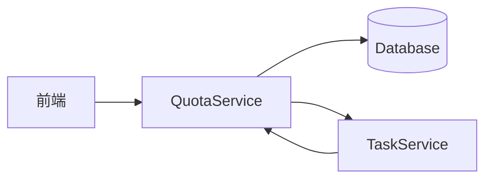

# [05] 计费配额模块设计稿

Created: 2026-07-29 Status: Draft

---

## 1. 用途

计费配额模块负责额度、成本预估、预占与回滚，保证生成业务可计费、可审计、可限流。

---

## 2. 最重要 3 点

### 2.1 数据结构设计

```sql
create table quotas
(
    id          bigint primary key generated always as identity,
    user_id     bigint  not null references users (id),
    balance     numeric not null default 0,
    frozen      numeric not null default 0,
    daily_used  numeric not null default 0,
    daily_limit numeric,
    created_at  timestamptz      default now(),
    updated_at  timestamptz      default now()
);

create table cost_rules
(
    id                   bigint primary key generated always as identity,
    spec_hash            varchar(64) not null,
    price_per_second     numeric,
    price_per_resolution numeric,
    model                varchar(128),
    created_at           timestamptz default now()
);

create table reserve_records
(
    id         bigint primary key generated always as identity,
    user_id    bigint  not null references users (id),
    task_id    bigint  not null references tasks (id),
    amount     numeric not null,
    status     varchar(32) default 'frozen',
    expire_at  timestamptz,
    created_at timestamptz default now()
);
```

### 2.2 数据流转过程



### 2.3 总体架构



---

## 3. 接口清单（MVP）

| 方法 | 路径                   | 说明     |
|------|------------------------|----------|
| GET  | /api/v1/quota/estimate | 成本预估 |
| POST | /api/v1/quota/reserve  | 预占额度 |
| POST | /api/v1/quota/commit   | 确认扣费 |
| POST | /api/v1/quota/release  | 释放冻结 |
| GET  | /api/v1/quota/records  | 预占记录 |

---

## 4. 依赖模块

| 模块         | 依赖说明     |
|--------------|--------------|
| 用户模块     | 额度归属     |
| 画布模块     | Spec 输入    |
| 任务调度模块 | 任务生命周期 |

---

## 5. 与 open-ai-canvas 的映射

| 我们的模块   | open-ai-canvas 对应 |
|--------------|---------------------|
| 计费配额模块 | 资源与策略配置      |
| 预占机制     | 任务并发与预算控制  |
