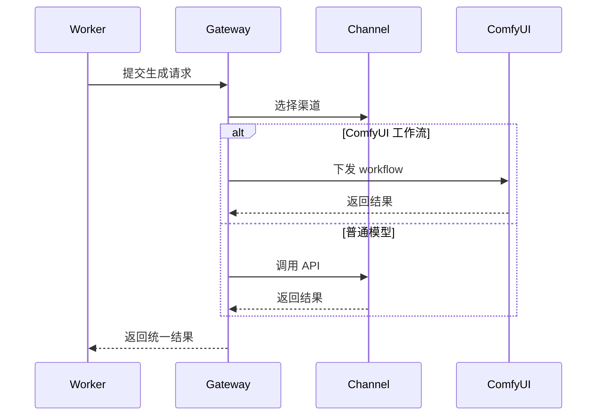
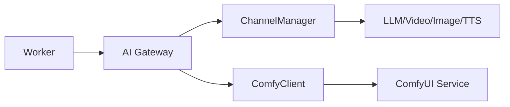

# [06] AI 网关模块设计稿

Created: 2026-07-29 Status: Draft

---

## 1. 用途

AI 网关模块负责统一管理多模型渠道、并发控制、请求封装与结果回收，是生成能力的中台。

---

## 2. 最重要 3 点

### 2.1 数据结构设计

```sql
create table channels
(
    id                bigint primary key generated always as identity,
    provider          varchar(128) not null,
    model_type        varchar(64)  not null,
    api_key_encrypted text,
    concurrency       int         default 3,
    status            varchar(32) default 'enabled',
    created_at        timestamptz default now()
);

create table model_calls
(
    id            bigint primary key generated always as identity,
    channel_id    bigint not null references channels (id),
    request_json  jsonb,
    response_json jsonb,
    duration_ms   int,
    status        varchar(64),
    created_at    timestamptz default now()
);

create table comfy_workflows
(
    id            bigint primary key generated always as identity,
    name          varchar(255),
    workflow_json jsonb not null,
    input_schema  jsonb,
    created_at    timestamptz default now()
);
```

### 2.2 数据流转过程



### 2.3 总体架构



参考 open-ai-canvas：

- 渠道配置：`D:\GoWorkSpace\open-ai-canvas\README.md`

---

## 3. 接口清单（MVP）

| 方法 | 路径                      | 说明       |
|------|---------------------------|------------|
| GET  | /api/v1/gateway/channels  | 渠道列表   |
| POST | /api/v1/gateway/channels  | 创建渠道   |
| POST | /api/v1/gateway/invoke    | 统一调用   |
| POST | /api/v1/gateway/comfy/run | 执行工作流 |

---

## 4. 依赖模块

| 模块         | 依赖说明      |
|--------------|---------------|
| 任务调度模块 | 执行步骤      |
| 素材模块     | 输入/输出素材 |
| 存储模块     | 大文件读写    |

---

## 5. 与 open-ai-canvas 的映射

| 我们的模块 | open-ai-canvas 对应 |
|------------|---------------------|
| AI网关模块 | 模型渠道与后台配置  |
| ComfyUI    | 复杂工作流处理      |
