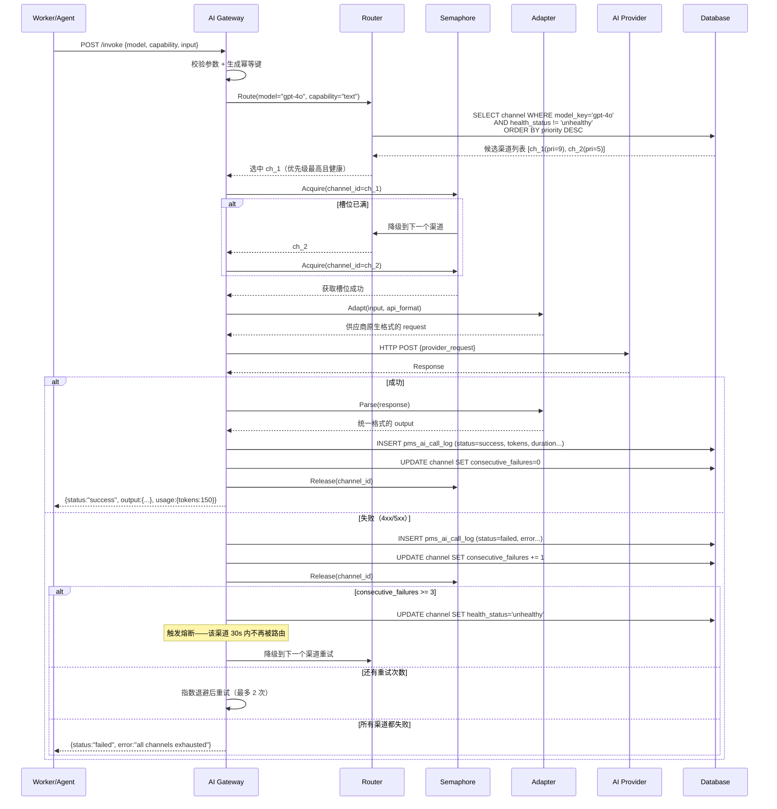
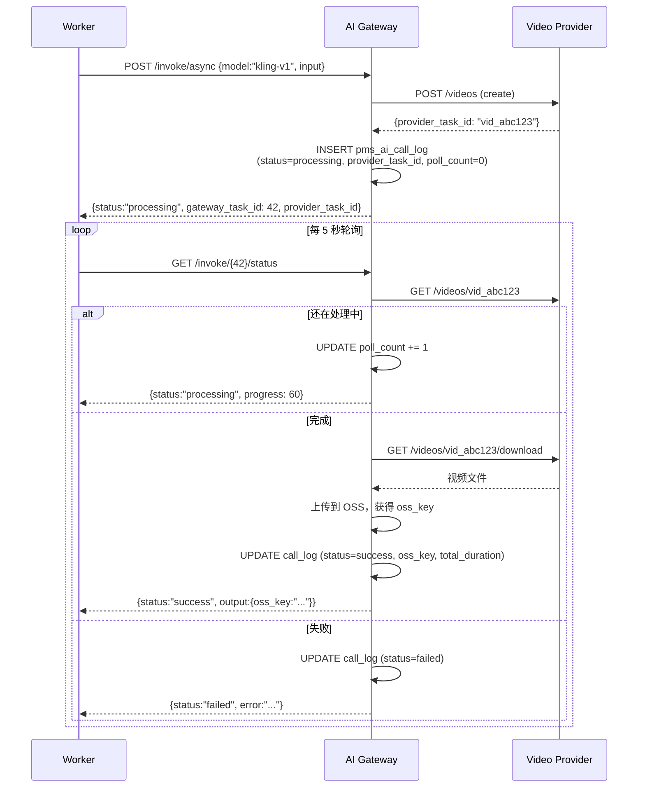
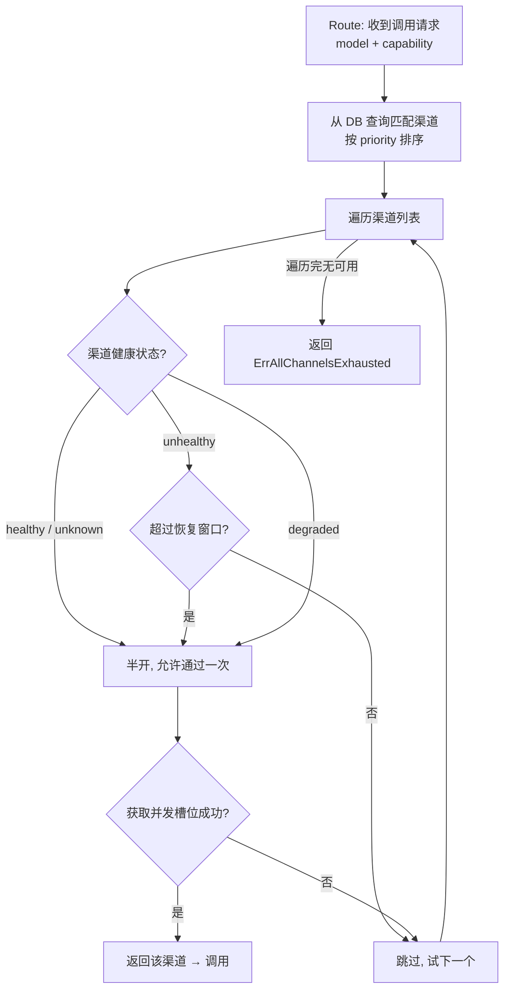
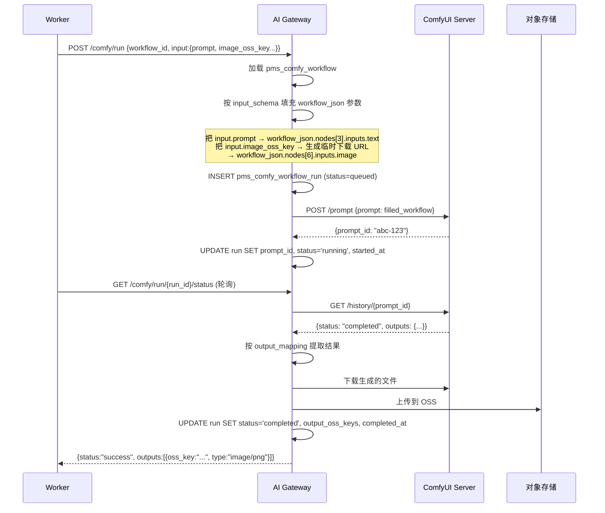
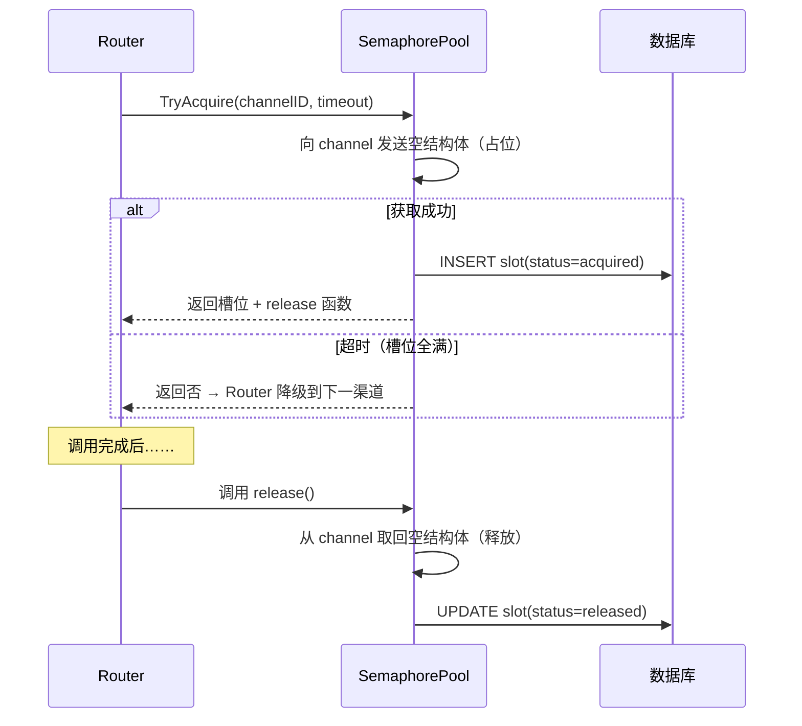
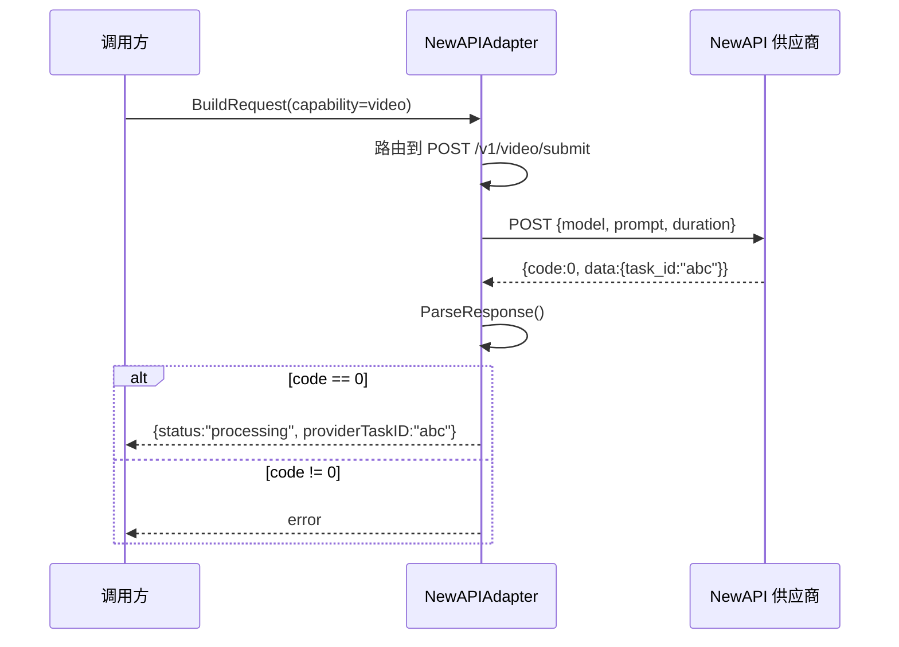
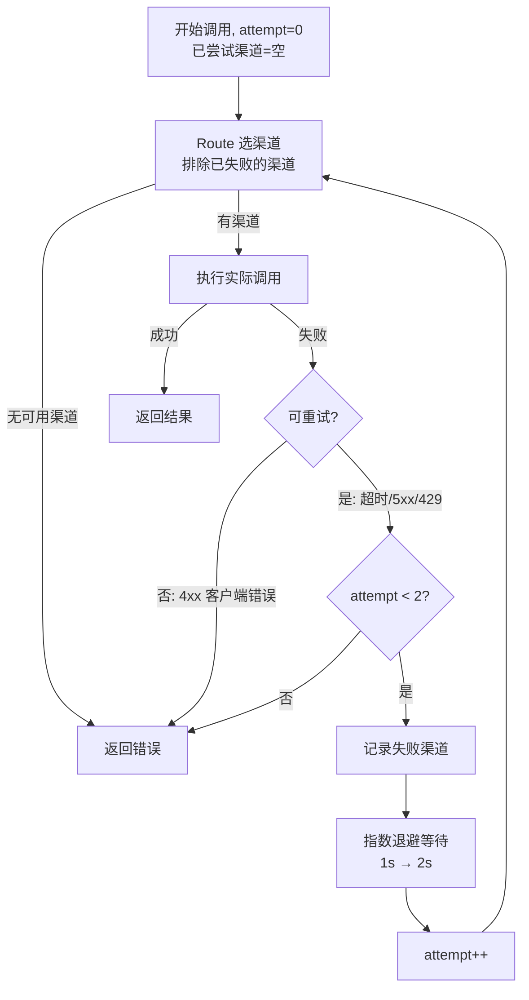
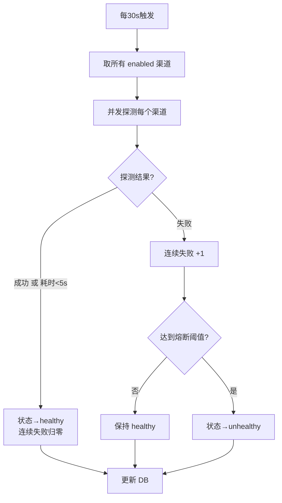
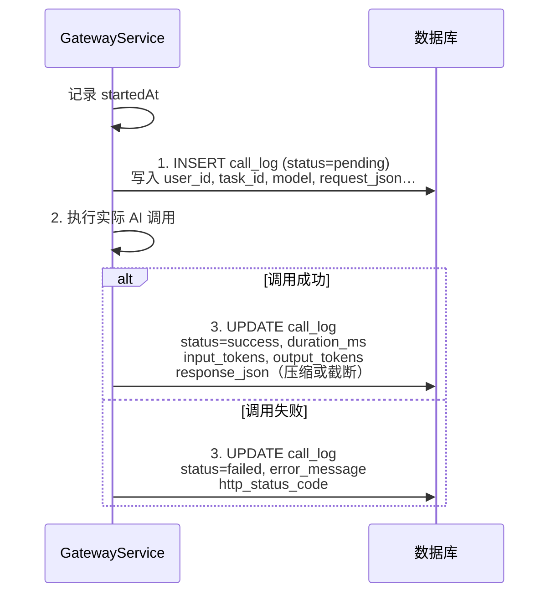
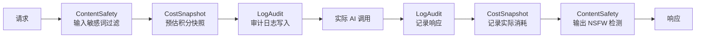

# [06] AI 网关模块设计文档

Created: 2026-07-29 | Status: Draft | Reviewed: 2026-07-29

---

## 📌 模块定位

> AI 网关模块是产品的**"模型中台"**——负责四件事：
> 1. **渠道怎么管**——多供应商的 API Key、BaseURL、支持模型、优先级统一配置
> 2. **请求往哪发**——按模型+能力路由到最佳渠道，故障自动转移、熔断保护
> 3. **并发怎么控**——信号量 + FIFO 公平队列，单渠道不超配、全局不超载
> 4. **调用可审计**——每次模型调用的全量日志（入参/出参/耗时/token/费用），可追溯可对账

一句话： **把"调哪个模型、走哪个渠道、花多少时间、用多少 token"变成可配置、可观测、可恢复的基础能力**。

---

## 🗺️ 新人 3 分钟速通

### 6 张表一句话

| 表                        | 一句话                                                                            |
|---------------------------|-----------------------------------------------------------------------------------|
| `pms_ai_channel`          | 一个渠道配置——哪个供应商、用什么 Key、最多并发几个、是否健康                      |
| `pms_ai_channel_model`    | 这个渠道支持哪些模型——每个模型的能力类型、优先级、定价系数                        |
| `pms_ai_call_log`         | 每次 API 调用的完整记录——谁调的、调了什么模型、花了多久、用了多少 token、成没成功 |
| `pms_ai_concurrency_slot` | 并发槽位——哪个 task 正在占用哪个渠道的并发位，FIFO 排队                           |
| `pms_comfy_workflow`      | ComfyUI 工作流模板——JSON 定义 + 参数映射 schema + 版本管理                        |
| `pms_comfy_workflow_run`  | ComfyUI 执行记录——哪次任务触发了哪个 workflow、prompt_id、结果、耗时              |

### 核心概念速查

| 概念                        | 含义                                                   | 类比                                 |
|-----------------------------|--------------------------------------------------------|--------------------------------------|
| **Channel（渠道）**         | 一个 API 入口——(供应商 + BaseURL + API Key) 的组合     | 一个快递网点                         |
| **InterfaceType**           | API 协议类型——OpenAI格式/Gemini格式/NewAPI视频/ComfyUI | 快递公司的运单格式                   |
| **Capability**              | 模型能力——text/image/video/audio                       | 这个网点能寄什么类型的包裹           |
| **Semaphore（信号量）**     | 并发控制——同一渠道最多同时发几个请求                   | 网点有几个窗口                       |
| **Circuit Breaker（熔断）** | 连续失败 N 次后自动停用该渠道，定时探测恢复            | 网点出问题暂时关闭，定期派人去看看   |
| **Router（路由）**          | 请求来了按模型→筛选候选渠道→按优先级+健康度选最佳      | 调度中心决定包裹走哪个网点           |
| **Adapter（适配器）**       | 把统一请求格式转成各供应商的原生格式                   | 翻译——把统一运单翻成各快递公司格式   |
| **Polling（轮询）**         | 视频生成类模型的异步模式：创建任务→定时查状态→下载结果 | 寄大件——先下单，定时查物流，到货取件 |

### 数据流一句话

```
Worker/Agent → Gateway.Invoke(model, input) → Router选渠道 → Adapter转格式
  → HTTP调供应商API → 记录CallLog → 返回统一格式
  ↓ 视频类
  create → poll(轮询到完成) → download → 记录CallLog
```

---

## 🆚 竞品对比（open-ai-canvas）

| 维度         | open-ai-canvas                                                              | x-media（我们）                        |
|--------------|-----------------------------------------------------------------------------|----------------------------------------|
| 渠道表       | `ModelChannel`：11+字段（baseURL/APIFormat/InterfaceType/Scope/ModelsJSON） | ✅ 同方案——`pms_ai_channel` 更细化     |
| 渠道模型管理 | `ChannelModel`：独立表，按模型粒度管理                                      | ✅ 同方案——`pms_ai_channel_model`      |
| 并发控制     | `SemaphoreQueue`：Weighted 信号量 + FIFO 公平队列                           | ✅ 同方案 + 数据库槽位持久化           |
| 调用日志     | `ApiCallLog`：20+字段含 taskID/tokens/pollCount                             | ✅ 同方案——`pms_ai_call_log`           |
| 熔断机制     | CircuitBreaker：3次连续失败 → zero-weight → semi-open                       | ✅ 同方案                              |
| 健康检查     | 定时探测 + semi-open 恢复                                                   | ✅ 同方案                              |
| 接口类型     | 8种：chat-completion/image/audio/video/newapi/comfyui...                    | 同方案，细化为 7 种                    |
| 视频异步     | 完整 create→poll→download 流程                                              | ✅ 同方案                              |
| API Key 管理 | `ApiKeyService` 独立 CRUD + 加密                                            | 加密存储 + Key 轮转（预留）            |
| 模型路由     | Controller + ModelSelector + OperationRouter                                | Router + Priority + Health 三位一体    |
| 流式响应     | SSE 直通                                                                    | ✅ 支持——LLM 流式透传                  |
| 内容审核     | 无                                                                          | ✅ 预留 input/output filter middleware |

---

## 1. 数据结构设计

### 1.1 pms_ai_channel — 渠道主表

```sql
create table pms_ai_channel
(
    id                         bigint primary key generated always as identity,

    -- 渠道标识
    name                       varchar(128) not null,               -- 管理用名称，如"OpenAI-官方账号"
    provider                   varchar(64)  not null,               -- 供应商：openai / stability / kling / runway / google
    scope                      varchar(16)  not null default 'system',
    -- system: 系统级渠道（所有用户共用）| user: 用户自配渠道（用户自带 Key）

    -- 连接配置
    base_url                   text         not null,               -- API 基础地址，如 https://api.openai.com/v1
    api_key_encrypted          text,                                -- 加密存储的 API Key（AES-256-GCM）
    api_format                 varchar(32)  not null default 'openai',
    -- openai: OpenAI 兼容格式 | gemini: Google Gemini 格式
    -- newapi: 国产模型的 NewAPI 格式 | custom: 自定义适配器
    interface_type             varchar(32)  not null,
    -- chat_completion: LLM 对话 | text_to_image: 文生图 | text_to_video: 文生视频
    -- image_to_video: 图生视频 | text_to_audio: TTS | comfyui: ComfyUI 工作流

    -- 并发控制
    concurrency_limit          int          not null default 3,     -- 该渠道最大并发数
    -- 实际并发由 Semaphore 控制：acquire 获取槽位 → 调用 → release 释放

    -- 路由与负载
    priority                   int          not null default 5,     -- 优先级 1-10，数字越大越优先
    weight                     int          not null default 100,   -- 权重（负载均衡用，预留）
    -- Router 规则：先按 priority 降序，同 priority 内随机选 healthy 的

    -- 健康状态（熔断器）
    health_status              varchar(16)  not null default 'unknown',
    -- unknown: 初始/未知 | healthy: 正常 | degraded: 降级（部分成功） | unhealthy: 熔断
    consecutive_failures       int          not null default 0,     -- 连续失败计数 → 达到阈值熔断
    last_health_check_at       timestamptz,                         -- 最近一次健康检查时间

    -- 熔断配置
    circuit_breaker_enabled    boolean      not null default true,
    circuit_breaker_threshold  int          not null default 3,     -- 连续失败 > 此值 → 熔断
    circuit_breaker_recover_ms int          not null default 30000, -- 30s 后半开探测

    -- 超时控制
    request_timeout_ms         int          not null default 60000, -- 单次请求超时（ms）
    -- 不同类型的默认超时：text=30s / image=60s / video=300s / comfyui=600s

    -- 状态
    status                     varchar(32)  not null default 'enabled',
    -- enabled: 正常可用 | disabled: 管理员停用 | deleted: 软删除
    deleted_at                 timestamptz,

    -- 元数据
    metadata                   jsonb,                               -- 扩展配置（如供应商特有参数）
    created_at                 timestamptz  not null default now(),
    updated_at                 timestamptz  not null default now()
);

create index idx_ai_channel_provider on pms_ai_channel (provider, status);
create index idx_ai_channel_interface on pms_ai_channel (interface_type, status) where status = 'enabled';
create index idx_ai_channel_health on pms_ai_channel (health_status) where status = 'enabled';
```

**`metadata` JSONB 示例**（供应商特有配置）：

```json
{
  "rate_limit_rpm": 60,
  "max_tokens_default": 4096,
  "supported_resolutions": [
    "720p",
    "1080p"
  ],
  "region": "us-east",
  "webhook_secret": "whsec_xxx"
}
```

### 1.2 pms_ai_channel_model — 渠道模型映射

```sql
create table pms_ai_channel_model
(
    id                bigint primary key generated always as identity,

    channel_id        bigint       not null references pms_ai_channel (id) on delete cascade,

    -- 模型标识
    model_key         varchar(128) not null, -- API 调用时用的模型名，如 "gpt-4o" "sdxl-turbo"
    display_name      varchar(255),          -- 前端展示名，如 "GPT-4o (OpenAI官方)"

    -- 模型能力
    capability        varchar(32)  not null, -- text / image / video / audio / embedding
    protocol          varchar(32)  not null, -- 同 channel 的 interface_type

    -- 优先级——同一模型在多个渠道中的选择优先级（数字越大越优先）
    priority          int          not null default 5,

    -- 状态
    enabled           boolean      not null default true,

    -- 模型参数约束
    param_constraints jsonb,
    -- {"max_tokens": 4096, "supported_sizes": ["1024x1024","1792x1024"], "max_duration_seconds": 60}

    created_at        timestamptz  not null default now(),
    updated_at        timestamptz  not null default now(),

    unique (channel_id, model_key)
);

create index idx_ai_channel_model_lookup on pms_ai_channel_model (capability, model_key, enabled) where enabled = true;
```

> **路由流程**：`POST /api/v1/gateway/invoke {model="gpt-4o", capability="text"}` →
> `SELECT cm.*, ch.* FROM pms_ai_channel_model cm JOIN pms_ai_channel ch ON cm.channel_id=ch.id
>  WHERE cm.model_key='gpt-4o' AND cm.enabled AND ch.status='enabled' AND ch.health_status != 'unhealthy'
>  ORDER BY cm.priority DESC, ch.priority DESC LIMIT 1`

### 1.3 pms_ai_call_log — 调用日志（审计核心）

```sql
create table pms_ai_call_log
(
    id                     bigint primary key generated always as identity,

    -- 归属追踪
    user_id                bigint       not null references pms_user (id),
    task_id                bigint references pms_task (id),
    task_step_id           bigint references pms_task_step (id),
    billing_order_id       bigint references pms_billing_order (id),

    -- 渠道与模型
    channel_id             bigint       not null references pms_ai_channel (id),
    model                  varchar(128) not null,
    capability             varchar(32)  not null, -- text / image / video / audio
    interface_type         varchar(32)  not null,

    -- 请求信息
    request_json           jsonb,                 -- 发给供应商的原始请求
    request_hash           varchar(64),           -- SHA256(request_json) 用于去重/缓存
    idempotency_key        varchar(128),          -- 幂等键（可选）

    -- 响应信息
    response_json          jsonb,                 -- 供应商原始响应
    status                 varchar(32)  not null, -- success / failed / timeout / rate_limited
    http_status_code       int,
    provider_status        varchar(128),          -- 供应商返回的 status/error code
    error_message          text,

    -- 用量统计
    input_tokens           int,
    output_tokens          int,
    cached_tokens          int,
    media_count            int,                   -- 生成了几张图/几个视频
    video_duration_seconds int,                   -- 视频总秒数

    -- 视频异步相关
    provider_task_id       varchar(256),          -- 供应商返回的异步任务 ID（用于轮询）
    poll_count             int          not null default 0,
    poll_first_duration_ms int,                   -- create 接口耗时
    poll_total_duration_ms int,                   -- create + 所有 poll + download 总耗时

    -- 耗时
    duration_ms            int,                   -- API 调用总耗时
    request_started_at     timestamptz,
    request_finished_at    timestamptz,

    -- 重试
    attempt                int          not null default 1,
    retry_reason           varchar(256),

    -- 成本快照（创建时从定价规则快照，防止事后改价）
    estimated_cost_credits int,

    created_at             timestamptz  not null default now()
);

create index idx_ai_call_log_task on pms_ai_call_log (task_id);
create index idx_ai_call_log_user on pms_ai_call_log (user_id, created_at desc);
create index idx_ai_call_log_channel on pms_ai_call_log (channel_id, created_at desc);
create index idx_ai_call_log_status on pms_ai_call_log (status) where status in ('failed', 'timeout');
create index idx_ai_call_log_provider_task on pms_ai_call_log (provider_task_id) where provider_task_id is not null;
```

### 1.4 pms_ai_concurrency_slot — 并发槽位

```sql
create table pms_ai_concurrency_slot
(
    id             bigint primary key generated always as identity,

    -- 占用的渠道
    channel_id     bigint      not null references pms_ai_channel (id),

    -- 谁占用的
    task_id        bigint      not null references pms_task (id),
    task_step_id   bigint references pms_task_step (id),

    -- 槽位状态
    status         varchar(32) not null default 'acquired',
    -- acquired: 正在执行 | released: 已释放 | expired: 超时未释放（异常）

    -- 超时保护——防止槽位泄漏
    acquired_at    timestamptz not null default now(),
    expires_at     timestamptz not null, -- acquired_at + max(slot_timeout, request_timeout)

    -- 释放信息
    released_at    timestamptz,
    release_reason varchar(64),          -- completed / failed / timeout / cancelled

    created_at     timestamptz not null default now()
);

create index idx_ai_concurrency_channel on pms_ai_concurrency_slot (channel_id, status) where status = 'acquired';
create index idx_ai_concurrency_expires on pms_ai_concurrency_slot (expires_at) where status = 'acquired';
```

> **槽位生命**：Worker 调用 Gateway → Gateway 尝试 acquire (channel) → 成功获槽位 → 执行 API 调用 → release 槽位。
> **泄漏保护**：定时任务扫描 `expires_at < now()` 的 acquired 槽位 → 标记 expired → 释放计数。

### 1.5 pms_comfy_workflow — ComfyUI 工作流

```sql
create table pms_comfy_workflow
(
    id                    bigint primary key generated always as identity,

    -- 基本信息
    name                  varchar(255) not null,
    description           text,
    spec_type             varchar(64)  not null,           -- 对应 pms_agent_spec.spec_type，如 "image_to_video"
    strategy_id           bigint references pms_agent_strategy (id),

    -- 工作流定义
    workflow_json         jsonb        not null,           -- ComfyUI 原生 workflow JSON
    input_schema          jsonb        not null,           -- 输入参数 Schema
    -- 示例：
    -- {
    --   "type": "object",
    --   "properties": {
    --     "prompt": {"type": "string", "node_id": 3, "field": "inputs.text"},
    --     "reference_image": {"type": "string", "node_id": 6, "field": "inputs.image"},
    --     "steps": {"type": "integer", "node_id": 10, "field": "inputs.steps", "default": 30}
    --   },
    --   "required": ["prompt"]
    -- }
    --
    -- input_schema 的作用：告诉 Gateway 如何把统一请求的 input JSON 映射到 workflow_json 的各个节点

    output_mapping        jsonb,                           -- 输出映射：workflow 输出节点 → 统一响应字段
    -- {"node_id": 27, "field": "images", "output_key": "generated_images"}

    -- 执行参数
    timeout_seconds       int          not null default 600,
    poll_interval_seconds int          not null default 5, -- 轮询间隔

    -- 版本
    version               int          not null default 1,
    status                varchar(32)  not null default 'active',
    -- active: 正常 | draft: 编辑中 | deprecated: 已废弃

    created_by            bigint references pms_user (id),
    created_at            timestamptz  not null default now(),
    updated_at            timestamptz  not null default now()
);

create index idx_comfy_workflow_spec on pms_comfy_workflow (spec_type, status) where status = 'active';
```

### 1.6 pms_comfy_workflow_run — ComfyUI 执行记录

```sql
create table pms_comfy_workflow_run
(
    id                bigint primary key generated always as identity,

    workflow_id       bigint      not null references pms_comfy_workflow (id),
    task_id           bigint      not null references pms_task (id),
    task_step_id      bigint references pms_task_step (id),
    channel_id        bigint references pms_ai_channel (id),

    -- ComfyUI 服务信息
    comfyui_base_url  text        not null, -- ComfyUI 服务地址

    -- 执行追踪
    prompt_id         varchar(128),         -- ComfyUI 返回的 prompt_id
    rendered_workflow jsonb,                -- 参数填充后的实际 workflow（调试用）

    -- 状态
    status            varchar(32) not null default 'queued',
    -- queued: 已提交 | running: 执行中 | completed: 成功 | failed: 失败 | cancelled: 取消
    comfyui_status    varchar(128),         -- ComfyUI 原生状态

    -- 结果
    output            jsonb,                -- 输出结果（映射后的统一格式）
    output_oss_keys   jsonb,                -- 生成文件的 OSS keys ["key1","key2"]

    -- 耗时
    queued_at         timestamptz,
    started_at        timestamptz,
    completed_at      timestamptz,
    duration_ms       int,
    poll_count        int         not null default 0,

    -- 错误
    error_message     text,

    created_at        timestamptz not null default now()
);

create index idx_comfy_run_task on pms_comfy_workflow_run (task_id);
create index idx_comfy_run_workflow on pms_comfy_workflow_run (workflow_id, created_at desc);
```

---

## 2. 总体架构

```
┌─────────────────────────────────────────────────────────────────────────┐
│                          调用方                                          │
│  ┌──────────┐  ┌──────────┐  ┌──────────┐  ┌──────────────┐            │
│  │ Worker   │  │ Agent    │  │ Admin    │  │ 前端(SSE)    │            │
│  │(执行步骤)│  │(LLM调用) │  │(配置管理)│  │(流式生成)    │            │
│  └────┬─────┘  └────┬─────┘  └────┬─────┘  └──────┬───────┘            │
└───────┼──────────────┼────────────┼───────────────┼────────────────────┘
        │              │            │               │
        ▼              ▼            ▼               ▼
┌─────────────────────────────────────────────────────────────────────────┐
│                         AI Gateway Service                               │
│                                                                         │
│  ┌──────────────────────────────────────────────────────────────────┐  │
│  │                        GatewayHandler                             │  │
│  │  POST /invoke  │  POST /invoke/async  │  GET /invoke/{id}/status  │  │
│  │  POST /invoke/stream(SSE)            │  POST /comfy/run           │  │
│  └──────────────────────────────┬───────────────────────────────────┘  │
│                                 │                                       │
│  ┌──────────────────────────────▼───────────────────────────────────┐  │
│  │                         Router                                    │  │
│  │  ┌─────────────┐  ┌────────────────┐  ┌──────────────────────┐   │  │
│  │  │ ModelRouter  │  │HealthChecker   │  │CircuitBreaker        │   │  │
│  │  │ 选渠道→按优先 │  │定时探测+状态更新│  │连续失败熔断+semi-open│   │  │
│  │  └──────┬───────┘  └───────┬────────┘  └──────────┬───────────┘   │  │
│  └─────────┼──────────────────┼───────────────────────┼──────────────┘  │
│            │                  │                       │                  │
│  ┌─────────▼──────────────────▼───────────────────────▼──────────────┐  │
│  │                     Adapter Layer（适配器层）                       │  │
│  │  ┌──────────┐ ┌──────────┐ ┌──────────┐ ┌──────────┐ ┌────────┐  │  │
│  │  │OpenAI    │ │Gemini    │ │NewAPI    │ │Stability │ │ComfyUI │  │  │
│  │  │Adapter   │ │Adapter   │ │Adapter   │ │Adapter   │ │Adapter │  │  │
│  │  └────┬─────┘ └────┬─────┘ └────┬─────┘ └────┬─────┘ └───┬────┘  │  │
│  └───────┼────────────┼────────────┼────────────┼───────────┼───────┘  │
│          │            │            │            │           │          │
│  ┌───────▼────────────▼────────────▼────────────▼───────────▼───────┐  │
│  │                    Semaphore Pool（信号量池）                      │  │
│  │  每渠道独立信号量 + db slot 持久化 + FIFO 公平队列                  │  │
│  └──────────────────────────────────────────────────────────────────┘  │
│                                                                         │
│  ┌──────────────────────────────────────────────────────────────────┐  │
│  │                    Middleware Chain                                │  │
│  │  内容审核 → 输入消毒 → 调用 → 输出过滤 → 日志审计 → 成本快照        │  │
│  └──────────────────────────────────────────────────────────────────┘  │
└─────────────────────────────────────────────────────────────────────────┘
          │
          ▼
┌─────────────────────────────────────────────────────────────────────────┐
│                       外部 AI 供应商                                     │
│  OpenAI │ Google │ Stability │ Kling │ Runway │ ComfyUI Server │ ...    │
└─────────────────────────────────────────────────────────────────────────┘
```

---

## 3. 核心流程

### 3.1 同步调用（LLM / 文生图）



### 3.2 视频异步调用（create → poll → download）



> **为什么不是 Gateway 内部自动轮询？**
> Worker 轮询模式让任务调度模块掌握轮询节奏——Worker 可以在轮询间隙续期租约、处理取消信号、更新进度。Gateway 内部自动轮询会导致
> Worker 被长时间阻塞，无法取消。

### 3.3 熔断与恢复

```
熔断三态：

  ┌──────────────────────────────────────────────────────────┐
  │                    CLOSED（正常）                          │
  │  consecutive_failures = 0                                │
  │  所有请求正常通过                                         │
  └────────────┬─────────────────────────────────┬───────────┘
               │ 请求成功                          │ 连续失败 ≥ threshold(3)
               │ 计数器归零                        ▼
               │                         ┌──────────────────┐
               │                         │   OPEN（熔断）    │
               │                         │ 拒绝所有请求      │
               │                         │ 直接返回降级错误  │
               │                         └────────┬─────────┘
               │                                  │ 等待 recover_ms(30s)
               │                                  ▼
               │                         ┌──────────────────┐
               │                         │ HALF-OPEN（探测） │
               │                         │ 允许 1 个探测请求 │
               │                         └──┬───────────┬───┘
               │                   探测成功  │           │ 探测失败
               │    consecutive_failures=0  │           │ 重新熔断
               └────────────────────────────┘           │
                                          ┌─────────────┘
                                          ▼
                                   回到 OPEN
```

**实现伪码**：



**状态变更**：

| 事件 | 动作 |
|------|------|
| 调用成功 | `MarkSuccess`: 状态→healthy, 连续失败归零 |
| 调用失败 | `MarkFailure`: 连续失败+1，达到阈值→unhealthy |

### 3.4 ComfyUI 工作流执行



### 3.5 流式响应（SSE 透传——LLM 场景）

```
POST /api/v1/gateway/invoke/stream
{
  "model": "gpt-4o",
  "capability": "text",
  "input": {
    "messages": [{"role":"user","content":"介绍一下AI视频生成"}],
    "stream": true
  }
}

Gateway:
  1. Route 选渠道（同同步流程）
  2. 向供应商发起 streaming HTTP 请求
  3. 将供应商的 SSE 事件逐个透传给调用方（Agent/前端）
  4. 流结束后，汇总 tokens 写入 pms_ai_call_log

SSE 事件格式（透传）：
  event: delta
  data: {"content": "AI视频"}

  event: delta
  data: {"content": "生成是"}

  event: done
  data: {"usage": {"prompt_tokens": 20, "completion_tokens": 100}}
```

---

## 4. 接口清单

### 4.1 模型调用（供 Worker / Agent 使用）

| 方法 | 路径                                          | 说明                         |
|------|-----------------------------------------------|------------------------------|
| POST | `/api/v1/gateway/invoke`                      | 同步模型调用（LLM/图片/TTS） |
| POST | `/api/v1/gateway/invoke/async`                | 异步模型调用（视频生成）     |
| GET  | `/api/v1/gateway/invoke/{call_log_id}/status` | 查询异步任务状态             |
| POST | `/api/v1/gateway/invoke/stream`               | 流式调用（SSE 透传）         |

**POST /api/v1/gateway/invoke 请求体**：

```json
{
  "task_id": 42,
  "task_step_id": 201,
  "step_key": "text_to_image",
  "model": "sdxl-turbo",
  "capability": "image",
  "input": {
    "prompt": "一只猫在草地上奔跑，电影质感，4K",
    "negative_prompt": "模糊，变形，低质量",
    "width": 1920,
    "height": 1080
  },
  "timeout_ms": 60000,
  "idempotency_key": "task:42:step:201"
}
```

**响应体**：

```json
{
  "call_log_id": 5001,
  "status": "success",
  "model": "sdxl-turbo",
  "output": {
    "oss_key": "generated/2026/07/29/task_42_step_201.png",
    "content_type": "image/png",
    "width": 1920,
    "height": 1080,
    "file_size": 2456789
  },
  "usage": {
    "media_count": 1
  },
  "duration_ms": 12340
}
```

**POST /api/v1/gateway/invoke/async 请求体**（视频生成）：

```json
{
  "task_id": 42,
  "task_step_id": 203,
  "step_key": "text_to_video",
  "model": "kling-v1.5",
  "capability": "video",
  "input": {
    "prompt": "一只猫在草地上奔跑，电影质感，4K",
    "duration_seconds": 5,
    "aspect_ratio": "16:9"
  },
  "timeout_ms": 300000
}
```

**异步响应体**：

```json
{
  "call_log_id": 5002,
  "status": "processing",
  "provider_task_id": "vid_kling_abc123",
  "estimated_duration_seconds": 120
}
```

### 4.2 ComfyUI 工作流

| 方法 | 路径                                        | 说明                |
|------|---------------------------------------------|---------------------|
| POST | `/api/v1/gateway/comfy/run`                 | 执行 ComfyUI 工作流 |
| GET  | `/api/v1/gateway/comfy/run/{run_id}/status` | 查询工作流执行状态  |
| POST | `/api/v1/gateway/comfy/run/{run_id}/cancel` | 取消执行            |

### 4.3 渠道管理（管理后台）

| 方法   | 路径                                                | 说明                   |
|--------|-----------------------------------------------------|------------------------|
| GET    | `/api/v1/admin/gateway/channels`                    | 渠道列表（含健康状态） |
| POST   | `/api/v1/admin/gateway/channels`                    | 创建渠道               |
| PUT    | `/api/v1/admin/gateway/channels/{id}`               | 编辑渠道               |
| DELETE | `/api/v1/admin/gateway/channels/{id}`               | 删除渠道（软删除）     |
| POST   | `/api/v1/admin/gateway/channels/{id}/health-check`  | 手动触发健康检查       |
| POST   | `/api/v1/admin/gateway/channels/{id}/reset-circuit` | 手动重置熔断器         |

### 4.4 渠道模型管理（管理后台）

| 方法   | 路径                                               | 说明             |
|--------|----------------------------------------------------|------------------|
| GET    | `/api/v1/admin/gateway/channels/{id}/models`       | 某渠道的模型列表 |
| POST   | `/api/v1/admin/gateway/channels/{id}/models`       | 为渠道添加模型   |
| PUT    | `/api/v1/admin/gateway/channels/{id}/models/{mid}` | 编辑模型配置     |
| DELETE | `/api/v1/admin/gateway/channels/{id}/models/{mid}` | 移除模型         |

### 4.5 ComfyUI 工作流管理（管理后台）

| 方法 | 路径                                              | 说明                   |
|------|---------------------------------------------------|------------------------|
| GET  | `/api/v1/admin/gateway/comfy/workflows`           | 工作流列表             |
| POST | `/api/v1/admin/gateway/comfy/workflows`           | 创建工作流             |
| PUT  | `/api/v1/admin/gateway/comfy/workflows/{id}`      | 更新工作流             |
| POST | `/api/v1/admin/gateway/comfy/workflows/{id}/test` | 测试工作流（空跑验证） |
| GET  | `/api/v1/admin/gateway/comfy/runs`                | 工作流执行历史         |

### 4.6 调用日志（管理后台 + 用户自查）

| 方法 | 路径                              | 说明                                     |
|------|-----------------------------------|------------------------------------------|
| GET  | `/api/v1/admin/gateway/call-logs` | 全局调用日志（支持按状态/渠道/模型筛选） |
| GET  | `/api/v1/gateway/call-logs`       | 我的调用日志                             |
| GET  | `/api/v1/gateway/call-logs/{id}`  | 调用详情（含完整 request/response）      |

### 4.7 健康监控（运维）

| 方法 | 路径                                | 说明                                       |
|------|-------------------------------------|--------------------------------------------|
| GET  | `/api/v1/admin/gateway/health`      | 全局健康概览——各渠道状态、失败率、并发水位 |
| GET  | `/api/v1/admin/gateway/concurrency` | 当前并发槽位占用详情                       |

> 共 **22 个接口**：4 个调用端 + 3 个 ComfyUI + 6 个渠道管理 + 4 个模型管理 + 5 个工作流管理 + 3 个日志 + 2 个运维。

---

## 5. 依赖模块与接口协议

### 5.1 依赖关系

| 模块           | 调用方式       | 用途                                              |
|----------------|----------------|---------------------------------------------------|
| 任务调度模块   | HTTP → Gateway | Worker 执行 Step 时调用模型                       |
| Agent 策略模块 | HTTP → Gateway | SpecExtractor / Validator / VisionParser 调用 LLM |
| 存储模块       | HTTP → Storage | AI 生成结果上传到 OSS                             |
| 用户模块       | 外键引用       | `pms_ai_call_log.user_id` 归属                    |
| 计费与支付模块   | 外键引用       | `pms_ai_call_log.billing_order_id` 关联账单       |
| 外部           | HTTPS          | 各 AI 供应商 API                                  |

### 5.2 给任务调度模块的约定

Worker 调用 Gateway 的请求格式（已在任务模块文档中约定）：

```json
POST /api/v1/gateway/invoke
{
  "task_id": 42,
  "task_step_id": 201,
  "step_key": "text_to_image",
  "model": "sdxl-turbo",
  "capability": "image",
  "input": {
    "prompt": "...",
    "negative_prompt": "...",
    "width": 1920,
    "height": 1080
  },
  "timeout_ms": 60000
}
```

Gateway 返回格式：

```json
{
  "call_log_id": 5001,
  "status": "success",
  "output": {
    "oss_key": "generated/2026/07/29/task_42_step_201.png",
    "content_type": "image/png",
    "width": 1920,
    "height": 1080,
    "file_size": 2456789
  },
  "usage": {
    "media_count": 1
  },
  "duration_ms": 12340
}
```

> 任务模块应使用响应中的 `call_log_id` 写入 `pms_task_step` 作为溯源。

### 5.3 给 Agent 策略模块的约定

Agent 调用 Gateway 做 LLM 推理（Spec 提取、校验、视觉理解）：

```json
POST /api/v1/gateway/invoke
{
  "capability": "text",
  "model": "gpt-4o",
  "input": {
    "messages": [
      {
        "role": "system",
        "content": "你是视频创作参数提取助手..."
      },
      {
        "role": "user",
        "content": "用户输入：生成一只猫在草地上奔跑的5秒视频"
      }
    ],
    "response_format": {
      "type": "json_object"
    },
    "max_tokens": 2000
  },
  "timeout_ms": 30000
}
```

视觉模型调用：

```json
POST /api/v1/gateway/invoke
{
  "capability": "text",
  "model": "gpt-4o",
  "input": {
    "messages": [
      {
        "role": "user",
        "content": [
          {
            "type": "text",
            "text": "分析这张图片的内容和风格"
          },
          {
            "type": "image_url",
            "image_url": {
              "url": "https://cdn.x-media.com/assets/xxx.png"
            }
          }
        ]
      }
    ],
    "max_tokens": 500
  },
  "timeout_ms": 30000
}
```

### 5.4 给存储模块的依赖

Gateway 将 AI 生成结果写入 OSS 时调用存储模块的上传接口：

```json
POST /api/v1/storage/upload
{
  "user_id": 5,
  "content_type": "image/png",
  "source": "ai_generated"
}
→ 获得 upload_url → Gateway 直接将 AI 返回的文件内容 PUT 到 OSS
→ 获得 oss_key → 返回给 Worker
```

---

## 6. 实现要点

### 6.1 并发槽位管理

每个渠道都有并发上限，Router 选渠道前先尝试获取槽位，获取不到则降级到下一渠道。

**数据结构**：

| 结构 | 字段 | 说明 |
|------|------|------|
| SemaphorePool | `channels map[channelID] → ChannelSemaphore` | 全局信号量池，按渠道隔离 |
| ChannelSemaphore | `ch chan`（缓冲 channel） | 用有缓冲 channel 实现信号量，容量=并发上限 |
|  | `acquired int32`（原子计数） | 当前已获取槽位数，原子操作无锁读取 |
| pms_ai_concurrency_slot | DB 记录 | 持久化槽位，含 `expires_at` 防泄漏 |

**获取流程**：



### 6.2 适配器抽象

每个 AI 供应商有自己的 API 格式，适配器负责**统一格式 ↔ 供应商原生格式**的双向转换。

**适配器接口**：

| 方法 | 职责 |
|------|------|
| `BuildRequest` | 将统一 GatewayRequest → 供应商原生 HTTP Request |
| `ParseResponse` | 将供应商原生响应 → 统一 GatewayResponse |
| `ParseStreamChunk` | 将流式响应的单个 chunk → 统一 StreamChunk |

**适配器注册表**（按 `api_format` 路由）：

| api_format | 适配器 | 典型供应商 |
|------------|--------|-----------|
| `openai` | OpenAIAdapter | GPT-4o, DALL-E, Sora |
| `gemini` | GeminiAdapter | Gemini 2.0, Imagen |
| `newapi` | NewAPIAdapter | Kling, 可图, 即梦 等国产 |
| `stability` | StabilityAdapter | Stable Diffusion, SD3 |
| `comfyui` | ComfyUIAdapter | 自建 ComfyUI 工作流 |

**NewAPI 适配器——视频异步请求/响应示例**：



> 视频生成是异步的——API 返回 processing 状态后，调用方通过 `providerTaskID` 轮询结果。

### 6.3 重试与退避

调用失败时自动切换到备用渠道重试，使用**指数退避**避免雪崩。



**重试判断规则**：

| 错误类型 | 是否重试 | 原因 |
|----------|----------|------|
| 上下文超时 `DeadlineExceeded` | 是 | 可能是网络波动 |
| HTTP 5xx | 是 | 服务端临时故障 |
| HTTP 429 | 是 | 限流，降级到其他渠道 |
| HTTP 4xx | 否 | 客户端错误，重试无意义 |
| 连接错误（resp 为 nil） | 是 | 重试下一个渠道 |

**退避策略**：基础延迟 1s，每次重试延迟 ×2（1s → 2s），最多重试 2 次。

### 6.4 健康检查定时任务

每 30 秒对所有 enabled 渠道做一次轻量健康探测，用于驱动熔断恢复和渠道下架。



**探测方式（按渠道类型）**：

| 渠道类型 | 探测端点 | 说明 |
|----------|----------|------|
| OpenAI | `GET /v1/models` | 轻量，无副作用 |
| NewAPI | `POST /v1/models/list` | 国产 API 通用探测 |
| ComfyUI | `GET /system_stats` | 自建服务状态 |

### 6.5 调用日志写入

每次 AI 调用都需要完整记录请求/响应、耗时、token 消耗，用于计费结算和问题排查。



**日志字段设计**：

| 字段 | 说明 | 处理策略 |
|------|------|----------|
| request_json | 完整请求体 | 大文件（图片 base64）压缩存储或只保留前 4KB |
| response_json | 完整响应体 | 同上 |
| input_tokens / output_tokens | Token 消耗 | 用于计费结算 |
| duration_ms | 耗时 | 性能分析 |
| media_count | 生成媒体数量 | 图片/视频计数 |

### 6.6 输入/输出过滤中间件（预留）

中间件以**洋葱模型**嵌套，请求先经过最外层中间件，逐层向内；响应从最内层返回，逐层向外。

**中间件链执行顺序**：



**各中间件职责**：

| 中间件 | 输入阶段 | 输出阶段 |
|--------|----------|----------|
| ContentSafety | 检测敏感词，命中则拒绝 | NSFW 检测，命中则拒绝 |
| CostSnapshot | 写入预估积分 `estimated_cost_credits` | — |
| LogAudit | 写入 `pms_ai_call_log`（status=pending） | 更新调用结果（success/failed） |

---

## 7. 新人开发指南

### 5 位后端分工

| 开发者 | 工作包               | 涉及内容                                                               | 依赖          |
|--------|----------------------|------------------------------------------------------------------------|---------------|
| **A**  | 渠道 + 模型管理      | `pms_ai_channel` + `pms_ai_channel_model` CRUD + Admin API（10个接口） | —             |
| **B**  | Router + 熔断 + 并发 | Route 算法 + CircuitBreaker + SemaphorePool + HealthCheck 定时任务     | A（渠道数据） |
| **C**  | Adapter 层 + Invoke  | OpenAI/Gemini/NewAPI/Stability 适配器 + Invoke 核心流程 + 重试 + 日志  | A, B          |
| **D**  | ComfyUI + 视频异步   | Workflow 管理 + 参数填充 + 执行轮询 + 视频 create/poll/download        | A, B, C       |
| **E**  | 流式 + 监控 + 运维   | SSE 透传 + 调用日志查询 + 健康面板 + 内容审核 Middleware               | A, B, C       |

### 开发顺序

1. **先做渠道 + Router**（A + B）——渠道数据有了，路由才有基础
2. **再做 Adapter + Invoke**（C）——核心调用通路，LLM/图片优先
3. **然后视频异步**（D）——视频生成是差异化能力
4. **最后 ComfyUI + 流式**（D + E）——高阶能力

### 实战踩坑点

| 踩坑点                        | 说明                                                     | 建议                                                     |
|-------------------------------|----------------------------------------------------------|----------------------------------------------------------|
| **槽位泄漏**                  | Worker 崩溃导致信号量槽位永不被释放                      | 每个 slot 设 `expires_at`，定时任务扫描释放              |
| **熔断误判**                  | 用户传了非法参数 → 400 → 计数为失败 → 熔断整个渠道       | 只对 5xx/超时/连接错误计数，4xx 不触发熔断               |
| **适配器不兼容**              | 不同供应商响应格式差异大，解析出错                       | 每个适配器必有单元测试 + mock 供应商响应 fixture         |
| **视频轮询死循环**            | 供应商一直返回 processing，Worker 无限轮询               | 设 max_poll_count 或 max_poll_duration，超时标记 failed  |
| **SSE 连接泄漏**              | 流式调用中调用方断开但未取消上游请求                     | ctx.Done() 监听取消信号，同步 cancel 上游 HTTP 请求      |
| **API Key 明文泄漏**          | 日志中意外输出 API Key                                   | 适配器层做敏感字段脱敏——`Authorization: Bearer sk-****`  |
| **渠道并发配置不当**          | 管理员把并发设成 100 → 打爆供应商限流                    | 管理后台校验 max_concurrency ≤ 供应商 RPM 配额           |
| **调用日志表膨胀**            | `request_json` 和 `response_json` 很大（图片 base64 等） | 大字段压缩存储（gzip）或只存前 4KB + 完整日志写入 OSS    |
| **时区不一致**                | 视频轮询中 `started_at`/`finished_at` 比较出错           | 统一使用 UTC 存储，前端展示时转换                        |
| **输入参数中的 OSS URL 失效** | 签名 URL 过期后 Adapter 拼到请求里，供应商 403           | Adapter 处理时生成新的临时下载 URL 或直接用 OSS 内网地址 |

---

## 8. 跨模块影响清单

| 文档                | 需要改的地方                                               | 优先级 |
|---------------------|------------------------------------------------------------|--------|
| `[03]Agent策略模块` | Agent 调用 LLM 的格式要遵循 Gateway 统一协议               | P1     |
| `[04]任务调度模块`  | Worker 调用 Gateway 时需传 `task_id` + `task_step_id`      | P0     |
| `[04]任务调度模块`  | `model_calls` 的 `channel_id` 需关联到 task/step（已修正） | P0     |
| `[05]计费与支付模块`  | `pms_billing_order` 需关联 `pms_ai_call_log` 的 id         | P1     |
| `[05]计费与支付模块`  | 计费结算可基于 `pms_ai_call_log` 的实际用量                | P1     |
| `[07]存储模块`      | Gateway 需要调用存储模块上传 AI 生成的文件到 OSS           | P0     |
| `[07]存储模块`      | 外键 `references users (id)` → `references pms_user (id)`  | P0     |
