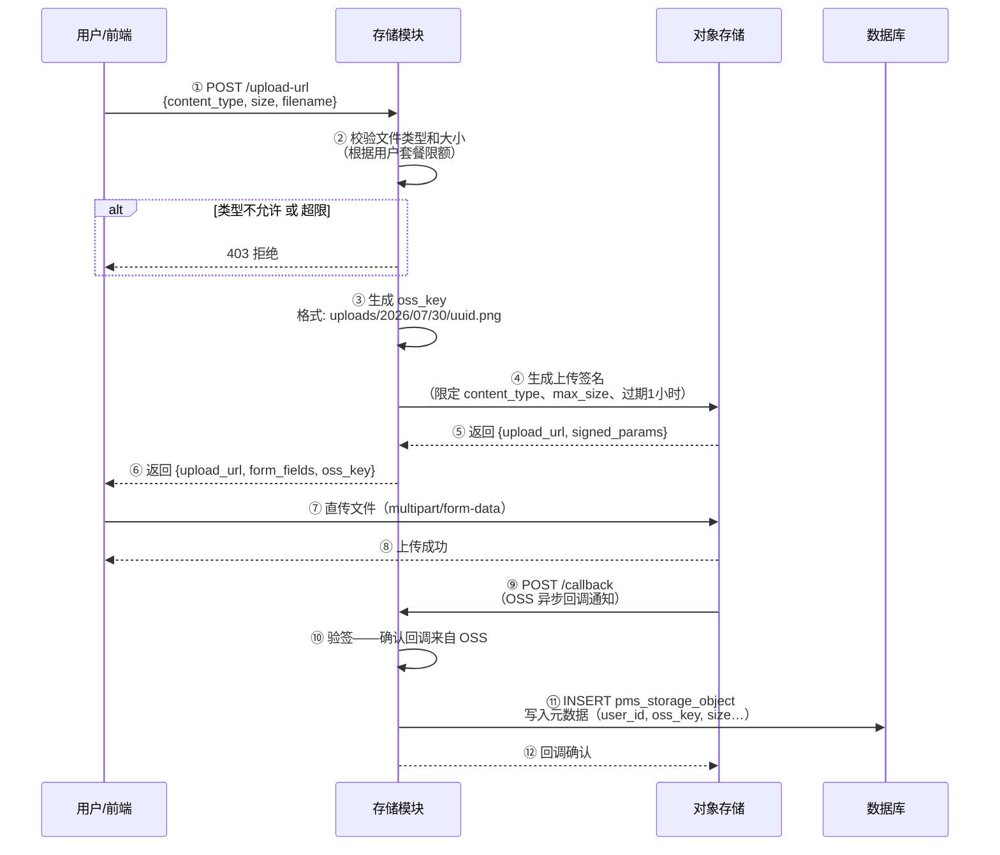
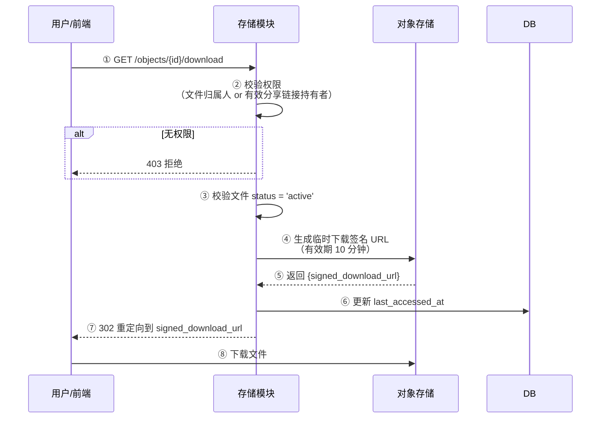
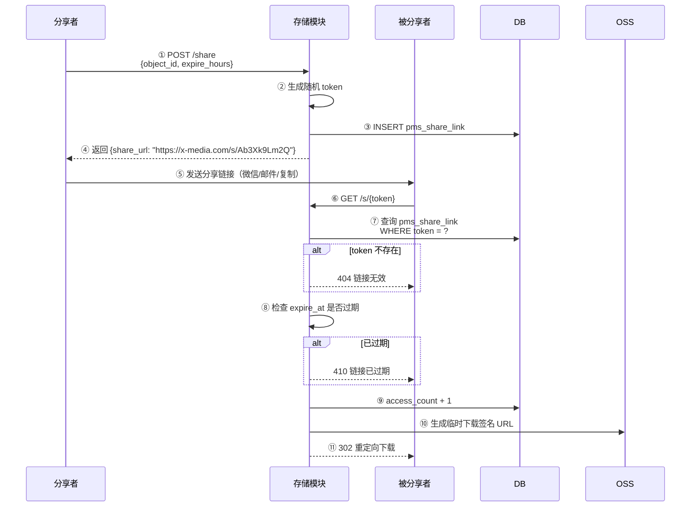
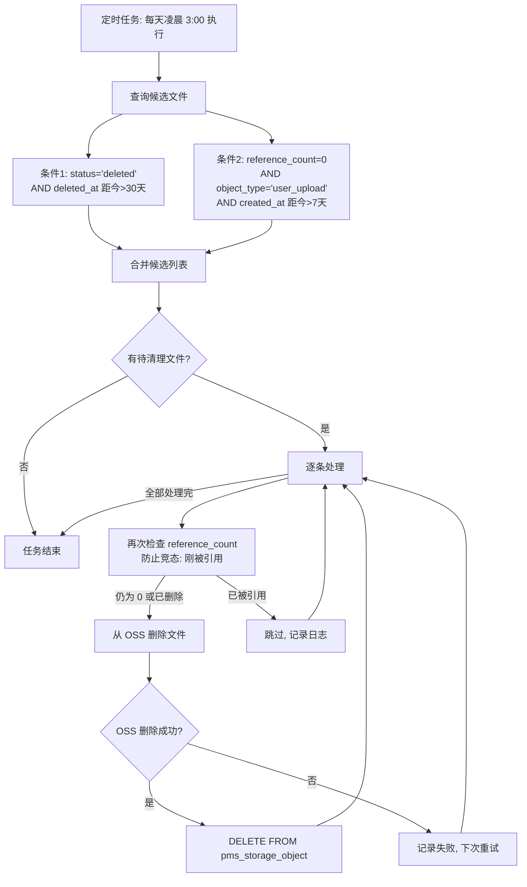
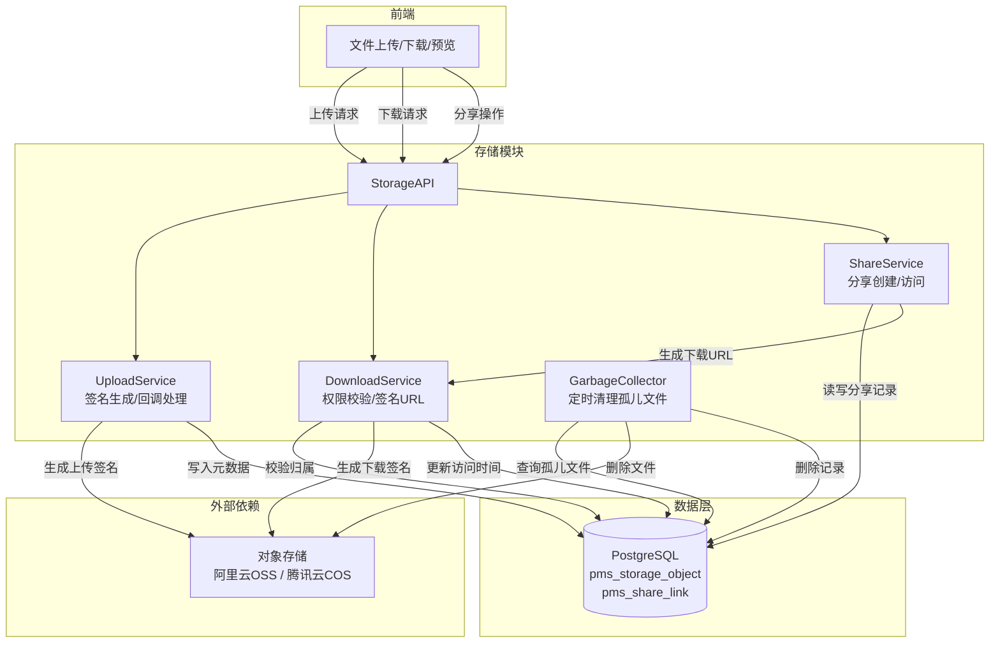
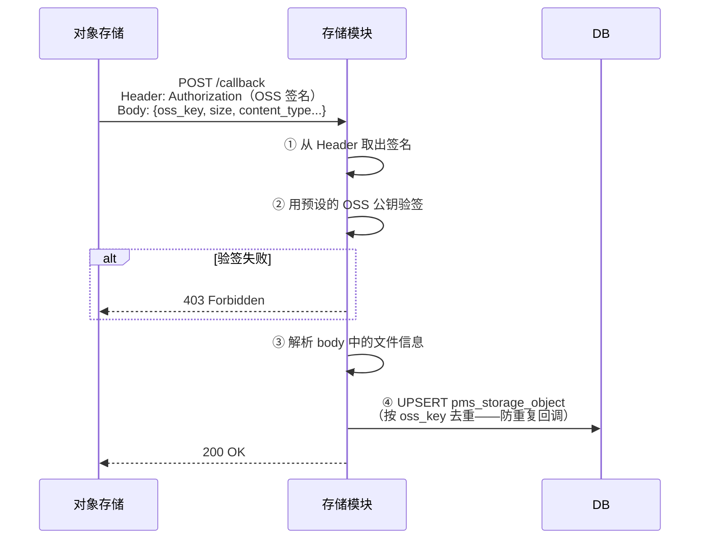

# [07] 存储模块设计稿

Created: 2026-07-29 | Status: Draft
Updated: 2026-07-30 — 补全 DDL 注释、核心流程、新人开发指南、跨模块影响

---

## 1. 用途

存储模块是 x-media 的文件底座，负责所有用户素材和 AI 生成结果的**上传、下载、分享和清理**。一句话：**前端只管用文件，不用管文件存在哪**。

本模块承担：

- OSS 直传签名——前端直接上传到 OSS，不经过后端，节省服务端带宽
- 上传回调写库——OSS 上传成功后通知后端，写入 `pms_storage_object` 元数据
- 下载签名 URL——私有 Bucket 的文件不能公开访问，后端下发有时效的签名 URL
- 分享链接——生成有时限的分享 token，发给他人即可预览/下载
- 引用计数与垃圾回收——无人引用的文件自动清理，防止存储成本膨胀

---

## 2. 最重要 3 点

### 2.1 数据结构设计

> **数据库方言：PostgreSQL 16+**，与项目基础设施模块保持一致。
>
> **新人提示**：`GENERATED ALWAYS AS IDENTITY` 表示自增主键，等价于 MySQL 的 `AUTO_INCREMENT`。
> `TIMESTAMPTZ` 是带时区的时间戳。

```sql
-- ============================================================
-- 表1：存储对象主表
-- 说明：记录所有上传到 OSS 的文件的元数据。不管用户自己上传的，还是 AI 生成的，
--       最终都落到这张表里，其他模块通过 oss_key 引用文件。
-- 场景：素材模块展示文件列表、AI 网关写入生成结果、分享链接关联文件
-- ============================================================
CREATE TABLE pms_storage_object
(
  -- 【主键】文件记录唯一 ID，系统自动生成
  id              BIGINT PRIMARY KEY GENERATED ALWAYS AS IDENTITY,

  -- 【归属用户】文件的上传者或拥有者，关联到用户模块
  -- 外键约束确保不会出现"幽灵文件"（即 user_id 指向不存在的用户）
  user_id         BIGINT       NOT NULL REFERENCES pms_user (id),

  -- 【OSS 路径】文件在对象存储中的唯一路径
  -- 格式示例：uploads/2026/07/30/uuid.png  或  ai-generated/task_42/image_001.png
  -- 这个 key 是上传时由后端生成（防止文件名碰撞），前端不能自己决定
  oss_key         TEXT         NOT NULL,

  -- 【存储桶】OSS 中的 Bucket 名称，例如 "x-media-prod"
  -- 不同环境用不同 Bucket（dev/staging/prod），避免开发环境污染生产数据
  bucket          VARCHAR(128) NOT NULL DEFAULT 'x-media-prod',

  -- 【MIME 类型】文件的内容类型，例如 image/png、video/mp4、application/pdf
  -- 作用：前端根据这个决定如何渲染（图片直接展示、视频播放器、PDF 预览等）
  content_type    VARCHAR(128),

  -- 【文件大小】单位：字节（bytes），展示时前端换算为 KB/MB/GB
  -- 用于配额计算——用户上传了多少东西，跟套餐限额做对比
  size            BIGINT       NOT NULL DEFAULT 0,

  -- 【文件摘要】SHA-256 哈希值，用于去重检测
  -- 两个文件 digest 相同 → 内容完全一样 → 可以复用同一份 OSS 文件
  -- MVP 阶段先存着不做去重，后期可开启：相同 digest 的文件直接复用旧记录
  digest          VARCHAR(64),

  -- 【来源类型】'user_upload'=用户通过前台上传
  --            'ai_generated'=AI 网关生成后回调写入
  -- 作用：区分文件来源，方便统计和垃圾回收策略不同
  object_type     VARCHAR(32)  NOT NULL DEFAULT 'user_upload',

  -- 【状态】'active'=正常可用
  --        'deleted'=已被软删除（标记删除，不立刻清 OSS）
  -- 软删除的好处：误删可恢复，后台有缓冲期
  status          VARCHAR(32)  NOT NULL DEFAULT 'active',

  -- 【引用计数】有多少条素材记录引用了这个文件
  -- 当引用计数归零时，这个文件成为"孤儿文件"，可以被垃圾回收
  -- 更新规则：素材模块创建素材时 +1，素材删除时 -1
  reference_count INT          NOT NULL DEFAULT 1,

  -- 【最后访问时间】文件最近一次被下载或预览的时间
  -- 作用：垃圾回收时优先清理长期无人访问的冷数据
  last_accessed_at TIMESTAMPTZ,

  -- 【创建时间】文件首次上传到 OSS 并写库的时间
  created_at       TIMESTAMPTZ NOT NULL DEFAULT now(),

  -- 【更新时间】任何字段变更时自动刷新
  updated_at       TIMESTAMPTZ NOT NULL DEFAULT now(),

  -- 【删除时间】软删除时记录，用于 GC 任务判断是否已过保留期
  deleted_at       TIMESTAMPTZ
);

-- 加速"按用户查文件列表"（素材模块最频繁的查询）
CREATE INDEX idx_storage_object_user_id
  ON pms_storage_object (user_id, created_at DESC);

-- 加速"按 OSS Key 查文件"（回调写库、下载时反查）
CREATE UNIQUE INDEX idx_storage_object_oss_key
  ON pms_storage_object (oss_key) WHERE status = 'active';

-- 加速"找孤儿文件做 GC"（reference_count = 0 或 deleted_at 过期的）
CREATE INDEX idx_storage_object_gc
  ON pms_storage_object (reference_count, deleted_at)
  WHERE status = 'deleted' OR reference_count = 0;

COMMENT ON TABLE  pms_storage_object IS '存储对象主表：记录所有 OSS 文件的元数据，包括用户上传和 AI 生成结果';
COMMENT ON COLUMN pms_storage_object.id               IS '文件记录唯一 ID，自增主键';
COMMENT ON COLUMN pms_storage_object.user_id           IS '文件归属用户，外键关联 pms_user';
COMMENT ON COLUMN pms_storage_object.oss_key           IS 'OSS 对象路径，全局唯一，格式如 uploads/2026/07/30/uuid.png';
COMMENT ON COLUMN pms_storage_object.bucket            IS 'OSS Bucket 名称，按环境区分';
COMMENT ON COLUMN pms_storage_object.content_type      IS 'MIME 类型，如 image/png、video/mp4';
COMMENT ON COLUMN pms_storage_object.size              IS '文件大小，单位字节（bytes）';
COMMENT ON COLUMN pms_storage_object.digest            IS 'SHA-256 文件摘要，用于去重检测';
COMMENT ON COLUMN pms_storage_object.object_type       IS '文件来源：user_upload=用户上传，ai_generated=AI生成';
COMMENT ON COLUMN pms_storage_object.status            IS '文件状态：active=正常，deleted=已软删除';
COMMENT ON COLUMN pms_storage_object.reference_count   IS '引用计数，被多少素材记录引用，归零后可回收';
COMMENT ON COLUMN pms_storage_object.last_accessed_at  IS '最近一次被下载或预览的时间';
COMMENT ON COLUMN pms_storage_object.created_at        IS '文件首次写入时间';
COMMENT ON COLUMN pms_storage_object.updated_at        IS '记录最后更新时间';
COMMENT ON COLUMN pms_storage_object.deleted_at        IS '软删除时间，GC 任务据此判断是否已过保留期';


-- ============================================================
-- 表2：分享链接表
-- 说明：用户可生成一个有时效的分享 token，发给他人即可临时访问文件
-- 场景：把生成的视频发给客户审阅、团队间共享素材
-- ============================================================
CREATE TABLE pms_share_link
(
  -- 【主键】分享记录唯一 ID
  id          BIGINT PRIMARY KEY GENERATED ALWAYS AS IDENTITY,

  -- 【关联文件】被分享的文件 ID
  object_id   BIGINT       NOT NULL REFERENCES pms_storage_object (id),

  -- 【分享 Token】随机生成的唯一字符串，例如 "Ab3Xk9Lm2Q"
  -- 访问链接格式：https://x-media.com/s/A b3Xk9Lm2Q
  -- 唯一约束：不同分享链接不能重复
  token       VARCHAR(128) NOT NULL UNIQUE,

  -- 【权限】'read'=只读（默认），MVP 只支持只读分享
  permission  VARCHAR(32)  NOT NULL DEFAULT 'read',

  -- 【过期时间】分享链接的有效截止时间
  -- NULL 表示永不过期（不建议），MVP 默认创建后 7 天过期
  -- 到期后任何人访问都返回"链接已过期"
  expire_at   TIMESTAMPTZ,

  -- 【访问次数】该分享链接被打开的总次数
  -- 用于统计和异常检测（短时间大量访问可能是链接泄露）
  access_count INT         NOT NULL DEFAULT 0,

  -- 【创建者】谁创建的分享
  created_by   BIGINT       NOT NULL REFERENCES pms_user (id),

  -- 【创建时间】
  created_at   TIMESTAMPTZ  NOT NULL DEFAULT now()
);

COMMENT ON TABLE  pms_share_link IS '分享链接表：生成有时效的分享 token，用于外部临时访问文件';
COMMENT ON COLUMN pms_share_link.object_id    IS '被分享的文件 ID';
COMMENT ON COLUMN pms_share_link.token        IS '分享 Token，唯一，通过短链接访问';
COMMENT ON COLUMN pms_share_link.permission   IS '访问权限：read=只读';
COMMENT ON COLUMN pms_share_link.expire_at    IS '过期时间，到期后链接失效';
COMMENT ON COLUMN pms_share_link.access_count IS '累计访问次数，用于统计和泄露检测';
COMMENT ON COLUMN pms_share_link.created_by   IS '创建分享的用户 ID';
COMMENT ON COLUMN pms_share_link.created_at   IS '分享创建时间';
```

**设计说明**：

- `pms_storage_object.oss_key` 由后端生成，格式为 `{prefix}/{yyyy/MM/dd}/{uuid}.{ext}`，前缀按来源区分（`uploads/` 或 `ai-generated/`）。
- `pms_storage_object.reference_count` 由素材模块负责维护：素材创建时 +1（通过存储模块暴露的内部接口），素材删除时 -1。归零后垃圾回收任务可清理 OSS 文件。
- `pms_storage_object.deleted_at` 记录软删除时间，垃圾回收保留 30 天缓冲期——用户 30 天内可以反悔恢复。
- `pms_share_link.token` 使用 `crypto/rand` 生成 10 位随机字符串（62^10 ≈ 8.4×10^17 种组合），碰撞概率极低。
- MVP 阶段不启用 digest 去重，字段预留。后期开启后：相同 digest 的文件仅创建新的 storage_object 记录，OSS 上复用同一份文件，`reference_count` 累加。

---

### 2.2 核心数据流转

#### 2.2.1 用户上传（OSS 直传）

用户上传不走后端中转，而是**前端直传 OSS**。后端只负责签发"上传通行证"和接收 OSS 回调。



**几个关键点**：

- **后端生成 oss_key**，不是前端传入——防止恶意覆盖他人文件。
- **上传签名限定了文件类型和大小**——即使前端被篡改，OSS 侧也会拒绝不合规的上传。
- **回调是异步的**——OSS 可能在用户看到"上传成功"后几秒才通知后端。素材模块在回调完成前看到的文件状态为"处理中"。

#### 2.2.2 文件下载

私有 Bucket 的文件不能直接访问，必须后端签发临时下载 URL。



> MVP 阶段直接用 302 重定向到 OSS。后续如果需要水印、转码等处理，可改为后端代理下载（Nginx 内部转发）。

#### 2.2.3 分享链接



#### 2.2.4 垃圾回收（孤儿文件清理）



**GC 策略说明**：

| 清理条件 | 缓冲期 | 原因 |
|----------|--------|------|
| 软删除超过 30 天 | 30 天 | 给用户反悔期，误删可恢复 |
| 用户上传但无引用 | 7 天 | 上传了但没创建素材（可能是上传中途放弃），7 天内保留 |
| AI 生成但无引用 | 不自动清理 | AI 生成结果可能在素材创建前就被引用，由素材模块通知存储模块增减引用计数 |

---

### 2.3 总体架构



**对外接口的职责边界**：

| 组件 | 做什么 | 不做什么 |
|------|--------|----------|
| UploadService | 生成 oss_key、签发签名、处理回调、写库 | 不接收文件字节流（直传 OSS） |
| DownloadService | 校验权限、签发下载 URL | 不代理文件内容（302 到 OSS） |
| ShareService | 创建/查询分享链接、记录访问次数 | 不限制分享次数（只统计） |
| GarbageCollector | 定时扫描并清理孤儿文件 | 不在每次删除时执行（定时批量处理） |

---

## 3. 接口清单（MVP）

### 3.1 上传

| 方法 | 路径 | 鉴权 | 说明 |
|------|------|------|------|
| POST | `/api/v1/storage/upload-url` | 是 | 获取 OSS 直传签名 URL 和表单参数 |
| POST | `/api/v1/storage/callback` | OSS 签名 | OSS 上传成功后的回调接口（对内） |

**POST /upload-url 请求体**：

```json
{
  "content_type": "image/png",
  "size": 2048576,
  "filename": "我的设计稿.png"
}
```

**响应**：

```json
{
  "oss_key": "uploads/2026/07/30/a1b2c3d4.png",
  "upload_url": "https://x-media-prod.oss-cn-shanghai.aliyuncs.com",
  "form_fields": {
    "key": "uploads/2026/07/30/a1b2c3d4.png",
    "policy": "eyJleHBpcmF0...",
    "signature": "abc123...",
    "OSSAccessKeyId": "LTAI5t..."
  },
  "expire_in_seconds": 3600
}
```

### 3.2 下载

| 方法 | 路径 | 鉴权 | 说明 |
|------|------|------|------|
| GET | `/api/v1/storage/objects/{id}/download` | 是 | 302 重定向到临时下载 URL |

### 3.3 文件管理

| 方法 | 路径 | 鉴权 | 说明 |
|------|------|------|------|
| GET | `/api/v1/storage/objects` | 是 | 查询当前用户的文件列表（分页） |
| GET | `/api/v1/storage/objects/{id}` | 是 | 查询单个文件详情 |
| DELETE | `/api/v1/storage/objects/{id}` | 是 | 软删除文件（标记 deleted，30 天后 GC） |

### 3.4 分享

| 方法 | 路径 | 鉴权 | 说明 |
|------|------|------|------|
| POST | `/api/v1/storage/objects/{id}/share` | 是 | 创建分享链接 |
| GET | `/api/v1/storage/objects/{id}/shares` | 是 | 查询该文件的所有分享链接 |
| DELETE | `/api/v1/storage/shares/{id}` | 是 | 撤销分享链接 |
| GET | `/s/{token}` | 否 | 通过分享 token 访问文件（302 重定向下载） |

### 3.5 内部接口（供其他模块调用）

| 方法 | 路径 | 鉴权 | 说明 |
|------|------|------|------|
| POST | `/internal/v1/storage/reference` | 内部 | 素材创建时：指定 oss_key，reference_count +1 |
| POST | `/internal/v1/storage/dereference` | 内部 | 素材删除时：指定 oss_key，reference_count -1 |
| POST | `/internal/v1/storage/write` | 内部 | AI 网关生成文件后：直接写入元数据（跳过上传） |

---

## 4. 实现要点

### 4.1 上传签名安全

OSS 直传最关键的安全机制是 **Policy 签名**。后端在签发上传 URL 时，把允许的规则写进 Policy 并签名。OSS 收到上传请求时会验签，不符合规则的直接拒绝。

| 限制项 | 说明 | 示例 |
|--------|------|------|
| 文件大小上限 | 根据用户套餐设定 | 免费版 ≤ 100MB，Pro 版 ≤ 1GB |
| 允许的 MIME 类型 | 白名单，防止上传恶意文件 | `image/*`, `video/mp4`, `application/pdf` |
| 签名有效期 | 超时则签名失效 | 默认 1 小时 |
| OSS Key 前缀 | 限制只能写到指定目录 | `uploads/{yyyy}/{MM}/{dd}/` |

### 4.2 回调验签

OSS 上传成功后通过回调通知后端。**必须验签**，否则任何人都可以伪造回调写入假数据。



### 4.3 下载控制

| 场景 | 方案 |
|------|------|
| 文件归属人下载 | 校验 `user_id == 当前用户` |
| 分享链接下载 | 校验 token 有效 + 未过期 |
| 内部模块读取 | 通过 `/internal/` 接口调用，不做用户校验 |
| 签名 URL 有效期 | 10 分钟，超时需重新请求 |

### 4.4 引用计数

引用计数是垃圾回收的基础。素材模块在创建/删除素材时，通过内部接口通知存储模块增减计数。

```
素材创建 → POST /internal/v1/storage/reference  {oss_key: "uploads/2026/07/30/xxx.png"}
         → reference_count +1

素材删除 → POST /internal/v1/storage/dereference {oss_key: "uploads/2026/07/30/xxx.png"}
         → reference_count -1
         → 减到 0 → 文件成为"孤儿"，等待 GC
```

> 注意：AI 生成的结果在写入时 `reference_count` 初始为 0（还没被素材引用），由随后素材模块的 reference 调用 +1。

---

## 5. 依赖模块

| 模块 | 依赖说明 |
|------|----------|
| [00]用户模块 | `pms_storage_object.user_id` 引用 `pms_user.id`，上传和下载需登录态 |
| [01]素材模块 | 素材记录通过 `oss_key` 引用存储模块，素材 CRUD 时通知引用计数变更 |
| [06]AI网关模块 | AI 生成的结果通过内部接口写入存储模块，不走用户上传流程 |
| [10]管理后台模块 | 管理员可查看全站存储用量、手动触发 GC |

---

## 6. 与 open-ai-canvas 的映射

| 我们的模块 | open-ai-canvas 对应 | 差异 |
|------------|---------------------|------|
| 存储模块 | `media/` 目录 + OSS 直传 | open-ai-canvas 的 media 模块更重，含 webhook 视频回调、转码队列；x-media MVP 只做文件 CRUD + 分享，视频异步流转由 AI 网关模块处理 |

---

## 7. 新人开发指南

### 7.1 这两张表一句话讲清楚

| 表名 | 一句话 | 什么时候有数据 |
|------|--------|---------------|
| `pms_storage_object` | 文件"户口本"——每个上传到 OSS 的文件都在这登记 | 上传回调成功后写入 |
| `pms_share_link` | 分享"通行证"——用户生成一个有时限的链接给别人看 | 用户主动创建分享时写入 |

### 7.2 动手前先搞懂这些概念

1. **上传不经过后端**：用户选择文件 → 前端调后端拿签名 → 前端直接上传到 OSS。后端不接收文件流，所以上传 1GB 文件也不会打满服务端带宽。签名的本质是"我给你一张限时 1 小时的通行证，拿着它去 OSS 停车，但只能停指定车位"。

2. **回调是异步的**：用户在前端看到"上传成功"≠ 后端已经写库。中间隔了一次 OSS 回调（几千毫秒）。素材模块需要能接受"文件还在处理中"这个中间状态。

3. **软删除不是真删除**：用户点删除只改 `status='deleted'`，文件和数据库记录都还在。垃圾回收任务每天凌晨扫描，只清理"删了超过 30 天"的数据。

4. **引用计数像"引用计数器"**：想象书架上的一本书，每借走一次盖一个章，还回来擦掉一个章。章数为零时说明没人需要了，可以下架。素材模块创建素材时 +1，删除素材时 -1。

5. **oss_key 必须后端生成**：不能让前端决定文件存在 OSS 的哪个路径。否则恶意用户可以 `uploads/../../../别人的文件.png` 覆盖他人的数据。

### 7.3 2 位后端分工

| 开发者 | 工作包 | 涉及内容 | 依赖 |
|--------|--------|----------|------|
| A | 上传 + 下载 | 上传签名生成、OSS 回调验签写库、文件下载签名 URL、文件列表查询、软删除 | — |
| B | 分享 + GC + 内部接口 | 分享链接 CRUD、分享 token 访问、垃圾回收定时任务、reference/dereference/write 内部接口 | A（需要文件读写基础） |

### 7.4 开发顺序

1. **先做上传 + 下载**（A）——文件能上传能下载，存储模块就算通了。此时 OSS 直传签名 + 回调写库是核心
2. **再做分享**（B）——分享链接是差异化功能，但依赖文件已经可访问
3. **然后内部接口**（B）——供素材模块和 AI 网关调用，引用计数机制
4. **最后 GC**（B）——自动化清理，不影响核心流程可以先上但设为手动触发

### 7.5 实战踩坑点

| 踩坑点 | 说明 | 建议 |
|--------|------|------|
| **OSS 回调丢包** | OSS 回调是 HTTP 请求，网络抖动可能导致回调失败，用户上传了但数据库没记录 | 前端上传成功后轮询查询文件状态；回调接口做幂等（按 oss_key UPSERT）；OSS 回调重试机制可配 |
| **oss_key 没做唯一约束** | 两个用户同时拿到了相同的 oss_key（概率极低但可能） | 加唯一索引 `UNIQUE(oss_key) WHERE status='active'`，写入前检查冲突并重试 |
| **签名 URL 泄露** | 用户把 10 分钟的下签名 URL 发到群里，任何人都能下载 | 下载 URL 有效期设短（10 分钟），分享场景走 `/s/{token}` 而非直接给签名 URL |
| **GC 误删正在使用的文件** | GC 任务检查时 reference_count=0，但下一毫秒素材模块调了 reference+1 | GC 删除前再次检查 reference_count 和 status（二次确认机制）；素材模块的 reference 调用要在事务内先 +1 再返回 |
| **大文件上传超时** | 1GB 视频上传时间很长，用户以为卡死了 | 前端显示进度条（OSS SDK 支持）；上传签名有效期给够（免费版 1 小时） |
| **content_type 信任前端** | 前端声称 `image/png` 但实际上上传了 `.exe`，没人在意 MIME | 上传签名中限定 `content-type` 白名单，OSS 侧拒绝不合规文件；回调时再次校验 |
| **软删除后用户仍可下载** | 用户删了一个文件，但其实 share link 还在，别人还能用分享链接访问 | 分享链接访问时检查关联的 `pms_storage_object.status`，deleted 的直接拒绝 |
| **回调签名密钥硬编码** | OSS 回调验签用到的公钥/密钥写死在代码里 | 放到配置文件或环境变量中，部署时注入。绝对不要提交到 Git |
| **内部接口没鉴权** | `/internal/v1/storage/write` 如果没有鉴权，任何知道端口的人都能伪造 AI 生成结果 | 内部接口加简单的 token 鉴权或网络策略（K8s NetworkPolicy 限制只有 AI 网关 Pod 能访问） |

---

## 8. 跨模块影响清单

| 文档 | 需要改的地方 | 优先级 |
|------|-------------|--------|
| `[00]用户模块` | `pms_storage_object.user_id` 的外键引用 | P0 |
| `[01]素材模块` | 素材创建/删除时需调 `/internal/` 接口通知引用计数变更 | P0 |
| `[01]素材模块` | 素材表的 `oss_key` 字段需与 `pms_storage_object.oss_key` 对齐 | P0 |
| `[06]AI网关模块` | AI 生成结果通过 `/internal/v1/storage/write` 写入，不再直接操作 OSS | P0 |
| `[06]AI网关模块` | 调用日志中 `request_json`/`response_json` 大字段完整日志写入 OSS 时依赖本模块 | P1 |
| `[10]管理后台模块` | 管理员查看存储用量、手动触发 GC 时依赖本模块接口 | P1 |
