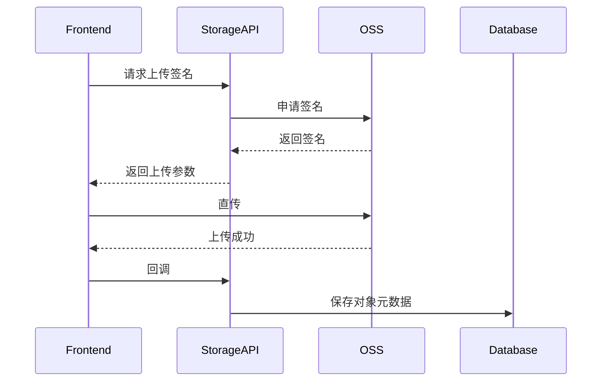
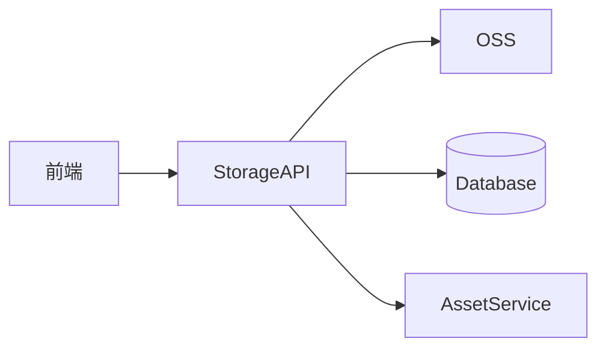

# [07] 存储模块设计稿

Created: 2026-07-29
Status: Draft

---

## 1. 用途

存储模块负责所有文件对象的生命周期，包括签名上传、下载、清理和跨模块访问控制。

---

## 2. 最重要 3 点

### 2.1 数据结构设计

```sql
create table storage_objects
(
    id           bigint primary key generated always as identity,
    user_id      bigint not null references users (id),
    oss_key      text   not null,
    bucket       text,
    content_type varchar(128),
    size         bigint,
    digest       varchar(64),
    created_at   timestamptz default now()
);

create table share_links
(
    id         bigint primary key generated always as identity,
    object_id  bigint       not null references storage_objects (id),
    token      varchar(128) not null,
    permission varchar(32) default 'read',
    expire_at  timestamptz,
    created_at timestamptz default now()
);
```

### 2.2 数据流转过程



### 2.3 总体架构



---

## 3. 接口清单（MVP）

| 方法 | 路径 | 说明 |
| -- | -- | -- |
| POST | /api/v1/storage/upload-url | 上传签名 |
| POST | /api/v1/storage/callback | 上传回调 |
| DELETE | /api/v1/storage/objects/{id} | 删除对象 |
| POST | /api/v1/storage/share | 创建分享 |

---

## 4. 依赖模块

| 模块 | 依赖说明 |
| -- | -- |
| 用户模块 | 对象归属 |
| 素材模块 | 素材指针 |
| AI网关模块 | 结果落盘 |

---

## 5. 与 open-ai-canvas 的映射

| 我们的模块 | open-ai-canvas 对应 |
| -- | -- |
| 存储模块 | OSS 直传与数据卷 |
