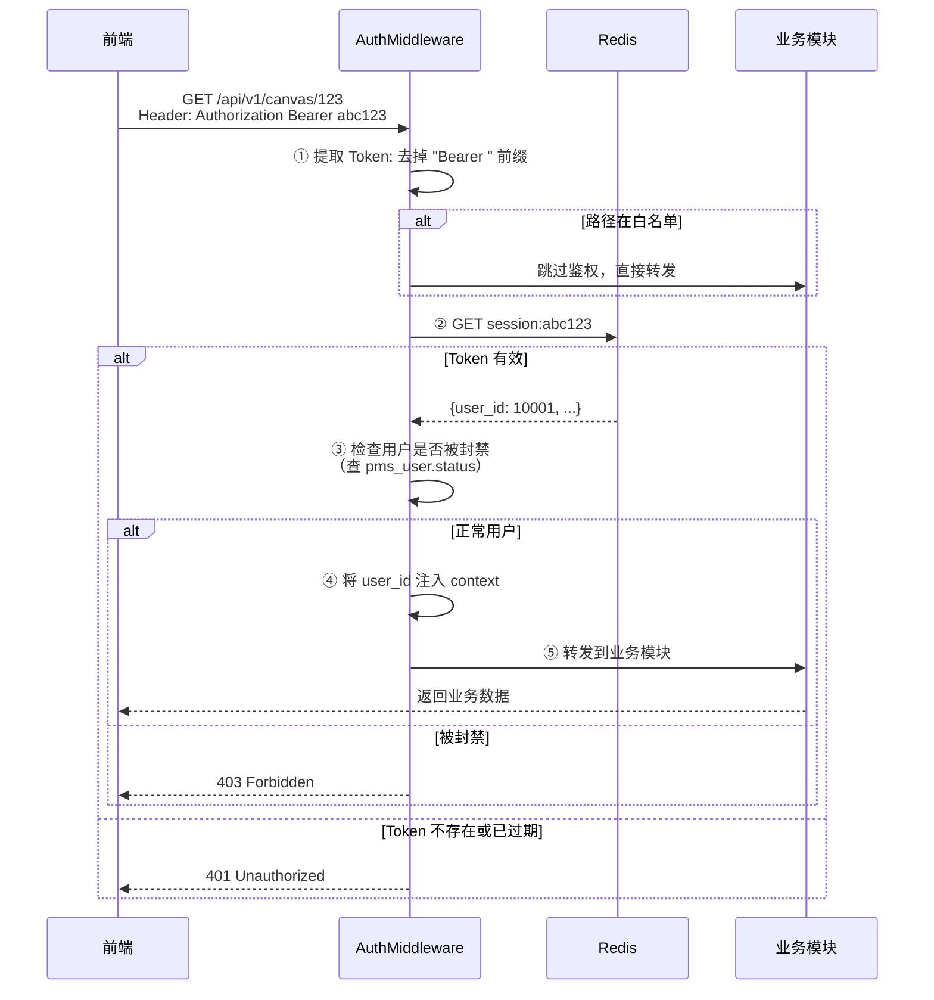
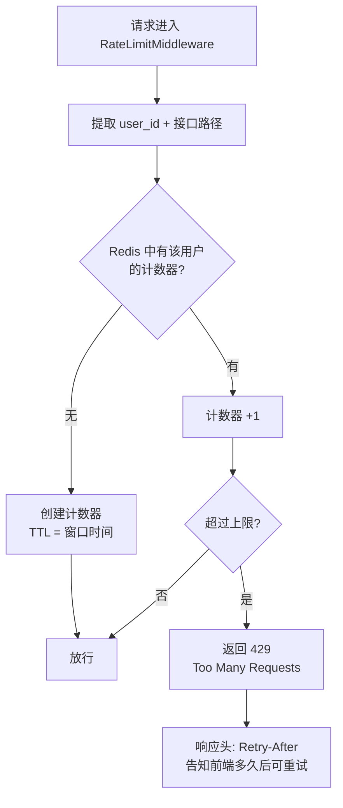
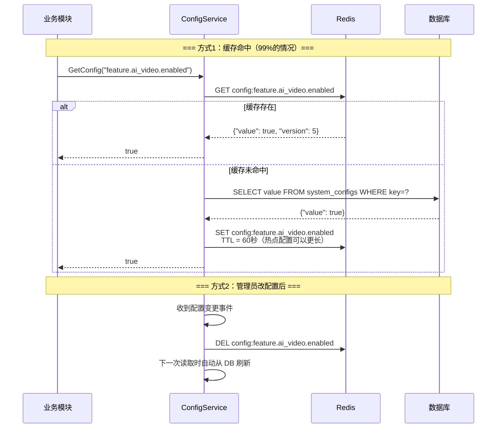
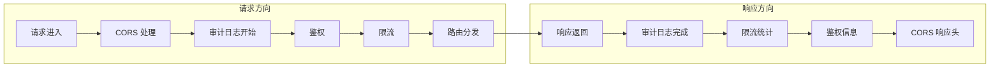
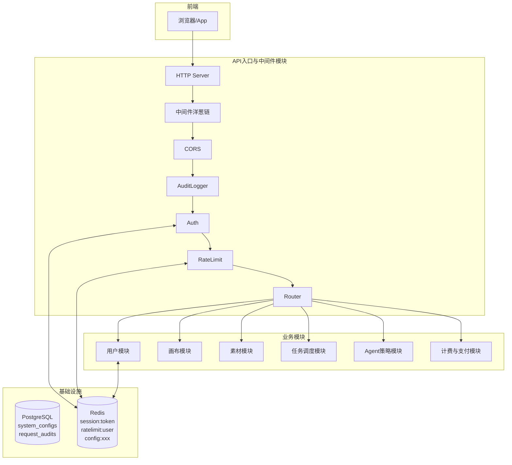
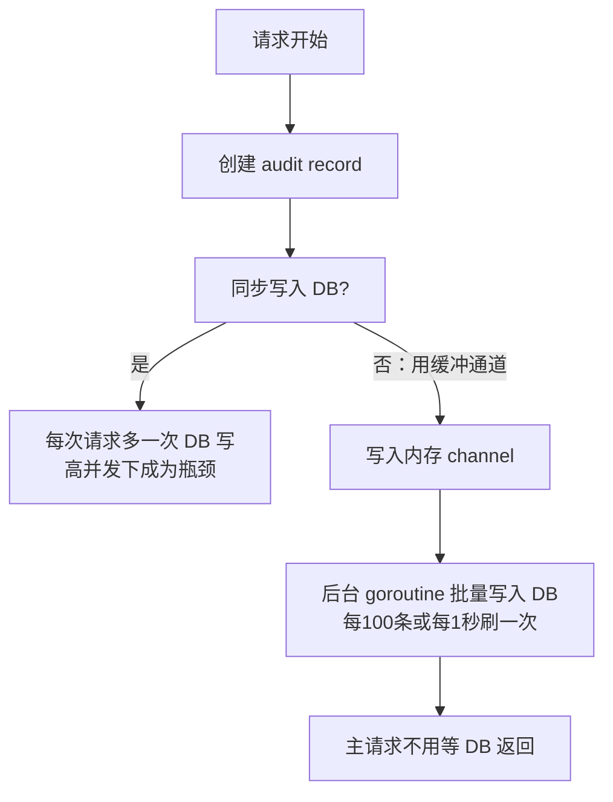

# [08] API入口与中间件模块设计稿

Created: 2026-07-29 | Status: Draft
Updated: 2026-07-30 — 重写 DDL 注释、补全核心流程、中间件洋葱模型、新人开发指南、跨模块影响

---

## 1. 用途

API入口与中间件模块是 x-media 的**统一大门**，所有前端请求都从这里进来，负责：

- 请求鉴权——从 Header 提取 Token，查 Redis 确认身份，注入 `user_id` 到上下文
- 限流保护——按用户/接口维度做频率控制，防止刷接口和恶意流量
- 路由分发——根据 URL 前缀将请求转发到对应的业务模块
- 配置中心——管理全局开关、功能参数、第三方 API Key 等动态配置
- 请求审计——记录每一次 API 调用的方法、路径、状态、耗时
- 健康检查与 CORS——对外暴露就绪探针、处理跨域请求

**一句话概括**：前端只知道一个入口地址，请求进来后经过鉴权→限流→路由→转发，最终到达具体业务模块。本模块本身不处理业务逻辑，只做"把关和分拣"。

> **与 [06]AI网关模块 的区别**：
> - 本模块（[08]）：HTTP 请求入口层——管"这个请求能不能进来、发给哪个微服务"
> - AI网关模块（[06]）：AI 模型调用层——管"这个 AI 任务调哪个模型供应商、怎么容错"
> - 两者是**不同层级**的网关，各管各的路由表，没有重叠

---

## 2. 最重要 3 点

### 2.1 数据结构设计

> **数据库方言：PostgreSQL 16+**，与项目基础设施模块保持一致。
>
> **新人提示**：`GENERATED ALWAYS AS IDENTITY` 表示自增主键，`TIMESTAMPTZ` 是带时区的时间戳。`JSONB` 是 PostgreSQL 特有的 JSON 存储格式，支持索引和高效查询。

核心表设计：

```sql
-- ============================================================
-- 表1：系统配置表
-- 说明：存储所有全局开关、功能参数、第三方配置等动态配置
-- 场景：运营开关某个功能、调参不发版、切换第三方 API Key
-- ============================================================
CREATE TABLE system_configs
(
    -- 【主键】配置记录唯一ID，自增
    id          BIGINT PRIMARY KEY GENERATED ALWAYS AS IDENTITY,

    -- 【配置键】配置的全局唯一标识名，例如 'feature.ai_video.enabled'
    -- 命名规范：使用点号分层，{域}.{子域}.{参数名}
    -- 示例：'feature.ai_video.enabled'、'api.rate_limit.per_minute'、'thirdparty.wechat.app_id'
    key         VARCHAR(128) NOT NULL UNIQUE,

    -- 【配置值】JSONB 格式，支持任意类型
    -- 简单值：{"value": true}
    -- 复杂值：{"max_tokens": 8000, "models": ["gpt-4o", "gemini-2.0"]}
    -- 为什么用 JSONB 而不是多个类型字段？因为配置类型不确定——有时是布尔值、有时是数字、有时是列表
    value       JSONB NOT NULL DEFAULT '{}',

    -- 【作用范围】'global'=全平台生效
    --           'user'    =按用户生效（key 一样但值不同，需关联 user_configs 表，MVP 暂不做）
    --           'org'     =按组织生效（同上，MVP 暂不做）
    -- MVP 阶段所有配置 scope 都是 'global'
    scope       VARCHAR(64) NOT NULL DEFAULT 'global',

    -- 【描述】这个配置是干什么的，给运营人员看的备注
    -- 不设 NOT NULL 是因为有些配置可以通过 key 名称自解释
    description TEXT,

    -- 【最后修改人】关联到管理员表 admins.id，记录是谁改的
    -- 注意：是 admins 表，不是 pms_user 表——只有管理员才能改系统配置
    updated_by  BIGINT,

    -- 【修改时间】每次更新时自动刷新
    updated_at  TIMESTAMPTZ NOT NULL DEFAULT now()
);

-- 加速按 key 查询（每个读取配置的请求都会用到）
CREATE INDEX idx_system_configs_key ON system_configs (key);

COMMENT ON TABLE  system_configs IS '系统配置表：存储全局开关、功能参数、第三方配置，支持运营不重启修改';
COMMENT ON COLUMN system_configs.key         IS '配置键，全局唯一，命名规范：{域}.{子域}.{参数名}，如 feature.ai_video.enabled';
COMMENT ON COLUMN system_configs.value       IS '配置值，JSONB格式支持任意类型：布尔/数字/数组/对象';
COMMENT ON COLUMN system_configs.scope       IS '作用范围：global=全平台，MVP阶段所有配置均为global';
COMMENT ON COLUMN system_configs.description IS '配置说明，给运营人员看的备注';
COMMENT ON COLUMN system_configs.updated_by  IS '最后修改人，关联admins表，只有管理员可修改';
COMMENT ON COLUMN system_configs.updated_at  IS '最后修改时间，每次UPDATE自动刷新';


-- ============================================================
-- 表2：请求审计日志表
-- 说明：记录每一次 API 调用的基本信息，用于监控、排查和统计
-- 场景：查某个用户的操作历史、分析接口慢在哪里、统计 QPS
-- 注意：这张表只存元信息（谁、什么接口、什么时间、多久），不存请求体和响应体（那由各业务模块自己记）
-- ============================================================
CREATE TABLE request_audits
(
    -- 【主键】日志记录唯一ID
    id          BIGINT PRIMARY KEY GENERATED ALWAYS AS IDENTITY,

    -- 【请求用户】发起请求的用户ID
    -- 允许为空：未登录的公开接口（如注册、登录、健康检查）user_id 为 NULL
    -- 外键确保不会出现幽灵用户（即指向不存在的 user_id）
    user_id     BIGINT REFERENCES pms_user (id),

    -- 【HTTP 方法】GET/POST/PUT/DELETE/PATCH 等
    method      VARCHAR(16)  NOT NULL,

    -- 【请求路径】不含域名和查询参数，例如 '/api/v1/users/me'
    -- 为什么去掉查询参数？因为参数里可能包含敏感信息，且保留路径就足够做接口级别统计
    path        TEXT         NOT NULL,

    -- 【HTTP 状态码】200/401/403/429/500 等
    -- 200=正常返回、401=未登录、403=被封禁/无权限、429=被限流
    status      INT          NOT NULL,

    -- 【耗时】从请求进入中间件到响应返回的总耗时，单位毫秒
    -- 用于发现慢接口、性能劣化的预警
    latency_ms  INT,

    -- 【客户端 IP】来源 IP 地址
    -- 用于攻击溯源、地域统计（注意合规：IP 属于个人信息，定期清理历史数据）
    client_ip   VARCHAR(64),

    -- 【请求时间】请求到达网关的时间，用于时序统计和排序
    created_at  TIMESTAMPTZ  NOT NULL DEFAULT now()
);

-- 索引1：按用户查操作历史（管理员查看某用户的所有请求记录）
CREATE INDEX idx_request_audits_user_id ON request_audits (user_id);

-- 索引2：按时间范围查日志（监控大盘展示最近N分钟的请求量/错误率）
CREATE INDEX idx_request_audits_created_at ON request_audits (created_at);

-- 索引3：按路径+时间查慢接口（运维排查某个接口最近的表现）
CREATE INDEX idx_request_audits_path_time ON request_audits (path, created_at);

COMMENT ON TABLE  request_audits IS '请求审计日志表：记录每次API调用的元信息，用于监控、排查和统计';
COMMENT ON COLUMN request_audits.user_id    IS '请求用户ID，公开接口可为NULL';
COMMENT ON COLUMN request_audits.method     IS 'HTTP方法：GET/POST/PUT/DELETE等';
COMMENT ON COLUMN request_audits.path       IS '请求路径，不含域名和查询参数';
COMMENT ON COLUMN request_audits.status     IS 'HTTP状态码：200/401/403/429/500等';
COMMENT ON COLUMN request_audits.latency_ms IS '请求耗时，单位毫秒';
COMMENT ON COLUMN request_audits.client_ip  IS '客户端IP地址';
COMMENT ON COLUMN request_audits.created_at IS '请求到达网关的时间';
```

设计说明：

- `system_configs` 是**运营开关面板**的数据源。运营在管理后台改配置，API 实时读取最新值，不用重启服务。
- `system_configs.updated_by` 关联 `admins` 表而非 `pms_user`，因为只有管理员才有权限改系统配置。
- `request_audits` 不存请求体和响应体——那是各业务模块的责任。这里只存"谁在什么时候调了什么接口、花了多久、返回了什么状态码"，够做监控大盘即可。
- `request_audits.user_id` 允许 NULL：注册、登录等公开接口还没有登录态，user_id 就是空的。
- 审计日志有 3 个索引，覆盖了最常见的 3 种查询场景（按用户、按时间、按路径+时间）。

---

### 2.2 数据流转过程

#### 2.2.1 请求鉴权流程

这是最核心的流程——每个带 `Authorization` Header 的请求都会走这条路。



**白名单路由**（跳过鉴权，直接放行）：

| 路径 | 说明 |
|------|------|
| `POST /api/v1/auth/register` | 注册 |
| `POST /api/v1/auth/login` | 登录 |
| `POST /api/v1/auth/reset-password/*` | 密码重置 |
| `GET /api/v1/health` | 健康检查 |
| `GET /api/v1/configs` | 公开配置 |

#### 2.2.2 限流决策流程

在鉴权通过后、路由转发前，检查该用户是否超过调用频率限制。



**限流维度**：

| 维度 | 限制 | 窗口 | Redis Key 示例 | 说明 |
|------|------|------|----------------|------|
| 全局 | 1000 次/秒 | 1 秒 | `ratelimit:global:1s` | 保护后端不被整体打垮 |
| 按用户 | 60 次/分钟 | 1 分钟 | `ratelimit:user:{userID}:1m` | 防止单个用户刷接口 |
| 按接口 | 10 次/秒 | 1 秒 | `ratelimit:path:/api/v1/tasks:1s` | 针对创建任务等重操作做保护 |
| 登录接口 | 5 次/分钟 | 1 分钟 | `ratelimit:path:/auth/login:1m` | 防暴力破解 |

> 限流数据存 Redis 而非数据库：计数器需要原子递增+自动过期，Redis 的 `INCR` + `EXPIRE` 天然支持，性能远高于数据库 UPDATE。

#### 2.2.3 配置读取流程

业务模块启动时和运行时都可能需要读全局配置，有两种方式：



- **缓存策略**：Redis 缓存 60 秒，配置变更时主动删除缓存。最坏情况下业务模块会在 60 秒内读到旧值，对非实时性要求的功能可接受。
- **紧急下线的处理**：如果某个功能需要立刻关闭（如某个模型返回异常），管理员改 DB + 手动调 API 刷新缓存，两步做完即时生效。

#### 2.2.4 中间件洋葱模型

所有中间件按**洋葱模型**嵌套——请求从外到内穿过每一层，响应从内到外返回。



**各中间件职责**：

| 顺序 | 中间件 | 请求阶段做什么 | 响应阶段做什么 |
|------|--------|---------------|---------------|
| 1 | CORS | 检查 Origin，OPTIONS 预检直接返回 | 添加 `Access-Control-*` 响应头 |
| 2 | AuditLogger | 记录 `started_at`、创建 `request_audits` 记录 | 更新 `status`、`latency_ms`、`finished_at` |
| 3 | Auth | 提取 Token → 查 Redis → 注入 `user_id` | — |
| 4 | RateLimit | 检查计数器，超限返回 429 | 更新计数器 |
| 5 | Router | 按 URL 前缀路由到对应业务模块 | 透传响应 |

---

### 2.3 总体架构



**模块边界**：

- 本模块只负责"把关"——鉴权、限流、审计、路由。**不处理任何业务逻辑**。
- 业务模块只认 `context` 中的 `user_id`，不知道自己是被哪个中间件鉴权的。
- 配置存储在 DB 中，Redis 做缓存层加速读取。
- 本模块依赖 [00]用户模块（查用户状态）、[10]管理后台模块（配置修改人），但不对它们做 RPC 调用——只通过共享数据库和外键关联。

---

## 3. 接口清单（MVP）

### 3.1 健康检查

| 方法 | 路径 | 鉴权 | 说明 |
|------|------|------|------|
| GET | `/api/v1/health` | 否 | 返回服务器状态、DB/Redis 连通性、启动时间 |
| GET | `/api/v1/health/ready` | 否 | K8s Readiness Probe，返回 200 表示可以接收流量 |

### 3.2 公开配置

| 方法 | 路径 | 鉴权 | 说明 |
|------|------|------|------|
| GET | `/api/v1/configs/public` | 否 | 获取前端需要的公开配置（如是否开放注册、版本号） |

### 3.3 管理配置（管理员专用）

| 方法 | 路径 | 鉴权 | 说明 |
|------|------|------|------|
| GET | `/api/v1/admin/configs` | 是（管理员） | 管理员查看所有系统配置列表 |
| GET | `/api/v1/admin/configs/{key}` | 是（管理员） | 管理员查看某个配置的详情和历史 |
| PUT | `/api/v1/admin/configs/{key}` | 是（管理员） | 管理员更新某个配置的值 |

### 3.4 路由转发（透明代理）

本模块不暴露业务接口，而是将请求按前缀转发到对应业务模块。路由规则：

| URL 前缀 | 转发到 | 说明 |
|----------|--------|------|
| `/api/v1/auth/*` | 用户模块 | 登录/注册/密码重置 |
| `/api/v1/users/*` | 用户模块 | 用户信息 |
| `/api/v1/canvas/*` | 画布模块 | 画布与节点 |
| `/api/v1/assets/*` | 素材模块 | 素材管理 |
| `/api/v1/storage/*` | 存储模块 | OSS 上传签名/下载 |
| `/api/v1/tasks/*` | 任务调度模块 | 任务提交与查询 |
| `/api/v1/agent/*` | Agent策略模块 | 策略与 Spec |
| `/api/v1/billing/*` | 计费与支付模块 | 积分与订单 |
| `/api/v1/admin/*` | 管理后台模块 | 运营管理 |

---

## 4. 实现要点

### 4.1 中间件洋葱模型实现

中间件本质是一个**函数包装器**，签名为：

```
func(ctx, next) → response
```

每个中间件在调用 `next(ctx)` 之前做请求阶段的事情，在 `next(ctx)` 返回之后做响应阶段的事情。以审计日志中间件为例：

```
输入阶段：记录 started_at → 创建 request_audits (status=pending)
  ↓
调用 next(ctx) —— 经过后续中间件 → 到达业务模块 → 返回
  ↓
输出阶段：记录 finished_at → 计算 latency_ms → 更新 request_audits
```

### 4.2 限流策略——固定窗口 vs 滑动窗口

| 策略 | 原理 | 优点 | 缺点 |
|------|------|------|------|
| 固定窗口 | 每个时间窗口内计数，窗口结束清零 | 简单，Redis 一个 key 搞定 | 窗口边界可能被突发打穿 |
| 滑动窗口 | 记录每次请求时间戳，计算窗口内的请求数 | 平滑，不会在边界突增 | 需要 Redis Sorted Set，稍复杂 |

**建议**：MVP 阶段用固定窗口（Redis `INCR` + `EXPIRE`），后续流量大了再升级为滑动窗口。固定窗口的边界突刺问题在 x-media 这种创作工具场景下不致命（用户不会卡着秒表刷接口）。

### 4.3 配置热加载

配置变更后的生效路径：

```
管理员在后台改配置 → 写入 system_configs 表 → 同时 DEL Redis 缓存 key
→ 下一次业务模块读配置时缓存未命中 → 从 DB 读取最新值
```

最坏情况下延迟 = Redis 缓存 TTL（60秒），对非实时性配置可接受。需要**即时生效**的场景（如紧急下架某个模型），通过管理后台的"强制刷新"按钮主动清除缓存。

### 4.4 请求审计日志——异步写入

`request_audits` 的写入不应该阻塞主请求流程：



- **缓冲写入**：用内存 channel 缓冲，后台协程批量 `INSERT`。即使写 DB 失败也只是丢失少量审计日志，不影响业务请求。
- **定期清理**：`request_audits` 表会随着请求量持续膨胀。MVP 阶段按创建时间建分区（按天），保留 30 天数据，超出自动删除。

---

## 5. 依赖模块

| 模块 | 依赖方式 | 说明 |
|------|----------|------|
| [00]用户模块 | 共享 DB（读 `pms_user.status`） | 鉴权时检查用户是否被封禁 |
| [10]管理后台模块 | 共享 DB（`system_configs.updated_by` → `admins.id`） | 记录配置是谁改的 |
| — | Redis + PostgreSQL | 本模块自行管理 DB 连接池和 Redis 客户端，不依赖其他模块 |
| 所有业务模块 | HTTP 路由转发 | 按 URL 前缀将请求转发到对应模块 |

---

## 6. 与 open-ai-canvas 的差异点

| 差异项 | open-ai-canvas | x-media（本模块） |
|--------|----------------|-------------------|
| 入口架构 | Gin 框架直连，中间件挂在 Router Group 上 | 独立的入口层模块，中间件洋葱链 |
| 鉴权方式 | Cookie-based Session | Header Bearer Token + Redis |
| 限流 | 无内置限流 | 多维度限流（全局/用户/接口） |
| 配置管理 | 硬编码或环境变量 | system_configs 表 + Redis 缓存，支持运营热更新 |
| 请求审计 | 依赖 Gin 日志中间件输出到文件 | request_audits 表落库，支持按用户/接口/时间查询 |
| 路由方式 | 代码内注册路由 | 按 URL 前缀转发到独立部署的业务模块（支持微服务拆分） |
| 模块拆分 | backend 单体服务 | 按业务域拆分独立模块，入口层只做路由转发 |
| 对应代码位置 | `open-ai-canvas/backend/cmd` | `cmd/server`（入口）+ `internal/gateway`（中间件） |

---

## 7. 新人开发指南

### 7.1 快速理解这 2 张表

| 表名 | 一句话解释 | 什么时候有数据 |
|------|-----------|---------------|
| `system_configs` | 运营开关和全局参数，改了立即生效 | 系统初始化时创建默认值，运营随时改 |
| `request_audits` | 每次 API 调用的记录——谁、调了什么、多久、成功没 | 每个请求进来都记一条 |

### 7.2 动手之前先理解这些概念

1. **中间件就是一个包装函数**：类似洋葱皮。请求进来时先过最外层→往里剥，响应返回时从最内层→往外走。每个中间件都可以在请求阶段做事情（如记录开始时间），在响应阶段做事情（如计算耗时）。

2. **Token 鉴权不查数据库**：每次请求都去查 `pms_user` 表性能太差。登录时把 `{user_id, device_info}` 存 Redis，后续校验只查 Redis。被封禁是低频操作——在鉴权中间件里查一次 `pms_user.status` 即可（可以加本地缓存）。

3. **限流计数器存在 Redis，不落 DB**：计数器变化极快（每秒成百上千次）、需要自动过期。Redis 的 `INCR` 原子操作和 `EXPIRE` TTL 天然适合这个场景，写数据库会拖垮性能。

4. **配置和代码的关系**：代码里写 `config.GetBool("feature.ai_video.enabled")`，不用关心这个值是硬编码的还是从 DB 读的。`ConfigService` 封装了 "先查 Redis 缓存，没有再查 DB" 的逻辑，对业务代码透明。

5. **请求审计不同步写 DB**：每次请求都等一条 `INSERT` 返回，高并发下 DB 会成为瓶颈。用内存 channel 做缓冲，后台批量写入，最坏情况丢几条审计日志，但业务请求不受影响。

### 7.3 团队分工建议

| 角色 | 负责内容 |
|------|----------|
| 后端 A | HTTP Server 启动 + 中间件洋葱链组装 + CORS 配置 |
| 后端 B | AuthMiddleware（Token 提取 + Redis 查询 + user_id 注入）+ 白名单管理 |
| 后端 C | RateLimitMiddleware（Redis 计数器 + 多维度限流规则配置） |
| 后端 D | ConfigService（system_configs CRUD + Redis 缓存层 + 热加载） |
| 后端 E | AuditLogger 中间件（内存缓冲 + 批量写入 + 分区清理） |

### 7.4 开发顺序建议

```
第1步：HTTP Server 能启动，/api/v1/health 返回 200
第2步：加上 CORS + 基础路由转发（先不做鉴权，全部放行）
第3步：加上 AuthMiddleware，能鉴权、能注入 user_id
第4步：加上系统配置的读写（system_configs 表 + 管理接口）
第5步：加上请求审计（request_audits 表 + 缓冲写入）
第6步：加上限流（先做全局限流，再补用户级和接口级）
```

### 7.5 实战踩坑点

| 序号 | 踩坑点 | 怎么避免 |
|------|--------|----------|
| 1 | Token 校验每次都查 DB 导致慢 | 只查 Redis，被封禁检查加本地 1 分钟缓存 |
| 2 | 限流计数器用 Redis `SET`+`GET` 有竞态 | 用 `INCR` 原子操作，第一次 `INCR` 返回 1 时设 `EXPIRE` |
| 3 | 请求审计同步写 DB 拖慢响应 | 用 channel 缓冲，后台批量 `INSERT`，允许少量丢失 |
| 4 | `request_audits` 表无限增长撑爆磁盘 | 建时间分区 + 定时清理 30 天前数据 |
| 5 | 中间件顺序搞反——先限流再鉴权 | 正确顺序：CORS → 审计开始 → 鉴权 → 限流 → 路由 → 响应时审计结束 |
| 6 | 配置缓存不失效，改了不生效 | 管理后台改配置时主动 `DEL` Redis key，加 TTL 兜底 |
| 7 | Token 提取逻辑没处理 "Bearer " 前缀大小写 | 统一用 `strings.TrimPrefix` 做大小写不敏感处理 |
| 8 | 健康检查返回 200 但 DB 挂了 | 就绪探针 `/ready` 要真的 ping DB 和 Redis |

---

## 8. 跨模块影响清单

| 影响对象 | 影响说明 | 优先级 |
|----------|----------|--------|
| `[00]用户模块` | AuthMiddleware 依赖 `pms_user.status` 字段判断封禁状态 | P0 |
| `[00]用户模块` | 鉴权中间件中的 Token → user_id 映射格式与用户模块的 session 存储格式对齐 | P0 |
| `[10]管理后台模块` | `system_configs.updated_by` 引用 `admins.id`，需确认外键 | P1 |
| — | Redis 需要 3 类 key 前缀：`session:`、`ratelimit:`、`config:`——部署时确认内存配额 | P0 |
| — | `request_audits` 按天分区的定时任务需要数据库支持 | P1 |
| 所有业务模块 | 统一的 `user_id` 注入方式（context key 名称约定）必须在所有模块中保持一致 | P0 |
| 所有业务模块 | 限流会返回 429，前端需要处理 `Retry-After` 响应头并做友好提示 | P1 |
