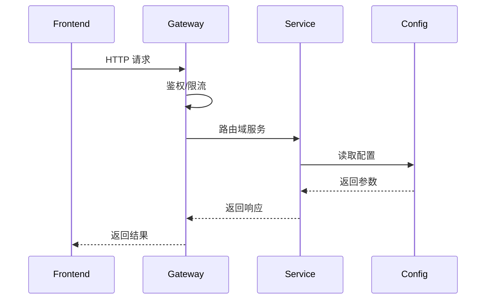
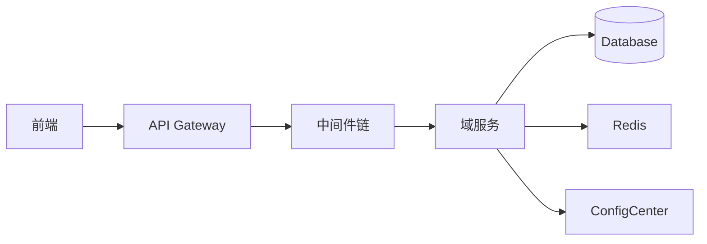

# [08] 后端服务模块设计稿

Created: 2026-07-29 Status: Draft

---

## 1. 用途

后端服务模块是统一入口，负责鉴权、路由、配置中心、日志、健康检查和跨域协作。

---

## 2. 最重要 3 点

### 2.1 数据结构设计

```sql
create table system_configs
(
    id         bigint primary key generated always as identity,
    key        varchar(128) not null unique,
    value      jsonb,
    scope      varchar(64),
    updated_by bigint references users (id),
    updated_at timestamptz default now()
);

create table request_audits
(
    id         bigint primary key generated always as identity,
    user_id    bigint references users (id),
    method     varchar(16),
    path       text,
    status     int,
    latency_ms int,
    created_at timestamptz default now()
);
```

### 2.2 数据流转过程



### 2.3 总体架构



参考 open-ai-canvas：

- 后端入口：`D:\GoWorkSpace\open-ai-canvas\backend\cmd`
- 内部服务：`D:\GoWorkSpace\open-ai-canvas\backend\internal`

---

## 3. 接口清单（MVP）

| 方法 | 路径                  | 说明     |
|------|-----------------------|----------|
| GET  | /api/v1/health        | 健康检查 |
| GET  | /api/v1/configs       | 公开配置 |
| GET  | /api/v1/admin/configs | 管理配置 |
| PUT  | /api/v1/admin/configs | 更新配置 |

---

## 4. 依赖模块

| 模块         | 依赖说明          |
|--------------|-------------------|
| 所有业务模块 | 统一入口          |
| 基础设施模块 | 数据库/Redis/部署 |

---

## 5. 与 open-ai-canvas 的映射

| 我们的模块   | open-ai-canvas 对应 |
|--------------|---------------------|
| 后端服务模块 | backend Go 服务     |
| 配置中心     | 系统配置与资源策略  |
