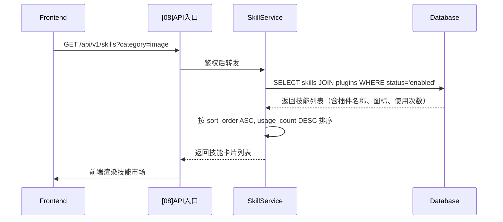
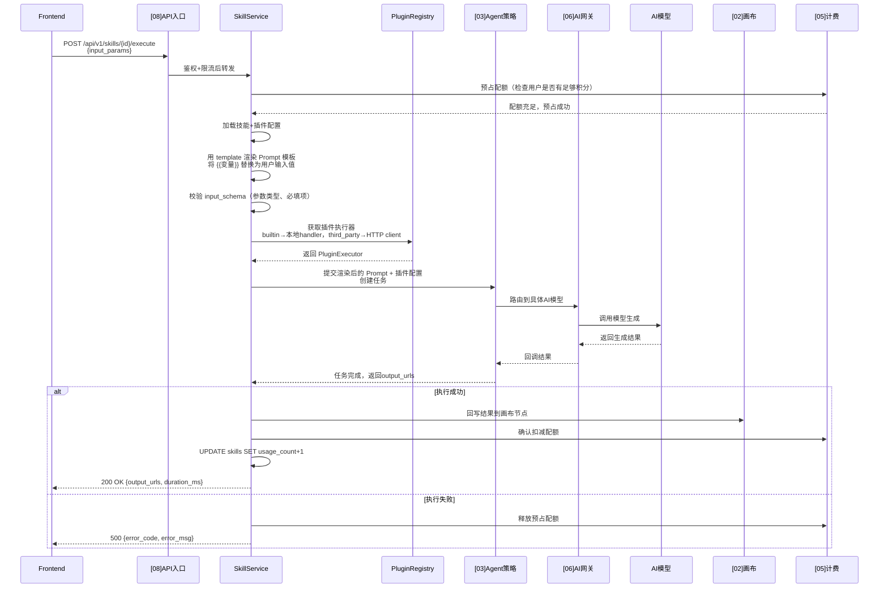
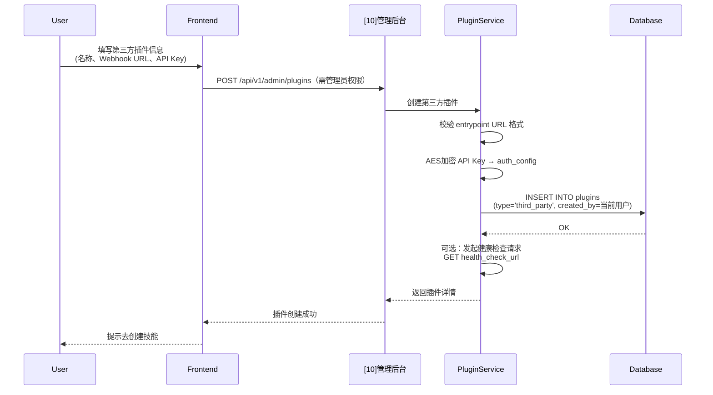
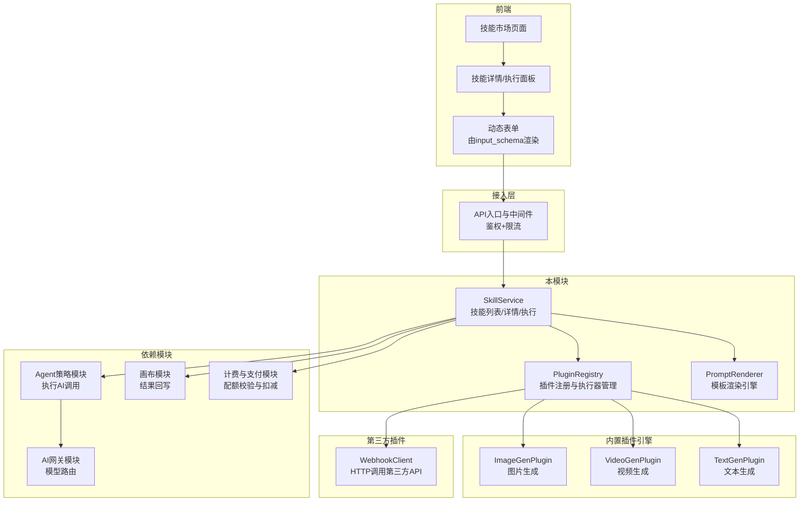
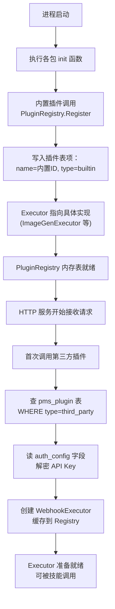
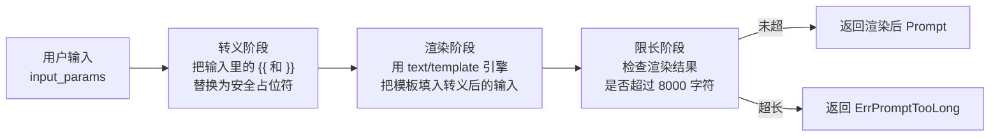

# [09] 插件与技能模块设计稿

Created: 2026-07-29 | Status: Draft
Updated: 2026-07-30 — 全量补全DDL、数据流转、接口清单、实现要点、新人指南

---

## 1. 用途

插件与技能模块是 x-media 的**能力扩展层**，负责：

- **插件管理**：注册和管理 AI 能力提供者（内置引擎 / 第三方 API / Webhook），作为技能的执行底座
- **技能管理**：管理预配置的 Prompt 模板 + 输入参数 Schema，将插件能力封装为「一键可用」的创作模板
- **技能执行**：接收用户输入 → 渲染 Prompt 模板 → 调用 Agent 策略模块执行 → 回写结果到画布

核心区分：

| 概念 | 一句话解释 | 谁维护 | 举例 |
|------|-----------|--------|------|
| **插件（Plugin）** | AI 能力提供者，定义「能做什么」 | 开发/运维 | `builtin_image_gen`（内置图片生成引擎） |
| **技能（Skill）** | 能力的封装模板，定义「怎么做」 | 产品/运营 | 「生成电影海报」：选 `builtin_image_gen` 插件 + 填入海报 Prompt 模板 |

一个插件可以挂载多个技能，一个技能必须属于一个插件。用户在前端看到的是技能列表，插件对普通用户透明。

---

## 2. 最重要 3 点

### 2.1 数据结构设计

> **数据库方言：PostgreSQL 16+**，与项目基础设施模块保持一致。
>
> **新人提示**：`JSONB` 是 PostgreSQL 的二进制 JSON 类型，支持索引和查询，适合存灵活结构的配置数据。
> `REFERENCES plugins(id)` 表示外键约束，删除插件时会阻止删除被技能引用的插件。

核心表设计：

```sql
-- ============================================================
-- 表1：插件注册表
-- 说明：管理所有插件——内置引擎和用户注册的第三方插件
-- 场景：系统启动时加载内置插件、用户配置第三方API、插件状态管理
-- ============================================================
CREATE TABLE plugins
(
  -- 【主键】插件唯一ID，自增，系统内部引用
  id           BIGINT PRIMARY KEY GENERATED ALWAYS AS IDENTITY,

  -- 【插件名称】系统内唯一标识，用于代码中引用
  -- 内置插件命名规范：builtin_ 前缀，如 builtin_image_gen
  -- 第三方插件不加前缀，由用户自定义
  name         VARCHAR(255) UNIQUE NOT NULL,

  -- 【显示名称】前端展示用，支持中文，可重名
  -- 例："图片生成引擎"、"视频生成引擎"、"我的StableDiffusion服务"
  display_name VARCHAR(255)        NOT NULL,

  -- 【插件类型】'builtin'=系统内置插件（代码中注册，不可删除，默认启用）
  --            'third_party'=用户配置的第三方插件（通过 Webhook / API 调用）
  -- 内置插件在系统启动时自动注册，type 为 builtin 的插件不展示「删除」按钮
  type         VARCHAR(32)         NOT NULL DEFAULT 'builtin',

  -- 【入口点】插件的调用入口，根据 type 不同含义不同
  -- builtin 类型：Go 代码中注册的 handler 名称，如 "ImageGenPlugin"
  -- third_party 类型：第三方服务的 Webhook URL，如 "https://api.example.com/v1/generate"
  -- 系统通过 PluginRegistry 查找对应的 handler 或发起 HTTP 调用
  entrypoint   TEXT                NOT NULL,

  -- 【版本号】语义化版本，如 "1.2.0"，用于兼容性检查和升级提示
  version      VARCHAR(64),

  -- 【配置参数】JSONB，插件级别的全局配置，所有使用该插件的技能共享
  -- 示例：{"base_url": "https://api.openai.com", "max_retry": 3, "timeout_seconds": 60}
  -- 内置插件通过代码中的默认值填充，第三方插件由用户配置时填写
  config       JSONB,

  -- 【认证配置】JSONB，存储第三方插件的 API Key 等敏感信息
  -- ⚠️ 必须加密存储（AES-256-GCM），日志中不能打印此字段
  -- 示例：{"auth_type": "bearer", "api_key": "encrypted_xxx", "header_name": "Authorization"}
  auth_config  JSONB,

  -- 【插件清单】JSONB，前端展示用的元数据
  -- {"description": "生成高质量图片", "icon": "🖼️", "author": "x-media", "capabilities": ["text2img","img2img"]}
  manifest     JSONB,

  -- 【状态】'enabled'=正常运行，'disabled'=已停用，'error'=调用异常（连续失败N次自动标记）
  -- 停用的插件下所有技能在前端置灰、不可执行
  status       VARCHAR(32)         NOT NULL DEFAULT 'enabled',

  -- 【错误信息】status='error' 时记录最后一次错误详情，方便运维排查
  error_msg    TEXT,

  -- 【健康检查URL】third_party 类型选填，系统定期 GET 此 URL 检测第三方服务可用性
  health_check_url VARCHAR(512),

  -- 【创建者】user_id，NULL=系统内置，非NULL=某用户创建的第三方插件
  -- 第三方插件归创建者所有，只有创建者和管理员可以编辑/删除
  created_by   BIGINT,

  -- 【创建时间】
  created_at   TIMESTAMPTZ         NOT NULL DEFAULT now(),

  -- 【更新时间】
  updated_at   TIMESTAMPTZ         NOT NULL DEFAULT now()
);

-- 按类型+状态查询（管理后台插件列表、健康检查任务扫描）
CREATE INDEX idx_plugins_type_status ON plugins (type, status);

COMMENT ON TABLE  plugins IS '插件注册表：管理内置引擎和用户注册的第三方AI能力提供者';
COMMENT ON COLUMN plugins.id               IS '插件唯一ID，自增主键';
COMMENT ON COLUMN plugins.name             IS '插件唯一标识名，内置插件以builtin_开头';
COMMENT ON COLUMN plugins.display_name     IS '前端展示名称，支持中文';
COMMENT ON COLUMN plugins.type             IS '插件类型：builtin=系统内置，third_party=用户配置';
COMMENT ON COLUMN plugins.entrypoint       IS '调用入口：内置为handler名，第三方为Webhook URL';
COMMENT ON COLUMN plugins.version          IS '语义化版本号';
COMMENT ON COLUMN plugins.config           IS 'JSONB：全局配置参数，所有使用此插件的技能共享';
COMMENT ON COLUMN plugins.auth_config      IS 'JSONB：认证信息，加密存储，日志不可打印';
COMMENT ON COLUMN plugins.manifest         IS 'JSONB：前端展示元数据（描述、图标、能力列表）';
COMMENT ON COLUMN plugins.status           IS '状态：enabled=正常，disabled=停用，error=异常';
COMMENT ON COLUMN plugins.error_msg        IS 'status=error时的错误详情';
COMMENT ON COLUMN plugins.health_check_url IS '第三方插件健康检查URL';
COMMENT ON COLUMN plugins.created_by       IS '创建者user_id，NULL表示系统内置';
COMMENT ON COLUMN plugins.created_at       IS '创建时间';
COMMENT ON COLUMN plugins.updated_at       IS '更新时间';


-- ============================================================
-- 表2：技能模板表
-- 说明：存储所有可用的技能——即「Prompt模板 + 参数Schema」组合
-- 场景：前端技能市场列表、技能详情展示、执行时加载模板渲染Prompt
-- ============================================================
CREATE TABLE skills
(
  -- 【主键】技能唯一ID
  id               BIGINT PRIMARY KEY GENERATED ALWAYS AS IDENTITY,

  -- 【所属插件】技能属于哪个插件，决定了执行时调用哪个引擎
  -- 删除插件时如果存在关联技能，会因外键约束阻止删除（需先手动解绑或迁移技能）
  plugin_id        BIGINT       NOT NULL REFERENCES plugins (id),

  -- 【技能名称】展示名称，同一插件下不可重复
  -- 例："生成电影海报"、"生成产品宣传片"、"AI写文案"
  name             VARCHAR(255) NOT NULL,

  -- 【技能描述】详细说明用途和效果，前端卡片展示和Tooltip
  -- 示例："输入产品名称和风格，自动生成符合品牌调性的营销海报，支持16:9和1:1两种尺寸"
  description      TEXT,

  -- 【分类标签】用于前端分组筛选和技能市场分类
  -- 建议值：'image_generation' | 'video_generation' | 'image_editing'
  --        'text_generation' | 'audio_generation' | '3d_generation' | 'utility'
  category         VARCHAR(64),

  -- 【提示词模板】核心字段：AI提示词模板，使用 {{变量名}} 作为占位符
  -- 执行时将用户输入值替换占位符，渲染为最终发送给AI模型的Prompt
  -- 示例：
  --   "为「{{product_name}}」生成一张{{style}}风格的海报，
  --    色调{{color_tone}}，尺寸{{width}}x{{height}}，
  --    要求：{{extra_requirements}}"
  prompt_template  TEXT         NOT NULL,

  -- 【输入参数Schema】JSON Schema 格式，定义用户需要填写的参数
  -- 前端根据此Schema动态渲染表单（文本框/下拉/滑块/颜色选择器等）
  -- 示例：
  -- {
  --   "type": "object",
  --   "properties": {
  --     "product_name": {"type": "string", "title": "产品名称"},
  --     "style": {"type": "string", "title": "风格", "enum": ["写实", "卡通", "赛博朋克", "水墨"]},
  --     "width": {"type": "integer", "title": "宽度", "default": 1024},
  --     "height": {"type": "integer", "title": "高度", "default": 1024}
  --   },
  --   "required": ["product_name", "style"]
  -- }
  input_schema     JSONB,

  -- 【输出类型】决定生成结果显示方式：'image'|'video'|'text'|'audio'|'3d'|'file'
  output_type      VARCHAR(32),

  -- 【图标】前端展示用 Emoji 或 Icon 名称，如 "🎬" "🖼️" "✍️"
  icon             VARCHAR(32),

  -- 【封面图】技能展示封面URL，在技能市场卡片中使用
  cover_url        TEXT,

  -- 【排序权重】数字越小越靠前，运营可通过调整此值控制推荐位
  sort_order       INT          NOT NULL DEFAULT 0,

  -- 【使用次数】每次执行 +1，用于「热门技能」排序
  usage_count      BIGINT       NOT NULL DEFAULT 0,

  -- 【示例输出】JSONB：执行示例的输入和输出URL，供用户预览效果
  -- [{"input": {"style":"写实"}, "output_url": "https://cdn.xxx/example1.png"}]
  examples         JSONB,

  -- 【标签】JSONB字符串数组：["海报","营销","快速出图"]，用于搜索和推荐
  tags             JSONB,

  -- 【状态】'enabled'=可用，'disabled'=已下架（前端不展示）
  status           VARCHAR(32)  NOT NULL DEFAULT 'enabled',

  -- 【创建者】user_id，NULL=系统预置技能，非NULL=用户自定义技能
  created_by       BIGINT,

  -- 【创建时间】
  created_at       TIMESTAMPTZ  NOT NULL DEFAULT now(),

  -- 【更新时间】
  updated_at       TIMESTAMPTZ  NOT NULL DEFAULT now(),

  -- 同一插件下技能名称唯一（不同插件可以有同名技能）
  UNIQUE (plugin_id, name)
);

-- 按分类+状态查询（前端技能列表页最常用查询）
CREATE INDEX idx_skills_category_status ON skills (category, status) WHERE status = 'enabled';

-- 按使用次数排序（热门技能推荐）
CREATE INDEX idx_skills_usage ON skills (usage_count DESC) WHERE status = 'enabled';

COMMENT ON TABLE  skills IS '技能模板表：存储Prompt模板+参数Schema，封装插件能力为可用的创作技能';
COMMENT ON COLUMN skills.id              IS '技能唯一ID';
COMMENT ON COLUMN skills.plugin_id       IS '所属插件ID，决定执行引擎';
COMMENT ON COLUMN skills.name            IS '技能展示名称，同一插件下唯一';
COMMENT ON COLUMN skills.description     IS '技能详细描述';
COMMENT ON COLUMN skills.category        IS '分类标签，用于前端分组';
COMMENT ON COLUMN skills.prompt_template IS '核心：AI提示词模板，{{变量名}}为占位符';
COMMENT ON COLUMN skills.input_schema    IS 'JSON Schema：定义用户输入参数，前端动态渲染表单';
COMMENT ON COLUMN skills.output_type     IS '输出类型：决定生成结果的展示方式';
COMMENT ON COLUMN skills.icon            IS '前端展示用图标';
COMMENT ON COLUMN skills.cover_url       IS '技能封面图URL';
COMMENT ON COLUMN skills.sort_order      IS '排序权重，越小越靠前';
COMMENT ON COLUMN skills.usage_count     IS '使用次数计数器，用于热门排序';
COMMENT ON COLUMN skills.examples        IS 'JSONB：执行示例，供用户预览效果';
COMMENT ON COLUMN skills.tags            IS 'JSONB数组：技能标签，用于搜索和推荐';
COMMENT ON COLUMN skills.status          IS '状态：enabled=可用，disabled=已下架';
COMMENT ON COLUMN skills.created_by      IS '创建者user_id，NULL表示系统预置';
COMMENT ON COLUMN skills.created_at      IS '创建时间';
COMMENT ON COLUMN skills.updated_at      IS '更新时间';


-- ============================================================
-- 表3：技能执行记录表（MVP+1 阶段启用）
-- 说明：追踪每次技能执行的输入/输出/耗时/结果，用于统计和排错
-- 场景：用户查看执行历史、运营分析技能使用数据、开发排查执行失败原因
-- ============================================================
CREATE TABLE skill_executions
(
  -- 【主键】执行记录唯一ID
  id            BIGINT PRIMARY KEY GENERATED ALWAYS AS IDENTITY,

  -- 【技能ID】执行的技能
  skill_id      BIGINT       NOT NULL REFERENCES skills (id),

  -- 【执行用户】谁触发了这次执行
  user_id       BIGINT       NOT NULL,

  -- 【画布节点ID】可选，关联到画布模块的某个节点，用于回写结果
  canvas_node_id VARCHAR(128),

  -- 【输入参数】JSONB：用户实际填写的参数值
  -- 示例：{"product_name": "Nike Air Max", "style": "赛博朋克", "width": 1024, "height": 1024}
  input_params  JSONB        NOT NULL,

  -- 【渲染后的Prompt】将 input_params 填入 prompt_template 后的最终Prompt文本
  -- 存下来方便排查「Prompt写得不好」vs「模型效果差」
  rendered_prompt TEXT,

  -- 【执行状态】'pending'=排队中，'running'=执行中，'completed'=成功，'failed'=失败
  status        VARCHAR(32)  NOT NULL DEFAULT 'pending',

  -- 【输出结果】JSONB：执行结果
  -- 成功时：{"output_urls": ["https://cdn.xxx/result1.png"], "output_type": "image"}
  -- 失败时：{"error_code": "TIMEOUT", "error_msg": "AI模型响应超时，请重试"}
  result        JSONB,

  -- 【耗时】毫秒，从提交到拿到最终结果的总时间
  duration_ms   INTEGER,

  -- 【消耗积分】本次执行消耗的积分/配额
  cost_credits  INTEGER,

  -- 【任务ID】关联到 [04]任务调度模块 的任务记录，方便追溯全链路
  task_id       BIGINT,

  -- 【创建时间】执行开始时间
  created_at    TIMESTAMPTZ  NOT NULL DEFAULT now(),

  -- 【完成时间】
  finished_at   TIMESTAMPTZ
);

-- 按用户+创建时间查询（「我的执行历史」页面）
CREATE INDEX idx_skill_executions_user_time ON skill_executions (user_id, created_at DESC);

-- 按技能ID+状态查询（运营分析某个技能的成功率）
CREATE INDEX idx_skill_executions_skill_status ON skill_executions (skill_id, status);

COMMENT ON TABLE  skill_executions IS '技能执行记录表：追踪每次执行的输入/输出/耗时（MVP+1阶段启用）';
COMMENT ON COLUMN skill_executions.id              IS '执行记录唯一ID';
COMMENT ON COLUMN skill_executions.skill_id        IS '执行的技能ID';
COMMENT ON COLUMN skill_executions.user_id         IS '执行用户ID';
COMMENT ON COLUMN skill_executions.canvas_node_id  IS '关联的画布节点ID，用于回写结果';
COMMENT ON COLUMN skill_executions.input_params    IS 'JSONB：用户实际填写的参数';
COMMENT ON COLUMN skill_executions.rendered_prompt IS '渲染后的最终Prompt文本，用于排错';
COMMENT ON COLUMN skill_executions.status          IS '执行状态：pending/running/completed/failed';
COMMENT ON COLUMN skill_executions.result          IS 'JSONB：成功时含output_urls，失败时含错误码和错误信息';
COMMENT ON COLUMN skill_executions.duration_ms     IS '执行耗时（毫秒）';
COMMENT ON COLUMN skill_executions.cost_credits    IS '本次消耗的积分';
COMMENT ON COLUMN skill_executions.task_id         IS '关联的任务调度模块任务ID';
COMMENT ON COLUMN skill_executions.created_at      IS '开始执行时间';
COMMENT ON COLUMN skill_executions.finished_at     IS '执行完成时间';
```

设计说明：

- **插件类型差异**：`builtin` 插件启动时通过代码自动注册，不可删除；`third_party` 插件由用户通过管理界面创建，可删除。
- **auth_config 安全**：`plugins.auth_config` 存储 API Key 等敏感信息，**必须 AES-256-GCM 加密存储**，日志脱敏，接口返回时返回 `"***"` 掩码。
- **技能归属**：一个技能必须属于一个插件，`plugin_id` 为外键。删除插件前需先迁移或删除其下所有技能。
- **input_schema 即表单**：前端完全由 `skills.input_schema` 驱动渲染，后端无需为每个技能写表单代码。比如 `enum` 字段 → 下拉框，`integer` 字段 → 数字输入框，`boolean` → 开关。
- **Prompt 渲染**：执行时用 Go 的 `text/template` 将 `input_params` 填入 `prompt_template` 的 `{{变量名}}` 占位符，生成最终 Prompt。变量名必须与 `input_schema.properties` 的 key 一致。
- **技能分类建议**：分类标签 `category` 推荐从以下枚举中选择，方便前端建立分类Tab：`image_generation`、`video_generation`、`image_editing`、`text_generation`、`audio_generation`、`3d_generation`、`utility`。
- **skill_executions 为 MVP+1**：MVP 阶段 `skill_executions` 只建表不实现写入逻辑，先让用户能执行技能、拿到结果。执行历史功能后续迭代中加入。
- **usage_count 计数**：每次技能执行成功时 `UPDATE skills SET usage_count = usage_count + 1`。简化为数据库自增，不用 Redis 计数器（执行频率不高，DB 直接更新足够）。如后续 QPS 上升再引入 Redis 异步合并写入。

---

### 2.2 数据流转过程

#### 2.2.1 技能发现与列表



#### 2.2.2 技能执行流程（核心流程）



#### 2.2.3 第三方插件注册流程



关键流转规则：

- 技能执行分三步不能跳：**配额预占 → Prompt渲染与参数校验 → 提交Agent任务**。任何一步失败都终止流程。
- 配额预占在调用 AI 模型**之前**完成，确保不会产生「生成了但没钱付」的情况。执行失败时释放预占。
- Prompt 渲染使用 Go `text/template`，变量名必须与 `input_schema.properties` 的 key 完全一致。如果模板引用了 `input_params` 中不存在的变量，直接返回 400 错误。
- 第三方插件的 API Key 在写入数据库时 AES 加密，读取时解密后注入 HTTP Header，绝不把明文 Key 返回给前端。
- 画布回写是异步操作，不阻塞技能执行结果返回。回写失败只记录日志，不影响用户看到生成结果。

---

### 2.3 总体架构



架构说明：

- **SkillService** 是模块对外唯一入口，负责技能 CRUD 和执行的编排。
- **PluginRegistry** 维护「插件名 → 执行器」的映射表。`builtin` 插件在系统启动时通过 `init()` 注册，`third_party` 插件在首次调用时延迟加载并缓存配置。
- **PromptRenderer** 封装 `text/template`，负责将用户输入填入模板。额外做安全校验：防止 Prompt 注入攻击（如用户输入中包含 `{{}}` 试图注入模板语法 → 自动转义）。
- 技能执行本身**不直接调用 AI 模型**，而是将渲染后的 Prompt 提交给 `[03]Agent策略模块`，由 Agent 模块负责调用 AI 网关和模型路由。插件与技能模块只管「组织输入、编排流程、处理结果」。

参考 infinite-canvas：
- 插件目录：`D:\GoWorkSpace\infinite-canvas\plugins`
- infinite-canvas 的插件系统是基于目录扫描的本地插件，x-media 扩展为 DB 驱动 + 支持第三方 Webhook。

---

## 3. 接口清单（MVP）

### 3.1 技能相关接口

| 方法 | 路径 | 鉴权 | 说明 |
|------|------|------|------|
| GET | `/api/v1/skills` | 否 | 技能列表（支持 ?category=&tag=&keyword=&sort=popular\|newest） |
| GET | `/api/v1/skills/{id}` | 否 | 技能详情（含 input_schema、示例、使用次数） |
| POST | `/api/v1/skills/{id}/execute` | 是 | 执行技能：提交 input_params，返回 {task_id, status} |
| GET | `/api/v1/skills/{id}/executions` | 是 | 当前用户对该技能的执行历史（MVP+1） |
| GET | `/api/v1/skills/categories` | 否 | 获取所有分类标签及每个分类下的技能数量 |

### 3.2 技能执行结果查询

| 方法 | 路径 | 鉴权 | 说明 |
|------|------|------|------|
| GET | `/api/v1/skills/executions/{execution_id}` | 是 | 查询某次执行的详情和结果 |
| GET | `/api/v1/skills/executions/{execution_id}/result` | 是 | 下载/获取生成结果文件 |

### 3.3 用户自定义技能（MVP+1）

| 方法 | 路径 | 鉴权 | 说明 |
|------|------|------|------|
| POST | `/api/v1/skills` | 是 | 创建自定义技能（绑定已有插件，自定义 Prompt 模板） |
| PUT | `/api/v1/skills/{id}` | 是 | 编辑自己的技能 |
| DELETE | `/api/v1/skills/{id}` | 是 | 删除自己的技能 |

### 3.4 插件管理（管理后台）

| 方法 | 路径 | 鉴权 | 说明 |
|------|------|------|------|
| GET | `/api/v1/admin/plugins` | 管理员 | 插件列表（含状态、健康检查结果） |
| GET | `/api/v1/admin/plugins/{id}` | 管理员 | 插件详情 |
| POST | `/api/v1/admin/plugins` | 管理员 | 注册第三方插件 |
| PUT | `/api/v1/admin/plugins/{id}` | 管理员 | 更新插件配置 |
| DELETE | `/api/v1/admin/plugins/{id}` | 管理员 | 删除第三方插件（内置插件不可删除） |
| POST | `/api/v1/admin/plugins/{id}/health-check` | 管理员 | 手动触发健康检查 |

### 3.5 运营管理接口

| 方法 | 路径 | 鉴权 | 说明 |
|------|------|------|------|
| GET | `/api/v1/admin/skills` | 管理员 | 全部技能列表（含 disabled 的） |
| POST | `/api/v1/admin/skills` | 管理员 | 创建系统预置技能 |
| PUT | `/api/v1/admin/skills/{id}` | 管理员 | 编辑技能（含调整 sort_order、status） |
| POST | `/api/v1/admin/skills/{id}/toggle` | 管理员 | 上架/下架技能 |
| GET | `/api/v1/admin/skills/stats` | 管理员 | 技能使用统计（总量、排行、成功率） |

---

## 4. 实现要点

### 4.1 PluginRegistry 注册机制

内置插件在进程启动时通过 `init()` 注册到 PluginRegistry；第三方插件运行时从 DB 加载，按需创建对应的 WebhookExecutor。



注册时机要点：

- **内置插件**：编译期就确定，启动即注册，无需 DB 数据
- **第三方插件**：懒加载——首次有技能调用时才查 DB、解密 Key、实例化 Executor，之后缓存复用
- **Registry 本质**是 `map[plugin_name]PluginExecutor`，线程安全（读写锁）

### 4.2 Prompt 渲染与防注入

模板渲染顺序：**转义 → 渲染 → 限长**。三步必须串行，缺一不可。



防注入要点：

| 步骤 | 做什么 | 为什么 |
|------|--------|--------|
| 转义 | 替换用户输入中的 `{{` `}}` | 防止用户构造 `{{.SystemPrompt}}` 之类的模板语法窃取内部提示词 |
| 渲染 | 标准模板引擎执行 | 把定义好的变量填到模板对应槽位 |
| 限长 | 拒绝 >8000 字符的输出 | 避免用户用超长 Prompt 拖垮下游模型 API（成本/超时） |

### 4.3 第三方插件 API Key 加密

- 写入时：`AES-256-GCM(apiKey, masterKey)` → 存入 `auth_config`
- 读取时：`AES-256-GCM-Decrypt(auth_config.api_key, masterKey)` → 注入 HTTP Header
- `masterKey` 从环境变量或密钥管理服务获取，不硬编码
- 日志中 `auth_config` 字段统一替换为 `[REDACTED]`

### 4.4 技能执行幂等性

- 前端可能重复提交执行请求（用户双击按钮）。后端通过**请求去重**保证幂等：用 `(user_id, skill_id, input_hash, 5分钟窗口)` 做去重 key，存入 Redis `SET NX EX 300`。同一用户在 5 分钟内用相同参数执行同一技能，返回第一次的任务 ID。
- 重复提交返回 HTTP 200 + 已有 task_id，而不是 409 冲突。

### 4.5 画布回写

- 技能执行成功后，调用 `[02]画布模块` 的内部接口将生成结果写入画布节点
- 回写是**异步 + 重试**的：失败自动重试 3 次，间隔 1s/3s/5s
- 最终都失败时记录 WARN 日志，但不影响技能执行的成功状态

---

## 5. 依赖模块

| 模块 | 接口路径 | 用途 |
|------|----------|------|
| [03] Agent策略模块 | `POST /api/v1/agent/spec/{id}/submit` | 执行 AI Prompt，获取生成结果 |
| [06] AI网关模块 | 间接（通过 [03] 调用 `POST /api/v1/gateway/invoke`） | 不直接感知具体模型 |
| [02] 画布模块 | `POST /internal/projects/{id}/nodes` | 执行成功后异步回写生成结果到画布节点 |
| [05] 计费与支付模块 | `POST /internal/v1/quota/reserve` / `settle` / `refund` | 预占/扣减/释放 |
| [08] API入口与中间件模块 | 中间件链：AuthMiddleware 注入 `user_id` 到 context | 鉴权 |
| [04] 任务调度模块 | `POST /api/v1/tasks` | 技能执行本质上是创建一个异步任务 |
| [07] 存储模块 | `POST /api/v1/storage/upload-url` | 生成的媒体文件上传到 OSS |
| [10] 管理后台模块 | `POST /api/v1/admin/plugins/*` 等 | 插件管理和技能管理的管理后台接口 |

---

## 6. 与 open-ai-canvas 的差异点

| 差异项 | open-ai-canvas | x-media |
|--------|---------------|---------|
| 插件发现 | 目录扫描（文件系统） | 数据库驱动 + 系统启动时自动注册 |
| 插件类型 | 仅本地内置插件 | 内置 + 第三方 Webhook 两种 |
| 技能/Template | 无独立技能概念 | 技能 = Plugin + Prompt模板 + 参数Schema，独立管理 |
| 参数校验 | 无 Schema 校验 | JSON Schema 校验 + 前端动态表单渲染 |
| 执行追踪 | 无执行记录 | skill_executions 表追踪全链路（MVP+1） |
| 第三方API Key管理 | 硬编码或环境变量 | 数据库 AES-256-GCM 加密存储 |
| 插件健康检查 | 无 | 支持 health_check_url 定期探测 |
| 技能市场 | 无 | 分类、标签、热门排行、示例预览 |
| 用户自定义 | 不支持 | 支持用户创建自定义技能（MVP+1） |
| Prompt注入防护 | 无 | 自动转义 {{}} 防注入 |

---

## 7. 新人开发指南

### 7.1 快速理解这 3 张表

| 表名 | 一句话解释 | 什么时候有数据 |
|------|-----------|---------------|
| `plugins` | AI 引擎和能力提供者的注册表 | 系统启动时自动注册内置插件，用户可在后台添加第三方插件 |
| `skills` | 预配置的「Prompt模板 + 参数Schema」 | 系统预置 + 运营配置 + 用户自定义（MVP+1） |
| `skill_executions` | 每次执行技能的记录 | 用户点击技能执行时写入，MVP 阶段只建表不写数据 |

### 7.2 动手之前先理解这些概念

1. **插件 ≠ 技能**：插件是发动机，技能是车。用户选的是「开什么车」（技能），不关心发动机是什么品牌（插件）。一个插件可以挂 N 个技能（比如图片生成插件可以挂「电影海报」「产品主图」「社交配图」等多个技能）。

2. **input_schema 驱动一切**：前端不写死任何表单，完全由 `skills.input_schema` 这个 JSON Schema 渲染。后端也不为每个技能写校验代码，统一用 `gojsonschema` 库校验。加新技能 = 在数据库插一行 `skills` 数据，**零代码**。

3. **Prompt 模板的 {{ }} 是占位符**：`"为{{name}}生成{{style}}图片"` + 用户填 `{"name":"产品A", "style":"写实"}` → 渲染为 `"为产品A生成写实图片"`。如果用户输入中包含 `{{`，会被转义为安全文本，防止 Prompt 注入攻击。

4. **技能执行 = 异步任务**：点击「生成」后，后端立即返回一个 `task_id`，前端轮询或通过 WebSocket 等待结果。这不是同步接口（一张图可能要生成 30 秒），用户不需要干等着。

5. **配额预占是安全边界**：AI 生成要花钱，所以执行技能前先扣配额。如果用户积分不够，直接返回 402 Payment Required，不会走到 AI 调用。

### 7.3 团队分工建议

| 角色 | 负责内容 |
|------|----------|
| 后端 A | `plugins` 表 + PluginRegistry 注册机制 + 内置插件 Executor 实现 |
| 后端 B | `skills` 表 + 技能 CRUD + 技能列表/搜索/分类接口 |
| 后端 C | 技能执行流程：Prompt渲染 + input_schema校验 + 插件调用编排 |
| 后端 D | 与 Agent/计费/画布的集成：配额预占、任务提交、结果回写 |
| 后端 E（MVP+1） | `skill_executions` 表 + 执行历史 + 第三方插件 API Key 加密 |

### 7.4 开发顺序

| 阶段 | 内容 | 产出 |
|------|------|------|
| 第1天 | plugins 表 + 技能表建表，PluginRegistry 框架 | 插件能注册，技能能 CRUD |
| 第2天 | 技能执行流程（Prompt渲染 + Agent调用） | 能执行技能并拿到结果 |
| 第3天 | 配额预占/扣减、画布回写 | 打通完整执行链路 |
| 第4天 | 技能市场前端（列表/搜索/分类） | 用户能浏览和执行技能 |

### 7.5 新人避坑指南

| # | 坑 | 正确做法 |
|---|-----|----------|
| 1 | 以为技能执行是同步接口 | 执行是异步的，返回 task_id，前端轮询 getResult |
| 2 | 忽略 Prompt 注入风险 | 用户输入中的 `{{` 和 `}}` 必须转义，否则可能注入模板语法 |
| 3 | API Key 打印到日志 | auth_config 写入日志前必须脱敏为 `[REDACTED]` |
| 4 | 忘记释放预占配额 | 执行失败的 error 分支务必调 releaseQuota()，否则用户积分被锁 |
| 5 | input_schema 与 prompt_template 变量名不一致 | prompt_template 中的 `{{变量名}}` 必须与 input_schema.properties 的 key 完全对应 |
| 6 | 插件删除时不检查关联技能 | 有外键约束保护，但应该在前端提示：「该插件下有 N 个技能，删除前请先迁移」 |
| 7 | 第三方插件的 Webhook URL 不做超时控制 | HTTP Client 必须设 timeout（建议 3s 连接超时 + 60s 读取超时） |
| 8 | Prompt 模板无限长 | 渲染后 Prompt 限制 8000 字符，超长返回 400 错误 |

---

## 8. 跨模块影响

本模块新增/变更时，以下模块需要注意联动：

| 影响模块 | 影响说明 | 优先级 |
|----------|----------|--------|
| [03] Agent策略模块 | 技能执行会将渲染后的 Prompt 提交给 Agent，Agent 需要暴露统一的任务提交接口 | 高 |
| [05] 计费与支付模块 | 每次技能执行前需预占配额、成功后确认扣减，计费模块需提供 `POST /internal/v1/quota/reserve` / `settle` / `refund` 三个接口 | 高 |
| [02] 画布模块 | 生成结果需要回写到画布节点，画布模块需提供 `POST /internal/projects/{id}/nodes` 内部接口 | 中 |
| [04] 任务调度模块 | 技能执行在任务调度模块创建异步任务，需统一 task 模型 | 中 |
| [10] 管理后台模块 | 插件的增删改查、技能上下架等管理功能放在管理后台 | 中 |
| [07] 存储模块 | 生成的媒体文件需上传到 OSS/COS 获取 URL | 低 |
| [08] API入口与中间件模块 | 需要在路由表中新增 `/api/v1/skills/*` 和 `/api/v1/admin/plugins/*` 等路由规则 | 低 |
