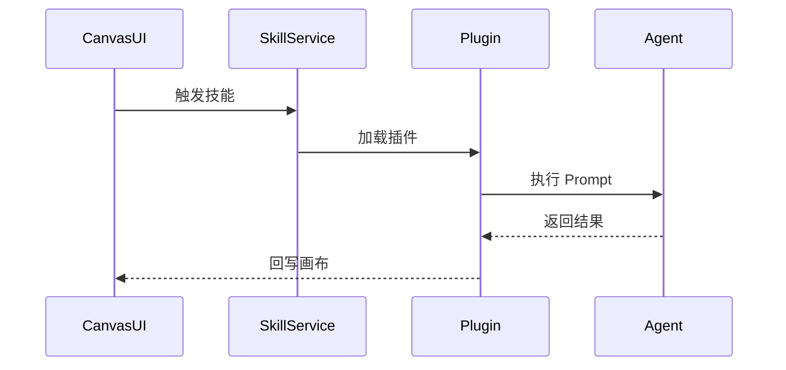
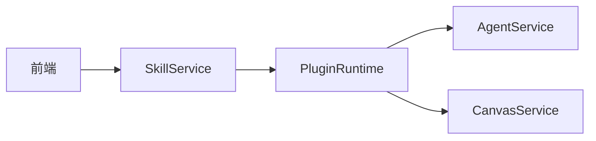

# [09] 插件与技能模块设计稿

Created: 2026-07-29 Status: Draft

---

## 1. 用途

插件与技能模块用于扩展画布和 Agent 能力，支持第三方插件、技能模板与可执行工作流。

---

## 2. 最重要 3 点

### 2.1 数据结构设计

```sql
create table plugins
(
    id         bigint primary key generated always as identity,
    name       varchar(255) not null,
    version    varchar(64),
    entrypoint text,
    config     jsonb,
    status     varchar(32) default 'enabled',
    created_at timestamptz default now()
);

create table skills
(
    id              bigint primary key generated always as identity,
    plugin_id       bigint references plugins (id),
    name            varchar(255) not null,
    prompt_template text,
    input_schema    jsonb,
    created_at      timestamptz default now()
);
```

### 2.2 数据流转过程



### 2.3 总体架构



参考 open-ai-canvas：

- 插件目录：`D:\GoWorkSpace\open-ai-canvas\plugins\infinite-canvas`

---

## 3. 接口清单（MVP）

| 方法 | 路径               | 说明     |
|------|--------------------|----------|
| GET  | /api/v1/skills     | 技能列表 |
| POST | /api/v1/skills/run | 执行技能 |
| GET  | /api/v1/plugins    | 插件列表 |

---

## 4. 依赖模块

| 模块          | 依赖说明    |
|---------------|-------------|
| 画布模块      | 回写结果    |
| Agent策略模块 | Prompt 执行 |

---

## 5. 与 open-ai-canvas 的映射

| 我们的模块     | open-ai-canvas 对应     |
|----------------|-------------------------|
| 插件与技能模块 | plugins/infinite-canvas |
