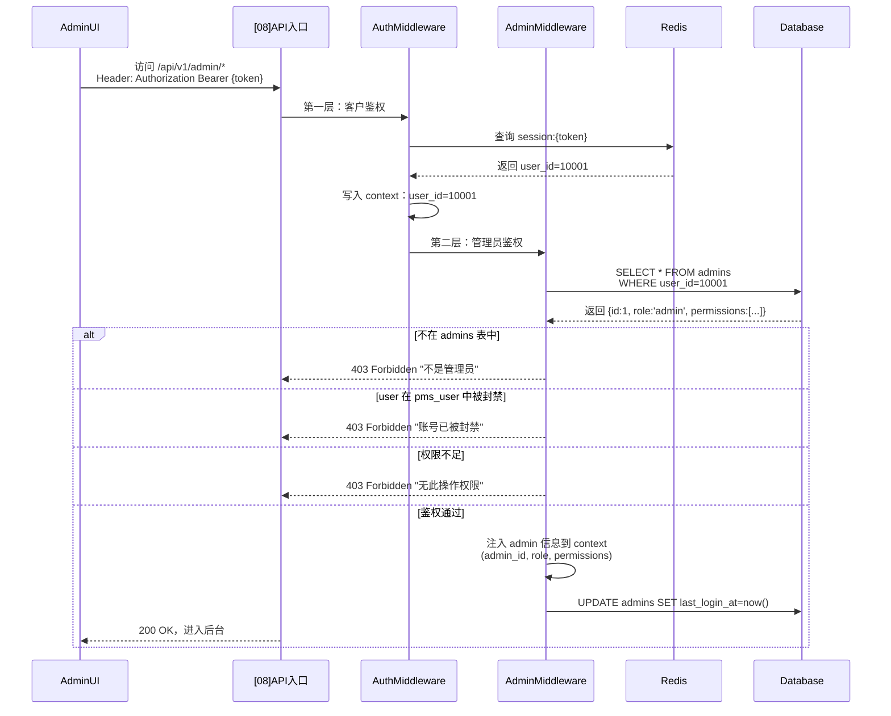
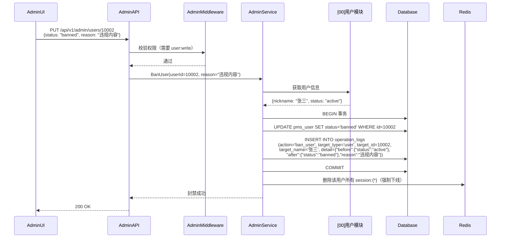
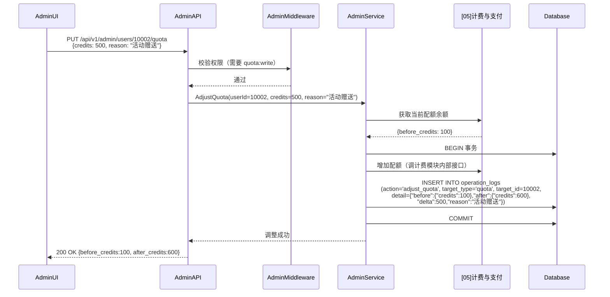
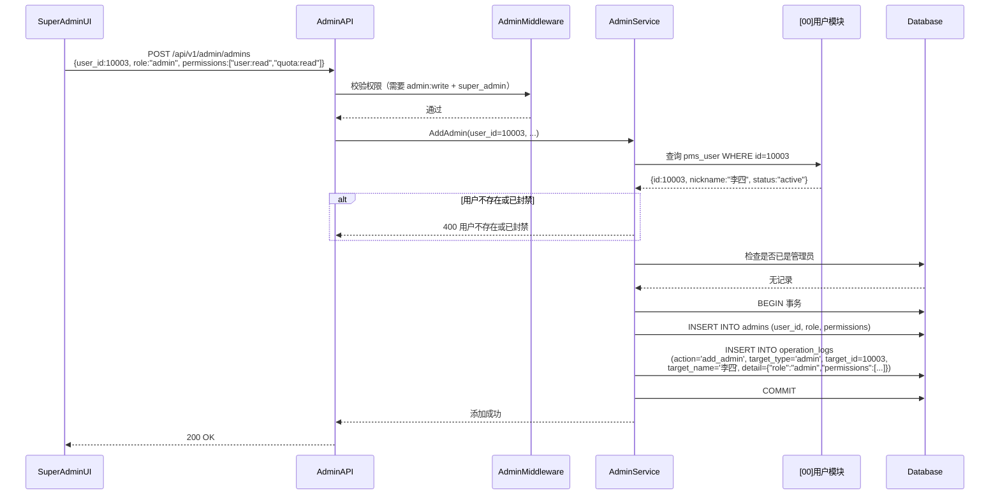
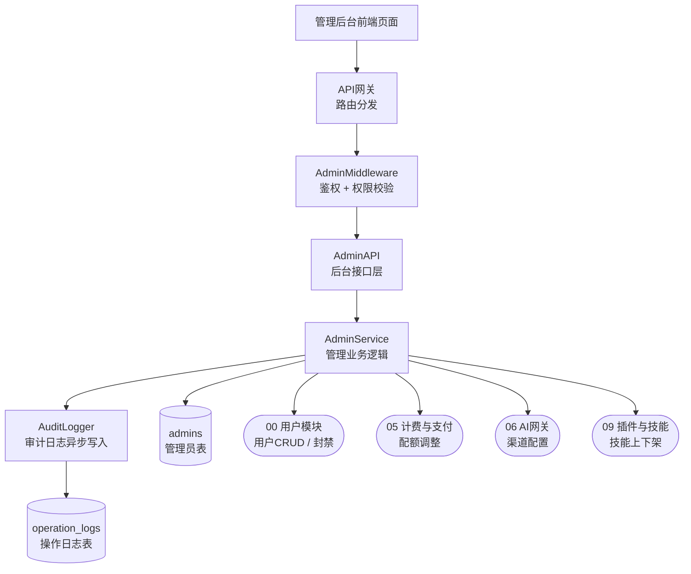
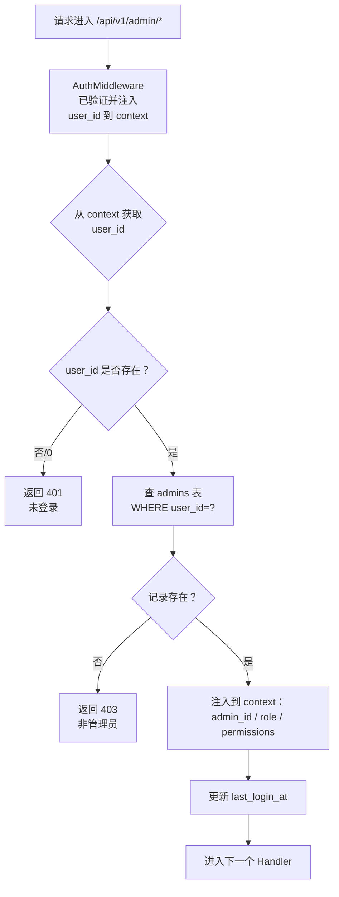
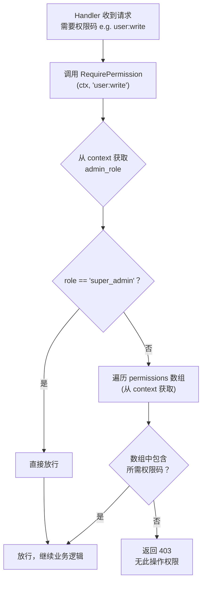

# [10] 管理后台模块设计稿

Created: 2026-07-29 | Status: Draft
Updated: 2026-07-30 — 全量补全：DDL 索引、数据流转子流程、接口清单、实现要点、新人指南

---

## 1. 用途

管理后台模块面向运营与管理员，是 x-media 的**后台运营控制中心**，负责：

- **管理员账号与权限**：管理谁能进后台、能操作什么，与客户用户身份彻底解耦
- **客户用户管理**：查询、封禁/解封客户用户（读写 `[00]` 的 `pms_user` 表）
- **渠道管理**：管理 AI 模型渠道路由配置（读写 `[06]` 的 channels 数据）
- **配额管理**：查看和调整用户配额额度（读写 `[05]` 的配额数据）
- **技能与插件管理**：上下架技能、注册第三方插件（读写 `[09]` 的 skills/plugins 数据）
- **操作审计**：所有管理操作全量记录到 `operation_logs`，支持事后回溯
- **数据看板**：用户数、生成量、收入等核心指标的 Dashboard

> **与 [00]用户模块 的关系**：`[00]` 的 `pms_user` 是纯客户表，不含管理员标记。
> 本模块通过 `admins` 表（`admins.user_id → pms_user.id`）单独管理"谁是管理员"，
> 实现客户身份与管理身份彻底解耦。一个用户在 `pms_user` 中存在不代表他是管理员，
> 必须在 `admins` 表中也有记录才能访问后台。

---

## 2. 最重要 3 点

### 2.1 数据结构设计

> **数据库方言：PostgreSQL 16+**，与项目基础设施模块保持一致。

本模块自身只维护 2 张表——管理员和操作日志。其他管理功能（用户列表、渠道配置、配额调整）操作的是其他模块的表，不在本模块建冗余表。

```sql
-- ============================================================
-- 表1：管理员表
-- 说明：通过 user_id 关联客户用户表，赋予后台管理权限
-- 场景：管理员登录校验、权限判断、管理员列表管理
-- ============================================================
CREATE TABLE admins
(
  -- 【主键】管理员记录唯一ID
  id          BIGINT PRIMARY KEY GENERATED ALWAYS AS IDENTITY,

  -- 【用户ID】关联到客户端用户表 pms_user
  -- 只有在此表中有记录的用户才能访问管理后台
  -- 一个 user_id 在 admins 表中最多只能有一条记录
  user_id     BIGINT       NOT NULL,

  -- 【管理员角色】'super_admin'=超级管理员（全部权限，不可删除，不可降级）
  --               'admin'=普通管理员（按 permissions 字段控制具体权限）
  -- 系统初始化时必须通过 SQL 脚本插入至少一个 super_admin
  role        VARCHAR(32)  NOT NULL DEFAULT 'admin',

  -- 【权限列表】JSONB 字符串数组，精细控制每个 admin 可操作的范围
  -- super_admin 此字段为 NULL，表示全部权限
  -- 权限粒度格式：{资源}:{操作}，如 "user:read"、"quota:write"
  -- 可用权限：
  --   user:read, user:write        — 客户用户查看/封禁
  --   channel:read, channel:write  — 渠道路由配置
  --   quota:read, quota:write      — 配额查看/调整
  --   skill:read, skill:write      — 技能上下架
  --   plugin:read, plugin:write    — 插件管理
  --   admin:read, admin:write      — 管理员管理（仅 super_admin 可操作）
  --   log:read                     — 操作日志查看
  --   dashboard:read               — 数据看板
  permissions JSONB,

  -- 【备注】内部备注，如"张三，运营部，负责渠道管理"
  note        TEXT,

  -- 【最后登录后台时间】每次通过后台鉴权时更新
  last_login_at TIMESTAMPTZ,

  -- 【创建时间】设为管理员的时间
  created_at  TIMESTAMPTZ  NOT NULL DEFAULT now()
);

-- 加速"按 user_id 查询是否为管理员"（高频：每个后台请求都要校验）
CREATE UNIQUE INDEX idx_admins_user_id ON admins (user_id);

COMMENT ON TABLE  admins IS '管理员表：通过user_id关联客户用户，控制谁能访问管理后台';
COMMENT ON COLUMN admins.id            IS '管理员记录唯一ID';
COMMENT ON COLUMN admins.user_id       IS '关联pms_user表的用户ID，有记录才能进后台';
COMMENT ON COLUMN admins.role          IS '管理员角色：super_admin=超管（全权限+不可删），admin=普通管理员';
COMMENT ON COLUMN admins.permissions   IS '权限列表JSON，如["user:read","quota:write"]，super_admin此字段为NULL';
COMMENT ON COLUMN admins.note          IS '内部备注，描述管理员身份和负责范围';
COMMENT ON COLUMN admins.last_login_at IS '最近一次登录管理后台的时间';
COMMENT ON COLUMN admins.created_at    IS '设为管理员的时间';


-- ============================================================
-- 表2：操作日志表
-- 说明：记录所有管理员的后台操作，全量保留用于审计
-- 场景：事后排查"谁在什么时候做了什么"、合规审计、安全回溯
-- ============================================================
CREATE TABLE operation_logs
(
  -- 【主键】日志唯一ID
  id          BIGINT PRIMARY KEY GENERATED ALWAYS AS IDENTITY,

  -- 【操作人】执行操作的 admin 记录ID，关联 admins 表
  -- 设为 NULL 是为了防止管理员被删除后日志丢失——即使管理员被移除，日志依然可查
  admin_id    BIGINT,

  -- 【操作人姓名】冗余字段，操作发生时记录 admin 关联的 pms_user.nickname
  -- 好处：管理员被删除后，仍然能一眼看出是谁操作的，不需要 JOIN 查询
  admin_name  VARCHAR(100),

  -- 【操作动作】简短的动作标识，如 'ban_user'、'update_channel'、'adjust_quota'、'create_skill'
  action      VARCHAR(128) NOT NULL,

  -- 【操作目标类型】被操作资源类型，如 'user'、'channel'、'quota'、'skill'、'plugin'、'admin'
  target_type VARCHAR(64),

  -- 【操作目标ID】被操作的记录ID，如用户ID、渠道ID
  target_id   BIGINT,

  -- 【操作目标名称】冗余字段，被操作对象的展示名称，如用户昵称、渠道名
  target_name VARCHAR(255),

  -- 【操作详情】JSONB，记录变更前后的值对比，用于审计回溯
  -- 示例：{"before": {"status": "active"}, "after": {"status": "banned"}, "reason": "违规发布内容"}
  detail      JSONB,

  -- 【操作IP】管理员操作时的客户端IP地址
  ip_address  VARCHAR(64),

  -- 【操作UserAgent】浏览器/客户端信息
  user_agent  TEXT,

  -- 【操作时间】
  created_at  TIMESTAMPTZ  NOT NULL DEFAULT now()
);

-- 按操作时间倒序查询（操作日志列表页最常用）
CREATE INDEX idx_operation_logs_created_at ON operation_logs (created_at DESC);

-- 按操作人+时间查询（排查某个管理员的操作记录）
CREATE INDEX idx_operation_logs_admin_time ON operation_logs (admin_id, created_at DESC);

-- 按目标定位（排查"谁动过这个用户/渠道"）
CREATE INDEX idx_operation_logs_target ON operation_logs (target_type, target_id);

COMMENT ON TABLE  operation_logs IS '管理员操作日志表：记录所有后台操作，全量保留用于审计和回溯';
COMMENT ON COLUMN operation_logs.id          IS '日志唯一ID';
COMMENT ON COLUMN operation_logs.admin_id    IS '操作人admin_id，管理员被删除时为NULL但日志保留';
COMMENT ON COLUMN operation_logs.admin_name  IS '操作人昵称（冗余），管理员被删除后仍可识别';
COMMENT ON COLUMN operation_logs.action      IS '操作动作：ban_user/update_channel/adjust_quota等';
COMMENT ON COLUMN operation_logs.target_type IS '被操作资源类型：user/channel/quota/skill/plugin/admin';
COMMENT ON COLUMN operation_logs.target_id   IS '被操作的目标记录ID';
COMMENT ON COLUMN operation_logs.target_name IS '被操作对象名称（冗余），如用户昵称、渠道名';
COMMENT ON COLUMN operation_logs.detail      IS '操作详情JSON：before/after值对比+操作原因';
COMMENT ON COLUMN operation_logs.ip_address  IS '操作时的客户端IP地址';
COMMENT ON COLUMN operation_logs.user_agent  IS '操作时的浏览器/客户端信息';
COMMENT ON COLUMN operation_logs.created_at  IS '操作时间';
```

设计说明：

- **管理员与客户解耦**：`pms_user` 不存 `role` 字段区分管理员，由 `admins` 表单独管理。好处：客户表纯净、管理权限独立演化、支持一人同时是客户+管理员。
- **admin_id 可 NULL**：`operation_logs.admin_id` 不放外键约束，管理员被移除后日志不丢失。通过 `admin_name` 冗余字段仍可识别操作人。
- **权限粒度**：`admins.permissions` 使用 `{资源}:{操作}` 格式，如 `user:read`。AdminMiddleware 校验时检查 `permissions` 数组是否包含所需权限。`super_admin` 的 `permissions` 为 NULL 表示全部权限。
- **操作日志全量保留**：不设清理策略，不物理删除。日志量预估：日均 100 次操作 × 365 天 = 约 3.6 万条/年，PostgreSQL 轻松承载，无需分区。
- **target_name 冗余**：操作日志中存被操作对象的名称（如用户昵称），避免后期查询时 JOIN 可能已不存在的记录。
- **初始化脚本**：系统部署时必须执行初始化 SQL，插入第一个 `super_admin`（手动指定 `user_id`），否则后台无人能登录。

---

### 2.2 数据流转过程

#### 2.2.1 管理员登录与鉴权（两层校验）



#### 2.2.2 封禁用户操作流程



#### 2.2.3 调整用户配额流程



#### 2.2.4 添加管理员流程（仅 super_admin）



关键流转规则：

- 后台鉴权是**两层校验**：第一层 `AuthMiddleware` 确认是合法登录用户，第二层 `AdminMiddleware` 确认是管理员且权限足够。两层任一失败都返回 403。
- 封禁用户时**同时删除 Redis session**，确保被封禁用户立即被踢下线，不能靠 TTL 自然过期。
- 所有管理写操作**必须在同一事务中写入 operation_logs**，确保「操作成功 = 日志写入」，不留审计盲区。
- 配额调整不是直接改余额，而是调用 `[05]计费与支付模块` 的内部接口（如 `GrantCredits`），让计费模块自己管理余额一致性。
- 添加管理员前必须校验目标用户 `pms_user.status = 'active'`，被封禁的用户不能被设为管理员。

---

### 2.3 总体架构



**层层拆解（从外到内）：**

| 层级 | 节点 | 职责 |
|------|------|------|
| 第1层·前端 | 管理后台前端页面 | 独立 SPA，使用 AdminLayout（菜单+权限控制） |
| 第2层·网关 | API网关 | 路由分发：`/api/v1/admin/*` 打到 AdminAPI |
| 第3层·鉴权 | AdminMiddleware | 两层校验：① 从 context 拿 user_id（AuthMiddleware 已注入）② 查 admins 表确认身份 ③ 校验 permissions 是否包含当前操作所需权限码 |
| 第4层·接口 | AdminAPI | 后台接口层：接收 HTTP 请求 → 参数校验 → 调 Service |
| 第5层·业务 | AdminService | 核心逻辑：封禁用户、调整配额、管理渠道、上下架技能，不直连外部模块的数据库，通过**内部接口**调用 |
| 第6层·审计 | AuditLogger | 异步写 operation_logs，不阻塞接口响应 |
| 第7层·存储 | admins + operation_logs | 本模块仅 2 张表，其余数据读写在各自模块中 |
| 被管目标 | 00/05/06/09 模块 | AdminService 通过各模块暴露的**内部接口**读写，不越界 |

**关键设计原则：**

- **本模块是「聚合管理面」**：自身只有 2 张表，大部分操作是聚合调用其他模块的内部接口完成
- **不越界**：AdminService 不直接 `SELECT/UPDATE` 其他模块的数据库表，只能通过对方暴露的内部方法操作
- **审计异步**：AuditLogger 通过 channel 异步写日志，不阻塞 HTTP 响应，channel 满时降级同步写入保证不丢数据

参考 open-ai-canvas：
- 运维后台能力参考 README 中「系统配置 → 资源与策略」

---

## 3. 接口清单（MVP）

> 所有后台接口统一前缀 `/api/v1/admin`，全部需要管理员鉴权。

### 3.1 管理员认证

| 方法 | 路径 | 鉴权 | 说明 |
|------|------|------|------|
| GET | `/api/v1/admin/me` | 管理员 | 获取当前登录管理员的角色和权限列表 |
| GET | `/api/v1/admin/me/permissions` | 管理员 | 返回当前管理员拥有的所有权限码 |

### 3.2 管理员管理（仅 super_admin）

| 方法 | 路径 | 鉴权 | 说明 |
|------|------|------|------|
| GET | `/api/v1/admin/admins` | super_admin | 管理员列表（含角色、权限、最后登录时间） |
| POST | `/api/v1/admin/admins` | super_admin | 添加管理员（写入 admins 表） |
| PUT | `/api/v1/admin/admins/{id}` | super_admin | 修改管理员角色和权限 |
| DELETE | `/api/v1/admin/admins/{id}` | super_admin | 移除管理员（不可移除自己） |

### 3.3 客户用户管理

| 方法 | 路径 | 鉴权 | 说明 |
|------|------|------|------|
| GET | `/api/v1/admin/users` | user:read | 客户用户列表（分页+搜索：支持邮箱/昵称/状态筛选） |
| GET | `/api/v1/admin/users/{id}` | user:read | 用户详情（含注册时间、最后登录、配额余额、生成统计） |
| PUT | `/api/v1/admin/users/{id}` | user:write | 更新用户（封禁/解封/修改昵称） |
| PUT | `/api/v1/admin/users/{id}/quota` | quota:write | 调整用户配额（增加/减少，必填原因） |

### 3.4 渠道管理

| 方法 | 路径 | 鉴权 | 说明 |
|------|------|------|------|
| GET | `/api/v1/admin/channels` | channel:read | 渠道列表（读取 [06]AI网关 数据） |
| GET | `/api/v1/admin/channels/{id}` | channel:read | 渠道详情（含调用量、成功率统计） |
| PUT | `/api/v1/admin/channels/{id}` | channel:write | 更新渠道配置（模型/API Key/权重等） |
| POST | `/api/v1/admin/channels/{id}/toggle` | channel:write | 启用/停用渠道 |

### 3.5 技能与插件管理

| 方法 | 路径 | 鉴权 | 说明 |
|------|------|------|------|
| GET | `/api/v1/admin/skills` | skill:read | 全部技能列表（含已下架的） |
| POST | `/api/v1/admin/skills` | skill:write | 创建系统预置技能 |
| PUT | `/api/v1/admin/skills/{id}` | skill:write | 编辑技能（Prompt模板/参数/排序） |
| POST | `/api/v1/admin/skills/{id}/toggle` | skill:write | 上架/下架技能 |
| GET | `/api/v1/admin/plugins` | plugin:read | 插件列表（含状态、健康检查结果） |
| POST | `/api/v1/admin/plugins` | plugin:write | 注册第三方插件 |

### 3.6 操作日志

| 方法 | 路径 | 鉴权 | 说明 |
|------|------|------|------|
| GET | `/api/v1/admin/logs` | log:read | 操作日志列表（分页+筛选：按操作人/动作/目标类型/时间范围） |
| GET | `/api/v1/admin/logs/{id}` | log:read | 操作日志详情（含完整 detail JSON） |

### 3.7 数据看板

| 方法 | 路径 | 鉴权 | 说明 |
|------|------|------|------|
| GET | `/api/v1/admin/dashboard/overview` | dashboard:read | 核心指标：总用户数/日活/总生成量/今日生成量/总收入 |
| GET | `/api/v1/admin/dashboard/trends` | dashboard:read | 趋势图数据：近30天注册/生成/消费趋势 |
| GET | `/api/v1/admin/dashboard/top-skills` | dashboard:read | 热门技能排行 Top 10 |

---

## 4. 实现要点

### 4.1 AdminMiddleware 两层鉴权流程

后端路由注册时对 `/api/v1/admin/*` 路径挂载 AdminMiddleware，挂载顺序：`AuthMiddleware → AdminMiddleware → Handler`。



### 4.2 权限校验流程

每个 Handler 执行业务逻辑前调用 `RequirePermission(ctx, 所需权限码)`，校验当前管理员是否有操作权限。



### 4.3 操作日志异步写入

- 操作日志不应阻塞管理操作的 HTTP 响应，使用带缓冲 channel 异步写入
- channel 满时降级为同步写入（保证日志不丢），并告警
- `admin_name` 和 `target_name` 在写入时从对应表查询并填充，方便后期直接查看
- `ip_address` 从 HTTP Header `X-Forwarded-For` 或 `X-Real-IP` 获取
- 日志写入失败只记 ERROR 日志，不影响管理操作的成功返回

### 4.4 封禁用户时的连带操作

封禁用户后需同步执行：
1. `UPDATE pms_user SET status='banned'` — 改状态
2. `DELETE FROM Redis session:{user的所有token}` — 强制踢下线（需用 SCAN 遍历 `session:*` 匹配 user_id）
3. `INSERT INTO operation_logs` — 记录审计

以上步骤在同一事务中完成（Redis 操作除外，Redis 删除失败不影响封禁结果，记录 WARN 日志）。

### 4.5 配额调整的幂等性

- 配额调整接口可能被重试，需保证不重复扣加
- 用 `(admin_id, user_id, credits, reason_hash, 5分钟窗口)` 做幂等 key，存入 Redis `SET NX EX 300`
- 重复请求返回 HTTP 200，不产生重复的 `operation_logs` 记录

---

## 5. 依赖模块

| 模块 | 依赖方式 | 依赖说明 |
|------|----------|----------|
| [00] 用户模块 | 读写 pms_user 表（通过内部接口） | 客户用户列表查询、封禁/解封、用户详情 |
| [00] 用户模块 | Redis session:{token} | 封禁时删除用户 session 强制踢下线 |
| [05] 计费与支付模块 | 内部接口（GrantCredits/DeductCredits） | 查看/调整用户配额余额 |
| [06] AI网关模块 | 内部接口 | 渠道的增删改查、启用停用 |
| [09] 插件与技能模块 | 内部接口 | 技能上下架、第三方插件注册 |
| [08] API入口与中间件模块 | 中间件链 | AuthMiddleware → AdminMiddleware 两层鉴权 |
| [11] 基础设施模块 | 数据库/Redis | 基础设施提供 DB 和 Redis 连接 |

---

## 6. 与 open-ai-canvas 的差异点

| 差异项 | open-ai-canvas | x-media |
|--------|---------------|---------|
| 管理后台 | 无独立管理后台，配置写代码/环境变量 | 独立管理后台模块，面向运营人员 |
| 管理员身份 | 无明确管理员概念 | admins 表独立管理，与 pms_user 解耦 |
| 权限模型 | 无 | RBAC：super_admin + admin 两级 + 资源级 permissions |
| 操作审计 | 无操作日志 | operation_logs 全量记录，含变更前后值和操作原因 |
| 用户管理 | 无用户管理体系 | 封禁/解封、配额调整、用户详情看板 |
| 渠道管理 | 配置在代码中 | 后台可视化配置，启用/停用/权重调整 |
| 技能管理 | 无 | 后台配置 Prompt 模板、上下架管理 |
| 数据看板 | 无 | Dashboard：用户/生成/收入核心指标 |
| 管理员登录 | 无 | 复用客户登录 token + admins 表二层校验 |

---

## 7. 新人开发指南

### 7.1 快速理解这 2 张表

| 表名 | 一句话解释 | 什么时候有数据 |
|------|-----------|---------------|
| `admins` | 谁可以进管理后台、有什么权限 | 系统初始化 + super_admin 手动添加管理员 |
| `operation_logs` | 管理员做了什么操作的全量记录 | 每次管理写操作时自动写入 |

### 7.2 动手之前先理解这些概念

1. **两层鉴权**：每个后台请求先过 `AuthMiddleware`（你是不是合法登录用户），再过 `AdminMiddleware`（你是不是管理员+有没有这个权限）。缺一不可。

2. **管理后台是「聚合面」不是「数据拥有者」**：后台能管用户、配额、渠道、技能，但这些数据的主体存在各自模块的表里。后台通过调用各模块的内部接口来操作，不直接写 SQL。

3. **permissions 是细粒度权限**：`admins.permissions` 数组存的不是布尔值，是 `"资源:操作"` 字符串。比如 `["user:read", "user:write", "quota:read"]` 表示「能看用户、能管用户、能看配额，但不能改配额」。前端根据这个数组决定显示哪些菜单和按钮。

4. **操作日志异步写，不丢数据**：日志写入不阻塞接口响应（通过 channel 异步写），但 channel 满时降级为同步写入防止日志丢失。这是典型的「非关键路径异步化」。

5. **封禁 = 改状态 + 踢下线**：不能只改 `pms_user.status='banned'`，必须同时删除 Redis session 强制下线。否则被封禁的人只要 token 没过期就还能继续用。

### 7.3 团队分工建议

| 角色 | 负责内容 |
|------|----------|
| 后端 A | `admins` 表 + AdminMiddleware（两层鉴权+权限校验） |
| 后端 B | `operation_logs` 表 + AuditLogger（异步日志写入） |
| 后端 C | 客户用户管理接口（用户列表/封禁/详情）+ 配额调整接口 |
| 后端 D | 渠道管理 + 技能/插件管理接口（对接 [06] 和 [09] 的内部接口） |
| 后端 E | 数据看板 Dashboard（聚合查询各模块统计数据） |

### 7.4 开发顺序

| 阶段 | 内容 | 产出 |
|------|------|------|
| 第1天 | admins 表 + AdminMiddleware + 初始化脚本 | 后台能登录，能校验管理员身份 |
| 第2天 | operation_logs 表 + AuditLogger + 客户用户管理 | 能查用户列表、封禁用户、查看操作日志 |
| 第3天 | 渠道管理 + 技能/插件管理接口 | 后台能配置渠道、上下架技能 |
| 第4天 | 配额调整 + 数据看板 Dashboard | 配额可调、核心指标可看 |

### 7.5 新人避坑指南

| # | 坑 | 正确做法 |
|---|-----|----------|
| 1 | 忘记封禁时踢下线 | 改 status='banned' 后必须删 Redis session，否则被封用户继续可用 |
| 2 | 操作日志同步写入拖慢接口 | 用 channel 异步写，channel 满时降级同步写入并告警 |
| 3 | super_admin 可以被删除/降级 | super_admin 的删除和角色修改必须在后端阻止，不能只靠前端隐藏按钮 |
| 4 | 配额调整为负数 | 调整前校验余额 + delta >= 0（不能扣成负的，但运营可以设为零） |
| 5 | 删除管理员导致日志丢失 | operation_logs.admin_id 不要设外键，admin_name 冗余保存 |
| 6 | 权限校验只在前端做 | 前端隐藏按钮只是 UX，后端每个接口都要 RequirePermission |
| 7 | 初始化忘记创建 super_admin | 部署文档必须包含初始化 SQL 脚本，插入第一个 super_admin |
| 8 | 添加管理员时不校验用户状态 | 被封禁的用户不能被设为管理员 |

---

## 8. 跨模块影响

本模块新增/变更时，以下模块需要注意联动：

| 影响模块 | 影响说明 | 优先级 |
|----------|----------|--------|
| [08] API入口与中间件模块 | 需要新增 AdminMiddleware，挂在 AuthMiddleware 之后，仅对 `/api/v1/admin/*` 生效 | 高 |
| [00] 用户模块 | 封禁用户时需要 [00] 暴露 `BanUser(userId)` 和 `GetUserSessions(userId)` 内部接口 | 高 |
| [05] 计费与支付模块 | 配额调整需要 [05] 暴露 `GrantCredits` 和 `GetBalance` 内部接口 | 高 |
| [06] AI网关模块 | 渠道管理需要 [06] 暴露渠道 CRUD 和 toggle 内部接口 | 中 |
| [09] 插件与技能模块 | 技能/插件管理需要 [09] 暴露管理接口（创建/编辑/上下架） | 中 |
| [11] 基础设施模块 | DB 迁移脚本需包含 admins 和 operation_logs 建表 + 初始 super_admin 插入 | 中 |
