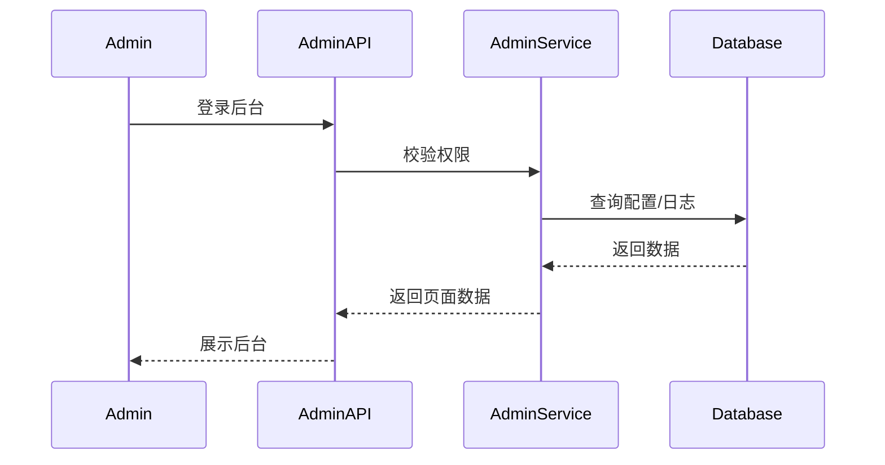
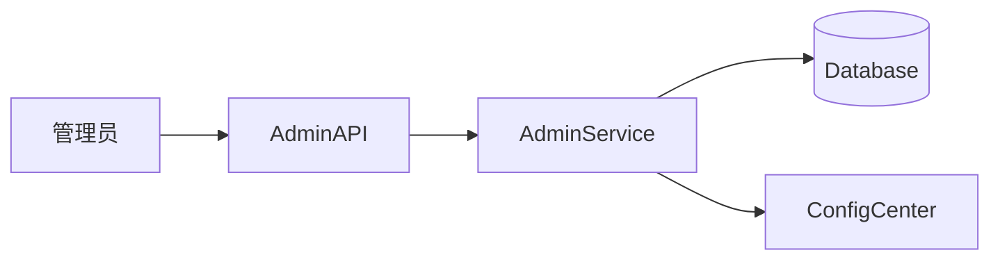

# [10] 管理后台模块设计稿

Created: 2026-07-29 Status: Draft

---

## 1. 用途

管理后台模块面向运营与管理员，负责用户、渠道、配额、日志、配置与监控的统一管理。

---

## 2. 最重要 3 点

### 2.1 数据结构设计

```sql
create table admins
(
    id          bigint primary key generated always as identity,
    user_id     bigint not null references users (id),
    role        varchar(32) default 'admin',
    permissions jsonb,
    created_at  timestamptz default now()
);

create table operation_logs
(
    id          bigint primary key generated always as identity,
    admin_id    bigint references admins (id),
    action      varchar(128),
    target_type varchar(64),
    target_id   bigint,
    created_at  timestamptz default now()
);
```

### 2.2 数据流转过程



### 2.3 总体架构



参考 open-ai-canvas：

- 运维后台能力参考 README 中“系统配置 -> 资源与策略”

---

## 3. 接口清单（MVP）

| 方法 | 路径                        | 说明     |
|------|-----------------------------|----------|
| GET  | /api/v1/admin/users         | 用户列表 |
| PUT  | /api/v1/admin/users/{id}    | 更新用户 |
| GET  | /api/v1/admin/channels      | 渠道列表 |
| PUT  | /api/v1/admin/channels/{id} | 更新渠道 |
| GET  | /api/v1/admin/logs          | 操作日志 |

---

## 4. 依赖模块

| 模块         | 依赖说明   |
|--------------|------------|
| 用户模块     | 账号管理   |
| AI网关模块   | 渠道管理   |
| 任务调度模块 | 任务与日志 |

---

## 5. 与 open-ai-canvas 的映射

| 我们的模块   | open-ai-canvas 对应    |
|--------------|------------------------|
| 管理后台模块 | 系统配置与资源策略后台 |
