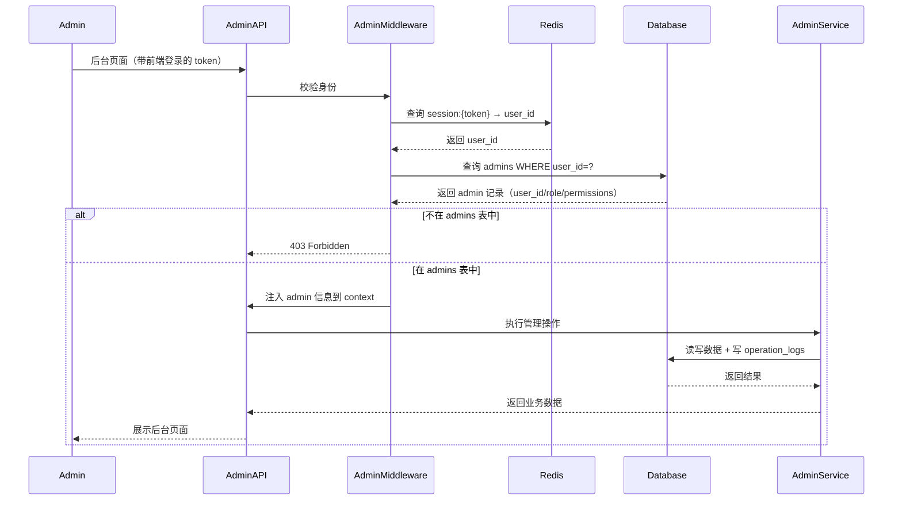
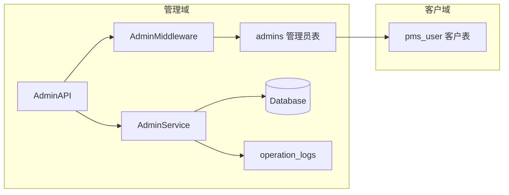

# [10] 管理后台模块设计稿

Created: 2026-07-29 | Status: Draft
Updated: 2026-07-29 — 修复 admins 表外键引用，统一 DDL 注释规范

---

## 1. 用途

管理后台模块面向运营与管理员，负责用户、渠道、配额、日志、配置与监控的统一管理。

> **与 [00]用户模块 的关系**：`[00]` 的 `pms_user` 是纯客户表，不含管理员标记。
> 本模块通过 `admins` 表（`admins.user_id → pms_user.id`）单独管理"谁是管理员"，
> 实现客户身份与管理身份彻底解耦。

---

## 2. 最重要 3 点

### 2.1 数据结构设计

```sql
-- 管理员表：通过 user_id 关联客户用户表，赋予后台管理权限
-- 不在 pms_user 表中加 role 字段，保持客户表纯净
CREATE TABLE admins
(
    -- 【主键】管理员记录唯一ID
    id          BIGINT PRIMARY KEY GENERATED ALWAYS AS IDENTITY,

    -- 【用户ID】关联到客户端用户表 pms_user，只有在此表中的用户才能访问管理后台
    user_id     BIGINT NOT NULL REFERENCES pms_user (id),

    -- 【管理员角色】'super_admin'=超级管理员（全部权限）
    --               'admin'=普通管理员（按 permissions 字段控制）
    role        VARCHAR(32) NOT NULL DEFAULT 'admin',

    -- 【权限列表】JSON 数组，精细控制每个管理员可操作的范围
    -- 示例：["user:read","user:write","channel:read","quota:write"]
    -- super_admin 此字段可为 NULL（表示全部权限）
    permissions JSONB,

    -- 【创建时间】
    created_at  TIMESTAMPTZ NOT NULL DEFAULT now()
);

COMMENT ON TABLE  admins IS '管理员表：通过user_id关联客户用户，控制谁能访问管理后台';
COMMENT ON COLUMN admins.user_id     IS '关联pms_user表的用户ID，有记录才能进后台';
COMMENT ON COLUMN admins.role        IS '管理员角色：super_admin=超管，admin=普通管理员';
COMMENT ON COLUMN admins.permissions IS '权限列表JSON，如["user:read","channel:write"]';
COMMENT ON COLUMN admins.created_at  IS '设为管理员的时间';

CREATE TABLE operation_logs
(
    -- 【主键】日志唯一ID
    id          BIGINT PRIMARY KEY GENERATED ALWAYS AS IDENTITY,

    -- 【操作人】执行操作的管理员ID
    admin_id    BIGINT REFERENCES admins (id),

    -- 【操作动作】例如 'ban_user'、'update_channel'、'adjust_quota'
    action      VARCHAR(128),

    -- 【操作目标类型】例如 'user'、'channel'、'quota'
    target_type VARCHAR(64),

    -- 【操作目标ID】被操作的记录的ID
    target_id   BIGINT,

    -- 【操作详情】JSON，记录变更前后的值，用于审计回溯
    detail      JSONB,

    -- 【操作时间】
    created_at  TIMESTAMPTZ NOT NULL DEFAULT now()
);

COMMENT ON TABLE  operation_logs IS '管理员操作日志表：记录所有后台操作，用于审计和回溯';
COMMENT ON COLUMN operation_logs.admin_id    IS '操作人（管理员ID）';
COMMENT ON COLUMN operation_logs.action      IS '操作动作：ban_user/update_channel/adjust_quota等';
COMMENT ON COLUMN operation_logs.target_type IS '被操作的目标类型：user/channel/quota等';
COMMENT ON COLUMN operation_logs.target_id   IS '被操作的目标记录ID';
COMMENT ON COLUMN operation_logs.detail      IS '操作详情JSON，记录变更前后数据';
COMMENT ON COLUMN operation_logs.created_at  IS '操作时间';
```

### 2.2 数据流转过程（后台登录与鉴权）



关键点：后台鉴权走**两层**——先经过 `[00]` 的 AuthMiddleware 拿到 `user_id`，再查 `admins` 表确认是管理员。

### 2.3 总体架构



参考 open-ai-canvas：
- 运维后台能力参考 README 中"系统配置 -> 资源与策略"

---

## 3. 接口清单（MVP）

### 3.1 管理员管理

| 方法   | 路径                          | 说明                       |
|--------|-------------------------------|----------------------------|
| GET    | `/api/v1/admin/admins`        | 管理员列表（仅 super_admin） |
| POST   | `/api/v1/admin/admins`        | 添加管理员（写入 admins 表） |
| DELETE | `/api/v1/admin/admins/{id}`   | 移除管理员                 |

### 3.2 客户用户管理

| 方法 | 路径                        | 说明                         |
|------|-----------------------------|------------------------------|
| GET  | `/api/v1/admin/users`       | 客户用户列表（查 pms_user 表） |
| PUT  | `/api/v1/admin/users/{id}`  | 更新客户用户（封禁/解封等）    |

### 3.3 渠道与日志

| 方法 | 路径                        | 说明     |
|------|-----------------------------|----------|
| GET  | `/api/v1/admin/channels`    | 渠道列表 |
| PUT  | `/api/v1/admin/channels/{id}` | 更新渠道 |
| GET  | `/api/v1/admin/logs`        | 操作日志 |

---

## 4. 依赖模块

| 模块         | 依赖说明   |
|--------------|------------|
| 用户模块     | 账号管理   |
| AI网关模块   | 渠道管理   |
| 任务调度模块 | 任务与日志 |

---

## 5. 与 open-ai-canvas 的映射

| 我们的模块   | open-ai-canvas 对应    |
|--------------|------------------------|
| 管理后台模块 | 系统配置与资源策略后台 |
