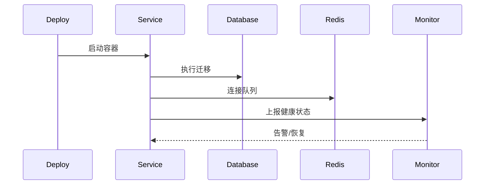
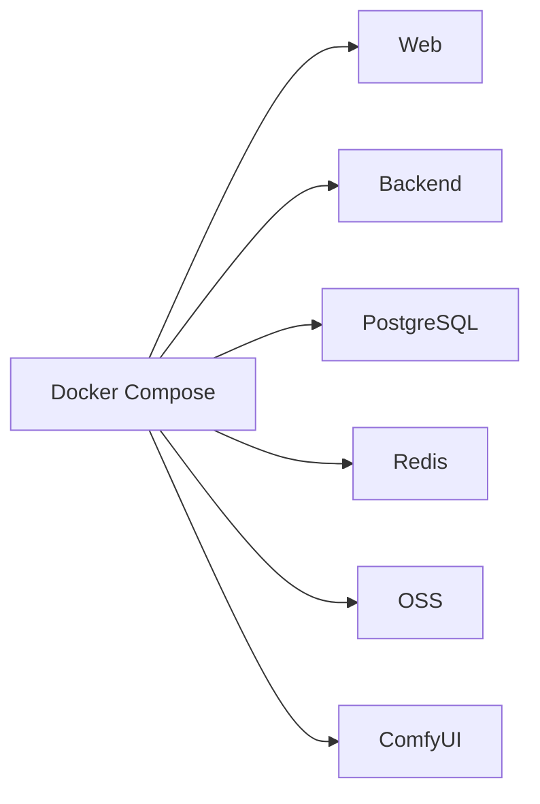

# [11] 基础设施模块设计稿

Created: 2026-07-29 Status: Draft

---

## 1. 用途

基础设施模块提供部署、数据库、缓存、消息队列、监控、日志与安全基座，保证其他模块可稳定运行。

---

## 2. 最重要 3 点

### 2.1 数据结构设计

基础设施不追求过重元数据，核心只有两类：

- `migrations`：版本、脚本、执行时间
- `health_checks`：服务名、状态、延迟、检查时间

### 2.2 数据流转过程

### 2.3 总体架构

参考 open-ai-canvas：

- `D:\GoWorkSpace\open-ai-canvas\docker-compose.server.yml`
- `D:\GoWorkSpace\open-ai-canvas\docker-compose.local.yml`

---

## 3. 接口清单（MVP）

| 方法 | 路径              | 说明     |
|------|-------------------|----------|
| GET  | /healthz          | 健康检查 |
| GET  | /metrics          | 监控指标 |
| POST | /admin/migrations | 执行迁移 |

---

## 4. 依赖模块

| 模块         | 依赖说明 |
|--------------|----------|
| 所有模块     | 运行基座 |
| 后端服务模块 | 启动入口 |

---

## 5. 与 open-ai-canvas 的映射

| 我们的模块   | open-ai-canvas 对应     |
|--------------|-------------------------|
| 基础设施模块 | Docker Compose 与数据卷 |
