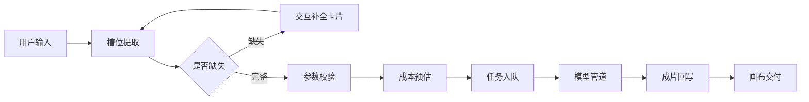
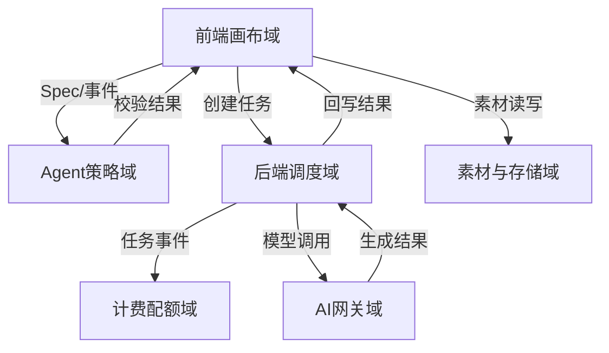

# AI 画布视频产品设计稿

Created: 2026-07-29
References:
- `d:\GoWorkSpace\x-media\docs\ai.md`
- `D:\GoWorkSpace\open-ai-canvas` (架构与模块参考)
- `D:\GoWorkSpace\gogo_trade` (分域拆解风格参考)

---

## 1. 产品定位

一句话定义：

> 基于无限画布与多模态生成能力，面向影视/短剧/广告场景的 AI 视频工作台。

核心目标：

- 让用户从“自然语言 + 画布资产”直接生成可编辑的视频分镜。
- 让视频生成具备业务可控性（槽位补全、参数校验、成本预估、任务回滚）。

---

## 2. 核心主流程

说明：

- 用户输入：自然语言描述 + 画布选中资产（图片/文案/参考帧）。
- 槽位提取：解析为结构化 Spec。
- 交互补全卡片：前端画布内直接补全，不跳转表单。
- 成本预估：在生成前返回额度/费用提示。
- 任务入队：后端异步队列，支持失败重试与回滚。
- 模型管道：按 Spec 串联 LLM/图像/视频/TTS/FFmpeg。
- 成片回写：生成结果回写画布节点与素材库。

---

## 3. 模块拆分与职责

参考 `gogo-trade` 的分域拆分风格，结合 `open-ai-canvas` 的现有分层，将产品拆为以下核心域：

### 3.1 前端画布域 (Canvas UI)

职责：

- 无限画布、节点拖拽、多图层、素材库。
- 画布上下文捕获：将选中资产序列化为 Prompt/Spec。
- 结构化参数面板：展示并微调 JSON Spec。
- 分镜/时间轴组件：多镜头轨道、首尾帧预览、局部修改。
- 交互补全卡片：在画布内完成槽位补全。

参考位置：

- `D:\GoWorkSpace\open-ai-canvas\web\src\components\canvas`
- `D:\GoWorkSpace\open-ai-canvas\web\src\pages\canvas`

### 3.2 Agent 策略域 (Agent Strategy)

职责：

- 意图与槽位提取。
- 确定性校验器（Validator）。
- 视觉槽位解析（图片理解自动填参）。
- System Prompt 与角色卡管理。

参考位置：

- `D:\GoWorkSpace\open-ai-canvas\canvas-agent`

### 3.3 后端调度域 (Backend Scheduler)

职责：

- 用户体系与登录态。
- 异步任务队列与 Worker 并发控制。
- 任务日志、失败重试、状态流转。
- 资源归属校验与权限控制。

参考位置：

- `D:\GoWorkSpace\open-ai-canvas\backend\internal`
- `D:\GoWorkSpace\open-ai-canvas\backend\cmd`

### 3.4 计费配额域 (Quota & Billing)

职责：

- 额度模型（Credits/Tapies）。
- 生成前成本预估。
- 预占（Reserve）与回滚。
- 日用量/单文件限制与后台配置。

参考位置：

- `D:\GoWorkSpace\open-ai-canvas\docker-compose.server.yml`（环境变量与策略配置）

### 3.5 AI 网关域 (AI Gateway)

职责：

- 模型渠道管理（LLM/图像/视频/TTS）。
- 渠道并发控制与中转策略。
- ComfyUI Workflow 下发与结果回收。
- API Key 加密与安全传输。

参考位置：

- `D:\GoWorkSpace\open-ai-canvas\README.md`（渠道与模型配置）

### 3.6 素材与存储域 (Asset & Storage)

职责：

- 私有 OSS 直传与签名 URL。
- 素材库分类、检索、版本。
- 公开只读分享与资源生命周期。

参考位置：

- `D:\GoWorkSpace\open-ai-canvas\docker-compose.server.yml`（数据卷与存储配置）

---

## 4. 跨域协作关系

数据契约原则：

- 跨域只走事件或明确接口，不直接访问内部存储。
- 每个域维护自己的状态与校验逻辑。
- 前端不直接调用 AI 渠道，所有生成必须走后端任务。

---

## 5. 关键技术决策

1. 基于 `open-ai-canvas` 进行二次开发，不重复造画布与队列。
2. Agent 策略域独立部署或模块化，便于后续替换 LLM 供应商。
3. Validator 为确定性规则 + LLM 联合决策，不纯靠 Prompt 幻觉。
4. 计费采用预占制，生成失败自动回滚。
5. 视频一致性采用“首尾帧 + 角色参考图 + 运镜提示词”组合。
6. 复杂图像处理接入 ComfyUI，后端以 Workflow JSON 形式下发。
7. 前端素材与画布状态保留本地缓存，登录后异步同步后端。

---

## 6. 后续细化建议

- Phase 1：跑通 `open-ai-canvas` 基础闭环，接入 1-2 个视频模型。
- Phase 2：落地 Spec Snapshot、Validator、槽位补全卡片。
- Phase 3：上线计费预占、成本预估、角色卡系统。
- Phase 4：引入节点化工作流与 ComfyUI 深度集成。

