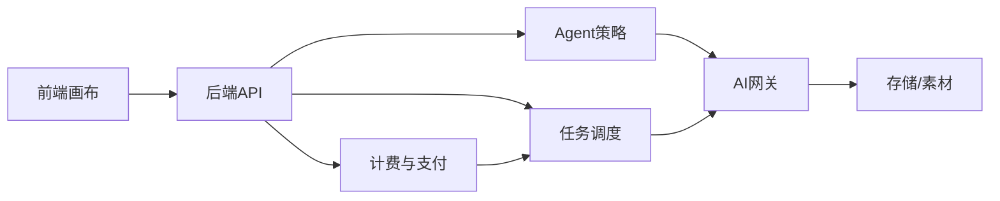
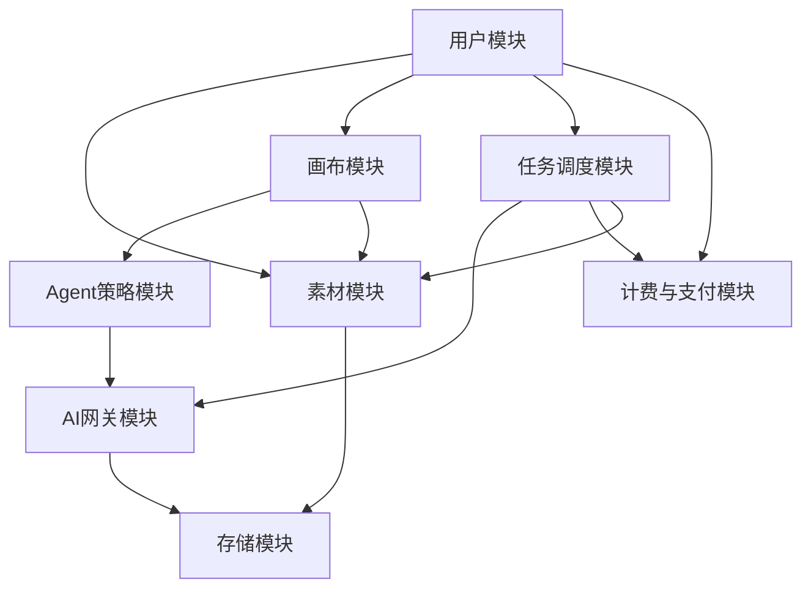

# x-media AI 画布视频产品 - 模块总览

Created: 2026-07-29
Status: Draft

---

## 总体架构

- 前端负责画布交互与 Spec 展示
- 后端负责用户、任务、权限
- Agent 负责槽位提取与校验
- 任务调度负责 Pipeline 编排
- AI 网关负责模型渠道
- 计费与支付负责额度与成本
- 存储素材负责 OSS 与素材库

---

## 模块清单

| 序号 | 模块 | 用途 |
| -- | -- | -- |
| 00 | 用户模块 | 账号、权限、登录态、组织 |
| 01 | 素材模块 | 上传、预处理、分类、OSS |
| 02 | 画布模块 | 无限画布、节点、上下文捕获、Spec面板 |
| 03 | Agent策略模块 | 槽位提取、Validator、视觉解析 |
| 04 | 任务调度模块 | 队列、Worker、Pipeline编排 |
| 05 | 计费与支付模块 | 额度、预占、回滚、成本预估 |
| 06 | AI网关模块 | 渠道管理、ComfyUI、模型调用 |
| 07 | 存储模块 | OSS签名、文件生命周期 |
| 08 | API入口与中间件模块 | 统一入口、配置中心 |
| 09 | 插件与技能模块 | Canvas Agent、技能库 |
| 10 | 管理后台模块 | 用户/渠道/配额/日志管理 |
| 11 | 基础设施模块 | Docker、数据库、Redis、监控 |

---

## 模块依赖关系

---

## 已完成模块

- `D:\GoWorkSpace\x-media\docs\[00]用户模块\README.md`
- `D:\GoWorkSpace\x-media\docs\[01]素材模块\README.md`

---

## 待完成模块

- `[02]画布模块`
- `[03]Agent策略模块`
- `[04]任务调度模块`
- `[05]计费与支付模块`
- `[06]AI网关模块`
- `[07]存储模块`
- `[08]API入口与中间件模块`
- `[09]插件与技能模块`
- `[10]管理后台模块`
- `[11]基础设施模块`

